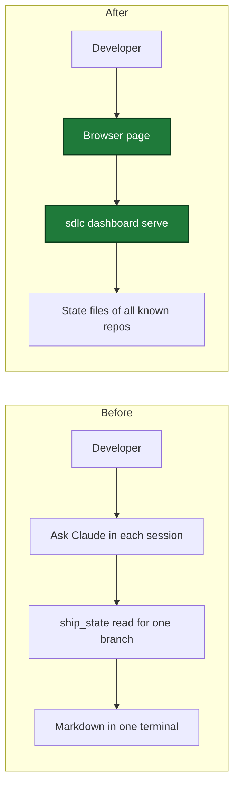
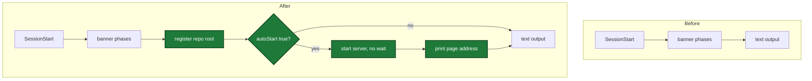
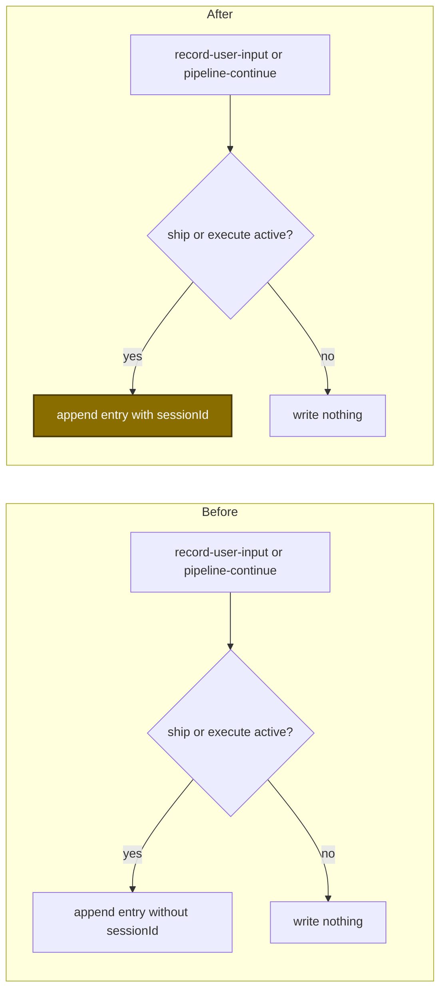

# Dashboard

> This document describes the local sdlc dashboard: one web page on the
> developer's own computer that shows the pipelines of every registered repo.
> The page is titled "sdlc signal room". Every file path, setting, and
> security rule below was verified against source. For the user-facing
> command, run `/sdlc:dashboard`.

## What it shows

The dashboard is one page at `http://127.0.0.1:<port>` (default
`http://127.0.0.1:7385`) that lists every repo registered with the local
server — not just the repo of the current session. A repo is registered the
moment a Claude session starts in it (see [How it works](#how-it-works)), and
stays listed for up to 7 days without a new session, or until its
`.sdlc-v2` directory disappears (`internal/dashboard/registry.go`'s `Roots`
self-cleans both cases).

The header has three tabs: Pipelines, Activity, and History. A repo filter
under the header applies to all three tabs. With no repo chip on, the page
shows all repos.

For each registered repo, the page shows:

- **Pipelines** — one entry per `ship`, `execute`, or `plan` state file, plus
  one per `runs/ledger/review-*/` folder, as one block in one feed for all
  repos. Pipelines that are not `completed` come first and start open.
  `completed` pipelines come after and start collapsed. An execute run or
  review run of a ship run shows inside the ship block, not as its own
  block. Each carries a status (`running`, `stalled`, `completed`, or
  `failed`), a done/total progress count, a track of its steps, and any
  issues. Each step with detail is a tile: waves and tasks, review
  dimensions, review findings, plan explorers, or plan review rounds. Each
  issue has a severity, a location (the file and line of a review finding,
  else the step, wave, or task it came from), and a reason. A `running`
  pipeline whose state has not changed in 30 minutes shows as `stalled`; a
  `completed` or `failed` pipeline drops off the page 24 hours after its
  last update. Ship and execute pipelines also carry the worktree path they
  ran in.
- **Session** — a tile with the Claude Code session of the pipeline, else the
  newest session on the same branch. The collector builds each session from
  the repo's evidence files, grouped by session ID, with
  prompt/command/MCP-call counts and a timeline of its newest 50 events. A
  session's timeline text is redacted and truncated to 120 characters before
  it reaches the page. A session shows as "active" when its newest evidence
  line is less than 30 minutes old.
- **Activity tab** — the repo's open deferred issues, high priority first,
  and the entries of its learnings log dated within the last 24 hours.
- **History tab** — the 50 newest runs of `runs.jsonl`, newest first, failed
  ship runs too. Each row shows the outcome, kind, branch, repo, finish time,
  and duration.

A link `#<pipeline id>` scrolls to that block. `#<pipeline id>/<n>` also
opens the block and selects step n of its track, counted from 0. `#activity`
and `#history` open that tab.

The page updates itself: it opens a server-sent-events stream
(`GET /api/events`) that re-collects the snapshot every 2 seconds and pushes
a new one only when its content actually changed, so an idle page sends no
data beyond an occasional keep-alive comment.

## Start and stop

| How to start | Effect |
|---|---|
| `/sdlc:dashboard` | Starts the server if it is not active, then opens the page |
| `autoStart = true` in `[dashboard]` of `~/.sdlc/local.toml` | Each session start starts the server and prints the address |
| Default address | `http://127.0.0.1:7385` |
| Another program uses port 7385 | Set `port = <1024-65535>` in `[dashboard]` of `~/.sdlc/local.toml`. The next ensure stops the old server and starts the server on the new port. |

| How to stop | Effect |
|---|---|
| Stop server button on the page, then confirm | The server stops within 2s. Use it when no Claude session is open to run the skill. |
| `/sdlc:dashboard --stop` | The server stops within 2s |
| Nothing | The server keeps running. It has no idle stop. |

The server runs only on macOS and Linux (`internal/dashboard/control.go`'s
`ErrUnsupported`): a detached process start on any other OS fails outright,
and there is no fallback mode.

"Within 2s" is two different internal bounds that both resolve inside that
window: a button click or `--stop` sends `SIGTERM` and then polls the health
endpoint for up to 2 seconds (`stopPolls` in `control.go`) waiting for the
port to stop answering, while the server's own graceful shutdown after
`POST /api/stop` allows at most 1 second (`shutdownTimeout` in
`internal/dashboard/web/server.go`) before it force-closes every connection.

## Settings

| key | default | range | file |
|---|---|---|---|
| `autoStart` | `false` | `true`, `false` | `.sdlc-v2/local.toml` or `~/.sdlc/local.toml` |
| `port` | `7385` | `1024`-`65535` | `.sdlc-v2/local.toml` or `~/.sdlc/local.toml` |

Both keys live in the `[dashboard]` section, which is a *local* config
section: per-developer, not shared with the team, and never committed.
`internal/dashboard/settings.go`'s `ReadSettings` reads it from the project
file (`.sdlc-v2/local.toml`), the user-level file (`~/.sdlc/local.toml`, or
the path named by `$SDLC_USER_CONFIG` when that is set), or both — **the
project file wins on any key both files set**. A `[dashboard]` section
missing from both files is not an error: the documented defaults apply. An
out-of-range `port` is a hard config error (not clamped or silently
corrected) — `ReadSettings` fails with a message naming the valid range and
both files `[dashboard]` may live in.

**`autoStart`** decides whether the dashboard server comes up on its own.
With `autoStart = false` (the default), the server only starts when a
developer runs `/sdlc:dashboard` or clicks something that calls the
`dashboard` MCP tool. With `autoStart = true`, every `SessionStart` hook
also starts the server — without waiting for it to answer — and prints its
address to the terminal, so a developer who opens a dozen worktrees across a
day never has to remember to launch the page.

**`port`** exists because one person can run only one dashboard server per
machine, and port 7385 is an arbitrary default that can collide with
something else already listening there. Changing `port` does not move a
server that is already running: it takes effect the next time something
calls `Ensure` (the next `/sdlc:dashboard`, or the next session start with
`autoStart` true), which stops the server at the old port and starts a new
one at the new port.

To change either setting, edit (or create) the `[dashboard]` section of
`~/.sdlc/local.toml` (or the project's `.sdlc-v2/local.toml`):

```toml
[dashboard]
autoStart = false   # start the local dashboard when a Claude session starts
port = 7385         # 1024-65535, loopback only
```

## Files on disk

| Path | Writer | Content |
|---|---|---|
| `~/.sdlc-cache/dashboard/server.json` | server | `{pid, port, version, startedAt, url}` |
| `~/.sdlc-cache/dashboard/roots/<hash>.json` | hook, tool | `{root, lastSeen}` |
| `~/.sdlc-cache/dashboard/server.log` | server | output of the detached process |

`~/.sdlc-cache` is `paths.CacheDir()`: `$SDLC_CACHE_DIR` when set, else the
user's home directory, shared with `sdlc-launcher.sh`. `dashboard.Dir()`
joins `dashboard` onto that root for all three paths above.

- **`server.json`** is written once the listener binds and is removed when
  the server stops — but only by the process whose own PID still matches
  the recorded one, so a server that lost a race for the port never deletes
  a newer server's record.
- **`roots/<hash>.json`** is one file per registered repo, named after the
  first 16 hex characters of `sha256(root)` so every session of the same
  repo writes the same file (refreshing `lastSeen` rather than duplicating
  the entry). Both the `SessionStart` hook and the `dashboard` MCP tool can
  write it. A root's file is deleted the next time anything calls `Roots`
  if its `lastSeen` is more than 7 days old or its `.sdlc-v2` directory is
  gone — the registry self-cleans with no separate garbage-collection pass.
- **`server.log`** collects the detached process's stdout and stderr,
  appended for the life of that process; a new server start appends to the
  same file rather than rotating or truncating it.

## Security

The dashboard binds `127.0.0.1` only — there is no flag to make it listen on
a non-loopback address, so it is never reachable from another machine.

Every request's `Host` header must be exactly `127.0.0.1:<port>` or
`localhost:<port>`, or the server answers `403`. This exists because a page
on another site can still reach `127.0.0.1` through DNS rebinding; its
request would carry that other site's host name, and only the two loopback
names pass. On its own, this check does **not** stop a cross-origin `POST`
from a browser tab open on another site: a page can issue a request that
correctly targets `127.0.0.1:<port>` and still originate from anywhere.

Every route is `GET` except `POST /api/stop`. `GET /` additionally serves
`index.html` with its `{{SDLC_TOKEN}}` placeholder replaced by this server
start's token (`Cache-Control: no-store`, so the token is never cached) —
only a client that has actually loaded the page has ever seen that value.

The stop request is held to two further checks, both required:

- Its `Origin` header must be `http://127.0.0.1:<port>` or
  `http://localhost:<port>`, else `403`.
- Its `X-Sdlc-Token` header must equal this server start's token — 32 bytes
  from `crypto/rand`, hex-encoded, generated fresh each time the server
  starts — compared with `crypto/subtle.ConstantTimeCompare`, else `403`.

Both checks exist together because they block two different attacks: the
`Origin` check blocks a cross-site `POST` that a browser attaches
automatically to every request, including one a malicious page fires at
`127.0.0.1` without the victim's knowledge; the token check blocks a
same-origin request forged by something that was never served the page at
all, such as a `curl` replay run from the same machine.

The server has no idle stop — nothing shuts it down just because it sat
unused. There are exactly three ways to stop it:

1. `POST /api/stop` — the page's **Stop server** button, gated by the Origin
   and token checks above.
2. `SIGTERM` — sent by the `dashboard` tool's stop action, or by `Ensure`
   itself when a version or port change requires stopping the old server
   before starting the new one.
3. `SIGINT` (Ctrl-C) — in a terminal that ran `sdlc dashboard serve`
   directly.

## How it works

### Changed flow 1 (developer sees progress)



### Changed flow 2 (session start hook)



### Changed flow 3 (prompt and command records)



## Snapshot contract

This section is for plugin contributors. The page reads one JSON snapshot.
`GET /api/snapshot` returns it, and `GET /api/events` pushes a new one when
its content changes. `CollectDashboardSnapshot` in
`internal/tools/dashboard_snapshot.go` builds it on each call from the state
files, ledger folders, evidence files, and history files of each repo. The
collector stores nothing of its own: it reads what other tools wrote. The Go
types in that file are the full list of fields. The table below lists the
fields that carry data from other tools, with the JSON key, where the
collector reads the data, and the tool action that writes it.

| Field | Source | Written by |
|---|---|---|
| `steps[].detail.kind` | One of `waves`, `dimensions`, `explorers`, `rounds`, or `findings`. It tells which list of `detail` is filled. | Collector, not stored |
| `steps[].detail.waves` | `waves[]` of the execute state, with `number`, `status`, `committedSha`, and `tasks[]`. A task name is the name of its task row, else the name in the wave's `planned[]`, else the `plannedTasks` name. | The execute_state wave and task actions: `wave-start`, `wave-done`, `wave-fail`, `task-done`, `task-fail`, `wave-commit`, `wave-committed`, and the others that edit `waves[]` |
| `steps[].detail.queued` | `plannedTasks` of the execute state that are in no wave yet. `plannedTasks` is one `{id, name}` for each `### Task N:` heading of the plan. | execute_state `init`, only when `planPath` is readable |
| `steps[].detail.dimensions` | One dimension file for each worker in a `runs/ledger/review-*/` folder. The file holds `checkinAt`, `checkoutAt`, and `findings`. The collector derives `name` (the file name), `status` (completed when `checkoutAt` is set), and the `findings` count and `worst` severity of the dimension. The `run.meta` of the folder ties the review to its ship run. | execute_state `ledger_checkin`, `ledger_checkout` |
| `steps[].detail.reviewTotals` (`found`, `fixed`, `deferred`, `unaccounted`) | Ship state: `healing.reviewTotal`, `healing.fixed[]` with origin `local-review`, and `deferredFindings[]`. `unaccounted` is `found` minus `fixed` minus `deferred`. | ship_state `healing_record` (kinds `review-total` and `fixed`), ship_state `defer` |
| `steps[].detail.findings` | The `findings` text of one completed dimension file, for a review run that has its own block. | execute_state `ledger_checkout` |
| `steps[].detail.explorers` | In a plan block: the `explore-*` writers of the plan run's evidence store. In a ship block: the `planExploreSummary` of the ship state. | plan_support `evidence_record`; ship_state `cleanup-pipeline` for `planExploreSummary` |
| `steps[].detail.rounds`, `.maxRounds` | `reviewRounds` of the plan state. `maxRounds` is the review-loop limit of the plan skill, not a stored value. | plan_mark `review-round` |
| `issues[].source`, `.severity`, `.text`, `.file`, `.line`, `.ref` | Failed ship steps, failed or partial waves, failed tasks that have an error, `issues[]` of the state file, review findings, and the stalled notice. `source` is `step`, `wave`, `review`, `state`, `task`, or `pipeline`. `.file` and `.line` are set for `review` issues only. `ref` is the step, wave, dimension, or task. | Collector, derived. Inputs come from ship_state `fail`, the execute_state wave and task actions, and `ledger_checkout` |
| `sessionId` | `sessionId` of the ship or execute state; `""` when unknown. A plan state is created with no session ID. A review block has none. | ship_prepare or ship_state `init`; execute_state `init` |
| `commitWaves` | `commitWaves` of the execute state; an absent key counts as `true`. A ship block gets it from its joined execute run. It is absent on a plan block, a review block, and a ship block with no joined execute run. | execute_state `init` |
| `repos[].history` | The 50 newest rows of `.sdlc-v2/history/runs.jsonl`, newest first. A row gives `kind` (the row's `skill`), `branch`, `outcome`, `startedAt`, `endedAt`, and `durationMs`. `startedAt` is `started_at`, else `ts` minus `duration_ms`. A line that does not parse is skipped. | ship_state `history_record` (outcome `success`, `failure`, or `partial`); ship_state `fail` (the first `fail` of a run appends a `failure` row); plan_mark `done` (a `plan` row with outcome `done`) |

### Which step carries which detail

- **Execute block** — each `wave N` step has `waves` with that one wave. A
  last step named `queued` has `queued`.
- **Plan block** — five steps: `setup`, `explore`, `draft`, `review`, and
  `finalize`. `explore` has `explorers`. `review` has `rounds`. The others
  have no detail.
- **Review block** — one step for each dimension. A completed dimension has
  `findings`.
- **Ship block** — the `execute` step gets all waves and `queued` from the
  joined execute run. The `review` step gets `reviewTotals` from the ship
  state and `dimensions` from the joined review run. When the ship state
  holds `planExploreSummary`, the collector adds a first step `plan` with
  `explorers`.

### How runs join a ship block

- An execute run joins the ship run of the same branch whose run window
  holds the start of the execute run.
- A review run joins the ship run named by the `shipRunId` of its `run.meta`.
  With no `shipRunId`, it joins the ship run of the same branch whose
  `review` step window holds the start of the review run.
- When two ship runs match, the newest wins. A review folder with no
  `run.meta` joins no ship run and stays its own block.
- The first `ledger_checkin` of a review run writes `run.meta` once, in the
  ledger folder: `branch`, `startedAt`, and `shipRunId`. `shipRunId` is set
  only when the branch has a ship run whose `review` step is in progress. The
  file name has no `.json` suffix, so the collector does not read it as a
  dimension file.
- The issues of a joined execute run go to the ship block with `execute:`
  before each `ref`. The issues of a joined review run go with their `ref`
  unchanged.

A state file written before a field existed does not fail the snapshot. The
page shows less. An execute state without `plannedTasks` shows task ids
without names, unless a wave stores the name. A ship state without
`planExploreSummary` has no `plan` step.

### Lifetime of the source data

- **Review ledgers stay after the review.** The review skill does not remove
  its ledger folder, because the dashboard reads it to show the review
  dimensions. The folder stays until the first execute_state `gc` or
  ship_state `cleanup-pipeline` sweep after 7 days. That sweep removes it.
  7 days is the default of `state.gc.ttlDays`. A completed review leaves the
  page 24 hours after its last update, but its folder stays on disk until the
  sweep.
- **Ship stores the explorer summary at cleanup.** The explorer findings of a
  plan run live in its `.evidence` directory, and `cleanup-pipeline` deletes
  that directory with the plan state file. Before it deletes them,
  `cleanup-pipeline` copies the explorer summary into the ship state key
  `planExploreSummary`: one `{name, status, total, top[]}` entry for each
  explorer, with at most 5 findings in `top`. It does this only after the ship
  report exists. If the copy fails, it deletes nothing, and `planRun.reason`
  starts with `explorer summary not saved: `.
