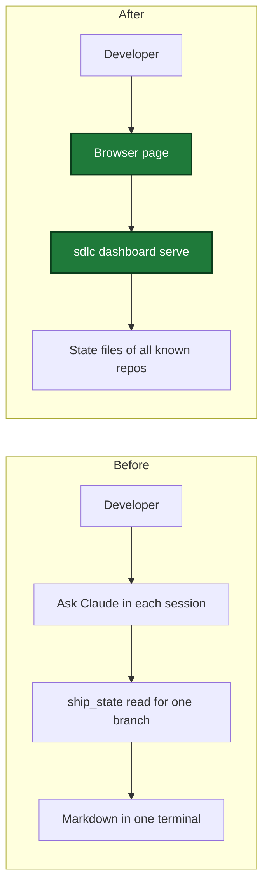
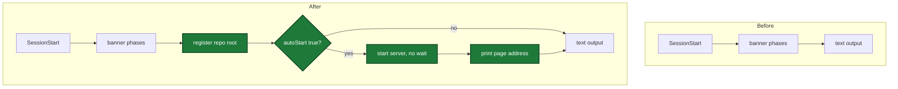
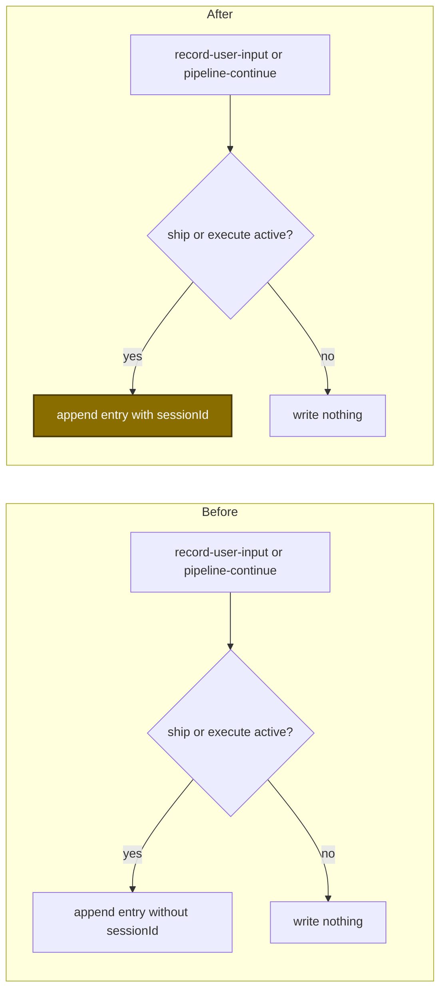

# Dashboard

> This document describes the local sdlc dashboard: one web page on the
> developer's own computer that shows the pipelines of every registered repo.
> The page is titled "sdlc signal room". Every file path, setting, and
> security rule below was verified against source. For the user-facing
> command, run `/sdlc:dashboard`.

## What it shows

The dashboard is one page at `http://127.0.0.1:<port>` (default
`http://127.0.0.1:7385`) that lists every repo registered with the local
server — not just the repo of the current session. A repo is registered the
moment a Claude session starts in it (see [How it works](#how-it-works)), and
stays listed for up to 7 days without a new session, or until its
`.sdlc-v2` directory disappears (`internal/dashboard/registry.go`'s `Roots`
self-cleans both cases).

The header has three tabs: Pipelines, Activity, and History. A repo filter
under the header applies to all three tabs. With no repo chip on, the page
shows all repos. The header also has a **Clear cache** button (see
[Clear cache files](#clear-cache-files)) and a **Stop server** button.

For each registered repo, the page shows:

- **Pipelines** — one entry per `ship`, `execute`, or `plan` state file, plus
  one per `runs/ledger/review-*/` folder, as one block in one feed for all
  repos. The feed has 5 groups in this order: waiting on you, running,
  failed, stalled, and completed. In each group, the newest start comes
  first. Only `completed` pipelines start collapsed. An execute run or
  review run of a ship run shows inside the ship block, not as its own
  block. Each carries a status (`running`, `stalled`, `completed`, or
  `failed`), a done/total progress count, a track of its steps, and any
  issues. A chip after the branch name shows the run duration. The time of
  a running pipeline increases each second. Each ship step and execute wave
  shows its duration under its name. Plan and standalone review steps show
  no duration. Each step with detail is a tile: waves and tasks, review
  dimensions as cards in balanced columns, review findings, plan
  guardrails, plan explorers, plan review rounds, the fixes of the
  received-review step, or the result of a commit step with nothing to
  commit. Each issue has a severity, a location (the file and line of a
  review finding, else the step, wave, or task it came from), and a
  reason. The issues tile lists issues from critical to info and shows at
  most 2 lines of each text. A click on an issue opens the full text in
  the [detail viewer](#detail-viewer). A `completed`, `failed`, or
  `stalled` pipeline has an archive icon at the left of its options, with
  the tooltip "Archive this run" (see [Archive a run](#archive-a-run)). A `running`
  pipeline whose state has not changed in 30 minutes shows as `stalled`,
  unless it waits for an answer or a permission. A waiting pipeline shows
  "WAITING ON YOU" and the wait time. The header shows a `waiting` count
  for all repos. The tab title starts with `(N)`, where N is the number of
  waiting pipelines in the repos of the repo filter. A
  `completed` or `failed` pipeline drops off the page 24 hours after its
  last update. Ship and execute pipelines also carry the worktree path they
  ran in.
- **Session** — a tile with the Claude Code session of the pipeline, else the
  newest session on the same branch. The collector builds each session from
  the repo's evidence files, grouped by session ID, with
  prompt/command/MCP-call counts, a table of command groups (see
  [Session command groups](#session-command-groups)), and a timeline of its
  newest 50 events. A session's timeline text is redacted and truncated to
  120 characters before it reaches the page. A session shows as "active" when
  its newest evidence line is less than 30 minutes old.
- **Activity tab** — the repo's open deferred issues, high priority first,
  and the entries of its learnings log dated within the last 24 hours. A row
  shows the first 200 characters of its text. A click on a row opens the
  full item in the [detail viewer](#detail-viewer).
- **History tab** — the 50 newest runs of `runs.jsonl`, newest first, failed
  ship runs too. Each row shows the outcome, kind, branch, repo, finish time,
  and duration.

A link `#<pipeline id>` scrolls to that block. `#<pipeline id>/<n>` also
opens the block and selects step n of its track, counted from 0. `#activity`
and `#history` open that tab.

The page updates itself: it opens a server-sent-events stream
(`GET /api/events`) that re-collects the snapshot every 2 seconds and pushes
a new one only when its content actually changed, so an idle page sends no
data beyond an occasional keep-alive comment.

### Session command groups

The session tile has a table of command groups. It shows which programs the
session ran most. A session with no command has no table.

- The groups count every command of the session. The timeline keeps only
  the newest 50 events, but the groups do not.
- The collector splits a command at `|`, `&&`, `||`, and `;`. It does not
  split inside single or double quotes. Only the first line that is not
  blank and not a comment counts, so the body of a heredoc is not read as a
  command.
- In each part of the command, the words `VAR=x` and `sudo` are skipped.
  The next word is the program.
- A group label comes from the programs of the command:

  | Programs in the command | Label | Example command | Label of the example |
  |---|---|---|---|
  | 1 or 2 | The first program | `git add . && git commit` | `git` |
  | 3 or more | All programs, as `a + b + c` | `cat a \| grep x \| wc -l` | `cat + grep + wc` |
  | None (empty text, or only `VAR=x`) | `(other)` | `FOO=1` | `(other)` |

- The `share` of a group is the number of its commands divided by the number
  of all commands of the session. It is rounded to 2 decimals. The page shows
  it as a percent.
- The largest group has the majority mark. When two groups have the same
  count, the group with the newest command is the largest. The page lists
  the largest group first.

The program names go through the same redaction as the timeline text.

## Start and stop

| How to start | Effect |
|---|---|
| `/sdlc:dashboard` | Starts the server if it is not active, then opens the page |
| `autoStart = true` in `[dashboard]` of `~/.sdlc/local.toml` | Each session start starts the server and prints the address |
| Default address | `http://127.0.0.1:7385` |
| Another program uses port 7385 | Set `port = <1024-65535>` in `[dashboard]` of `~/.sdlc/local.toml`. The next ensure stops the old server and starts the server on the new port. |

| How to stop | Effect |
|---|---|
| Stop server button on the page, then confirm | The server stops within 2s. Use it when no Claude session is open to run the skill. |
| `/sdlc:dashboard --stop` | The server stops within 2s |
| Nothing | The server keeps running. It has no idle stop. |

The server runs only on macOS and Linux (`internal/dashboard/control.go`'s
`ErrUnsupported`): a detached process start on any other OS fails outright,
and there is no fallback mode.

"Within 2s" is two different internal bounds that both resolve inside that
window: a button click or `--stop` sends `SIGTERM` and then polls the health
endpoint for up to 2 seconds (`stopPolls` in `control.go`) waiting for the
port to stop answering, while the server's own graceful shutdown after
`POST /api/stop` allows at most 1 second (`shutdownTimeout` in
`internal/dashboard/web/server.go`) before it force-closes every connection.

## Detail viewer

A list row shows a short text. The detail viewer shows the full item in a
dialog. Four kinds of row open it:

| Row | Where | What the viewer shows |
|---|---|---|
| Deferred item | Activity tab | The description, and the Created, Source, Severity, File, Line, and Reason of the item |
| Learning | Activity tab | The Date, and the text of the learning |
| Issue | Issues tile of a pipeline | The text, and the Source, Severity, File, Line, and Ref of the issue |
| Finding | Review step of a pipeline, for each dimension | The text, and the Pipeline, Dimension, and Severity of the finding |

- The viewer leaves out a field with no value.
- The snapshot holds only the heading of a learning. The page reads the text
  with `GET /api/learning` when the row opens. The server redacts the text
  and cuts it at 8000 characters. A cut text ends with `…`. When the log has
  no such entry any more, the viewer shows "The body of this learning was not
  found."
- Close the viewer with the close icon at its top left or the Esc key. The focus goes
  back to the row that opened it, or to the Activity tab when that row is
  gone.
- The viewer follows the snapshot. When the item leaves the snapshot, for
  example because someone resolved the deferred item, the viewer shows "This
  item is no longer open."

## Archive a run

Archive takes a run off the page and keeps its files. It moves them to
`<repo>/.sdlc-v2/run-archive/<runId>/`. Use it for a run that you do not need
any more, such as a stalled run that will not resume.

Archive asks for a confirm before it changes a file. The dialog shows the
question "Archive run `<runId>`?".

| Status of the row | Archive icon | Confirm steps | Result |
|---|---|---|---|
| `running` | None | None | The server refuses with `RUN_ACTIVE` |
| `stalled` | Shown | 2: the second asks "The run stalled. Archive removes its resume point." | Archived after the second confirm |
| `completed`, `failed` | Shown | 1 | Archived after the confirm |

The server decides from the status of a fresh collect. It does not trust the
status that the page sends. A stalled run needs `confirmStalled: true` in the
request.

What Archive does:

- Only a top-level pipeline row can be archived. A run nested in a ship
  block, such as its execute run or its review run, has no archive icon. It moves
  with its ship.
- A `completed` or `failed` run is a row for 24 hours after its last update.
  After that the run is not a row, and its id returns `RUN_NOT_FOUND`.
- Archive moves the files that hold results. It deletes the working
  folders. Archive does not move them.

| Row | Moved into the archive folder | Deleted |
|---|---|---|
| `ship-…` | The ship state file, the report of the ship run, and for the nested execute run its state file, its ledger folder, and its report. The ledger folder of a nested review run. | `runs/<id>/`, the working folder of the nested execute run |
| `execute-…` | The state file, the ledger folder, and the report | `runs/<id>/`, the working folder of the run |
| `plan-…` | The state file, and `brief.md` of its evidence folder (it lands in `evidence/brief.md`) | The evidence folder `runs/<plan state>.evidence/` |
| `review-<ts>` | The ledger folder of the review run | None |

A path keeps its form below `.sdlc-v2/` in the archive folder, without the
leading `runs/`. For example:

```text
Before: runs/ship-x-1.json
        runs/execute-x-2.json
        runs/20261008T120000/                      (working folder, execute run)
        runs/ledger/20261008T120000/
        reports/ship-20261008T110000-report.md
After:  run-archive/ship-x-1/ship-x-1.json
        run-archive/ship-x-1/execute-x-2.json
        run-archive/ship-x-1/ledger/20261008T120000/
        run-archive/ship-x-1/reports/ship-20261008T110000-report.md
        run-archive/ship-x-1/archive.json
        runs/20261008T120000/ is deleted
```

The file `archive.json` records the archive: `runId`, `archivedAt` (UTC),
`moved`, and `deleted`. The last two are lists of paths below `.sdlc-v2/`.
They are `[]` when empty. `moved` does not list the last move, because that
move happens after `archive.json` is written. The last move is the state file
of the run, or the ledger folder of a review run.

The state file moves last. When a move fails, the state file stays in
`runs/`, so the run stays on the page. Fix the cause and archive the run
again. The second try handles the files that are still in place.

No sdlc tool reads or deletes `run-archive/`. A linked worktree shares it with
the main worktree, like `runs/`. Delete a folder by hand when you do not need
it. [Clear cache](#clear-cache-files) keeps it.

Archive stops at a link that points nowhere. Such a link occurs when
`.sdlc-v2/run-archive` of a linked worktree or of the main worktree is a link
to the path of a deleted worktree.

The server answers `200` with `{"runId","dir","moved","deleted"}`. An error
answer has one of five codes:

| Code | HTTP status | Cause | What to do |
|---|---|---|---|
| `BAD_RUN_ID` | 400 | The id is not a bare run name. It has a path part, or it does not start with `ship-`, `execute-`, `plan-`, or `review-`. | Send the id of a pipeline row. |
| `RUN_NOT_FOUND` | 404 | No pipeline row has this id, or the run has no file on disk. A nested run and a finished run older than 24 hours are not rows. | Reload the page. The run is gone. |
| `RUN_ACTIVE` | 409 | The row has the status `running`. | Wait until the run ends or stalls. |
| `CONFIRM_STALLED` | 409 | The row is `stalled`, and the request has no `confirmStalled: true`. | Confirm. Archive removes the resume point. |
| `ARCHIVE_FAILED` | 500 | A read, a move, or a delete failed. An unexpected error gets this code too. | Read the message. If the message names a link that points nowhere, do the recovery in the message. See [Linked worktrees](getting-started.md#linked-worktrees). Otherwise, fix the permission of the named file, then archive again. |

The page shows the message of the error. The other errors of the route are in
[Security](#security).

## Clear cache files

The **Clear cache** button in the header deletes cache data that the plugin
can build again. It asks one confirm: "Clear cache files?". The dialog does
not list the files, so read this table before you click.

| Class | What Clear does | Only when |
|---|---|---|
| `evidence-rotations` | Deletes `<repo>/.sdlc-v2/evidence/*.jsonl.1` | The file did not change for more than 30 minutes |
| `temp-dirs` | Deletes the `sdlc-*` folders of the temp folder of the system (`$TMPDIR`, else `/tmp`), except `sdlc-explore-*` | The folder did not change for more than 24 hours |
| `orphan-reports` | Deletes the files of `<repo>/.sdlc-v2/reports/` | The run id in the file name matches no ship or execute state in `runs/` |
| `server-log` | Cuts `~/.sdlc-cache/dashboard/server.log` to 0 bytes. It does not delete the file. | Always, when the file is not empty |

Details of each class:

- **`evidence-rotations`** — A writer renames an evidence file to `.jsonl.1`
  when the file reaches 5 MiB. Clear never touches the live `.jsonl` file. A
  rewrite of a live file would lose lines that another process adds at the
  same time.
- **`temp-dirs`** — Tools such as review, harden, error-report, and the
  OpenSpec stage check create these folders. The `sdlc-explore-*` folders
  stay, because the state `gc` sweep owns them.
- **`orphan-reports`** — A report name is `ship-<id>-report.md`,
  `ship-<id>-report.json`, `<id>-report.md`, or `<id>-report.json`. The `<id>`
  is the run id of a ship or execute state. Clear keeps a file with any other
  name. When Clear cannot read every state file in `runs/`, it deletes no
  report.
- **`server-log`** — The running server keeps the log open for append, so a
  new line goes to the new end of the file.

Clear keeps these data: `history/`, `learnings/`, `timings.json`, `runs/`,
`run-archive/`, the live evidence files, and `~/.sdlc-cache/bin`.

The button clears every repo that the page lists, one after another. The repo
filter does not change this. `evidence-rotations` and `orphan-reports` belong
to one repo. `temp-dirs` and `server-log` are global, so the first repo clears
them and the next repos find them empty.

The page shows the freed size, for example "Freed 2.0 MB.", and one line for
each repo whose request failed. It does not show the list of kept files.

The server answers `200` with `freedBytes`, a `classes` list, and a `skipped`
list. Each class has `name`, `files`, and `bytes`. A class with nothing to
clear shows `files: 0`. A `skipped` row has a `path` and a `reason`. Clear
continues after a skipped row. The reasons are:

| Reason | Meaning |
|---|---|
| `Changed less than 30 minutes ago` | Clear kept a rotated evidence file that is too new |
| `Changed less than 24 hours ago` | Clear kept a temp folder that is too new |
| `Report name has no run id` | Clear kept a report with an unknown name |
| `Not a regular file` | Clear kept a server log path that is not a regular file |
| `Read failed: <error>` | Clear could not read the path, so it kept the path |
| `Delete failed: <error>` | Clear could not delete the path |
| `Truncate failed: <error>` | Clear could not cut the server log |

Only a failed read of the repo folder fails the request. The answer is `500`
with the code `CLEAR_FAILED`.

## Settings

| key | default | range | file |
|---|---|---|---|
| `autoStart` | `false` | `true`, `false` | `.sdlc-v2/local.toml` or `~/.sdlc/local.toml` |
| `port` | `7385` | `1024`-`65535` | `.sdlc-v2/local.toml` or `~/.sdlc/local.toml` |

Both keys live in the `[dashboard]` section, which is a *local* config
section: per-developer, not shared with the team, and never committed.
`internal/dashboard/settings.go`'s `ReadSettings` reads it from the project
file (`.sdlc-v2/local.toml`), the user-level file (`~/.sdlc/local.toml`, or
the path named by `$SDLC_USER_CONFIG` when that is set), or both — **the
project file wins on any key both files set**. A `[dashboard]` section
missing from both files is not an error: the documented defaults apply. An
out-of-range `port` is a hard config error (not clamped or silently
corrected) — `ReadSettings` fails with a message naming the valid range and
both files `[dashboard]` may live in.

**`autoStart`** decides whether the dashboard server comes up on its own.
With `autoStart = false` (the default), the server only starts when a
developer runs `/sdlc:dashboard` or clicks something that calls the
`dashboard` MCP tool. With `autoStart = true`, every `SessionStart` hook
also starts the server — without waiting for it to answer — and prints its
address to the terminal, so a developer who opens a dozen worktrees across a
day never has to remember to launch the page.

**`port`** exists because one person can run only one dashboard server per
machine, and port 7385 is an arbitrary default that can collide with
something else already listening there. Changing `port` does not move a
server that is already running: it takes effect the next time something
calls `Ensure` (the next `/sdlc:dashboard`, or the next session start with
`autoStart` true), which stops the server at the old port and starts a new
one at the new port.

To change either setting, edit (or create) the `[dashboard]` section of
`~/.sdlc/local.toml` (or the project's `.sdlc-v2/local.toml`):

```toml
[dashboard]
autoStart = false   # start the local dashboard when a Claude session starts
port = 7385         # 1024-65535, loopback only
```

## Files on disk

| Path | Writer | Content |
|---|---|---|
| `~/.sdlc-cache/dashboard/server.json` | server | `{pid, port, version, startedAt, url}` |
| `~/.sdlc-cache/dashboard/roots/<hash>.json` | hook, tool | `{root, lastSeen}` |
| `~/.sdlc-cache/dashboard/server.log` | server | output of the detached process. Clear cache class `server-log` cuts it to 0 bytes |
| `<repo>/.sdlc-v2/run-archive/<runId>/` | server | archived runs: state files, ledgers, reports, `archive.json` |
| `<repo>/.sdlc-v2/evidence/*.jsonl.1` | hook, tool | rotated evidence files. Clear cache class `evidence-rotations` deletes the old ones |
| `$TMPDIR/sdlc-*` (else `/tmp/sdlc-*`) | tool | temp folders of tools. Clear cache class `temp-dirs` deletes the old ones |
| `<repo>/.sdlc-v2/reports/*` | ship, execute | run reports. Clear cache class `orphan-reports` deletes the ones that no run owns |

`~/.sdlc-cache` is `paths.CacheDir()`: `$SDLC_CACHE_DIR` when set, else the
user's home directory, shared with `sdlc-launcher.sh`. `dashboard.Dir()`
joins `dashboard` onto that root for the first three paths above. The last
four paths do not live under `~/.sdlc-cache/dashboard/`. See
[Archive a run](#archive-a-run) and [Clear cache files](#clear-cache-files)
for the rules of the last four paths.

- **`server.json`** is written once the listener binds and is removed when
  the server stops — but only by the process whose own PID still matches
  the recorded one, so a server that lost a race for the port never deletes
  a newer server's record.
- **`roots/<hash>.json`** is one file per registered repo, named after the
  first 16 hex characters of `sha256(root)` so every session of the same
  repo writes the same file (refreshing `lastSeen` rather than duplicating
  the entry). Both the `SessionStart` hook and the `dashboard` MCP tool can
  write it. A root's file is deleted the next time anything calls `Roots`
  if its `lastSeen` is more than 7 days old or its `.sdlc-v2` directory is
  gone — the registry self-cleans with no separate garbage-collection pass.
- **`server.log`** collects the detached process's stdout and stderr,
  appended for the life of that process; a new server start appends to the
  same file rather than rotating or truncating it. Only the **Clear cache**
  button cuts it to 0 bytes.

## Security

The dashboard binds `127.0.0.1` only — there is no flag to make it listen on
a non-loopback address, so it is never reachable from another machine.

Every request's `Host` header must be exactly `127.0.0.1:<port>` or
`localhost:<port>`, or the server answers `403`. This exists because a page
on another site can still reach `127.0.0.1` through DNS rebinding; its
request would carry that other site's host name, and only the two loopback
names pass. On its own, this check does **not** stop a cross-origin `POST`
from a browser tab open on another site: a page can issue a request that
correctly targets `127.0.0.1:<port>` and still originate from anywhere.

Three `POST` routes change files: `POST /api/stop`, `POST /api/run-archive`
and `POST /api/cache-clear`. Each one checks the Origin and the token. Every
other route is `GET`, including the read-only `GET /api/learning`. `GET /`
additionally serves `index.html` with its `{{SDLC_TOKEN}}` placeholder
replaced by this server start's token (`Cache-Control: no-store`, so the
token is never cached) — only a client that has actually loaded the page has
ever seen that value.

Each `POST` route is held to two further checks, both required:

- Its `Origin` header must be `http://127.0.0.1:<port>` or
  `http://localhost:<port>`, else `403` with the code `FORBIDDEN_ORIGIN`.
- Its `X-Sdlc-Token` header must equal this server start's token — 32 bytes
  from `crypto/rand`, hex-encoded, generated fresh each time the server
  starts — compared with `crypto/subtle.ConstantTimeCompare`, else `403` with
  the code `FORBIDDEN_TOKEN`.

Both checks exist together because they block two different attacks: the
`Origin` check blocks a cross-site `POST` that a browser attaches
automatically to every request, including one a malicious page fires at
`127.0.0.1` without the victim's knowledge; the token check blocks a
same-origin request forged by something that was never served the page at
all, such as a `curl` replay run from the same machine.

The archive and clear routes read a JSON body. After the Origin and token
checks, they also need the header `Content-Type: application/json` (else
`415`) and a body of at most 8 KiB (else `413`). The stop route has no body,
so it skips these two checks.

| Route | What it does | Guard after the `Host` check |
|---|---|---|
| `POST /api/stop` | Stops the server | Origin and token |
| `POST /api/run-archive` | Moves one run into `run-archive/`. See [Archive a run](#archive-a-run). | Origin, token, JSON content type, body of 8 KiB or less. The body is `{"repo", "runId", "confirmStalled"}`. `repo` and `runId` are required. `confirmStalled` is a bool. |
| `POST /api/cache-clear` | Deletes cache files. See [Clear cache files](#clear-cache-files). | Origin, token, JSON content type, body of 8 KiB or less. The body is `{"repo"}`, and `repo` is required. |
| `GET /api/learning?repo=…&date=…&heading=…` | Returns the text of one learning. See [Detail viewer](#detail-viewer). | No Origin check and no token: the route only reads, like `GET /api/snapshot`. `repo`, `date` and `heading` are required. The text is redacted and cut at 8000 characters. |

For the archive, clear, and learning routes, `repo` must be the path of a
repo that the page shows. The server compares it with the registered repos,
where a linked worktree counts as its main repo. Any other path gets `404`,
and the server does no file work.

Each error answer of these routes has the body
`{"error":{"code","message","suggestion"}}`. The `Host` check and a request
with a wrong method (`405`) answer with plain text. The error answers are:

| Status | Code | Cause | Route |
|---|---|---|---|
| 403 | `FORBIDDEN_ORIGIN`, `FORBIDDEN_TOKEN` | The Origin or the token check failed | The three `POST` routes |
| 415 | `BAD_CONTENT_TYPE` | The content type is not `application/json` | Archive, clear |
| 413 | `BODY_TOO_LARGE` | The body is over 8 KiB | Archive, clear |
| 400 | `BAD_BODY` | The server could not read the body | Archive, clear |
| 400 | `BAD_REQUEST` | The body is not a JSON object of the shape of the route. Or `repo` or `runId` is missing (archive). Or `repo` is missing (clear). Or `repo`, `date` or `heading` is missing (learning). | Archive, clear, learning |
| 404 | `REPO_NOT_FOUND` | `repo` is not a repo that the page shows. | Archive, clear, learning |
| 500 | `NOT_CONFIGURED` | The server runs without the function of the route. This is a wiring defect. | Archive, clear, learning |
| 500 | `CLEAR_FAILED` | Clear cannot read the repo folder | Clear |
| 500 | `LEARNING_READ_FAILED` | The server cannot read the learnings log | Learning |
| 400, 404, 409, 500 | `BAD_RUN_ID`, `RUN_NOT_FOUND`, `RUN_ACTIVE`, `CONFIRM_STALLED`, `ARCHIVE_FAILED` | See [Archive a run](#archive-a-run) | Archive |

An example of an error answer:

```http
409 {"error":{"code":"RUN_ACTIVE","message":"Run \"ship-feat-x-20261008T120000Z\" is running","suggestion":"Wait until the run ends or stalls."}}
```

The server has no idle stop — nothing shuts it down just because it sat
unused. There are exactly three ways to stop it:

1. `POST /api/stop` — the page's **Stop server** button, gated by the Origin
   and token checks above.
2. `SIGTERM` — sent by the `dashboard` tool's stop action, or by `Ensure`
   itself when a version or port change requires stopping the old server
   before starting the new one.
3. `SIGINT` (Ctrl-C) — in a terminal that ran `sdlc dashboard serve`
   directly.

## How it works

### Changed flow 1 (developer sees progress)



### Changed flow 2 (session start hook)



### Changed flow 3 (prompt and command records)



## Snapshot contract

This section is for plugin contributors. The page reads one JSON snapshot.
`GET /api/snapshot` returns it, and `GET /api/events` pushes a new one when
its content changes. `CollectDashboardSnapshot` in
`internal/tools/dashboard_snapshot.go` builds it on each call from the state
files, ledger folders, evidence files, and history files of each repo. The
collector stores nothing of its own: it reads what other tools wrote. The Go
types in that file are the full list of fields. The table below lists the
fields that carry data from other tools, with the JSON key, where the
collector reads the data, and the tool action that writes it.

| Field | Source | Written by |
|---|---|---|
| `steps[].detail.kind` | One of `waves`, `dimensions`, `explorers`, `rounds`, `findings`, `guardrails`, `result`, or `fixes`. It tells which field of `detail` is filled. | Collector, not stored |
| `steps[].startedAt`, `steps[].completedAt` | `startedAt` and `completedAt` of a ship step or an execute wave, as RFC 3339 text. No key when the time is absent or does not parse. A running step has no `completedAt`. The `plan` step that the collector adds, and the steps of a standalone plan or review pipeline, have no times. | ship_state step actions; execute_state wave actions |
| `steps[].detail.fixes` | `healing.fixProgress[]` of the ship state, in stored order. Each row has `title` (redacted, at most 120 characters), `severity`, `file`, `line` (absent when 0), and `status`: `queued`, `fixing`, `fixed`, `failed`, or `deferred`. A record with an unknown status or severity is skipped. | ship_state `healing_record` kind `fix-progress` |
| received-review step | Added after the first `review` step of a ship block when `healing.fixProgress[]` holds a valid fix record. A `fixProgress` value that is not a list, or a list with records and no valid fix record, adds a `state` issue. `in_progress` while a row is `queued` or `fixing` on a live run, else `completed`. `startedAt` is the earliest `firstAt`. `completedAt` is the latest `updatedAt`. | Collector, derived |
| `steps[].detail.waves` | `waves[]` of the execute state, with `number`, `status`, `committedSha`, and `tasks[]`. A task name is the name of its task row, else the name in the wave's `planned[]`, else the `plannedTasks` name. | The execute_state wave and task actions: `wave-start`, `wave-done`, `wave-fail`, `task-done`, `task-fail`, `wave-commit`, `wave-committed`, and the others that edit `waves[]` |
| `steps[].detail.queued` | `plannedTasks` of the execute state that are in no wave and in no planned wave. `plannedTasks` is one `{id, name}` for each `### Task N:` heading of the plan. | execute_state `init`, only when `planPath` is readable |
| `steps[].detail.dimensions` | One row for each planned dimension in the `run.meta` of a `runs/ledger/review-*/` folder. A row with no worker file is `pending`. A stopped row is `skipped` with a `reason`. A worker file holds `checkinAt`, `checkoutAt`, and `findings`. The collector derives `name` (the dimension name; the file name when `run.meta` plans no dimension), `status` (completed when `checkoutAt` is set), and the `findings` count and `worst` severity of the dimension. The `run.meta` of the folder ties the review to its ship run. A worker file that cannot be read or does not parse is an `in_progress` row with no findings, and it counts as a run dimension. Findings that are not a JSON list count as none. A `run.meta` that exists but cannot be read or does not parse gives the rows of the worker files, as with no `run.meta`. Each of these three cases also adds a `state` issue that names the file. Each dimension row also has `findingItems`: its finding rows (`text`, `severity`, `file`, `line`), the same rows as `steps[].detail.findings`, or `[]` when the dimension has no finding. | execute_state `ledger_checkin`, `ledger_checkout`, `ledger_skip` |
| `steps[].detail.reviewPlan`, `dimensions[].wave`, `.reason` | `waves`, `dimensions`, and `stopReason` of `run.meta`. `reviewPlan` holds `wavesPlanned`, `wavesRun`, `dimensionsPlanned`, `dimensionsRun`, and `neverStarted`. `reason` is `stalled`, `missing`, or `unstopped`. | `review_prepare`, execute_state `ledger_skip` |
| `steps[].detail.reviewTotals` (`found`, `fixed`, `deferred`, `unaccounted`) | Ship state: `healing.reviewTotal`, `healing.fixed[]` with origin `local-review`, and `deferredFindings[]`. `unaccounted` is `found` minus `fixed` minus `deferred`. | ship_state `healing_record` (kinds `review-total` and `fixed`), ship_state `defer` |
| `steps[].detail.findings` | The `findings` text of one completed dimension file, for a review run that has its own block. | execute_state `ledger_checkout` |
| `steps[].detail.result` | The `result` of the ship `commit` step, when it starts with `nothing to commit`. | ship_state `commit-check` |
| `steps[].detail.guardrails` | `guardrailCounts` of the plan state: `total`, `error`, and `warning`. | `plan_prepare` |
| `steps[].detail.explorers` | In a plan block: the `explore-*` writers of the plan run's evidence store. In a ship block: the `planExploreSummary` of the ship state, and `rounds` from its `planReviewRounds`. | plan_support `evidence_record`; ship_state `cleanup-pipeline` for `planExploreSummary` and `planReviewRounds` |
| `steps[].detail.rounds`, `.maxRounds` | `reviewRounds` of the plan state. In a ship block: `planReviewRounds` of the ship state, which holds the same rows. `maxRounds` is the review-loop limit of the plan skill, not a stored value. | plan_mark `review-round`; ship_state `cleanup-pipeline` for `planReviewRounds` |
| `steps[].detail.roundTotals`, `.repairLimit`, `.outcomes` | From `reviewRounds` and `reviewOutcome` of the plan state. `roundTotals` holds `iterations` (the number of stored rounds), `violations`, `fixes`, and `distinct`. When every round has a `findings` list, `violations` and `fixes` count distinct finding IDs across all rounds, a finding counts as fixed when any round fixed it, and `distinct` is `true`. Else they are the sums of the `found` and `fixed` counts of the rounds, and `distinct` is `false`. `repairLimit` is derived, not stored: it is `true` when the last stored round has a number of at least the review-loop limit (5) and its merged status is Issues Found. `outcomes` is one `{id, text, choice, reason}` for each finding of `reviewOutcome.findings`, in stored order. | plan_mark `review-round`, `review-outcome` |
| `issues[].source`, `.severity`, `.text`, `.file`, `.line`, `.ref` | Failed ship steps, failed or partial waves, failed tasks that have an error, `issues[]` of the state file, review findings, review ledger files that cannot be used and a damaged `healing.fixProgress` (as `state` issues with no `ref`), and the stalled notice. `source` is `step`, `wave`, `review`, `state`, `task`, or `pipeline`. `.file` and `.line` are set for `review` issues only. `ref` is the step, wave, dimension, or task. | Collector, derived. Inputs come from ship_state `fail`, the execute_state wave and task actions, and `ledger_checkout` |
| `sessionId` | `sessionId` of the ship or execute state; `""` when unknown. A plan state is created with no session ID. A review block has none. | ship_prepare or ship_state `init`; execute_state `init` |
| `attention` | The newest open wait record of the pipeline session and branch. It holds `kind` (`question` or `permission`), `askedAt`, `header`, and `text`. Only a `running` pipeline with a `sessionId` has it. Absent when no wait is open. | Hooks `block-askuserquestion-auto`, `record-permission-wait` |
| `commitWaves` | `commitWaves` of the execute state; an absent key counts as `true`. A ship block gets it from its joined execute run. It is absent on a plan block, a review block, and a ship block with no joined execute run. | execute_state `init` |
| `repos[].history` | The 50 newest rows of `.sdlc-v2/history/runs.jsonl`, newest first. A row gives `kind` (the row's `skill`), `branch`, `outcome`, `startedAt`, `endedAt`, and `durationMs`. `startedAt` is `started_at`, else `ts` minus `duration_ms`. A line that does not parse is skipped. | ship_state `history_record` (outcome `success`, `failure`, or `partial`); ship_state `fail` (the first `fail` of a run appends a `failure` row); plan_mark `done` (a `plan` row with outcome `done`) |
| `repos[].sessions[].commandGroups` | One `{label, programs[], count, share, majority, lastAt}` for each command group, over every command of the session, not only the newest 50 events. The largest group comes first. `[]` when the session has no command, never `null`. See [Session command groups](#session-command-groups). | Collector, derived from the command entries of the evidence files |
| `repos[].deferred[]` | The open items of `.sdlc-v2/history/deferred.json`, high priority first, then oldest first. Each item has `id`, `priority`, `description`, `created`, `source`, `severity`, `file`, `line`, and `reason`. A value that the record lacks is `""`, or `0` for `line`, never `null`. | ship_state `defer` and `deferred_add`; execute_state `issue-draft` |

### Which step carries which detail

- **Execute block** — each `wave N` step has `waves` with that one wave. A
  planned wave that has not started shows as `pending`. A last step named
  `queued` has the tasks that are in no planned wave.
- **Plan block** — five steps: `setup`, `explore`, `draft`, `review`, and
  `finalize`. `setup` has `guardrails`. `explore` has `explorers`. `review`
  has `rounds`. The others have no detail.
- **Review block** — one step for each dimension. A completed dimension has
  `findings`.
- **Ship block** — the `execute` step gets all waves and `queued` from the
  joined execute run. The `review` step gets `reviewTotals` from the ship
  state, and `dimensions` and `reviewPlan` from the joined review run. The
  `commit` step has `result` when it completed with a `nothing to commit` result. When the ship state
  holds `planExploreSummary`, the collector adds a first step `plan` with
  `explorers`. When it also holds `planReviewRounds`, the step adds `rounds`
  and `maxRounds`. When the ship state holds a valid fix record, the
  `received-review` step has `fixes`. On a completed run, the step shows
  completed. A row keeps its last status. A `queued` or `fixing` row on a
  completed run means that the fix pass stopped.

### How runs join a ship block

- An execute run joins the ship run of the same branch whose run window
  holds the start of the execute run.
- A review run joins the ship run named by the `shipRunId` of its `run.meta`.
  With no `shipRunId`, it joins the ship run of the same branch whose
  `review` step window holds the start of the review run.
- When two ship runs match, the newest wins. A review folder with no
  `run.meta` joins no ship run and stays its own block.
- `review_prepare` writes `run.meta` once, in the ledger folder: `branch`,
  `startedAt`, `shipRunId`, `waves`, and `dimensions`. A dry run writes no
  file. A folder with only `run.meta` turns `stalled` after 30 minutes.
  `shipRunId` is set only when the branch has a ship run whose `review` step
  is in progress. The file name has no `.json` suffix, so the collector does
  not read it as a dimension file. A review run that started before
  `review_prepare` wrote the file gets a `run.meta` from its first
  `ledger_checkin`, with no `waves` or `dimensions`.
- The issues of a joined execute run go to the ship block with `execute:`
  before each `ref`. The issues of a joined review run go with their `ref`
  unchanged.

A state file written before a field existed does not fail the snapshot. The
page shows less. An execute state without `plannedTasks` shows task ids
without names, unless a wave stores the name. A ship state without
`planExploreSummary` has no `plan` step. A ship state without
`planReviewRounds` shows explorers only.

### Lifetime of the source data

- **Review ledgers stay after the review.** The review skill does not remove
  its ledger folder, because the dashboard reads it to show the review
  dimensions. The folder stays until the first execute_state `gc` or
  ship_state `cleanup-pipeline` sweep after 7 days. That sweep removes it.
  7 days is the default of `state.gc.ttlDays`. A completed review leaves the
  page 24 hours after its last update, but its folder stays on disk until the
  sweep.
- **Ship stores the explorer summary and the review rounds at cleanup.**
  The explorer findings of a plan run live in its `.evidence` directory, and
  `cleanup-pipeline` deletes that directory with the plan state file. Before
  it deletes them, `cleanup-pipeline` copies the explorer summary into the
  ship state key `planExploreSummary`: one `{name, status, total, top[]}`
  entry for each explorer, with at most 5 findings in `top`. It does this
  only after the ship report exists. If the copy fails, it deletes nothing,
  and `planRun.reason` starts with
  `explorer summary and review rounds not saved: `. It also copies the plan
  state `reviewRounds` into `planReviewRounds`, when the plan run has rounds,
  in the same ship state write. A retry keeps a stored list of rounds. After
  that write, `planRun` carries `exploreSummaryCount` and `reviewRoundsCount`:
  the number of entries the ship state now holds in each key.
