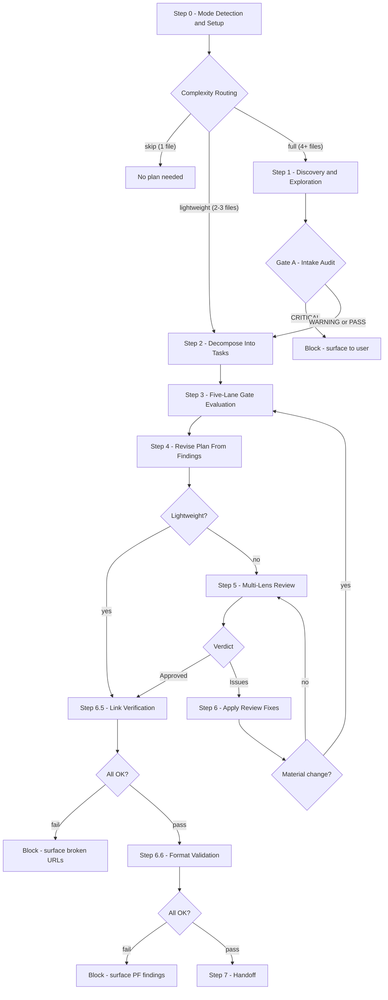
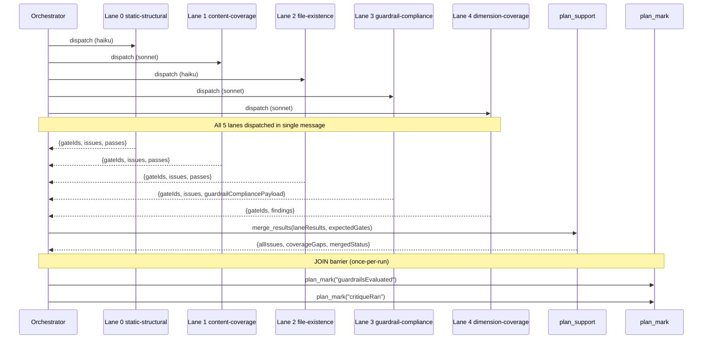
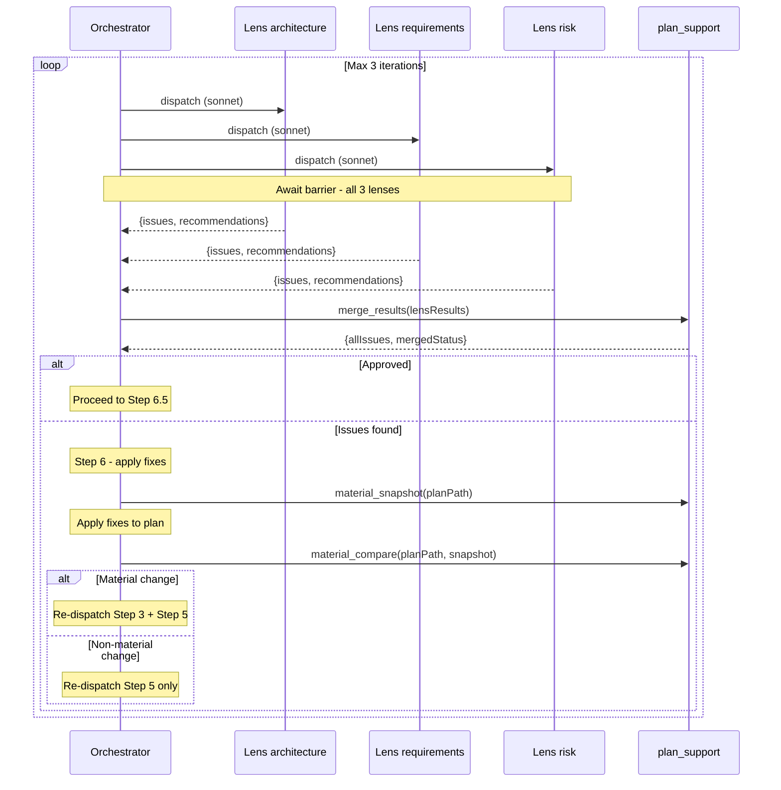
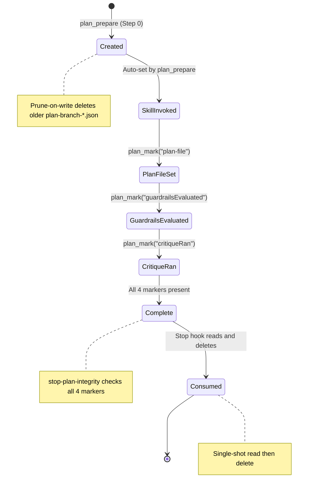

# Plan Skill Architecture

> **Verified against: sdlc v1.0.0**
>
> This document describes the internals of the `/plan` skill as implemented in
> the sdlc plugin. Every tool name, gate ID, format check, config key, and
> state marker was verified against source. For the user-facing skill
> definition, see [`plugins/sdlc/skills/plan/SKILL.md`](../plugins/sdlc/skills/plan/SKILL.md).

---

## Component Inventory

### MCP Tools

Eight MCP tools are called directly by the plan skill pipeline.

| Tool | Registration | Purpose |
|------|-------------|---------|
| `plan_prepare` | `internal/tools/plan.go` `RegisterPlanTools` | Context detection, template resolution, OpenSpec validation, guardrail loading, lane/lens construction, complexity routing |
| `plan_mark` | `internal/tools/plan.go` `RegisterPlanTools` | Write planIntegrity markers (`skillInvoked`, `plan-file`, `guardrailsEvaluated`, `critiqueRan`) |
| `plan_explore_prepare` | `internal/tools/plan_explore.go` `RegisterPlanExploreTools` | Build standalone explore pack (git scope, OpenSpec paths, keyword grep, web-research signal, skill registry sample, recent plans) |
| `plan_support` | `internal/tools/plan_support.go` `RegisterPlanSupportTools` | Four actions: `merge_results`, `material_snapshot`, `material_compare`, `openspec_appendix` |
| `validate` | `internal/tools/validators.go` `RegisterValidateTools` | Seven actions; plan pipeline uses `plan_format` (PF1-PF12) |
| `links_validate` | `internal/tools/links.go` `RegisterLinksTools` | URL extraction + HTTP validation with line tracking |
| `execute_state` | `internal/tools/execute_state.go` `RegisterExecuteStateTools` | Ledger operations: `ledger_checkin`, `ledger_checkout`, `ledger_status` |

Subagents dispatched by the plan skill may call additional tools (e.g., `Glob`,
`Read`, `Grep`) during their evaluation runs.

### Skill Files

Fourteen files in `plugins/sdlc/skills/plan/`:

| File | Role |
|------|------|
| `SKILL.md` | Skill definition (Steps 0-7 pipeline, dispatch instructions) |
| `plan-template-default.md` | Shipped default plan template (sections, discovery questions, verification patterns) |
| `plan-reviewer-prompt.md` | Plan review subagent template (Step 5 lens dispatch) |
| `plan-format-reference.md` | Plan document format specification (PF checks, contract rendering) |
| `state-format.md` | State file schema reference |
| `intake-verify-prompt.md` | Step 1 intake audit subagent prompt |
| `lane-static-structural-prompt.md` | Lane 0 prompt: G1, G2, G3, G7, G12 |
| `lane-content-coverage-prompt.md` | Lane 1 prompt: G5, G6, G8, G9, G11, G13, G15, G16, G18-G21 |
| `lane-file-existence-prompt.md` | Lane 2 prompt: G4, G10 |
| `lane-guardrail-compliance-prompt.md` | Lane 3 prompt: G14 |
| `g17-dimension-coverage-prompt.md` | Lane 4 prompt: G17 |
| `lens-architecture-prompt.md` | Step 5 architecture lens prompt |
| `lens-requirements-prompt.md` | Step 5 requirements lens prompt |
| `lens-risk-prompt.md` | Step 5 risk lens prompt |

### Config Surfaces

| Surface | File | Routing |
|---------|------|---------|
| `plan` section (guardrails, tasks) | `.sdlc-v2/config.json` | `config.ProjectSections` (team-shared, committed) |
| `plan.tasks.requiredFields` | `.sdlc-v2/config.json` | Array of field names for PF11 |
| `plan.tasks.contractShape` | `.sdlc-v2/config.json` | Shape key for PF12 |
| `planStyle` section | `.sdlc-v2/local.json` | `config.allowedLocalOnlyKeys` (per-developer, gitignored) |
| Plan template override | `.sdlc-v2/plan-template.md` | Detected by `plan_prepare` when `resolveTemplate: true` |
| Plans directory | `.claude/settings.json` `plansDirectory` | Claude Code native setting |

`PlanStyle` fields: `verbosity` (default `"standard"`), `audience` (default
`"technical"`), `narrativeRules` (default `nil`). Loaded by `loadPlanStyle` in
`plan.go` with benign-absence fallback.

`PlanTasks` fields: `requiredFields` (default `[]`), `contractShape` (default
`""`). Loaded from `plan` config section's `tasks` sub-key.

### State System

State files live in `.sdlc-v2/execution/` with the naming pattern:

```
plan-<branchSlug>-<YYYYMMDDTHHmmssZ>.json
```

Branch slugs are computed by `state.SlugifyBranch`. The state package
(`internal/state/state.go`) provides `Init`, `Find`, and `Write`. Lifecycle
rules:

- **Prune-on-write:** When a new `plan-<branch>-*.json` is written, older
  state files for the same branch prefix are deleted.
- **Consume-then-delete:** The stop hook reads the state file once, then
  deletes it regardless of outcome (single-shot).
- **GC orphan sweep:** `internal/state/gc.go` applies a TTL and
  branch-liveness check to remove stale state files from dead branches.

### Hooks

| Hook | Trigger | Handler | Effect |
|------|---------|---------|--------|
| `stop-plan-integrity` | `Stop` | `internal/hooks/stop_hooks.go` | Advisory check that all 4 planIntegrity markers were written. Reads + deletes state file. Falls back to transcript scanning (last 64KB for "Plan mode is active") when no state file found. Always ExitCode 0 (advisory). |
| `post-tool-validate` | `PostToolUse` on `Edit\|Write` | `internal/hooks/post_tool_validate.go` | Runs format validation after edits to plan files |
| `session-start` | `SessionStart` | `internal/hooks/session_start.go` | OpenSpec detection, version banner (`sdlc: v1.0.0`), skill count |

Hook definitions are registered in `plugins/sdlc/hooks/hooks.json`.

---

## Step-by-Step Flow

### Pipeline Overview



### Step 0: Mode Detection and Setup

| Aspect | Detail |
|--------|--------|
| **Tools called** | `plan_prepare({resolveTemplate: true, fileCount: N})`, `plan_mark({marker: "plan-file", path: "..."})` |
| **Subagents** | None |
| **Plan sections written** | Template skeleton (header fields: Goal, Architecture, Source, Verification) via `skeletonMarkdown` + `headerMarkdown` |
| **Failure modes** | Missing `.sdlc-v2/config.json`: benign fallback to defaults. Invalid OpenSpec change: `errors[]` populated, pipeline stops. |

`plan_prepare` returns the full context payload: OpenSpec info, guardrails,
style, tasks config, explore pack, template resolution, lanes, lens reviewers,
and dispatches. The `ComplexityRouting` object decides the pipeline mode:

```
fileCount 0-1  -> skip      (no plan)
fileCount 2-3  -> lightweight (skip Step 1, skip Step 5)
fileCount 4+   -> full       (all steps)
```

The `plan_mark({marker: "skillInvoked"})` marker is auto-written by
`plan_prepare` itself. The `plan-file` marker is set explicitly after writing
the plan file.

### Step 1: Discovery and Exploration

| Aspect | Detail |
|--------|--------|
| **Tools called** | `plan_explore_prepare` (or inline `explorePack` from `plan_prepare`), `execute_state({action: "ledger_checkin"})` |
| **Subagents** | 3-7 dimension exploration subagents (parallel fan-out, one per dimension), then 1 intake-audit subagent (prompt: `intake-verify-prompt.md`, model from `intakeAuditDispatch`) |
| **Plan sections written** | None (discovery data feeds Step 2) |
| **Failure modes** | Intake audit returns CRITICAL findings: pipeline blocks, surfaces to user. Explore pack errors: degraded mode with partial context. Brief has zero `F-DIM-N` findings: falls back to inline exploration. Dimension worker stalls twice: skipped with disclosure. |

The explore pack gathers: git scope (diff stats, branch info), OpenSpec paths,
keyword grep results, web-research signal, skill registry sample, and recent
plan files.

**Dimension fan-out:** The orchestrator derives 3-7 task-specific dimensions
(code, web, or hybrid) from the user prompt, scope hints, and OpenSpec
context. One `Agent` subagent is dispatched per dimension, all in a single
message with `run_in_background: true`. Each dimension worker writes its
findings to `.sdlc-v2/execution/ledger/{runId}/{workerId}.findings.md` using
the `F-{dimension.name}-<n>` ID format. The orchestrator polls via
`execute_state({action: "ledger_status"})` until all workers complete, then
compiles a discovery brief. Stalled workers are given one extra poll cycle
before being skipped with disclosure.

`execute_state` ledger operations (`ledger_checkin`, `ledger_checkout`,
`ledger_status`) track dimension worker lifecycle.

### Step 2: Decompose Into Tasks

| Aspect | Detail |
|--------|--------|
| **Tools called** | None (orchestrator writes directly) |
| **Subagents** | None |
| **Plan sections written** | `## Task N` sections with metadata: Complexity, Risk, Depends on, Verify, Files, Contract, Acceptance Criteria, Notes |
| **Failure modes** | None (author-driven step) |

The orchestrator decomposes the goal into numbered tasks using the template
structure from `plan_prepare.template.sections` and the context from Step 1.

### Step 3: Five-Lane Gate Evaluation

| Aspect | Detail |
|--------|--------|
| **Tools called** | `plan_support({action: "merge_results"})`, `plan_mark({marker: "guardrailsEvaluated"})`, `plan_mark({marker: "critiqueRan"})` |
| **Subagents** | 5 lane subagents dispatched in a single message (see [Fan-Out Architecture](#step-3-five-lane-gate)) |
| **Plan sections written** | None (findings stored for Step 4) |
| **Failure modes** | Lane subagent failure: `merge_results` reports coverage gaps for missing gate IDs. All lanes timeout: critique markers not set, stop hook warns. |

All five lanes run in parallel. Each lane evaluates its assigned gates against
the plan file and returns structured findings. `merge_results` deduplicates
issues, checks for coverage gaps (missing gate IDs), and produces a merged
status. The two once-per-run markers (`guardrailsEvaluated`, `critiqueRan`)
are set after the merge barrier.

### Step 4: Revise Plan From Findings

| Aspect | Detail |
|--------|--------|
| **Tools called** | `plan_support({action: "openspec_appendix"})` (conditional) |
| **Subagents** | None |
| **Plan sections written** | Fixes applied to existing task sections, `## OpenSpec Appendix` (conditional) |
| **Failure modes** | None (author-driven revision) |

The orchestrator applies gate findings from Step 3 to the plan. If
`openspecContext` is non-null, `openspec_appendix` generates a markdown
appendix mapping OpenSpec requirements to plan tasks.

### Step 5: Multi-Lens Review

| Aspect | Detail |
|--------|--------|
| **Tools called** | `plan_support({action: "merge_results"})` |
| **Subagents** | 3 lens reviewers dispatched in a single message (see [Fan-Out Architecture](#step-5-three-lens-review)) |
| **Plan sections written** | `## Verification Scorecard` (regenerated after each lens merge iteration) |
| **Failure modes** | All lenses approve: proceed to Step 6.5. Reviewer timeout: degraded findings, may miss issues. Max 3 iterations: surfaces unresolved issues to user via AskUserQuestion. |

Skipped in `lightweight` mode. Three lens reviewers (architecture,
requirements, risk) evaluate the plan independently. Results merge through
`plan_support.merge_results`. After each merge, the `## Verification
Scorecard` section is assembled and written (or regenerated) in the plan file.
If issues remain after 3 iterations, the loop exits and surfaces issues to the
user.

### Step 6: Apply Review Fixes

| Aspect | Detail |
|--------|--------|
| **Tools called** | `plan_support({action: "material_snapshot"})`, `plan_support({action: "material_compare"})` |
| **Subagents** | None |
| **Plan sections written** | Fixes applied to task sections |
| **Failure modes** | Material change detected: re-dispatch from Step 3 (full) or Step 5 (non-material). |

Before applying fixes, a `material_snapshot` captures 7 structural dimensions
of the plan. After fixes, `material_compare` compares against the snapshot. A
material change triggers re-dispatch to Step 3; a non-material change
re-dispatches only Step 5.

The 7 snapshot dimensions (`PlanSnapshot` type in `plan_support.go`):
`taskCount`, `deviationsRows`, `filesSet`, `contracts`, `dependsOn`,
`keyDecisions`, `openspecTaskMapping`.

### Step 6.5: Link Verification

| Aspect | Detail |
|--------|--------|
| **Tools called** | `links_validate({path: planFilePath})` |
| **Subagents** | None |
| **Plan sections written** | None |
| **Failure modes** | Broken URLs found: **blocking** -- pipeline stops and surfaces URLs to user. |

### Step 6.6: Format Validation

| Aspect | Detail |
|--------|--------|
| **Tools called** | `validate({action: "plan_format", path: planFilePath, final: true})` |
| **Subagents** | None |
| **Plan sections written** | None |
| **Failure modes** | PF check failures: **blocking** -- pipeline stops and surfaces findings to user. |

The `final: true` flag enables PF9 (Verification Scorecard) and PF10
(template-required sections) checks that only apply to the finished plan.

### Step 7: Handoff

| Aspect | Detail |
|--------|--------|
| **Tools called** | None (learning capture appends directly to `.sdlc-v2/learnings/log.md`) |
| **Subagents** | None |
| **Plan sections written** | None (Scorecard already written in Step 5) |
| **Failure modes** | None |

The orchestrator logs learnings and hands off the finalized plan to the user
or to the `/execute` skill. The Verification Scorecard was already written
during Step 5's lens-merge iterations.

---

## Fan-Out Architecture

### Step 1: Dimension Exploration Fan-Out

The orchestrator derives 3-7 dimensions from the user prompt, scope hints, and
OpenSpec context. Each dimension has a type (`code`, `web`, or `hybrid`) and a
model assignment. One `Agent` subagent is dispatched per dimension in a single
message, all with `run_in_background: true`.

Each worker explores its dimension independently (codebase reads for `code`,
web research for `web`, both for `hybrid`) and writes findings to
`.sdlc-v2/execution/ledger/{runId}/{workerId}.findings.md`. The orchestrator
polls `execute_state({action: "ledger_status"})` until all workers complete or
stall. Results are compiled into a discovery brief (`discovery-brief.md`) that
feeds Step 2's decomposition.

A brief that contains zero `F-DIM-N` finding IDs triggers a fallback to inline
exploration (the brief is discarded and the ledger directory cleaned up).

### Step 3: Five-Lane Gate

Five subagents are dispatched in a single `Agent` tool-use message. Each lane
runs independently with its own model and prompt template. All must complete
before the merge barrier.



Lane prompt templates are filled with variables from the `plan_prepare`
payload. Each lane receives the plan file path, format reference path, and
lane-specific context (e.g., `{ACTIVE_GUARDRAILS}` for Lane 3,
`{DIMENSIONS_DIR}` and `{COPILOT_DIR}` for Lane 4).

### Step 5: Three-Lens Review

Three lens reviewers run in parallel. Each uses the
`plan-reviewer-prompt.md` template with lens-specific focus categories.



Lens definitions from `buildLensReviewers()` in `plan.go`:

| Lens | Model | Focus Categories |
|------|-------|-----------------|
| `architecture` | sonnet | Structural design, component boundaries, dependency direction |
| `requirements` | sonnet | Requirement coverage, acceptance criteria completeness |
| `risk` | sonnet | Risk identification, mitigation strategies, failure modes |

### Merged Re-Dispatch Path

When Step 6 detects a material change (any of the 7 snapshot dimensions
differ), the pipeline re-dispatches from Step 3. This means all five lanes
re-evaluate the revised plan. When the change is non-material, only Step 5
re-dispatches.

The material-change detection uses `plan_support` actions:

1. `material_snapshot` captures the 7 dimensions before fixes.
2. The orchestrator applies fixes.
3. `material_compare` diffs against the snapshot and returns `{material: bool, triggers: []}`.

The `triggers` array names which dimensions changed (e.g., `"taskCount"`,
`"contracts"`, `"dependsOn"`), giving the orchestrator visibility into what
shifted.

---

## Data Flow

### plan_prepare Payload Map

Every field of `PlanPrepareOut` and its consuming step:

| Field | Type | Consumer |
|-------|------|----------|
| `openspec` | `OpenspecInfo` | Step 0 (banner), Step 1 (explore context) |
| `fromOpenspec` | `*FromOpenspecResult` | Step 0 (validation gate) |
| `openspecContext` | `OpenspecContext` | Steps 2, 4 (task mapping, appendix generation) |
| `guardrails` | `[]map[string]any` | Step 3 Lane 3 (`{ACTIVE_GUARDRAILS}` template var) |
| `style` | `PlanStyle` | Steps 0-7 (verbosity, audience, narrative rules) |
| `tasks` | `PlanTasks` | Step 6.6 (PF11 requiredFields, PF12 contractShape) |
| `explorePack` | `ExplorePack` | Step 1 (git scope, OpenSpec paths, keywords) |
| `planTemplate` | `PlanTemplate` | Step 0 (template path detection) |
| `githubHosting` | `GithubHosting` | Step 3 Lane 4 (`{GITHUB_HOSTING_DETECTED}`) |
| `g17Dispatch` | `Dispatch` | Step 3 Lane 4 (subagent type, model, prompt path) |
| `intakeAuditDispatch` | `Dispatch` | Step 1 (intake audit subagent config) |
| `lanes` | `[]Lane` | Step 3 (5 lane configs: name, model, prompt, gateIds) |
| `lensReviewers` | `[]LensReviewer` | Step 5 (3 lens configs: lens, model, prompt, focusCategories) |
| `template` | `*TemplateResolution` | Step 0 (skeleton, routing, sections, questions) |
| `errors` | `[]string` | Step 0 (pipeline abort on non-empty) |

### Template Variable Bindings

Lane and lens prompt templates use `{PLACEHOLDER}` variables filled from the
`plan_prepare` payload:

| Variable | Source | Used by |
|----------|--------|---------|
| `{PLAN_FILE_PATH}` | Plan file path on disk | All lanes, all lenses |
| `{FORMAT_REFERENCE_PATH}` | `plan-format-reference.md` path | Lanes 0, 1 |
| `{ACTIVE_GUARDRAILS}` | `guardrails` array (JSON) | Lane 3 |
| `{DIMENSIONS_DIR}` | `.sdlc-v2/review-dimensions/` | Lane 4 |
| `{COPILOT_DIR}` | `.github/instructions/` | Lane 4 |
| `{GITHUB_HOSTING_DETECTED}` | `githubHosting.detected` (boolean) | Lane 4 |
| `{OPENSPEC_TASKS}` | `openspecContext.tasks` (JSON or null) | Lane 1 (G11, G16) |

### F-DIM-N Finding Provenance Chain

Step 1 dimension exploration workers produce findings with structured IDs:

```
F-{dimension.name}-{n}
```

For example: `F-auth-layer-1`, `F-perf-budget-3`. Each finding is anchored to
a source (file path + line for `code` dimensions, URL for `web` dimensions,
both for `hybrid`).

**Provenance flow:**

1. **Step 1** -- Dimension workers write `F-DIM-N` findings to ledger files.
2. **Step 1** -- Orchestrator compiles findings into a discovery brief.
3. **Step 2** -- Tasks cite `F-DIM-N` IDs in their descriptions to trace
   requirements back to discovery evidence.
4. **Step 3** -- G15 (Brief citation coverage) verifies that Standard/Complex
   tasks cite at least one `F-DIM-N` finding ID. Tasks without citations
   must be marked "out-of-scope addition" with rationale.

The `merge_results` action in `plan_support` deduplicates gate findings by
matching `(taskRef, message-normalized-prefix)` and reports coverage gaps for
any expected gate IDs not returned by lane subagents.

### Plan File Section Lifecycle

| Step | Sections Created/Modified |
|------|--------------------------|
| Step 0 | Header fields (Goal, Architecture, Source, Verification), template skeleton via `skeletonMarkdown` |
| Step 2 | `## Task N` sections with full metadata (Complexity, Risk, Depends on, Verify, Files, Contract, Acceptance Criteria, Notes) |
| Step 4 | Fixes applied to existing `## Task N` sections; `## Guardrail Compliance` (when `activeGuardrails` non-empty); `## Suggested Review Dimensions` (when `g17Findings` non-empty); `## OpenSpec Appendix` (conditional on `openspecContext`) |
| Step 5 | `## Verification Scorecard` written after each lens merge (regenerated per iteration, not appended) |
| Step 6 | Review fixes applied to `## Task N` sections |

Steps 1, 3, 5, 6.5, and 6.6 do not write to the plan file directly. They
produce findings or validation results that feed into subsequent writing steps.

---

## Quality Gate Reference

### G1-G21 Partition Table

| Gate | Name | Lane | Model | Severity | Blocking |
|------|------|------|-------|----------|----------|
| G1 | Requirements coverage | 0 static-structural | haiku | warning* | No* |
| G2 | No orphan tasks | 0 static-structural | haiku | warning* | No* |
| G3 | Dependency integrity | 0 static-structural | haiku | error | **Yes** |
| G4 | File conflict potential | 2 file-existence | haiku | error | **Yes** |
| G5 | Context sufficiency | 1 content-coverage | sonnet | warning | No |
| G6 | Classification accuracy | 1 content-coverage | sonnet | warning | No |
| G7 | No scope creep | 0 static-structural | haiku | warning* | No* |
| G8 | Verification completeness | 1 content-coverage | sonnet | warning | No |
| G9 | Decomposition balance | 1 content-coverage | sonnet | warning | No |
| G10 | File existence | 2 file-existence | haiku | error | **Yes** |
| G11 | OpenSpec requirements coverage | 1 content-coverage | sonnet | error | **Yes** |
| G12 | Dependency target existence | 0 static-structural | haiku | error | **Yes** |
| G13 | Self-containment test | 1 content-coverage | sonnet | warning | No |
| G14 | Guardrail compliance | 3 guardrail-compliance | sonnet | per-guardrail | per-guardrail |
| G15 | Brief citation coverage | 1 content-coverage | sonnet | warning | No |
| G16 | OpenSpec tasks.md coverage | 1 content-coverage | sonnet | error | **Yes** |
| G17 | Dimension coverage | 4 dimension-coverage | sonnet | advisory | No (never) |
| G18 | Contract concreteness | 1 content-coverage | sonnet | error | **Yes** |
| G19 | Render-don't-narrate | 1 content-coverage | sonnet | error | **Yes** |
| G20 | Notes rationale-only | 1 content-coverage | sonnet | error | **Yes** |
| G21 | Self-contained code references | 1 content-coverage | sonnet | error | **Yes** |

**\* Escalation rule:** G1, G2, G7 escalate from `warning` to `error`
(blocking) when the plan has 3 or more uncovered requirements or orphan tasks.

**G14 note:** Severity inherits from each guardrail's own `severity` field.
`error`-severity guardrails are blocking; `warning`-severity guardrails are
advisory.

**G5 note:** The lane-content-coverage prompt lists G6/G8/G9/G13/G15 as
warning and G11/G16/G18-G21 as error, but omits G5 from both lists. G5 is
classified as warning here based on the pattern (correctable, non-blocking).

**G17 note:** Dimension coverage is always advisory and non-blocking. Findings
are spliced as a `## Suggested Review Dimensions` advisory block in Step 4.

### PF1-PF12 Format Checks

All checks implemented in `internal/tools/validators.go` under the
`plan_format` action.

| Check | What | Source Function | Final-Only |
|-------|------|-----------------|------------|
| PF1 | Header fields present (Goal, Architecture, Source, Verification) | `checkPF1` | No |
| PF2 | Task numbering contiguous, starts at 0 or 1 | `checkPF2` | No |
| PF3 | Task metadata present (Complexity, Risk, Depends on, Verify) | `checkPF3` | No |
| PF4 | Dependency graph valid (no cycles, no dangling refs) | `checkPF4` | No |
| PF5 | Acceptance criteria checkboxes + Notes line cap | `checkPF5` | No |
| PF6 | Deviations and assumptions section present | `checkPF6` | No |
| PF7 | Contract block present for artifact-touching tasks | `checkPF7` | No |
| PF8 | *(Reserved -- not implemented)* | -- | -- |
| PF9 | Verification Scorecard section present | `checkPF9` | **Yes** |
| PF10 | Template-required sections present | `checkPF10` | **Yes** |
| PF11 | Custom required fields (from `plan.tasks.requiredFields`) | `checkPF11` | No |
| PF12 | Contract shape keys (from `plan.tasks.contractShape`) | `checkPF12` | No |

PF9 and PF10 are gated behind `final: true` because the Verification
Scorecard and template sections are written in Step 7, after all revisions.

`parseTemplateRequiredSectionsFull` (shared between template resolution and
PF10) parses the active template to determine which sections are required.

---

## State & Integrity

The `planIntegrity` system tracks whether the plan skill completed its full
pipeline. Four markers must be present in the state file for a clean exit.



### Marker Definitions

| Marker | Set By | Step | Meaning |
|--------|--------|------|---------|
| `skillInvoked` | `plan_prepare` (auto) | 0 | Plan skill pipeline was entered |
| `plan-file` | `plan_mark` (explicit) | 0 | Plan file path was written |
| `guardrailsEvaluated` | `plan_mark` (explicit) | 3 | Gate evaluation completed |
| `critiqueRan` | `plan_mark` (explicit) | 3 | Critique merge barrier passed |

### Stop Hook Behavior

`stop-plan-integrity` in `internal/hooks/stop_hooks.go`:

1. Attempts to find and read `plan-<branch>-*.json` state file.
2. Calls `planIntegrityFromState`: checks all 4 markers present + `planFilePath` stat.
3. If no state file found, falls back to `planIntegrityFromTranscript`: scans last 64KB of transcript for "Plan mode is active".
4. Advisory only (ExitCode 0 always). Missing markers produce a warning, not a failure.
5. State file is deleted after reading regardless of outcome.

---

## Error Paths & Degraded Modes

| Trigger | Step | Recovery | Blocking |
|---------|------|----------|----------|
| `plan_prepare` returns non-empty `errors[]` | 0 | Pipeline aborts, surfaces errors to user | **Yes** |
| Complexity routing returns `skip` | 0 | Pipeline ends cleanly (no plan needed) | No |
| Intake audit returns CRITICAL findings | 1 | Pipeline blocks, surfaces findings to user | **Yes** |
| Explore pack partial failure (e.g., git scope unavailable) | 1 | Degraded mode with partial context; no block | No |
| Lane subagent timeout or crash | 3 | `merge_results` reports coverage gaps for missing gate IDs | No (degraded) |
| `merge_results` finds coverage gaps | 3 | Missing gates flagged in merge output; orchestrator decides | No (advisory) |
| Lens reviewer timeout | 5 | Degraded findings; loop may exit early | No (degraded) |
| Material change after Step 6 fixes | 6 | Re-dispatch from Step 3 (full pipeline re-evaluation) | No (loop) |
| Non-material change after Step 6 fixes | 6 | Re-dispatch from Step 5 only | No (loop) |
| Max review iterations (3) exceeded | 5-6 | Loop exits, proceeds to Step 6.5 | No |
| `links_validate` finds broken URLs | 6.5 | Pipeline blocks, surfaces broken URLs to user | **Yes** |
| `validate({action: "plan_format"})` finds PF failures | 6.6 | Pipeline blocks, surfaces PF findings to user | **Yes** |
| Session interrupted (Ctrl+C, timeout) | Any | `stop-plan-integrity` hook fires, warns on missing markers | No (advisory) |
| State file missing at stop time | Stop | Falls back to transcript scanning | No (advisory) |

---

## Skill-to-Skill Interfaces

### Inbound

| Source | Interface | What It Provides |
|--------|-----------|-----------------|
| `/setup` | `.sdlc-v2/config.json` (plan section) | Guardrails, tasks config (requiredFields, contractShape) |
| `/execute` | `execute_state` ledger | Ledger checkin/checkout/status for execution tracking |
| OpenSpec CLI | `openspec/changes/<name>/` directory | Proposal, delta specs, tasks, design docs for `--from-openspec` plans |
| Session start hook | OpenSpec detection banner | Signals whether OpenSpec is active in the project |

### Outbound

| Target | Interface | What Plan Provides |
|--------|-----------|-------------------|
| `/execute` | Plan file (`.claude/plans/*.md`) | Numbered task list with metadata, contracts, acceptance criteria |
| `/ship` | Plan file reference | Ship pipeline references the plan for commit/PR context |
| `/harden` | Quality gate findings | Gate failures may trigger hardening proposals |

---

## Configurable vs Hard-Coded

| Surface | Configurable | Where | Override Mechanism |
|---------|-------------|-------|-------------------|
| Guardrails list | Yes | `.sdlc-v2/config.json` `plan.guardrails` | Array of `{id, description, severity}` objects |
| Required task fields | Yes | `.sdlc-v2/config.json` `plan.tasks.requiredFields` | Array of field name strings |
| Contract shape | Yes | `.sdlc-v2/config.json` `plan.tasks.contractShape` | Shape key string |
| Plan template | Yes | `.sdlc-v2/plan-template.md` | Project-local override of default template |
| Plans directory | Yes | `.claude/settings.json` `plansDirectory` | Claude Code native setting |
| Verbosity | Yes | `.sdlc-v2/local.json` `planStyle.verbosity` | Per-developer (gitignored) |
| Audience | Yes | `.sdlc-v2/local.json` `planStyle.audience` | Per-developer (gitignored) |
| Narrative rules | Yes | `.sdlc-v2/local.json` `planStyle.narrativeRules` | Per-developer (gitignored) |
| Lane count (5) | No | `plan.go` `buildLanes()` | Hard-coded |
| Lane-to-gate assignment | No | `plan.go` `buildLanes()` | Hard-coded |
| Lane models (haiku/sonnet) | No | `plan.go` `buildLanes()` | Hard-coded |
| Lens count (3) | No | `plan.go` `buildLensReviewers()` | Hard-coded |
| Lens focus categories | No | `plan.go` `buildLensReviewers()` | Hard-coded |
| Complexity thresholds (1/2-3/4+) | No | `plan.go` `ComplexityRouting` | Hard-coded |
| Max review iterations (3) | No | `SKILL.md` Step 5 | Hard-coded |
| PF checks (PF1-PF12) | No | `validators.go` | Hard-coded (PF11/PF12 are parameterized) |
| G1-G21 gate definitions | No | Lane prompt `.md` files | Hard-coded |
| planIntegrity markers (4) | No | `stop_hooks.go` `requiredPlanMarkers` | Hard-coded |
| Snapshot dimensions (7) | No | `plan_support.go` `PlanSnapshot` | Hard-coded |
| Transcript scan window (64KB) | No | `stop_hooks.go` | Hard-coded |

### Config Knob Connectivity Chains

Full source-to-enforcement chain for the 5 `planStyle`/`plan.tasks` config fields: schema definition, Go struct field, the loader function that reads it, where the SKILL.md workflow consumes it, and what enforces it.

| Config Field | File | Schema Location | Go Struct | Loaded By | SKILL.md Step | Enforced By |
|---|---|---|---|---|---|---|
| `planStyle.verbosity` | `.sdlc-v2/local.json` (personal) | `planStyleSection.verbosity` | `PlanStyle.Verbosity` | `loadPlanStyle` | Step 2 | LLM judgment |
| `planStyle.audience` | `.sdlc-v2/local.json` (personal) | `planStyleSection.audience` | `PlanStyle.Audience` | `loadPlanStyle` | Step 2 | LLM judgment |
| `planStyle.narrativeRules` | `.sdlc-v2/local.json` (personal) | `planStyleSection.narrativeRules` | `PlanStyle.NarrativeRules` | `loadPlanStyle` | Step 5 | Lens prompts (`{NARRATIVE_RULES}`) |
| `plan.tasks.requiredFields` | `.sdlc-v2/config.json` (team) | `planSection.tasks.requiredFields` | `PlanTasks.RequiredFields` | `loadPlanTasks` | Step 2 (authored), Step 4 (revised) | PF11 (`checkPF11`) |
| `plan.tasks.contractShape` | `.sdlc-v2/config.json` (team) | `planSection.tasks.contractShape` | `PlanTasks.ContractShape` | `loadPlanTasks` | Step 2 (authored), Step 4 (revised) | PF12 (`checkPF12`) |

---

## Sources of Truth

Maintenance reference: which source files back each section of this document.

| Section | Primary Sources |
|---------|----------------|
| Component Inventory - MCP Tools | `internal/tools/plan.go`, `plan_explore.go`, `plan_support.go`, `validators.go`, `links.go`, `execute_state.go`, `learnings.go` |
| Component Inventory - Skill Files | `plugins/sdlc/skills/plan/` directory listing |
| Component Inventory - Config | `internal/config/schema.go`, `internal/config/config.go`, `internal/tools/plan.go` (`loadPlanStyle`, `PlanTasks`) |
| Component Inventory - State | `internal/state/state.go`, `internal/state/gc.go` |
| Component Inventory - Hooks | `plugins/sdlc/hooks/hooks.json`, `internal/hooks/hooks.go`, `internal/hooks/stop_hooks.go` |
| Step-by-Step Flow | `plugins/sdlc/skills/plan/SKILL.md` (Steps 0-7) |
| Fan-Out Architecture | `internal/tools/plan.go` (`buildLanes`, `buildLensReviewers`), `internal/tools/plan_support.go` (`merge_results`) |
| Data Flow | `internal/tools/plan.go` (`PlanPrepareOut`, `TemplateResolution`), lane/lens prompt `.md` files |
| Quality Gate Reference | Lane prompt files (`lane-*.md`, `g17-*.md`), `internal/tools/validators.go` |
| State & Integrity | `internal/hooks/stop_hooks.go`, `internal/state/state.go` |
| Error Paths | `plugins/sdlc/skills/plan/SKILL.md`, `internal/tools/plan.go`, `internal/tools/validators.go` |
| Skill-to-Skill Interfaces | `plugins/sdlc/skills/plan/SKILL.md`, `internal/config/schema.go` |
| Configurable vs Hard-Coded | `internal/config/schema.go`, `internal/tools/plan.go`, `internal/tools/validators.go`, `internal/hooks/stop_hooks.go` |
