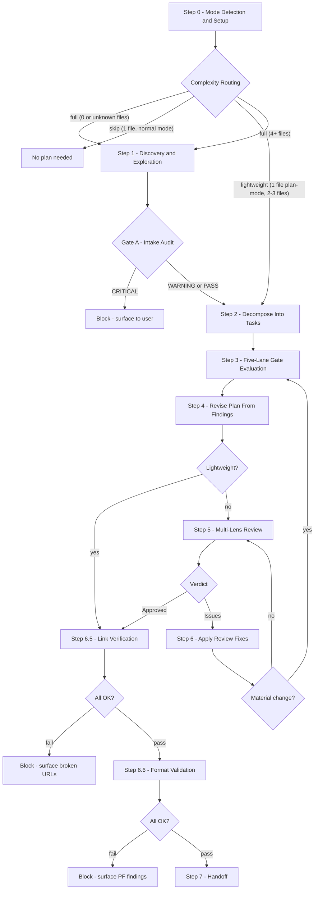
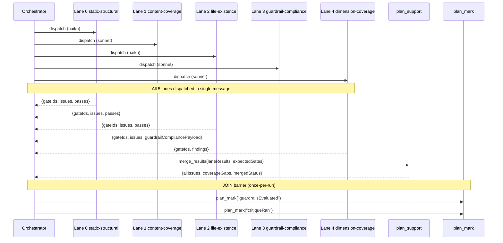
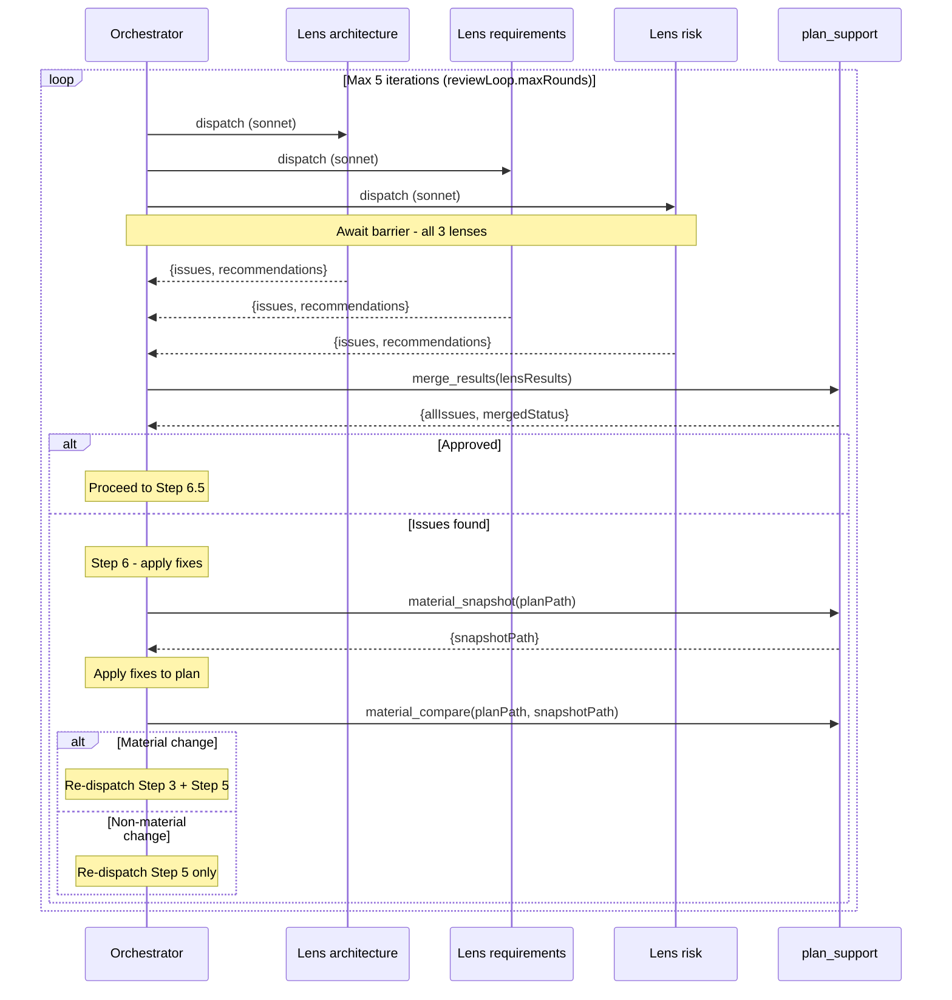
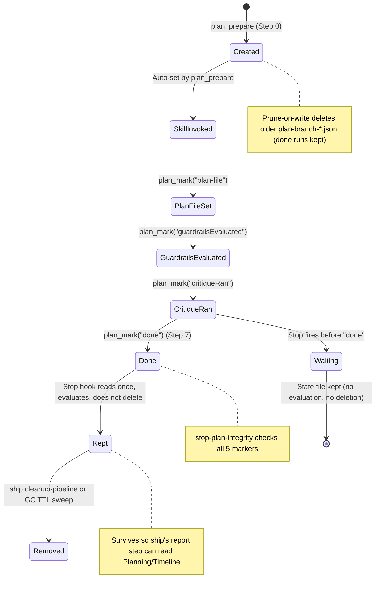

# Plan Skill Architecture

> **Verified against: sdlc v1.0.0**
>
> This document describes the internals of the `/plan` skill as implemented in
> the sdlc plugin. Every tool name, gate ID, format check, config key, and
> state marker was verified against source. For the user-facing skill
> definition, see [`plugins/sdlc/skills/plan/SKILL.md`](../plugins/sdlc/skills/plan/SKILL.md).

---

## Component Inventory

### MCP Tools

Seven MCP tools are called directly by the plan skill pipeline.

| Tool | Registration | Purpose |
|------|-------------|---------|
| `plan_prepare` | `internal/tools/plan.go` `RegisterPlanTools` | Context detection, template resolution, OpenSpec validation, guardrail loading, lane/lens construction, complexity routing. Computes pending OpenSpec tasks.md ref stamps but never writes them — see [OpenSpec tasks.md Ref Stamping](#openspec-tasksmd-ref-stamping) |
| `plan_mark` | `internal/tools/plan.go` `RegisterPlanTools` | Write planIntegrity markers (`skillInvoked`, `plan-file`, `guardrailsEvaluated`, `critiqueRan`, `done`), append `guardrailResults`/`criticalDecisions`, or replace the `checkpoint` progress marker. Every call also refreshes `data.planTiming` (run start to the plan file's last edit); `done` additionally appends a `history.RunRecord` to `.sdlc-v2/history/runs.jsonl` |
| `plan_explore_prepare` | `internal/tools/plan_explore.go` `RegisterPlanExploreTools` | Build standalone explore pack (git scope, OpenSpec paths, keyword grep, web-research signal, skill registry sample, recent plans) |
| `plan_support` | `internal/tools/plan_support.go` `RegisterPlanSupportTools` | Seven actions: `merge_results`, `material_snapshot`, `material_compare`, `openspec_appendix`, `evidence_record`, `evidence_digest`, `evidence_get` |
| `validate` | `internal/tools/validators.go` `RegisterValidateTools` | Ten actions (9 today + `plan_style`); plan pipeline uses `plan_format` (PF1-PF14) and `plan_style` |
| `links_validate` | `internal/tools/links.go` `RegisterLinksTools` | URL extraction + HTTP validation with line tracking |
| `execute_state` | `internal/tools/execute_state.go` `RegisterExecuteStateTools` | Ledger operations (review skill; plan uses the evidence store instead — see [Evidence store and compaction recovery](#evidence-store-and-compaction-recovery)) |

Subagents dispatched by the plan skill may call additional tools (e.g., `Glob`,
`Read`, `Grep`) during their evaluation runs.

### Skill Files

Fourteen files in `plugins/sdlc/skills/plan/`:

| File | Role |
|------|------|
| `SKILL.md` | Skill definition (Steps 0-7 pipeline, dispatch instructions) |
| `plan-template-default.md` | Shipped default plan template (sections, discovery questions, verification patterns) |
| `plan-reviewer-prompt.md` | Plan review subagent template (Step 5 lens dispatch) |
| `plan-format-reference.md` | Plan document format specification (PF checks, contract rendering) |
| `state-format.md` | State file schema reference |
| `intake-verify-prompt.md` | Step 1 intake audit subagent prompt |
| `lane-static-structural-prompt.md` | Lane 0 prompt: G1, G2, G3, G7, G12 |
| `lane-content-coverage-prompt.md` | Lane 1 prompt: G5, G6, G8, G9, G11, G13, G15, G16, G18-G21 |
| `lane-file-existence-prompt.md` | Lane 2 prompt: G4, G10 |
| `lane-guardrail-compliance-prompt.md` | Lane 3 prompt: G14, G22 |
| `g17-dimension-coverage-prompt.md` | Lane 4 prompt: G17 |
| `lens-architecture-prompt.md` | Step 5 architecture lens prompt |
| `lens-requirements-prompt.md` | Step 5 requirements lens prompt |
| `lens-risk-prompt.md` | Step 5 risk lens prompt |

### Config Surfaces

| Surface | File | Routing |
|---------|------|---------|
| `plan` section (guardrails, tasks) | `.sdlc-v2/config.toml` | `config.ProjectSections` (team-shared, committed) |
| `plan.tasks.requiredFields` | `.sdlc-v2/config.toml` | Array of field names for PF11 |
| `plan.tasks.contractShape` | `.sdlc-v2/config.toml` | Shape key for PF12 |
| `planStyle` section | `.sdlc-v2/local.toml` | `config.ProjectSections` routing: not a project section (per-developer, gitignored) |
| Plan template override | `.sdlc-v2/plan-template.md` | Detected by `plan_prepare` when `resolveTemplate: true` |
| Plans directory | `.claude/settings.json` `plansDirectory` | Claude Code native setting |

`PlanStyle` (alias of `commstyle.Style`) fields: `audience` (default
`"functional"`), `writingStandard` (default `"plain-language"`), `tone`
(default `"direct"`), `visualDensity` (default `"balanced"`), `language`
(default `"English"`), `technicalTerms`, `narrativeRules` and `instructions`
(default `[]`), plus the derived `limits`, `warnings`, and `writingGuide`.
Loaded by `loadPlanStyle` in `plan.go`, which calls `commstyle.FromSections`
on the `[style]` and `[planStyle]` config sections.

`PlanTasks` fields: `requiredFields` (default `[]`), `contractShape` (default
`"full"`). Loaded from `plan` config section's `tasks` sub-key.

### State System

State files live in `.sdlc-v2/runs/` with the naming pattern:

```
plan-<branchSlug>-<YYYYMMDDTHHmmssZ>.json
```

Branch slugs are computed by `state.SlugifyBranch`. The state package
(`internal/state/state.go`) provides `Init`, `Find`, and `Write`. Lifecycle
rules:

- **Prune-on-write:** When a new `plan-<branch>-*.json` is written, older
  state files for the same branch prefix are deleted — except a sibling
  `plan` run already marked `done`, which is kept (see
  [Plan run lifetime](#plan-run-lifetime)).
- **Evaluate, don't delete:** The stop hook reads the state file once `done`
  is set and evaluates it, but no longer deletes it — deletion is owned by
  ship's `cleanup-pipeline` step or the GC TTL sweep below.
- **GC orphan sweep:** `internal/state/gc.go` deletes every state file of a
  dead branch regardless of age, and — for a live branch — a file only once
  it is both past the TTL **and** no longer the newest of its branch; this
  is what eventually claims a `done` plan run too, once the branch moves on
  (see [Plan run lifetime](#plan-run-lifetime)). `ship_state({action:
  "cleanup-pipeline"})` additionally removes a `done` plan run as soon as
  the ship report has read it, independently of GC's TTL/newest rule.

### Hooks

| Hook | Trigger | Handler | Effect |
|------|---------|---------|--------|
| `stop-plan-integrity` | `Stop` | `internal/hooks/stop_hooks.go` | Advisory check that all 5 planIntegrity markers were written. Gates on `done` marker before evaluating; never deletes the state file (see [Plan run lifetime](#plan-run-lifetime)). Falls back to transcript scanning (last 64KB for "Plan mode is active") when no state file found. Always ExitCode 0 (advisory). |
| `post-tool-validate` | `PostToolUse` on `Edit\|Write` | `internal/hooks/post_tool_validate.go` | Runs format validation after edits to plan files |
| `pipeline-continue` | `PostToolUse` on `Bash\|TodoWrite` | `internal/hooks/pipeline_continue.go` | Signals pipeline-aware hooks that a tool completed during an active pipeline |
| `stop-pipeline-continue` | `Stop` | `internal/hooks/stop_hooks.go` | Counterpart to `pipeline-continue`; fires on session stop during an active pipeline |
| `session-start` | `SessionStart` | `internal/hooks/session_start.go` | OpenSpec detection, version banner (`sdlc: v1.0.0`), skill count |

Hook definitions are registered in `plugins/sdlc/hooks/hooks.json`.

---

## Step-by-Step Flow

### Pipeline Overview


```mermaid
flowchart TD
    S0["Step 0 - Mode Detection and Setup"]
    S0 --> route{Complexity Routing}
    route -->|"full (0 or unknown files)"| S1
    route -->|"skip (1 file, normal mode)"| STOP["No plan needed"]
    route -->|"lightweight (1 file plan-mode, 2-3 files)"| S2
    route -->|"full (4+ files)"| S1

    S1["Step 1 - Discovery and Exploration"]
    S1 --> gate_a{"Gate A - Intake Audit"}
    gate_a -->|CRITICAL| BLOCK1["Block - surface to user"]
    gate_a -->|WARNING or PASS| S2

    S2["Step 2 - Decompose Into Tasks"]
    S2 --> S3

    S3["Step 3 - Five-Lane Gate Evaluation"]
    S3 --> S4["Step 4 - Revise Plan From Findings"]
    S4 --> lw_check{Lightweight?}
    lw_check -->|yes| S6_5
    lw_check -->|no| S5

    S5["Step 5 - Multi-Lens Review"]
    S5 --> verdict{Verdict}
    verdict -->|Approved| S6_5
    verdict -->|Issues| S6["Step 6 - Apply Review Fixes"]
    S6 --> material{"Material change?"}
    material -->|yes| S3
    material -->|no| S5

    S6_5["Step 6.5 - Link Verification"]
    S6_5 --> link_ok{All OK?}
    link_ok -->|fail| BLOCK2["Block - surface broken URLs"]
    link_ok -->|pass| S6_6

    S6_6["Step 6.6 - Format Validation"]
    S6_6 --> fmt_ok{All OK?}
    fmt_ok -->|fail| BLOCK3["Block - surface PF findings"]
    fmt_ok -->|pass| S7["Step 7 - Handoff"]
```

### Step 0: Mode Detection and Setup

| Aspect | Detail |
|--------|--------|
| **Tools called** | `plan_prepare({resolveTemplate: true, fileCount: N})`, `plan_mark({marker: "plan-file", path: "..."})` |
| **Subagents** | None |
| **Plan sections written** | Template skeleton (header fields: Goal, Architecture, Source, Verification) via `skeletonMarkdown` + `headerMarkdown` |
| **Failure modes** | Missing `.sdlc-v2/config.toml`: benign fallback to defaults. Invalid OpenSpec change: `errors[]` populated, pipeline stops. |

`plan_prepare` returns the full context payload: OpenSpec info, guardrails,
style, tasks config, explore pack, template resolution, lanes, lens reviewers,
and dispatches. The `ComplexityRouting` object decides the pipeline mode:

```
fileCount ≤ 0  -> full       (file count unknown — defaulting to full pipeline)
fileCount 1    -> skip       (no plan; lightweight override → lightweight)
fileCount 2-3  -> lightweight (skip Step 1, skip Step 5)
fileCount 4+   -> full       (all steps)
```

The `plan_mark({marker: "skillInvoked"})` marker is auto-written by
`plan_prepare` itself. The `plan-file` marker is set explicitly after writing
the plan file.

#### OpenSpec tasks.md Ref Stamping

When the plan attaches to an OpenSpec change, each task line in
`openspec/changes/<name>/tasks.md` eventually carries an inline
`<!-- ref:... -->` comment linking it back to a plan task. That write is
**deferred out of the plan pipeline entirely**:

| Stage | Tool | What happens |
|-------|------|--------------|
| Plan | `plan_prepare` | `pendingTaskRefs` computes which task lines still lack a ref comment. Nothing is written. `openspecContext.tasksUpdated` is that **pending count**. |
| Execute | `execute_state({action: "init"})` | `stampTaskRefs` writes the ref comments for real, once the plan is approved. |

The split exists because `tasks.md` is git-tracked and the plan skill runs
under Claude Code plan mode, which must not modify tracked files.
`plan_prepare` does write — the plan state file and `<runId>.evidence/guardrails.md`,
both under gitignored `.sdlc-v2/runs/` — but never a tracked file, which is
what lets it stay `ReadOnly:true` in its MCP annotations (see
docs/mcp-tool-annotations.md) and therefore callable in plan mode at all. A
call without `resume` or `resolveTemplate` also starts a new run and
best-effort deletes older runs' evidence directories for the branch.

Two consequences worth knowing:

- **`tasksUpdated` is not a write count.** Reporting it as "N tasks updated"
  after `plan_prepare` is wrong — nothing has been updated yet.
- **The `**Source:** openspec/changes/<name>/` plan header is load-bearing.**
  `execute_state`'s init handler re-reads the plan file and matches that exact
  header (`openspecSourceRe`) to recover the change name; the resolved name is
  then run through `isSafeChangeName` before any path is built from it. A
  missing or reworded header means no stamp, silently.

Stamping is warning-only on every failure path — a standalone execute has no
plan file, and a non-OpenSpec plan is not an error. An unreadable plan file, or
a change whose `tasks.md` is absent, surfaces as an entry in init's
`warnings[]` rather than failing the run. `stampTaskRefs` is write-once and
idempotent: a line that already has a ref comment is skipped, and a run where
nothing is pending writes no file at all.

### Step 1: Discovery and Exploration

| Aspect | Detail |
|--------|--------|
| **Tools called** | `plan_explore_prepare` (or inline `explorePack` from `plan_prepare`), `plan_support({action: "evidence_record"})` per dimension writer (running, then done), `plan_support({action: "evidence_digest"})` (poll) |
| **Subagents** | 3-7 dimension exploration subagents (parallel fan-out, one per dimension), then 1 intake-audit subagent (prompt: `intake-verify-prompt.md`, model from `intakeAuditDispatch`) |
| **Plan sections written** | None (discovery data feeds Step 2) |
| **Failure modes** | Intake audit returns CRITICAL findings: pipeline blocks, surfaces to user. Explore pack errors: degraded mode with partial context. Brief has zero `F-DIM-N` findings: falls back to inline exploration. Dimension writer stalled twice, or missing (dispatched but never recorded) twice, in `plan_support({action: "evidence_digest", expectedWriters: [...]})`'s `stalledWriters`/`missingWriters`: skipped with disclosure ("skipped — writer stalled twice" / "skipped — writer never recorded") in the brief's `## Zero-Finding Dimensions` section, and the pipeline force-progresses to CRITIQUE. |

The explore pack gathers: git scope (diff stats, branch info), OpenSpec paths,
keyword grep results, web-research signal, skill registry sample, and recent
plan files.

**Dimension fan-out:** The orchestrator derives 3-7 task-specific dimensions
(code, web, or hybrid) from the user prompt, scope hints, and OpenSpec
context. One `Agent` subagent is dispatched per dimension, all in a single
message with `run_in_background: true`. Each dimension writer records its
findings with `plan_support({action: "evidence_record", writerId: "explore-<slugified-dimension-name>", items: [{id: "F-<slug>-<n>", summary, ref, body}, ...]})`,
written to `<runId>.evidence/<writerId>.json` (see
[Evidence store and compaction recovery](#evidence-store-and-compaction-recovery)).
The orchestrator polls via `plan_support({action: "evidence_digest", statusOnly: true})`,
passing the accumulated `expectedWriters` list, roughly every 60 seconds until
every dispatched writer shows `done`, then compiles a discovery brief.
Stalled or missing writers are given one extra poll cycle before the
orchestrator force-progresses past them with disclosure.

`plan_support`'s evidence actions (`evidence_record`, `evidence_digest`,
`evidence_get`) track dimension writer lifecycle and let the orchestrator
recover in-progress findings after a context compaction.

### Step 2: Decompose Into Tasks

| Aspect | Detail |
|--------|--------|
| **Tools called** | None (orchestrator writes directly) |
| **Subagents** | None |
| **Plan sections written** | `## Task N` sections with metadata: Complexity, Risk, Depends on, Verify, Files, Contract, Acceptance Criteria, Notes |
| **Failure modes** | None (author-driven step) |

The orchestrator decomposes the goal into numbered tasks using the template
structure from `plan_prepare.template.sections` and the context from Step 1.

### Step 3: Five-Lane Gate Evaluation

| Aspect | Detail |
|--------|--------|
| **Tools called** | `plan_support({action: "merge_results"})`, `plan_mark({marker: "guardrailsEvaluated"})`, `plan_mark({marker: "critiqueRan"})` |
| **Subagents** | 5 lane subagents dispatched in a single message (see [Fan-Out Architecture](#step-3-five-lane-gate)) |
| **Plan sections written** | None (findings stored for Step 4) |
| **Failure modes** | Lane subagent failure: `merge_results` reports coverage gaps for missing gate IDs. All lanes timeout: critique markers not set, stop hook warns. |

All five lanes run in parallel. Each lane evaluates its assigned gates against
the plan file and returns structured findings. `merge_results` deduplicates
issues, checks for coverage gaps (missing gate IDs), and produces a merged
status. The two once-per-run markers (`guardrailsEvaluated`, `critiqueRan`)
are set after the merge barrier.

### Step 4: Revise Plan From Findings

| Aspect | Detail |
|--------|--------|
| **Tools called** | `plan_support({action: "openspec_appendix"})` (conditional) |
| **Subagents** | None |
| **Plan sections written** | Fixes applied to existing task sections, `## OpenSpec Appendix` (conditional) |
| **Failure modes** | None (author-driven revision) |

The orchestrator applies gate findings from Step 3 to the plan. If
`openspecContext` is non-null, `openspec_appendix` generates a markdown
appendix mapping OpenSpec requirements to plan tasks.

### Step 5: Multi-Lens Review

| Aspect | Detail |
|--------|--------|
| **Tools called** | `plan_support({action: "merge_results"})` |
| **Subagents** | 3 lens reviewers dispatched in a single message (see [Fan-Out Architecture](#step-5-three-lens-review)) |
| **Plan sections written** | `## Verification Scorecard` (regenerated after each lens merge iteration) |
| **Failure modes** | All lenses approve: proceed to Step 6.5. Reviewer timeout: degraded findings, may miss issues. Max `reviewLoop.maxRounds` (5) iterations: surfaces unresolved issues to user via AskUserQuestion. |

Skipped in `lightweight` mode. Three lens reviewers (architecture,
requirements, risk) evaluate the plan independently. Results merge through
`plan_support.merge_results`. After each merge, the `## Verification
Scorecard` section is assembled and written (or regenerated) in the plan file.
If issues remain after `reviewLoop.maxRounds` (5) iterations, the loop exits
and surfaces issues to the user.

### Step 6: Apply Review Fixes

| Aspect | Detail |
|--------|--------|
| **Tools called** | `plan_support({action: "material_snapshot"})`, `plan_support({action: "material_compare"})` |
| **Subagents** | None |
| **Plan sections written** | Fixes applied to task sections |
| **Failure modes** | Material change detected: re-dispatch from Step 3 (full) or Step 5 (non-material). |

Before applying fixes, a `material_snapshot` captures 7 structural dimensions
of the plan, writes them to a temp file (`sdlc-plan-snapshot-*/snapshot.json`)
and returns its `snapshotPath`. After fixes, `material_compare` reads that
`snapshotPath` back and compares it against the current plan. A material
change triggers re-dispatch to Step 3; a non-material change re-dispatches
only Step 5.

The 7 snapshot dimensions (`PlanSnapshot` type in `plan_support.go`):
`taskCount`, `deviationsRows`, `filesSet`, `contracts`, `dependsOn`,
`keyDecisions`, `openspecTaskMapping`.

### Step 6.5: Link Verification

| Aspect | Detail |
|--------|--------|
| **Tools called** | `links_validate({path: planFilePath})` |
| **Subagents** | None |
| **Plan sections written** | None |
| **Failure modes** | Broken URLs found: **blocking** -- pipeline stops and surfaces URLs to user. |

### Step 6.6: Format Validation

| Aspect | Detail |
|--------|--------|
| **Tools called** | `validate({action: "plan_format", path: planFilePath, final: true})` |
| **Subagents** | None |
| **Plan sections written** | None |
| **Failure modes** | PF check failures: **blocking** -- pipeline stops and surfaces findings to user. |

The `final: true` flag enables PF9 (Verification Scorecard) and PF10
(template-required sections) checks that only apply to the finished plan.

### Step 7: Handoff

| Aspect | Detail |
|--------|--------|
| **Tools called** | None (learning capture appends directly to `.sdlc-v2/learnings/log.md`) |
| **Subagents** | None |
| **Plan sections written** | None (Scorecard already written in Step 5) |
| **Failure modes** | None |

The orchestrator logs learnings and hands off the finalized plan to the user
or to the `/execute` skill. The Verification Scorecard was already written
during Step 5's lens-merge iterations.

### OpenSpec staging

Plan mode must not write to tracked files (see **OpenSpec tasks.md Ref
Stamping** above). The **Create OpenSpec change** path records the choice in
Step 0 and authors the whole change (proposal, delta specs, tasks, design)
from the reviewed plan at the end of Step 6, and again after handoff feedback.
`internal/openspec/stage.go` and `internal/openspec/materialize.go` split
that into an authoring phase (plan mode, gitignored) and a materialize phase
(the first tracked-file write, deferred to the next run's start).

**Authoring — `plan_support`'s `openspec_instructions`/`openspec_stage`
actions, both plan-mode safe:**

1. `plan_support({action: "openspec_instructions", changeName})`
   (`openspec.PrepareInstructions`) resolves the artifact list and
   per-artifact authoring guidance (template, instruction, context, rules)
   for `changeName`. It never touches the real repo: it copies
   `openspec/config.yaml` into a throwaway temp directory, runs `openspec
   new change <changeName>` there, and asks the CLI about that temp change.
2. The skill authors each artifact's content, following the returned
   guidance and the plan's guardrails.
3. `plan_support({action: "openspec_stage", changeName, files, planPath})`
   (`openspec.Stage`) validates every file's path against the artifact
   `outputPath` glob patterns the CLI reports for a temp change (e.g.
   `specs/**/*.md`, where `**` matches zero or more whole path segments),
   rejecting any path that matches none of them, is absolute, contains
   `..`/`.` segments, or repeats. On success it replaces the whole
   `<active-worktree>/.sdlc-v2/openspec-staging/<changeName>/` directory
   (gitignored) with the new files, writes a `stage.json` manifest
   (`change`, `schema`, `planPath`, each file's `path` + SHA-256, and
   `validatedAt` once validation passes), and runs `openspec validate
   <changeName> --strict` against a temp copy of the staged change. A failed
   validation is not an error — the result carries `valid: false` and the
   CLI output, `stage.json` keeps no `validatedAt`, and the skill can fix
   the artifacts and re-stage.
4. The plan's `**OpenSpec-Staging:** .sdlc-v2/openspec-staging/<changeName>/`
   header records the staging dir so a later run can find it
   (`openspec.StagedChangeFromPlan` regex-matches that exact header to
   recover the change name).

**Materialize — `openspec.Materialize`, called by `execute_state`'s `init`
action and by `ship_prepare`, before any other state is written:**

Reads the plan's `**OpenSpec-Staging:**` header (a no-op, nil-error return
when the plan has none) and applies the first matching rule:

| Target `openspec/changes/<name>/` | Staging dir | Result |
|---|---|---|
| missing | missing | error — nothing to materialize from |
| exists | missing | no-op — already materialized (`"already"`) |
| exists | exists, every staged file's SHA-256 matches the target | staging dir deleted; no-op (`"already"`) |
| exists | exists, any file differs from staging | error — the existing target is never overwritten |
| missing | exists | `openspec new change <name>` for real, copy every staged file in, `openspec validate <name> --strict`, `git add openspec/changes/<name>/`, delete the staging dir (`"created"`) |

Before that last row runs, every staged file's current SHA-256 is re-checked
against `stage.json` — a hand-edit after validation aborts materialize
instead of committing an unvalidated file. A validation or `git add`
failure removes the half-created target directory and leaves the staging
dir untouched, so the next run start can retry. `.openspec.yaml` (the
per-change metadata file `openspec new change` itself creates) is never
part of `stage.json` and is never overwritten by materialize.

### Guardrails and OpenSpec

| Path | Before | After |
|---|---|---|
| Guardrails vs new OpenSpec change (Create) | guardrails unseen while authoring; Step 3 lane rewrites tasks; staged `tasks.md` stays stale | authoring runs at the end of Step 6 from the reviewed plan; `openspec_instructions` returns `guardrails`; authoring follows them; all files are staged again after handoff feedback |
| Guardrails vs existing change (`--spec`) | Gate A audits proposal/specs/tasks/design without guardrails | Gate A gets `{GUARDRAILS}`; conflicts become `## Intake Audit Caveats` before decomposition |

---

## Fan-Out Architecture

### Step 1: Dimension Exploration Fan-Out

The orchestrator derives 3-7 dimensions from the user prompt, scope hints, and
OpenSpec context. Each dimension has a type (`code`, `web`, or `hybrid`) and a
model assignment. One `Agent` subagent is dispatched per dimension in a single
message, all with `run_in_background: true`.

Each writer explores its dimension independently (codebase reads for `code`,
web research for `web`, both for `hybrid`) and records findings with
`plan_support({action: "evidence_record", writerId: "explore-<slug>", items: [...]})`,
written to `<runId>.evidence/<writerId>.json`. The orchestrator polls
`plan_support({action: "evidence_digest", statusOnly: true})` until all
writers complete or stall. Results are compiled into a discovery brief that,
once it passes validation, is stored with
`plan_support({action: "evidence_record", writerId: "main", brief: "<markdown>"})`
at `<runId>.evidence/brief.md` and feeds Step 2's decomposition.

A brief that contains zero `F-DIM-N` finding IDs triggers a fallback to inline
exploration; the brief is never stored (only a brief that passes validation
is written), and the writer evidence files stay in `<runId>.evidence/` until
the Stop hook removes the whole directory after the `done` marker.

### Step 3: Five-Lane Gate

Five subagents are dispatched in a single `Agent` tool-use message. Each lane
runs independently with its own model and prompt template. All must complete
before the merge barrier.


```mermaid
sequenceDiagram
    participant O as Orchestrator
    participant L0 as Lane 0 static-structural
    participant L1 as Lane 1 content-coverage
    participant L2 as Lane 2 file-existence
    participant L3 as Lane 3 guardrail-compliance
    participant L4 as Lane 4 dimension-coverage
    participant PS as plan_support
    participant PM as plan_mark

    O->>L0: dispatch (haiku)
    O->>L1: dispatch (sonnet)
    O->>L2: dispatch (haiku)
    O->>L3: dispatch (sonnet)
    O->>L4: dispatch (sonnet)
    Note over O,L4: All 5 lanes dispatched in single message

    L0-->>O: {gateIds, issues, passes}
    L1-->>O: {gateIds, issues, passes}
    L2-->>O: {gateIds, issues, passes}
    L3-->>O: {gateIds, issues, guardrailCompliancePayload}
    L4-->>O: {gateIds, findings}

    O->>PS: merge_results(laneResults, expectedGates)
    PS-->>O: {allIssues, coverageGaps, mergedStatus}

    Note over O,PM: JOIN barrier (once-per-run)
    O->>PM: plan_mark("guardrailsEvaluated")
    O->>PM: plan_mark("critiqueRan")
```

Lane prompt templates are filled with variables from the `plan_prepare`
payload. Each lane receives the plan file path, format reference path, and
lane-specific context (e.g., `{GUARDRAILS_FILE}` for lanes 0, 1, and 3,
`{DIMENSIONS_DIR}` and `{COPILOT_DIR}` for Lane 4).

### Step 5: Three-Lens Review

Three lens reviewers run in parallel. Each uses the
`plan-reviewer-prompt.md` template with lens-specific focus categories.


```mermaid
sequenceDiagram
    participant O as Orchestrator
    participant A as Lens architecture
    participant R as Lens requirements
    participant K as Lens risk
    participant PS as plan_support

    loop Max 5 iterations (reviewLoop.maxRounds)
        O->>A: dispatch (sonnet)
        O->>R: dispatch (sonnet)
        O->>K: dispatch (sonnet)
        Note over O,K: Await barrier - all 3 lenses

        A-->>O: {issues, recommendations}
        R-->>O: {issues, recommendations}
        K-->>O: {issues, recommendations}

        O->>PS: merge_results(lensResults)
        PS-->>O: {allIssues, mergedStatus}

        alt Approved
            Note over O: Proceed to Step 6.5
        else Issues found
            Note over O: Step 6 - apply fixes
            O->>PS: material_snapshot(planPath)
            PS-->>O: {snapshotPath}
            Note over O: Apply fixes to plan
            O->>PS: material_compare(planPath, snapshotPath)
            alt Material change
                Note over O: Re-dispatch Step 3 + Step 5
            else Non-material change
                Note over O: Re-dispatch Step 5 only
            end
        end
    end
```

Lens definitions from `buildLensReviewers()` in `plan.go`:

| Lens | Model | Focus Categories |
|------|-------|-----------------|
| `architecture` | sonnet | Buildability, Task descriptions, Decision documentation, Dependency accuracy |
| `requirements` | sonnet | Requirements coverage, Metadata completeness, Plan completeness, OpenSpec G16, Exploration provenance, Best-practice traceability |
| `risk` | sonnet | File paths, Verification strategy, Scope discipline, Guardrail compliance |

### Merged Re-Dispatch Path

When Step 6 detects a material change (any of the 7 snapshot dimensions
differ), the pipeline re-dispatches from Step 3. This means all five lanes
re-evaluate the revised plan. When the change is non-material, only Step 5
re-dispatches.

The material-change detection uses `plan_support` actions:

1. `material_snapshot` captures the 7 dimensions before fixes, writes them to a
   temp file and returns its `snapshotPath`.
2. The orchestrator applies fixes.
3. `material_compare` is called with the same `filePath` plus that
   `snapshotPath`, and returns `{material: bool, triggers: []}`.

The `triggers` array names which dimensions changed (e.g., `"taskCount"`,
`"contracts"`, `"dependsOn"`), giving the orchestrator visibility into what
shifted.

---

## Evidence store and compaction recovery

Each plan run owns a per-run evidence directory that holds every dispatched
writer's recorded findings, the discovery brief, and the guardrails
snapshot. It is what lets a run resume after a context compaction without
re-doing its research. It is written and read only through `plan_support`'s
`evidence_record`, `evidence_digest`, and `evidence_get` actions
(`internal/tools/plan_evidence.go`).

### Layout

```
<main-worktree>/.sdlc-v2/runs/<runId>.evidence/
├── main.json          # the orchestrator's own recorded items, if any
├── <writerId>.json     # one file per dispatched writer (explorer, lane, lens, reviewer)
├── brief.md            # optional: the discovery brief, recorded by writerId "main" only
└── guardrails.md       # the guardrails snapshot, written by plan_prepare (not evidence_record)
```

`<runId>` is `state.RunID(st)` — the state file's stem (e.g.
`plan-fix-my-bug-20260509T140000Z`), not just the timestamp. `guardrailsFile`,
one of `plan_prepare`'s output fields, is this directory's `guardrails.md`
path.

### Writers

| `writerId` pattern | Writer | Recorded at |
|---|---|---|
| `main` | The orchestrator session itself | Brief (Step 1 CONSOLIDATE), R-items, `F-main-<n>` inline findings, `D<n>` decision records |
| `explore-<dim>` | Step 1 dimension-exploration subagent | One dimension's findings; `<dim>` = `slugify(dimension.name)` |
| `gate-a` | Step 1 intake-audit subagent | Gate A result |
| `lane-<name>-r<n>` | Step 3 lane subagent | One lane's result; `<n>` = review iteration |
| `lens-<name>-r<n>` | Step 5 lens subagent | One lens's result; `<n>` = review iteration |
| `reviewer-r<n>` | Step 5 single-reviewer path (plans with <5 tasks) | Reviewer result |

Every writer records `status: "running"` before starting and `status: "done"`
with `items` when finished, via the run-context footer appended to its
prompt. Every `main` write (brief, R-items, `F-main-<n>`, `D<n>`) runs alone,
never in parallel with another `main` write, since two parallel upserts of
`main.json` would lose one.

### Tools

| Call | Purpose |
|---|---|
| `plan_support({action: "evidence_record", runId, writerId, status, items?, brief?})` | A writer registers itself running, then done with its items. `writerId: "main"` also records the brief (only when it passes validation) and decision records. |
| `plan_support({action: "evidence_digest", runId, expectedWriters?, timeoutSeconds?, statusOnly?})` | Returns the `writers` status table always, plus a `digest` (run summary including `briefPath`) unless `statusOnly`; never returns item bodies. `expectedWriters` defaults to the checkpoint's `expectedWriters` when omitted. |
| `plan_support({action: "evidence_get", runId, writerIds})` | Fetches recorded item bodies for CRITIQUE, or for template fills like `{REQUIREMENTS_SUMMARY}` / `{BRIEF_FINDING_IDS}`. |
| `plan_mark({marker: "checkpoint", data: {step, iteration, expectedWriters?}})` | Replaces (not appends) `st.Data["checkpoint"]`. Called at the start of every step (`1, 2, 3, 4, 5, 6, 6.5, 6.6, 7`); `expectedWriters` is passed only at a fan-out step (Step 1 explorers, Step 3 lanes, Step 5 lenses or reviewer). |
| `plan_prepare({resume: true, resolveTemplate: true, skipConfigCheck: true})` | Reuses the active run without resetting it. Restores `runId`, `guardrailsFile`, `lanes`, `lensReviewers`, `style`, and `template.activeTemplatePath` as a fresh run would set them. Returns a `no active plan run` domain error when there is none. |

### Resume flow

1. The SessionStart hook (post-compact) prints `Active plan (post-compact):
   step <n>, branch <b>; plan file: <path>` plus a `Resume with:` line
   (`internal/hooks/session_start.go`, `planResumeLines`).
2. The skill's Session recovery rule matches the plan file path and calls
   `plan_prepare({resume: true, resolveTemplate: true, skipConfigCheck:
   true})`.
3. `plan_support({action: "evidence_digest", runId})` returns the writer
   status table plus `briefPath`. On error, the skill prints it, stops, and
   tells the user to re-invoke `/sdlc:plan`.
4. Execution continues at `checkpoint.step` and `checkpoint.iteration`. Any
   writer still listed in `missingWriters` or `stalledWriters` gets one more
   poll cycle, then is force-progressed past (skipped, and disclosed in the
   brief's `## Zero-Finding Dimensions` section) — the same fail-partial-open
   rule a fresh POLL uses.
5. If the resume call returns `no active plan run`, the skill prints "No
   active plan run to resume — starting a new plan." and runs Step 0
   normally.

### Lifecycle

- A new (non-resume) run calls `state.PruneEvidenceDirs(st)`
  (`internal/tools/plan.go`, inside `newPlanRun`), which best-effort deletes
  sibling `<runId>.evidence/` directories that share the same state-file
  prefix and branch slug, skipping its own run's directory **and** any
  sibling whose state file is itself a finished (`done`) plan run — the same
  exception `state.Write`'s prune-on-write applies to the `.json` files
  themselves (see [Plan run lifetime](#plan-run-lifetime)). This is not
  TTL-based — it only fires when a new run starts on the same branch.
- Every `plan_mark` call refreshes `st.Data["planTiming"]`
  (`refreshPlanTiming` in `internal/tools/plan.go`) from
  `planIntegrity.skillInvoked` and the plan file's own mtime — the run's
  timing window is start to last plan-file edit, never the `done` or
  acceptance time. This is best-effort: a missing `planFilePath`, or a plan
  file that cannot be stat'ed, leaves `planTiming` (and `planFilePath`) at
  their previous value and does not fail the marker call.
- `plan_mark({marker: "done"})` appends one `history.RunRecord` (skill
  `"plan"`, outcome `"done"`, `plan_file`, `started_at`, `last_modified_at`,
  `duration_ms`) to `.sdlc-v2/history/runs.jsonl`
  (`appendPlanRunRecord` in `internal/tools/plan.go`) — this file lives
  outside `runs/` under `.sdlc-v2/history/`, so it survives the state file's
  own eventual removal (ship's `cleanup-pipeline` step or the GC TTL sweep —
  see [Plan run lifetime](#plan-run-lifetime)). A revised plan (a second
  `done` after a rejected ExitPlanMode) appends a newer record rather than
  replacing the first; readers take the latest `skill:"plan"` record for the
  branch. A failed append is non-fatal: the call still returns `ok: true`,
  with the error named in `warning`. After `plan_mark({marker: "done"})`,
  the Stop hook (`internal/hooks/stop_hooks.go`, `planIntegrityFromState`)
  reads the state file once and evaluates the five markers, but it does
  **not** delete the state file or `state.EvidenceDir(st.Root, runId)` —
  both are left on disk for ship's `report` step to read, and are removed
  only by ship's `cleanup-pipeline` step or the GC TTL reaper below.
- `execute_state` gc (`execReapRunDirectories` in
  `internal/tools/execute_state.go`) removes `runs/` subdirectories older
  than the TTL that do not belong to a live execute run. This includes
  abandoned `<runId>.evidence/` directories, independently of whether the
  matching `.json` state file has already been removed. It is the TTL
  backstop both for runs that never reached `done` and were never followed
  by a new run on the same branch, and for a `done` run's evidence
  directory once the Stop hook has stopped being the thing that cleans it
  up.

---

## Data Flow

### plan_prepare Payload Map

Every field of `PlanPrepareOut` and its consuming step:

| Field | Type | Consumer |
|-------|------|----------|
| `next` | `string` | Step 0 (the literal next instruction — see [MCP Output Contract](mcp-output-contract.md)) |
| `runId` | `string` | Steps 0-7 (the run ID passed to every `plan_support` evidence call and every subagent's `{RUN_ID}` template var) |
| `guardrailsFile` | `string` | Step 3 lanes 0, 1, 3, Step 5 lenses and reviewer (`{GUARDRAILS_FILE}` template var) |
| `styleGuideFile` | `string` | Step 3 lane 3 (`{STYLE_GUIDE_FILE}`) |
| `openspec` | `OpenspecInfo` | Step 0 (banner), Step 1 (explore context) |
| `fromOpenspec` | `*FromOpenspecResult` | Step 0 (validation gate) |
| `openspecContext` | `OpenspecContext` | Steps 2, 4 (task mapping, appendix generation) |
| `guardrails` | `[]map[string]any` | Step 0 (`activeGuardrails` banner print), Step 4 (gates whether `## Guardrail Compliance` is written); the same data is persisted to `guardrails.md` (path in `guardrailsFile`) for lane/lens/reviewer subagents |
| `style` | `PlanStyle` | Steps 0-7 (reader level, writing guide, limits, custom instructions) |
| `tasks` | `PlanTasks` | Step 6.6 (PF11 requiredFields, PF12 contractShape) |
| `explorePack` | `ExplorePack` | Step 1 (git scope, OpenSpec paths, keywords) |
| `planTemplate` | `PlanTemplate` | Step 0 (template path detection) |
| `githubHosting` | `GithubHosting` | Step 3 Lane 4 (`{GITHUB_HOSTING_DETECTED}`) |
| `g17Dispatch` | `Dispatch` | Step 3 Lane 4 (subagent type, model, prompt path) |
| `intakeAuditDispatch` | `Dispatch` | Step 1 (intake audit subagent config) |
| `lanes` | `[]Lane` | Step 3 (5 lane configs: name, model, prompt, gateIds) |
| `lensReviewers` | `[]LensReviewer` | Step 5 (3 lens configs: lens, model, prompt, focusCategories) |
| `reviewLoop` | `ReviewLoop` | Step 5 (loop limit, `reviewLoop.maxRounds`) |
| `template` | `*TemplateResolution` | Step 0 (skeleton, routing, sections, questions) |
| `errors` | `[]string` | Step 0 (pipeline abort on non-empty) |

### Template Variable Bindings

Lane and lens prompt templates use `{PLACEHOLDER}` variables filled from the
`plan_prepare` payload:

| Variable | Source | Used by |
|----------|--------|---------|
| `{PLAN_FILE_PATH}` | Plan file path on disk | All lanes, all lenses |
| `{FORMAT_REFERENCE_PATH}` | `plan-format-reference.md` path | Lanes 0, 1 |
| `{GUARDRAILS_FILE}` | `guardrailsFile` (path to `<runId>.evidence/guardrails.md`) | Lanes 0, 1, 3; all lenses; reviewer template |
| `{RUN_ID}` | `runId` | Every dispatched writer (explorer, lane, lens, reviewer, gate-a subagent) |
| `{WRITER_ID}` | Computed per dispatch (e.g. `"explore-" + slugify(dimension.name)`, or a lane/lens/reviewer name) | Every dispatched writer, for its own `evidence_record` calls |
| `{PLAN_INSTRUCTIONS}` | `style.instructions` (from `[planStyle] instructions`) | All lanes, all lenses (custom-instruction compliance check) |
| `{DIMENSIONS_DIR}` | `.sdlc-v2/review-dimensions/` | Lane 4 |
| `{COPILOT_DIR}` | `.github/instructions/` | Lane 4 |
| `{GITHUB_HOSTING_DETECTED}` | `githubHosting.detected` (boolean) | Lane 4 |
| `{OPENSPEC_TASKS}` | `openspecContext.tasks` (JSON or null) | Lane 1 (G11, G16) |

### F-DIM-N Finding Provenance Chain

Step 1 dimension exploration writers produce findings with structured IDs:

```
F-{dimension.name}-{n}
```

For example: `F-auth-layer-1`, `F-perf-budget-3`. Each finding is anchored to
a source (file path + line for `code` dimensions, URL for `web` dimensions,
both for `hybrid`).

**Provenance flow:**

1. **Step 1** -- Dimension writers record `F-DIM-N` findings with `plan_support({action: "evidence_record"})`.
2. **Step 1** -- Orchestrator compiles findings into a discovery brief.
3. **Step 2** -- Tasks cite `F-DIM-N` IDs in their descriptions to trace
   requirements back to discovery evidence.
4. **Step 3** -- G15 (Brief citation coverage) verifies that Standard/Complex
   tasks cite at least one `F-DIM-N` finding ID. Tasks without citations
   must be marked "out-of-scope addition" with rationale.

The `merge_results` action in `plan_support` deduplicates gate findings by
matching `(gateId, lower-cased trimmed summary)` and reports coverage gaps for
any expected gate IDs not returned by lane subagents. The skill maps each
lane's and lens's output to the tool's field names first (`status`
`pass`/`fail`, `severity` `blocking`/`advisory`, `summary`) — see SKILL.md
Step 3 and Step 5.

### Plan File Section Lifecycle

| Step | Sections Created/Modified |
|------|--------------------------|
| Step 0 | Header fields (Goal, Architecture, Source, Verification), template skeleton via `skeletonMarkdown` |
| Step 2 | `## Task N` sections with full metadata (Complexity, Risk, Depends on, Verify, Files, Contract, Acceptance Criteria, Notes) |
| Step 4 | Fixes applied to existing `## Task N` sections; `## Guardrail Compliance` (when `activeGuardrails` non-empty); `## Suggested Review Dimensions` (when `g17Findings` non-empty); `## OpenSpec Appendix` (conditional on `openspecContext`) |
| Step 5 | `## Verification Scorecard` written after each lens merge (regenerated per iteration, not appended) |
| Step 6 | Review fixes applied to `## Task N` sections |

Steps 1, 3, 5, 6.5, and 6.6 do not write to the plan file directly. They
produce findings or validation results that feed into subsequent writing steps.

---

## Quality Gate Reference

### G1-G22 Partition Table

| Gate | Name | Lane | Model | Severity | Blocking |
|------|------|------|-------|----------|----------|
| G1 | Requirements coverage | 0 static-structural | haiku | warning* | No* |
| G2 | No orphan tasks | 0 static-structural | haiku | warning* | No* |
| G3 | Dependency integrity | 0 static-structural | haiku | error | **Yes** |
| G4 | File conflict potential | 2 file-existence | haiku | error | **Yes** |
| G5 | Context sufficiency | 1 content-coverage | sonnet | warning | No |
| G6 | Classification accuracy | 1 content-coverage | sonnet | warning | No |
| G7 | No scope creep | 0 static-structural | haiku | warning* | No* |
| G8 | Verification completeness | 1 content-coverage | sonnet | warning | No |
| G9 | Decomposition balance | 1 content-coverage | sonnet | warning | No |
| G10 | File existence | 2 file-existence | haiku | error | **Yes** |
| G11 | OpenSpec requirements coverage | 1 content-coverage | sonnet | error | **Yes** |
| G12 | Dependency target existence | 0 static-structural | haiku | error | **Yes** |
| G13 | Self-containment test | 1 content-coverage | sonnet | warning | No |
| G14 | Guardrail compliance | 3 guardrail-compliance | sonnet | per-guardrail | per-guardrail |
| G15 | Brief citation coverage | 1 content-coverage | sonnet | warning | No |
| G16 | OpenSpec tasks.md coverage | 1 content-coverage | sonnet | error | **Yes** |
| G17 | Dimension coverage | 4 dimension-coverage | sonnet | advisory | No (never) |
| G18 | Contract concreteness | 1 content-coverage | sonnet | error | **Yes** |
| G19 | Render-don't-narrate | 1 content-coverage | sonnet | error | **Yes** |
| G20 | Notes rationale-only | 1 content-coverage | sonnet | error | **Yes** |
| G21 | Self-contained code references | 1 content-coverage | sonnet | error | **Yes** |
| G22 | Style compliance | 3 guardrail-compliance | sonnet | error | **Yes** |

**\* Escalation rule:** G1, G2, G7 escalate from `warning` to `error`
(blocking) when the plan has 3 or more uncovered requirements or orphan tasks.

**G14 note:** Severity inherits from each guardrail's own `severity` field.
`error`-severity guardrails are blocking; `warning`-severity guardrails are
advisory.

**G5 note:** The lane-content-coverage prompt lists G6/G8/G9/G13/G15 as
warning and G11/G16/G18-G21 as error, but omits G5 from both lists. G5 is
classified as warning here based on the pattern (correctable, non-blocking).

**G17 note:** Dimension coverage is always advisory and non-blocking. Findings
are spliced as a `## Suggested Review Dimensions` advisory block in Step 4.

### PF1-PF14 Format Checks

All checks implemented in `internal/tools/validators.go` under the
`plan_format` action.

| Check | What | Source Function | Final-Only |
|-------|------|-----------------|------------|
| PF1 | Header fields present (Goal, Architecture, Source, Verification) | `checkPF1` | No |
| PF2 | Task numbering contiguous, starts at 0 or 1 | `checkPF2` | No |
| PF3 | Task metadata present (Complexity, Risk, Depends on, Verify) | `checkPF3` | No |
| PF4 | Dependency graph valid (no cycles, no dangling refs) | `checkPF4` | No |
| PF5 | Acceptance criteria checkboxes + Notes line cap | `checkPF5` | No |
| PF6 | Deviations and assumptions section present | `checkPF6` | No |
| PF7 | Contract block present for artifact-touching tasks | `checkPF7` | No |
| PF8 | *(Reserved -- not implemented)* | -- | -- |
| PF9 | Verification Scorecard section present | `checkPF9` | **Yes** |
| PF10 | Template-required sections present | `checkPF10` | **Yes** |
| PF11 | Custom required fields (from `plan.tasks.requiredFields`) | `checkPF11` | No |
| PF12 | Contract shape keys (from `plan.tasks.contractShape`) | `checkPF12` | No |
| PF13 | Plan style limits from [planStyle] (prose share, paragraph/list length, sentence length, jargon share, banned phrases, STE rules) | `checkPF13` | No |
| PF14 | Mermaid classDef/style colors text color + contrast >=4.5:1 (whole file in `plan_format`; edited text only in the PostToolUse hook) | `checkPF14` | No |

PF9 and PF10 are gated behind `final: true` because the Verification
Scorecard and template sections are written in Step 7, after all revisions.

`parseTemplateRequiredSectionsFull` (shared between template resolution and
PF10) parses the active template to determine which sections are required.

---

## State & Integrity

The `planIntegrity` system tracks whether the plan skill completed its full
pipeline. Five markers must be present in the state file for a clean exit.


```mermaid
stateDiagram-v2
    [*] --> Created: plan_prepare (Step 0)
    Created --> SkillInvoked: Auto-set by plan_prepare
    SkillInvoked --> PlanFileSet: plan_mark("plan-file")
    PlanFileSet --> GuardrailsEvaluated: plan_mark("guardrailsEvaluated")
    GuardrailsEvaluated --> CritiqueRan: plan_mark("critiqueRan")
    CritiqueRan --> Done: plan_mark("done") (Step 7)
    Done --> Kept: Stop hook reads once, evaluates, does not delete
    Kept --> Removed: ship cleanup-pipeline or GC TTL sweep
    CritiqueRan --> Waiting: Stop fires before "done"
    Waiting --> [*]: State file kept (no evaluation, no deletion)

    note right of Created: Prune-on-write deletes older plan-branch-*.json (done runs kept)
    note right of Done: stop-plan-integrity checks all 5 markers
    note right of Kept: Survives so ship's report step can read Planning/Timeline
```

### Marker Definitions

| Marker | Set By | Step | Meaning |
|--------|--------|------|---------|
| `skillInvoked` | `plan_prepare` (auto) | 0 | Plan skill pipeline was entered |
| `plan-file` | `plan_mark` (explicit) | 0 | Plan file path was written |
| `guardrailsEvaluated` | `plan_mark` (explicit) | 3 | Gate evaluation completed |
| `critiqueRan` | `plan_mark` (explicit) | 3 | Critique merge barrier passed |
| `done` | `plan_mark` (explicit) | 7 | Plan completed; gates stop-hook evaluation (the hook reads and evaluates but no longer deletes — see [Plan run lifetime](#plan-run-lifetime)) |

### Stop Hook Behavior

`stop-plan-integrity` in `internal/hooks/stop_hooks.go`:

1. Attempts to find and read `plan-<branch>-*.json` state file.
2. Calls `planIntegrityFromState`: first checks whether the `done` marker is present. If absent, the plan is still running — returns silently without evaluation or deletion.
3. Once `done` is present, checks all 5 markers present + `planFilePath` stat, and leaves the state file and its evidence directory on disk — this hook no longer deletes them. Deletion is owned by ship's `cleanup-pipeline` step or the GC TTL sweep; see [Plan run lifetime](#plan-run-lifetime) below.
4. If no state file found, falls back to `planIntegrityFromTranscript`: scans last 64KB of transcript for "Plan mode is active".
5. Advisory only (ExitCode 0 always). Missing markers produce a warning, not a failure.

### Plan run lifetime

A `done` plan run's state file is not deleted the moment it finishes — it is kept so a later `/sdlc:ship` run can read it for the report's Planning/Timeline sections, then removed once that has happened (or once it ages out):

| Event | Plan run file + evidence |
|---|---|
| `plan_mark done` | kept |
| ship `report` (write) | read for `## Planning` / `## Timeline` |
| ship `cleanup-pipeline` | deleted when the report file exists |
| GC (TTL, default 7 days) | deleted |

`state.Write`'s prune-on-write (and `state.PruneEvidenceDirs`) both special-case a `done` plan run: a sibling state file for the same branch is pruned on every write *unless* it is itself a finished (`done`) plan run, in which case it is left alone. That is what lets the file survive from Step 7's `done` marker through the Stop hook (which only reads it) to the point ship's `report` step reads `planIntegrity`/`planTiming` from it. Actual removal then comes from whichever happens first: `ship_state({action: "cleanup-pipeline"})` removing it once the ship report has been written (the table's third row), or the standalone TTL/branch-liveness sweep (`ship --gc` / `execute --gc`, `state.GC`) once it is both past the TTL and no longer the newest file for its branch — a gone branch's files are removed regardless of age.

---

## Error Paths & Degraded Modes

| Trigger | Step | Recovery | Blocking |
|---------|------|----------|----------|
| `plan_prepare` returns non-empty `errors[]` | 0 | Pipeline aborts, surfaces errors to user | **Yes** |
| Complexity routing returns `skip` | 0 | Pipeline ends cleanly (no plan needed) | No |
| Intake audit returns CRITICAL findings | 1 | Pipeline blocks, surfaces findings to user | **Yes** |
| Explore pack partial failure (e.g., git scope unavailable) | 1 | Degraded mode with partial context; no block | No |
| Lane subagent timeout or crash | 3 | `merge_results` reports coverage gaps for missing gate IDs | No (degraded) |
| `merge_results` finds coverage gaps | 3 | Missing gates flagged in merge output; orchestrator decides | No (advisory) |
| Lens reviewer timeout | 5 | Degraded findings; loop may exit early | No (degraded) |
| Material change after Step 6 fixes | 6 | Re-dispatch from Step 3 (full pipeline re-evaluation) | No (loop) |
| Non-material change after Step 6 fixes | 6 | Re-dispatch from Step 5 only | No (loop) |
| Max review iterations (`reviewLoop.maxRounds`, 5) exceeded | 5-6 | Loop exits, proceeds to Step 6.5 | No |
| `links_validate` finds broken URLs | 6.5 | Pipeline blocks, surfaces broken URLs to user | **Yes** |
| `validate({action: "plan_format"})` finds PF failures | 6.6 | Pipeline blocks, surfaces PF findings to user | **Yes** |
| Session interrupted (Ctrl+C, timeout) | Any | `stop-plan-integrity` hook fires, warns on missing markers | No (advisory) |
| State file missing at stop time | Stop | Falls back to transcript scanning | No (advisory) |

---

## Skill-to-Skill Interfaces

### Inbound

| Source | Interface | What It Provides |
|--------|-----------|-----------------|
| `/setup` | `.sdlc-v2/config.toml` (plan section) | Guardrails, tasks config (requiredFields, contractShape) |
| `/execute` | `execute_state` ledger | Ledger checkin/checkout/status for execution tracking |
| OpenSpec CLI | `openspec/changes/<name>/` directory, `.sdlc-v2/openspec-staging/<name>/` | Proposal, delta specs, tasks, design docs for `--spec <change-name>` plans; staged artifacts for Create-flow plans |
| Session start hook | OpenSpec detection banner | Signals whether OpenSpec is active in the project |

### Outbound

| Target | Interface | What Plan Provides |
|--------|-----------|-------------------|
| `/execute` | Plan file (`.claude/plans/*.md`) | Numbered task list with metadata, contracts, acceptance criteria |
| `/ship` | Plan file reference | Ship pipeline references the plan for commit/PR context |
| `/harden` | Quality gate findings | Gate failures may trigger hardening proposals |

---

## Configurable vs Hard-Coded

| Surface | Configurable | Where | Override Mechanism |
|---------|-------------|-------|-------------------|
| Guardrails list | Yes | `.sdlc-v2/config.toml` `plan.guardrails` | Object keyed by guardrail ID; each value has `{description, severity}` |
| Required task fields | Yes | `.sdlc-v2/config.toml` `plan.tasks.requiredFields` | Array of field name strings |
| Contract shape | Yes | `.sdlc-v2/config.toml` `plan.tasks.contractShape` | Shape key string |
| Plan template | Yes | `.sdlc-v2/plan-template.md` | Project-local override of default template |
| Plans directory | Yes | `.claude/settings.json` `plansDirectory` | Claude Code native setting |
| Audience | Yes | `.sdlc-v2/local.toml` `style.audience` (legacy: `planStyle.audience`) | Per-developer (gitignored) |
| Writing standard | Yes | `.sdlc-v2/local.toml` `style.writingStandard` (legacy: `planStyle.writingStandard`) | Per-developer (gitignored) |
| Tone | Yes | `.sdlc-v2/local.toml` `style.tone` (legacy: `planStyle.tone`) | Per-developer (gitignored) |
| Visual density | Yes | `.sdlc-v2/local.toml` `planStyle.visualDensity` | Per-developer (gitignored) |
| Language | Yes | `.sdlc-v2/local.toml` `style.language` (legacy: `planStyle.language`) | Per-developer (gitignored) |
| Technical terms | Yes | `.sdlc-v2/local.toml` `style.technicalTerms` (legacy: `planStyle.technicalTerms`) | Per-developer (gitignored); code and product names exempt from the strict STE word checks |
| Narrative rules | Yes | `.sdlc-v2/local.toml` `planStyle.narrativeRules` | Per-developer (gitignored) |
| Custom instructions | Yes | `.sdlc-v2/local.toml` `planStyle.instructions` | Per-developer (gitignored); one instruction per array entry |
| Style limits | No | `internal/commstyle` `LimitsFor` | Derived from the keys above |
| Lane count (5) | No | `plan.go` `buildLanes()` | Hard-coded |
| Lane-to-gate assignment | No | `plan.go` `buildLanes()` | Hard-coded |
| Lane models (haiku/sonnet) | No | `plan.go` `buildLanes()` | Hard-coded |
| Lens count (3) | No | `plan.go` `buildLensReviewers()` | Hard-coded |
| Lens focus categories | No | `plan.go` `buildLensReviewers()` | Hard-coded |
| Complexity thresholds (1/2-3/4+) | No | `plan.go` `ComplexityRouting` | Hard-coded |
| Max review iterations (`reviewLoop.maxRounds`, 5) | No | `plan.go` `maxReviewRounds` | Hard-coded |
| PF checks (PF1-PF14) | No | `validators.go` | Hard-coded (PF11/PF12/PF13 are parameterized) |
| G1-G22 gate definitions | No | Lane prompt `.md` files | Hard-coded |
| planIntegrity markers (4) | No | `stop_hooks.go` `requiredPlanMarkers` | Hard-coded |
| Snapshot dimensions (7) | No | `plan_support.go` `PlanSnapshot` | Hard-coded |
| Transcript scan window (64KB) | No | `stop_hooks.go` | Hard-coded |

### Config Knob Connectivity Chains

Full source-to-enforcement chain for the 10 `planStyle`/`plan.tasks` config fields: Go struct field, the loader function that reads it, where the SKILL.md workflow consumes it, and what enforces it.

| Config Field | Go Struct | Loaded By | SKILL.md Step | Enforced By |
|---|---|---|---|---|
| `style.audience` (legacy: `planStyle.audience`) | `Style.Audience` | `commstyle.FromSections` | guide `<reader>`; Step 0/1/5 question framing | G22 (LLM); PF13 jargon share |
| `style.writingStandard` (legacy: `planStyle.writingStandard`) | `Style.WritingStandard` | `commstyle.FromSections` | guide `<writing_standard>` | G22; PF13 sentence length; PF13 STE rules (ste only) |
| `style.technicalTerms` (legacy: `planStyle.technicalTerms`) | `Style.TechnicalTerms` | `commstyle.FromSections` | `Limits.TechnicalTerms` | PF13 STE exemptions |
| `style.tone` (legacy: `planStyle.tone`) | `Style.Tone` | `commstyle.FromSections` | guide `<tone>` | G22; PF13 banned phrases |
| `planStyle.visualDensity` | `Style.VisualDensity` | `commstyle.FromSections` | guide `<visual_rules>`, `<limits>` | PF13 prose share, paragraph, list |
| `style.language` (legacy: `planStyle.language`) | `Style.Language` | `commstyle.FromSections` | guide header | PF13 (sentence length off if not English) |
| `planStyle.narrativeRules` | `Style.NarrativeRules` | `commstyle.FromSections` | guide `<extra_rules>` | G22 |
| `planStyle.instructions` | `Style.Instructions` | `commstyle.FromSections` | Step 0 print; `{PLAN_INSTRUCTIONS}`; guide `<custom_instructions>`; checkpoint next; post-compact hook; `styleReport.instructions` | G22 (LLM); Step 7 table (LLM) |
| `plan.tasks.requiredFields` | unchanged | unchanged | unchanged | PF11 |
| `plan.tasks.contractShape` | unchanged | unchanged | unchanged | PF12 |

---

## Sources of Truth

Maintenance reference: which source files back each section of this document.

| Section | Primary Sources |
|---------|----------------|
| Component Inventory - MCP Tools | `internal/tools/plan.go`, `plan_explore.go`, `plan_support.go`, `validators.go`, `links.go`, `execute_state.go`, `learnings.go` |
| Component Inventory - Skill Files | `plugins/sdlc/skills/plan/` directory listing |
| Component Inventory - Config | `internal/config/schema.go`, `internal/config/config.go`, `internal/tools/plan.go` (`loadPlanStyle`, `PlanTasks`) |
| Component Inventory - State | `internal/state/state.go`, `internal/state/gc.go` |
| Component Inventory - Hooks | `plugins/sdlc/hooks/hooks.json`, `internal/hooks/hooks.go`, `internal/hooks/stop_hooks.go` |
| Step-by-Step Flow | `plugins/sdlc/skills/plan/SKILL.md` (Steps 0-7) |
| Fan-Out Architecture | `internal/tools/plan.go` (`buildLanes`, `buildLensReviewers`), `internal/tools/plan_support.go` (`merge_results`) |
| Data Flow | `internal/tools/plan.go` (`PlanPrepareOut`, `TemplateResolution`), lane/lens prompt `.md` files |
| Quality Gate Reference | Lane prompt files (`lane-*.md`, `g17-*.md`), `internal/tools/validators.go` |
| State & Integrity | `internal/hooks/stop_hooks.go`, `internal/state/state.go` |
| Error Paths | `plugins/sdlc/skills/plan/SKILL.md`, `internal/tools/plan.go`, `internal/tools/validators.go` |
| Skill-to-Skill Interfaces | `plugins/sdlc/skills/plan/SKILL.md`, `internal/config/schema.go` |
| Configurable vs Hard-Coded | `internal/config/schema.go`, `internal/tools/plan.go`, `internal/tools/validators.go`, `internal/hooks/stop_hooks.go` |
