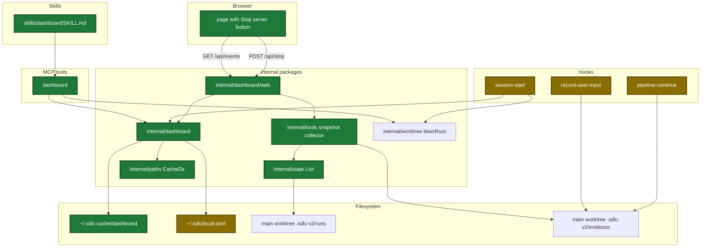
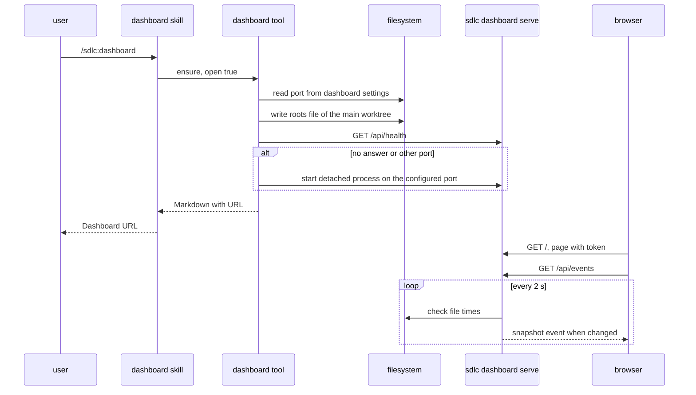
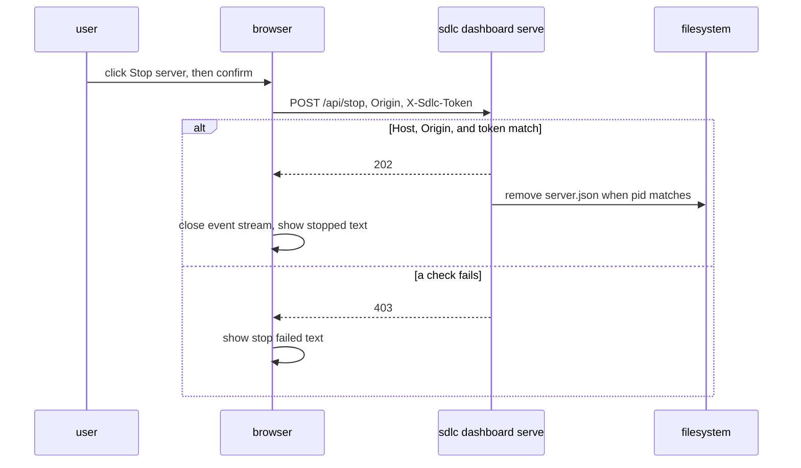
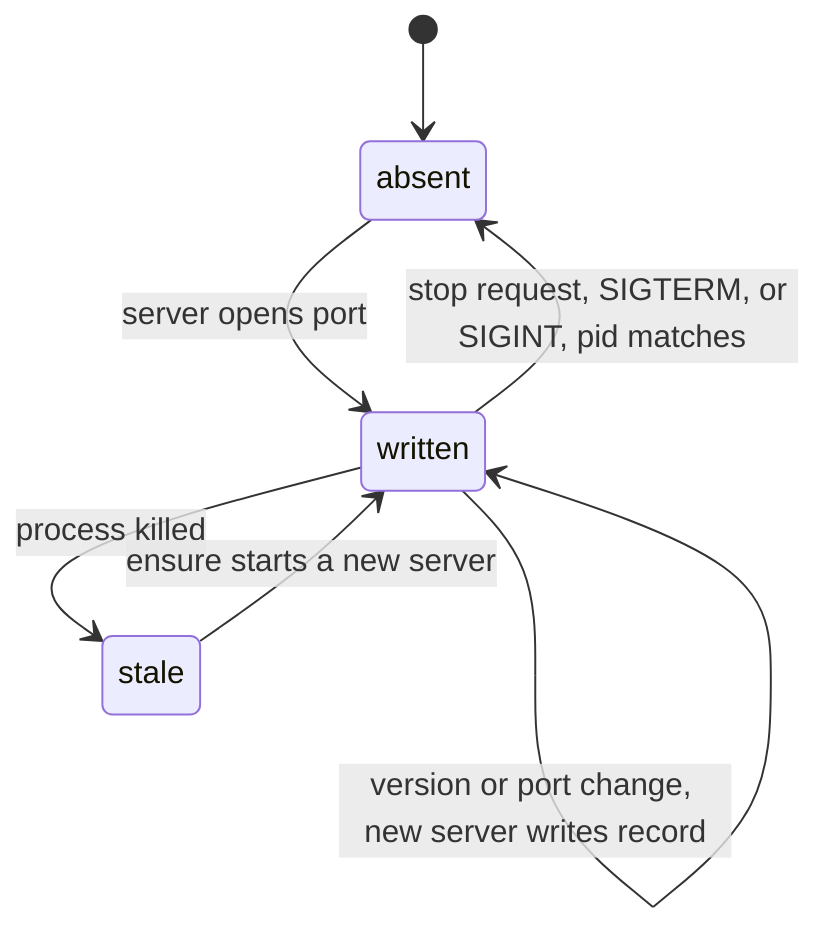

# Design

## Context

- Motivation: see proposal.md, Why.
- The MCP server is one stdio process for each session. It stops at the end of its input. It cannot host a page that outlives the session.
- State lives in `.sdlc-v2/runs/` (ship, execute, plan), `.sdlc-v2/runs/ledger/review-*/` (review), and `.sdlc-v2/evidence/*.jsonl` of the main worktree of each repo.
- A run in a linked worktree writes its state under the main worktree. Ship and execute state store the linked path in `worktree`.
- No list of repos and no list of runs exists today.
- The `[dashboard]` section reads the merged personal config of change `user-config-and-pipeline-fixes`. That change merges first.

## Goals / Non-Goals

**Goals:**
- One detached server process for all sessions, repos, and worktrees, with no new Go dependency and no build step for the page.
- Updates reach the page within 2 s.
- The server runs until a person stops it: from the page, from the skill, or with a signal.
- The page can stop the server when no Claude session is open.
- The port is a setting, so the user can move the server when another program uses the default port.

**Non-Goals:**
- Buttons that change pipeline state (cancel, retry, resolve).
- An idle stop of the server.
- Stats for sessions with no ship or execute run.
- History browser, search, and filters.
- A `/setup` menu entry for `[dashboard]`.
- Windows support and access from other computers.

## Architecture

Touched parts and their links:



Package imports, with no cycle:

| Package | Holds | Imports |
|---|---|---|
| `internal/dashboard` | repo list, server record, start and stop, settings | `internal/paths`, `internal/config` |
| `internal/tools` | snapshot collector, MCP tool | `internal/dashboard`, `internal/worktree` |
| `internal/dashboard/web` | web server, stop endpoint, page files | `internal/dashboard`, `internal/tools` |

## Runtime flow

Main flow, from the skill to the page:



Stop from the page:



## Persisted state

Server record `~/.sdlc-cache/dashboard/server.json`:



Files under `~/.sdlc-cache/dashboard/`:

| Path | Writer | Content |
|---|---|---|
| `server.json` | server | `{pid, port, version, startedAt, url}`. It never holds the token. |
| `roots/<16 hex of sha256(main root)>.json` | hook, tool | `{root, lastSeen}`, where `root` is always the main worktree |
| `server.log` | server | output of the detached process |

The stop token lives only in the memory of the server and in the page it serves.

Config change in `~/.sdlc/local.toml` (template):

```diff
+# [dashboard]
+# autoStart = false   # start the local dashboard when a Claude session starts
+# port = 7385         # 1024-65535, loopback only
```

Evidence line change:

| File | Field | Type | Encoding | Example |
|---|---|---|---|---|
| `cli-executions.jsonl` | `sessionId` | string | JSON string, always present | `"3f2c…"` |
| `user-inputs.jsonl` | `sessionId` | string | JSON string, always present | `"3f2c…"` |

## Data contracts

```go
type DashboardIn struct {
    Action string `json:"action"`         // ensure | status | stop
    Open   bool   `json:"open,omitempty"` // ensure only
}
type DashboardOut struct {
    Summary string   `json:"summary"`
    URL     string   `json:"url"`
    Running bool     `json:"running"`
    Started bool     `json:"started"`
    PID     int      `json:"pid"`
    Port    int      `json:"port"`
    Version string   `json:"version"`
    Repos   []string `json:"repos"`
    Next    string   `json:"next"`
}
```

Snapshot pipeline field added for worktrees:

| Field | Type | Encoding | Example |
|---|---|---|---|
| `worktree` | string | JSON string, `""` for plan and review runs | `"/Users/me/repo-feat-x"` |

Stop request:

| Field | Where | Accepted value |
|---|---|---|
| `Host` | header | `127.0.0.1:<port>` or `localhost:<port>` |
| `Origin` | header | `http://127.0.0.1:<port>` or `http://localhost:<port>` |
| `X-Sdlc-Token` | header | 64 hex chars, the token of this server start |

## Decisions

| Decision | Chosen | Rejected alternatives | Reason |
|---|---|---|---|
| Host process | Detached `sdlc dashboard serve` of the same binary | Server inside each MCP process; Node or Python server | MCP process stops with its session. The user asked for one language. |
| Repo key | Main worktree root | Active worktree root | State of every worktree lives under the main root. A linked root would show each run twice through the `runs/` symlink. |
| Worktree of a run | `worktree` field of the ship or execute state | Match by branch to `git worktree list` | The field exists today and needs no git call |
| Server life | Runs until a person stops it | Idle stop after 30 min | The user wants the page to stay available |
| Stop from the page | `POST /api/stop` with `Origin` check and a token for each start | No button; GET stop link; Host check only | The owner session can be gone. A GET link fires from an image tag. A cross-site form POST passes the Host check. |
| Single server | The open port is the lock, `/api/health` names the owner | Lock file | A lock file outlives a killed process |
| Port | `port` in `[dashboard]`, default 7385, range 1024-65535 | Fixed port; random free port | Another program can use 7385. A random port changes the page address on each start. |
| Push channel | Event stream with full snapshots, `retry: 3000` | WebSocket; replay by `Last-Event-ID` | One-way data, standard library only, a full snapshot on connect is simpler |
| Change detection | File time checks every 2 s | `fsnotify` | No new dependency |
| Control path | New `dashboard` MCP tool | New action on `ship_state` | One clear job, easy to find |
| Session activity | Active when newest evidence line is under 30 min old | Heartbeat file | No new writer |
| Prompt data | Current records plus `sessionId` | A second prompt store | Reuse, decision D8 |
| Page | Plain JS, `embed.FS`, one OFL font, logic in a tested `view.js` | Framework with a build step | No build step, logic has a `node --test` file |
| Cache root | `paths.CacheDir` reads `SDLC_CACHE_DIR` | Fixed home path | Same root as the launcher, test seam |

## Risks / Trade-offs

| Risk | Impact | Mitigation |
|---|---|---|
| A linked worktree path is registered | Each run shows twice | Callers pass `worktree.MainRoot()`. Tests use a real `git worktree add`. |
| Another website sends a stop request | The server stops with no user action | `Origin` check, token header that a cross-site form cannot set, constant-time compare, a test for each 403 path |
| Server runs for days with no use | One idle process with a 2 s file check | Low cost. Stop button, `--stop`, and the `stop` tool action. |
| Auto-start blocks session start | Slow session start | Start with no wait, phase under 300 ms, hook exits 0 on every path |
| Server listens on a public address | Pipeline data and prompt text leak | Bind `127.0.0.1` only, host allow list, tests for 403 |
| Another program uses the port | Server cannot start | `ensure` error names `port` in `[dashboard]`. The next `ensure` moves the server to the new port. |
| Wrong active logic | Finished runs show as active | One status table for each kind, a test for each row |
| Old binary keeps serving after an install | Page shows old data shape | `ensure` restarts on a version change |
| Step status set in three places | Page glyph or Go constant drifts | Go and JS tests compare both copies with `ship-state.schema.json` |
| Other change not merged | `[dashboard]` and `sessionId` tasks fail | Precondition grep for `LocalFilesLabel` in tasks 1.3 and 6.1 |

## Migration Plan

- No data migration. Old evidence lines with no `sessionId` still parse.
- Rollback: remove the release. The cache folder `~/.sdlc-cache/dashboard/` is safe to delete.
