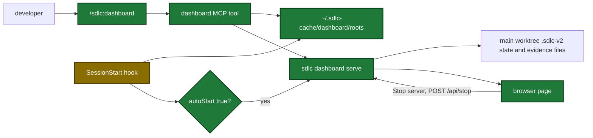

# Proposal

## Why

- Problem: no single view shows all active sdlc pipelines, their progress, and their issues. Each Claude session sees only its own branch, as text in one terminal.
- Evidence: the MCP server is one stdio process for each session and stops at the end of its input (`cmd/sdlc/main.go`). No code lists the runs of a repo or the repos of a computer (`internal/state/state.go`).
- Why now: the user runs several pipelines at the same time in several repos and worktrees, and asked for one local page that updates itself.

## What Changes

| Area | Before | After |
|---|---|---|
| Pipeline view | `ship_state` read for one branch, Markdown in one terminal | One local page at `http://127.0.0.1:7385` for all registered repos. It updates within 2 s. It shows the worktree of each ship and execute run. |
| Server | none | `sdlc dashboard serve`: a detached process of the same binary. Loopback only. It runs until a person stops it. It has no idle stop. |
| Stop from the page | none | **Stop server** button with a confirm dialog. It sends `POST /api/stop` with an `Origin` check and a token for each server start. |
| MCP tool | none | `dashboard` tool with actions `ensure`, `status`, `stop` |
| Skill | none | `/sdlc:dashboard` with `--status`, `--stop`, `--no-open` |
| Personal config | no `[dashboard]` section | `[dashboard]` with `autoStart` (default `false`) and `port` (default `7385`, change it when another program uses 7385) in `~/.sdlc/local.toml` |
| Session start | banner phases only | Registers the main worktree root of the repo. When `autoStart` is `true`, starts the server with no wait and prints its address. |
| Prompt and command records | no session id | Each line has a `sessionId` key |

Flow after the change, from a session start to the page:

## Capabilities

### New Capabilities
- `pipeline-dashboard`: the local dashboard server, its page and stop button, the snapshot of pipelines, sessions, issues, and learnings, the `[dashboard]` settings, and the session start registration and auto-start.
- `tool-dashboard`: the `dashboard` MCP tool that starts, checks, and stops the server.
- `skill-dashboard`: the `/sdlc:dashboard` skill.

### Modified Capabilities
- `hook-record-user-input`: each recorded prompt line carries the `sessionId` of the hook. The text builds on change `user-config-and-pipeline-fixes`.

## Impact

| Path | Kind | Change |
|---|---|---|
| `cmd/sdlc/main.go` | MCP tool | `dashboard` subcommand, `RegisterDashboardTools` |
| `internal/dashboard/` | MCP tool | new package: repo list, server record, start and stop, settings |
| `internal/dashboard/web/` | MCP tool | new web server, stop endpoint, and embedded page files |
| `internal/tools/dashboard*.go` | MCP tool | snapshot collector and `dashboard` tool |
| `internal/paths/paths.go` | MCP tool | `CacheDir` shared with the launcher |
| `internal/state/state.go` | MCP tool | `List` of all state files of a repo |
| `internal/hooks/session_start.go` | hook | `dashboard` phase |
| `internal/hooks/user_input_record.go`, `internal/hooks/pipeline_continue.go` | hook | `sessionId` on each line |
| `plugins/sdlc/schemas/sdlc-local.schema.json` | schema | `dashboard` section |
| `plugins/sdlc/templates/local.toml` | template | commented `[dashboard]` example |
| `plugins/sdlc/skills/dashboard/SKILL.md` | skill | new skill |
| `docs/dashboard.md`, `docs/skills/dashboard.md`, `docs/skills/README.md` | doc | new docs and skill row |
| `.github/workflows/test.yml` | CI | `node --test` runs the page logic test |
