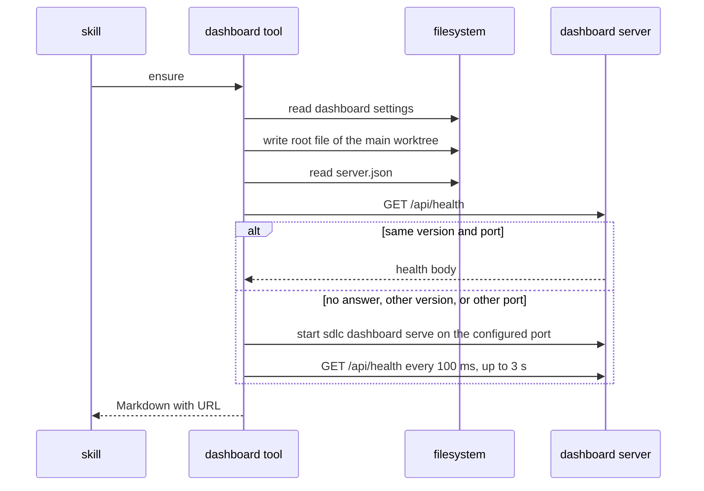

# Spec Delta

## Purpose

The `dashboard` MCP tool starts, checks, and stops the local dashboard server so that skills and sessions share one server on this computer.

## ADDED Requirements

### Requirement: Actions and inputs
The tool SHALL select its operation from `action`, one of `ensure`, `status`, `stop`, and SHALL read `open` only for `ensure`.

| Input | Encoding | Example |
|---|---|---|
| `action` | plain text, `ensure`, `status`, or `stop` | `ensure` |
| `open` | JSON bool, `ensure` only | `true` |

#### Scenario: Unknown action
- **WHEN** the call passes `action:"restart"`
- **THEN** the result is a `DomainError` that lists `ensure`, `status`, `stop`

### Requirement: Ensure
The `ensure` action SHALL register the main worktree root of the repo, SHALL use the `port` of the `[dashboard]` settings, SHALL reuse an active server of the same version and port, SHALL replace a server of another version or port, and SHALL wait up to 3 s for the health answer of a new server.

#### Scenario: Server already active
- **WHEN** the health answer has the same version and port
- **THEN** the result has `started:false`, `running:true`, and the URL

#### Scenario: Call from a linked worktree
- **WHEN** `ensure` runs in a linked worktree of the repo at `/r`
- **THEN** the registered root is `/r`

#### Scenario: Configured port
- **WHEN** `[dashboard]` has `port = 7400`
- **AND** no server is active
- **THEN** the new server listens on port 7400
- **AND** the result URL is `http://127.0.0.1:7400`

#### Scenario: Port change
- **WHEN** a server is active on port 7385
- **AND** `[dashboard]` has `port = 7400`
- **THEN** the tool stops the server on port 7385 and starts a server on port 7400

#### Scenario: Version change
- **WHEN** the active server reports another version
- **THEN** the tool stops it and starts a new server
- **AND** the result has `started:true`

#### Scenario: Settings error
- **WHEN** `[dashboard]` has `port = 80`
- **THEN** the result is a `DomainError` with the settings error text
- **AND** no server starts

#### Scenario: Open the browser
- **WHEN** the call passes `action:"ensure"` and `open:true`
- **THEN** the tool opens the URL with `open` on macOS or `xdg-open` on Linux

### Requirement: Ensure errors
The `ensure` action SHALL return a `DomainError` or `InfraError` with the suggestion of this table when the server cannot start.

| Condition | Suggestion text |
|---|---|
| The port answers, but not with an sdlc health body | Port P is in use by another program. Set `port` in `[dashboard]` of `~/.sdlc/local.toml`, then run `/sdlc:dashboard` again. |
| The process start fails | Read `~/.sdlc-cache/dashboard/server.log`, then try again. |
| No health answer after 3 s | Read `server.log` for the port error, then try again. |
| The OS is not macOS or Linux | The dashboard runs only on macOS and Linux. |

#### Scenario: Port held by another program
- **WHEN** port 7385 answers with a body that is not an sdlc health body
- **THEN** the error suggestion names `port` in `[dashboard]` of `~/.sdlc/local.toml`

#### Scenario: Start timeout
- **WHEN** the new server gives no health answer within 3 s
- **THEN** the error suggestion names `server.log`

### Requirement: Status and stop
The `status` action SHALL report `running:false` when no server record or no health answer exists. The `stop` action SHALL send SIGTERM only to the pid that `/api/health` reports.

#### Scenario: No server
- **WHEN** `~/.sdlc-cache/dashboard/server.json` is absent
- **THEN** `status` returns `running:false`

#### Scenario: Stale record
- **WHEN** `server.json` names pid 42 and no server answers on its port
- **THEN** `stop` sends no signal to pid 42

### Requirement: Output
The tool SHALL return Markdown with `summary`, `url`, `running`, `started`, `pid`, `port`, `version`, `repos`, and a `**Next:**` line on each success path.

#### Scenario: No repos
- **WHEN** no repo root is registered
- **THEN** the repos line renders `(none)`

### Requirement: Annotations
The tool SHALL declare `ReadOnly:false`, `Destructive:false`, `Idempotent:true`, `OpenWorld:false`, and the title `Start, check, or stop the local dashboard`.

#### Scenario: Annotation table
- **WHEN** the annotation test reads the `dashboard` entry
- **THEN** the values match this requirement
