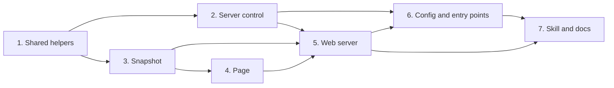

# Tasks

Group dependencies:

## 1. Shared helpers

- [ ] 1.1 Add `CacheDir` and use it for the 3 Jira cache paths in internal/paths/paths.go — verify: go test ./internal/paths/ ./internal/tools/ ./internal/links/ ./internal/hooks/ <!-- ref:1-1-add-cachedir-and-use-it-for-the-3-ji-debde9 -->
- [ ] 1.2 Add `List` of all state files of a repo in internal/state/state.go — verify: go test ./internal/state/ -run TestList <!-- ref:1-2-add-list-of-all-state-files-of-a-rep-98441b -->
- [ ] 1.3 Add `sessionId` to prompt and command records in internal/hooks/user_input_record.go and internal/hooks/pipeline_continue.go, after the `LocalFilesLabel` precondition check — verify: go test ./... <!-- ref:1-3-add-sessionid-to-prompt-and-command-237934 -->

## 2. Server control

- [ ] 2.1 Add the repo list and server record in internal/dashboard/registry.go — verify: go test ./internal/dashboard/ -run 'TestRegistry|TestServerRecord' <!-- ref:2-1-add-the-repo-list-and-server-record-5f7322 -->
- [ ] 2.2 Add start, stop, and status control in internal/dashboard/control.go — verify: go test ./internal/dashboard/ -run TestControl <!-- ref:2-2-add-start-stop-and-status-control-in-e4b159 -->

## 3. Snapshot

- [ ] 3.1 Add the pipeline snapshot collector, the `worktree` field of each run, and all snapshot types in internal/tools/dashboard_snapshot.go — verify: go test ./internal/tools/ -run TestDashboardSnapshot <!-- ref:3-1-add-the-pipeline-snapshot-collector-af68b0 -->
- [ ] 3.2 Fill sessions, learnings, and deferred items in internal/tools/dashboard_activity.go — verify: go test ./internal/tools/ -run 'TestDashboardSnapshot|TestDashboardActivity' <!-- ref:3-2-fill-sessions-learnings-and-deferred-f7fbda -->

## 4. Page

- [ ] 4.1 Add the page logic module, including `stopRequest`, `stopResult`, and `worktreeLabel`, and its node test in internal/dashboard/web/static/view.js and .github/workflows/test.yml — verify: node --test internal/dashboard/web/testdata/view.test.cjs <!-- ref:4-1-add-the-page-logic-module-including-89b3da -->
- [ ] 4.2 Add the page files, the worktree label, the Stop server button with its confirm dialog, and the OFL font in internal/dashboard/web/static/ — verify: manual file:// load, render(fixture), keyboard check, 375 px check <!-- ref:4-2-add-the-page-files-the-worktree-labe-f38866 -->

## 5. Web server

- [ ] 5.1 Add the web server with no idle stop, the guarded `POST /api/stop`, and the `sdlc dashboard serve` command in internal/dashboard/web/server.go and cmd/sdlc/main.go — verify: go test ./internal/dashboard/web/ ./cmd/sdlc/ <!-- ref:5-1-add-the-web-server-with-no-idle-stop-170948 -->

## 6. Config and entry points

- [ ] 6.1 Add the `[dashboard]` section with `autoStart` and `port`, schema, template example, and `ReadSettings` in internal/dashboard/settings.go, after the `LocalFilesLabel` precondition check — verify: go test ./... && go test -tags integration ./... <!-- ref:6-1-add-the-dashboard-section-with-autos-3c45e2 -->
- [ ] 6.2 Add the `dashboard` MCP tool that registers `worktree.MainRoot()` and passes the configured port to `Ensure`, and its annotations row, in internal/tools/dashboard.go — verify: go test ./... <!-- ref:6-2-add-the-dashboard-mcp-tool-that-regi-a230fe -->
- [ ] 6.3 Add the `dashboard` session start phase that registers `worktree.MainRoot()` and uses the configured port in internal/hooks/session_start.go — verify: go test ./internal/hooks/ -run TestSessionStartDashboard <!-- ref:6-3-add-the-dashboard-session-start-phas-0cdfe8 -->

## 7. Skill and docs

- [ ] 7.1 Add the `/sdlc:dashboard` skill and its docs in plugins/sdlc/skills/dashboard/SKILL.md and docs/skills/dashboard.md — verify: go test ./internal/skillcheck/... and the manual end-to-end check with two repos and one linked worktree <!-- ref:7-1-add-the-sdlc-dashboard-skill-and-its-ecbf0e -->
- [ ] 7.2 Add the architecture document with the port steps, the 3 stop paths, the stop request checks, and the main-root rule for worktrees in docs/dashboard.md — verify: each key, path, and endpoint matches tasks 2.1, 5.1, and 6.1 <!-- ref:7-2-add-the-architecture-document-with-t-03e224 -->
