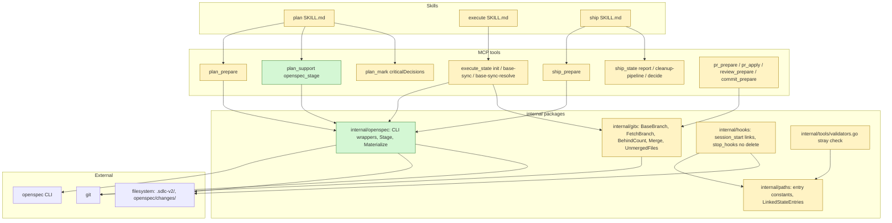
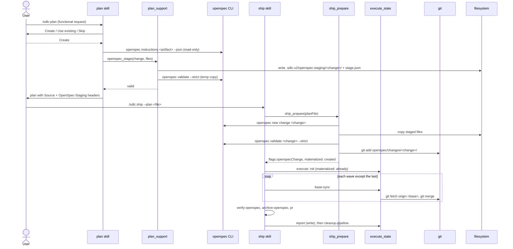
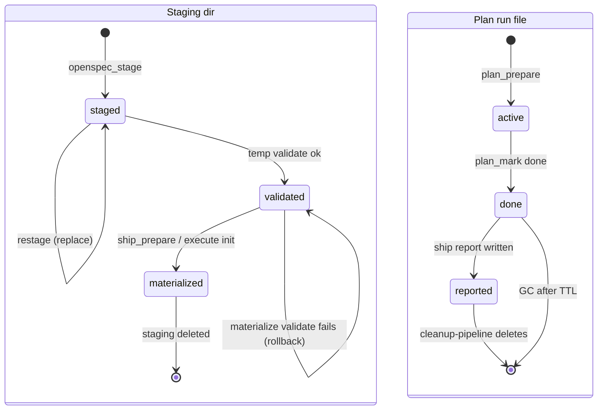

# Design

## Context

See `proposal.md` — Why. Constraints that shape the approach:

- Plan mode allows writes only to the plan file. Plan tools keep `ReadOnly: true` only because they write gitignored run state (`docs/mcp-tool-annotations.md:11-19`; enforced by `TestReadOnlyToolsWriteNothingTracked`).
- OpenSpec CLI 1.13.2 facts, verified in a temp repo:
  - `openspec instructions <artifact> --change <n> --json` returns `template`, `instruction`, `context`, `rules`, `outputPath` (`specs/**/*.md`, recursive), `dependencies`.
  - `openspec new change <n>` creates only `openspec/changes/<n>/.openspec.yaml`.
  - `openspec validate <n> --strict` works in a temp dir that holds only `openspec/config.yaml` + the change.
  - `openspec list --json` reports a grouped change as `warnings[{code:"nested_change_directory", name, nested[], message}]`; `status --change grp/demo` fails with `Change name cannot contain path separators`.
- Every run-time `.sdlc-v2/` write is rooted at `worktree.MainRoot()`; deletions too (`execute_state.go:4246`, `state/gc.go:126`, `hooks/stop_hooks.go:118`).
- `execute_state` already parses `**Source:**` (`openspecSourceRe`, `execute_state.go:2025`) and guards names with `isSafeChangeName`.
- `wave-commit` idempotency and resume cross-checks require each recorded `committedSha` to stay an ancestor of `HEAD` (`execute_state.go:2983`, `:3068`, `:5089`).
- The Stop hook deletes the plan run + evidence on `planIntegrity.done` (`internal/hooks/stop_hooks.go:109-121`); ship writes its report after `cleanup-pipeline` (`ship_report.go:89-95`).
- `findStrayStateEntries` flags every non-allowlisted entry in a linked worktree's `.sdlc-v2/` as `WORKTREE_ANCHOR_STRAY_STATE` (`internal/tools/validators.go:2028-2057`).
- No `[git]` section and no base-branch key exist; `gitx.DefaultBranch` (`internal/gitx/gitx.go:40`) is used directly by commit, pr, review, ship, setup, plan_explore, session_start, openspec.

Touched parts (new and changed marked):



## Goals / Non-Goals

**Goals:**
- One shared Go implementation of stage + materialize in `internal/openspec`, called by `plan_support`, `ship_prepare`, `execute_state`.
- All OpenSpec layout knowledge comes from the CLI at runtime.
- One base-branch resolver used by every base-relative operation.
- Ship report reads planning data that still exists when the report runs.

**Non-Goals:**
- Supporting grouped changes (`openspec/changes/<group>/<name>/`). The CLI rejects them; so do we.
- Copying staging across worktrees.
- Fixing the aisa plugin's "OpenSpec NOT initialized" hook.
- Changing the plan markdown location (Claude Code `plansDirectory`).

## Decisions

| Decision | Chosen | Rejected alternatives | Reason |
|---|---|---|---|
| D1 Who writes OpenSpec artifacts | Plan authors content; MCP (`internal/openspec`) does every CLI call and file write | Hand off to native `/opsx:*` skills | CLI is always present; `/opsx:*` skills are per project and may be missing or stale |
| D2 Inline "Draft" appendix | Removed | Keep as fallback | Main source of drift; content never reached disk |
| D3 Entry points | `--spec [<name>]`; `--from-openspec` alias for one release; auto-detect functional requests | Keep three entry points | Users cannot tell them apart |
| D4 Grouped changes | Follow the CLI: report `nested_change_directory`, never load | Plugin-side support for groups | `openspec validate`/`archive` cannot run on them; ship would break |
| D5 Spec storage during plan mode | Stage real files in `<active-worktree>/.sdlc-v2/openspec-staging/<change>/`; materialize at run start | (a) `ReadOnly:true` tool that writes `openspec/changes/` anyway; (b) spec first, outside plan mode; (c) stage inside the plan file | (a) lies to the client, breaks the ReadOnly rule, leaves files after a rejected plan; (b) two steps per feature; (c) fenced fragments, nested-fence hacks |
| Staging location | Active worktree | Main worktree `.sdlc-v2/runs/` | Change belongs to the branch of the active worktree; no pollution of main |
| Materialize trigger | `ship_prepare` and `execute_state init`, idempotent by SHA-256 | Right after plan approval in the plan skill | Deterministic Go code at the point the run needs the files; no LLM step to forget |
| Materialize integrity | `stage.json` with SHA-256 per file | Copy whatever is in the dir | Detects edits after validation; makes "already materialized" exact |
| Staged files in git | `git add openspec/changes/<change>/` after validate | Leave untracked | `/sdlc:commit` never stages untracked files; the spec would never be committed |
| Base branch key | `[git] baseBranch` in `.sdlc-v2/config.toml` | `[execute] baseBranch`; `local.toml` | Git flow is a team property; ship, pr, review need the same value as execute |
| Base sync method | `git merge --no-edit origin/<base>` | Rebase between waves | Rebase rewrites committed wave SHAs and breaks `wave-commit` idempotency and resume cross-checks |
| Base sync placement | New `execute_state` actions after `summarize-prior-wave-context`, only when another wave follows | Inside `wave-commit`; separate MCP tool | Tree is clean there; execute_state already owns wave lifecycle and is `ReadOnly:false` |
| Base sync conflict | One sub-agent resolves, `base-sync-resolve` verifies markers and commits; abort and continue on failure | Stop the run | Idea requires "LLM resolves, not a pipeline stop"; ship's rebase still catches leftovers |
| Base sync default | `[execute] baseSync = true` | Off by default | Idea: "should run automatically" |
| Base sync on dirty tree | Skip with warning | Stash | `commitWaves=false` leaves commit to the LLM; stashing hides work |
| Planning data deletion | Stop hook no longer deletes; `cleanup-pipeline` deletes the linked plan run after the report file exists; GC TTL as fallback | Copy plan data into ship state | One owner of deletion; no duplicate data |
| Decision source for the report | `plan_mark criticalDecisions` `{key, choice, rejected, reason, at}` written by the skill before handoff | Parse `## Key Decisions` markdown | Markdown narrative is not machine-stable; the marker already exists and is unused |
| Report order | `report` (write) before `cleanup-pipeline` | Keep order, have cleanup render the report | Report stays read-only; cleanup checks report file existence |
| Timeline | Merge plan milestones + decisions, execute waves + base syncs, ship steps + decisions by timestamp | Separate per-phase lists | Idea asks for one full timeline |
| Worktree link set | Per-entry symlinks for run-generated entries (table in `worktree-state-links` spec) | Symlink the whole `.sdlc-v2/` | `config.toml` and `review-dimensions/` are tracked per branch |
| `state/` | Linked | Not linked | Live path: `received_review.go:346`, `jira.go:1361` write `state/artifacts/` |
| `learnings/` | Linked | Not linked | Gitignored; `learnings-commit` never touches git (`ship/SKILL.md:186`) |
| `execution/` | Not linked | Linked | Legacy only, migrated into `runs/` (`migrate.go:441`) |
| `scratch/`, `backups/`, `plan-template.md`, `pr-template.md` | Never link | Linked | No code writes `scratch/`/`backups/`; templates are setup-written config |
| Staging path allowlist | Derived from CLI `outputPath` values | Hardcoded `proposal.md`, `design.md`, `tasks.md`, `specs/**/*.md` | Layout comes from the CLI, so custom schemas work |
| "Already materialized" detection | Target exists + staging missing → already; target + staging → SHA compare | Always compare SHAs | Success deletes staging, so the second start has nothing to compare against |
| Link trigger | SessionStart in a linked worktree | `WorktreeCreate` hook | SessionStart covers worktrees made by any tool (git CLI, IDE, Claude Code); one trigger |
| Single source for entries | Constants + `LinkedStateEntries` / `UnlinkedStateEntries` in `internal/paths`; test fails on an entry in neither list | String literals per file | A new state dir cannot be forgotten |
| `task deploy` pruning | Delete `$CACHE_DIR/bin/sdlc-*-{{OS}}-{{ARCH}}` and `.signed` files except the new `BIN_PATH` | Delete the whole cache dir | Launcher cache may hold other OS/arch files; minimal blast radius |
| D-instructions Template source for staging | New `plan_support` action `openspec_instructions`: temp dir with `openspec/config.yaml`, `openspec new change`, `status --json`, `instructions --json` per artifact; returns `schemaName`, `artifacts[]`, `guardrails` | Plan skill runs `openspec instructions` itself | `instructions --change` needs an existing change, and the skill must not run `openspec new change` in the repo; one Go call keeps the repo clean |
| D-openworld `execute_state` annotation | `OpenWorld: true` | Keep `OpenWorld: false` | `base-sync` runs `git fetch` against the git remote, which is outside the local system |
| D-conflicted-files `baseSyncs[]` shape | Optional `conflictedFiles` on an entry when `status` is `conflict` | Return the files only in the action result | A resumed run must know which files were left in conflict without re-running the merge |
| D-guardrail-coherence Guardrails and OpenSpec | Create: `guardrails` from `openspec_instructions` constrain `design` and `tasks`, and `tasks.md` is re-staged from the final plan tasks before Step 6.5. Existing change: Gate A gets the guardrails; conflicts are `WARNING` (`error` guardrail) or `SUGGESTION` (`warning` guardrail), never `CRITICAL` | Check guardrails only against plan tasks | The guardrail lane can split or change plan tasks after staging; without a re-stage, `tasks.md` and the plan drift apart |

Data contracts:

```go
// plan_prepare input: field replaced
type PlanPrepareIn struct {
    // removed: OpenspecInlineGenerate bool
    OpenspecStage bool `json:"openspecStage,omitempty" jsonschema_description:"Plain JSON bool. True when the plan authors a new OpenSpec change and stages it. Example: true"`
}

// plan_support openspec_stage
type StageFile struct {
    Path    string `json:"path"    jsonschema_description:"Plain text path relative to the change dir. Example: specs/user-auth/spec.md"`
    Content string `json:"content" jsonschema_description:"Plain text file content (Markdown). Example: # Proposal"`
}
// PlanSupportIn gains: Files []StageFile, PlanPath string
// PlanSupportOut gains: StagingDir string, StagedFiles []{Path, SHA256}, Valid bool, ValidateOutput string

// execute_state base-sync-resolve
// ExecuteStateIn gains: Abort bool `json:"abort,omitempty" jsonschema_description:"Plain JSON bool. True aborts the in-progress base merge. Example: true"`
```

| Output field | Tool | Type | Example |
|---|---|---|---|
| `openspec.groupedChanges[]` | plan_prepare | `{name, nested[], message}` | `{name:"grp", nested:["grp/demo"], ...}` |
| `fromOpenspec.deltaSpecPaths` | plan_prepare | string[] | `["openspec/changes/x/specs/a/b/spec.md"]` |
| `materialized` | execute_state init | `"created"` \| `"already"` | `"created"` |
| `openspec` | ship_prepare | `{change, materialized}` | `{change:"x", materialized:"dry-run"}` |
| `sources.openspecChange` | ship_prepare | `"cli"` \| `"plan"` | `"plan"` |
| `status`, `behind`, `sha`, `conflictedFiles` | execute_state base-sync | enum, int, string, string[] | `"conflict"`, `3`, `"ab12…"`, `["a.go"]` |
| `planning`, `timeline` | ship_state report | object, array | see spec |
| `planRun` | ship_state cleanup-pipeline | `{deleted, runId?, reason?}` | `{deleted:true, runId:"plan-…"}` |

Config:

```diff
+[git]
+baseBranch = ""          # empty = repository default branch
+
 [execute]
 commitWaves = true
+baseSync = true          # merge origin/<base> between waves
```

Main runtime flow (plan in plan mode, then ship):



Staging and plan-run lifecycle:



## Risks / Trade-offs

| Risk | Impact | Mitigation |
|---|---|---|
| Merge commits from base sync are later linearized by ship's `rebase` step | Ship rebase replays wave commits and drops merge commits; possible repeat conflicts | Ship rebase is a no-op when the base is already an ancestor, which base sync ensures for all but the last wave's window |
| `openspec` CLI missing on PATH | Detection, staging, materialize fail | `plan_prepare` reports `openspec CLI unavailable`; `openspec_stage` returns `InfraError`; gate offers **Skip OpenSpec** |
| Staging in worktree A, ship in worktree B | Materialize fails | DomainError names the expected path; user ships from the planning worktree |
| A new plan on the same branch prunes the older plan run (`state.Write`) | Older plan's decisions are lost before ship | Accepted: the newer plan supersedes; report uses the plan matching execute `planPath` |
| Plan run kept after `done` grows `.sdlc-v2/runs/` | Disk use | GC TTL (default 7 days) and `cleanup-pipeline` delete it |
| Symlinks on Windows | Links not created | Fail open with one line per entry |
| `--from-openspec` and `openspecInlineGenerate` removal breaks callers | Old invocations fail | Alias for one release; `openspecInlineGenerate` only had the plan skill as caller |
| Materialized spec files are staged (`git add`) and committed by wave 1's `git add -A` | Spec lands inside the first wave commit, not a separate `docs(spec):` commit | Accepted; execute's pre-execution rebase runs before `init`, and ship's branch setup runs before `ship_prepare`, so staged files never block a rebase |
| Base-branch change touches many tools | Regression in pr/commit/review ranges | One resolver with tests; explicit `--base` still wins |

## Migration Plan

- No data migration. New config keys are optional; absent keys keep today's behavior except `baseSync`, which defaults to `true`.
- Rollback: revert the release; staged dirs are gitignored and harmless; materialized changes are normal OpenSpec changes.
