# Proposal

## Why

- **Problem:** five gaps in the plan → execute → ship flow. (1) Plan and OpenSpec drift apart and spec content never reaches disk. (2) Long execute runs work on a stale base. (3) Planning data is deleted before ship can report on it. (4) Run state is invisible from a linked worktree. (5) `task deploy` leaves old binaries behind.
- **Evidence:**
  - Plan gate option 2 writes spec content only into the plan file and points to `openspec create`, a command that does not exist in OpenSpec CLI 1.13.2 (`plugins/sdlc/skills/plan/SKILL.md:57`, `:736`). Ship then skips `verify-openspec`/`archive-openspec` with `"no active OpenSpec change"` (`openspec/specs/skill-ship/spec.md`, "OpenSpec steps").
  - Plan mode can write only the plan file (`plugins/sdlc/skills/plan/SKILL.md:37`), so plan cannot create a change on disk.
  - Spec discovery is hardcoded one level deep (`specs/*.md`, `specs/<capability>/spec.md`) in `SKILL.md:74`, `internal/tools/plan.go:270`, `internal/tools/plan_explore.go:212`.
  - The `stop-plan-integrity` Stop hook deletes the plan run file and its `.evidence` dir as soon as `planIntegrity.done` is set (`internal/hooks/stop_hooks.go:109-121`). Ship writes its report after `cleanup-pipeline` (`internal/tools/ship_report.go:89-95`).
  - Every run-time write goes to `worktree.MainRoot()/.sdlc-v2/`; a linked worktree sees none of it.
  - `task deploy` copies `sdlc-<VERSION>-<os>-<arch>` into `~/.sdlc-cache/bin/` and never removes older versions (`Taskfile.yml:26-44`).
- **Why now:** the ideas were collected in `tmp/ideas.md`; all decisions are taken (see `design.md`, Decisions).

## What Changes

| Area | Before | After |
|---|---|---|
| **BREAKING** plan flags | `--spec` (bool), `--from-openspec <name>`, positional path | `--spec [<name>]`; `--from-openspec <name>` kept as an alias for one release, prints a deprecation line |
| Plan OpenSpec gate | 3 options; default writes a "Draft" appendix into the plan file | Functional request without `--spec` asks: **Create OpenSpec change** / **Use existing change** / **Skip OpenSpec**; non-functional requests print one hint line |
| **BREAKING** inline appendix | `openspecInlineGenerate` drafts proposal/specs/tasks inside the plan | Removed. Spec content never lives in the plan file |
| Spec authoring | LLM invents the format | Plan authors each artifact from `openspec instructions <artifact> --change <name> --json` (`template`, `instruction`, `context`, `rules`) |
| Guardrail coherence | Plan guardrails apply only to plan tasks; OpenSpec `design`/`tasks` can contradict them | Create flow: guardrails constrain `design` and `tasks`, and `tasks.md` is re-staged from the final plan tasks. Existing change: Gate A reports guardrail conflicts as `WARNING`/`SUGGESTION` caveats |
| Spec storage in plan mode | Not possible | New `plan_support` action `openspec_stage` writes real files to `<active-worktree>/.sdlc-v2/openspec-staging/<change>/` and validates a temp copy |
| Materialize | Manual, or never | `ship_prepare` and `execute_state init` materialize staged files: `openspec new change`, copy, `openspec validate --strict`, `git add`, delete staging. Idempotent |
| Change and spec discovery | Plugin globs, one level deep | OpenSpec CLI (`openspec list --json`, `openspec status --change <name> --json`); grouped changes (`openspec/changes/<group>/<name>/`) are reported and rejected, as the CLI does |
| Ship OpenSpec steps | Skip silently when no change is passed | Change name comes from the plan `**Source:**` header; a named change missing on disk is an error, not a skip |
| Base branch | Always the repo default branch | New config `[git] baseBranch`; fallback to the default branch. Used by execute, ship rebase, pr, review |
| Execute wave boundary | No sync | New `execute_state` actions `base-sync` / `base-sync-resolve`: fetch, merge the base into the branch, LLM resolves conflicts |
| Planning data lifetime | Deleted at the first Stop after planning | Kept until ship's report is written; deleted by `cleanup-pipeline` after the report |
| Ship report | Plan timing only | New `Planning` section (decisions, rejected alternatives, plan milestones) and one `Timeline` across plan, execute, ship |
| Linked worktree | No run state visible | SessionStart links every run-generated `.sdlc-v2/` entry from the main worktree; config never linked |
| `task deploy` | Old binaries pile up | Removes other `sdlc-*-<os>-<arch>` binaries and their `.signed` sentinels before installing |

Flow after the change (plan in plan mode → ship); new steps marked:

```mermaid
flowchart LR
  U[User] --> P["/sdlc:plan --spec"]
  P --> I["openspec instructions --json"]:::new
  I --> S["plan_support openspec_stage"]:::new
  S --> V["validate temp copy"]:::new
  V --> A[User approves plan]
  A --> SP["ship_prepare"]:::changed
  SP --> M["materialize: openspec new change, copy, validate, git add"]:::new
  M --> E["execute waves"]:::changed
  E --> B["base-sync between waves"]:::new
  B --> E
  E --> VO["verify-openspec / archive-openspec"]:::changed
  VO --> R["ship_state report: Planning + Timeline"]:::changed
  R --> C["cleanup-pipeline: delete plan run"]:::changed
  classDef new fill:#d4f7d4,stroke:#2a7a2a
  classDef changed fill:#fff3c4,stroke:#a07a00
```

## Capabilities

### New Capabilities
- `openspec-staging`: stage OpenSpec artifacts in a gitignored dir of the active worktree during planning, and materialize them into `openspec/changes/<name>/` deterministically when a run starts.
- `worktree-state-links`: link run-generated `.sdlc-v2/` entries from the main worktree into linked worktrees.
- `base-branch`: one configured integration branch, with fallback to the repo default branch, shared by every tool that integrates or compares against a base.

### Modified Capabilities
- `skill-plan`: merged `--spec [<name>]` flag, new gate options, staging instead of the inline appendix, CLI-based discovery, structured decision recording.
- `tool-plan-prepare`: CLI-based OpenSpec detection, grouped-change warning, `openspecStage` input replaces `openspecInlineGenerate`.
- `tool-plan-support`: new `openspec_instructions` and `openspec_stage` actions.
- `tool-plan-mark`: `criticalDecisions` entries gain `rejected`.
- `tool-execute-state`: `init` materializes staged artifacts; new `base-sync` / `base-sync-resolve` actions.
- `tool-ship-prepare`: materializes staged artifacts; derives `flags.openspecChange` from the plan.
- `tool-ship-state`: `decide` gains `at`; `report` gains `planning` and `timeline`; `cleanup-pipeline` deletes the reported plan run.
- `skill-ship`: OpenSpec steps fail instead of skipping for a named change; report before cleanup; rebase uses the base branch.
- `skill-execute`: base sync at each wave boundary; pre-execution rebase uses the base branch.

## Impact

| Path | Kind | Change |
|---|---|---|
| `plugins/sdlc/skills/plan/SKILL.md`, `plan-format-reference.md`, `plan-template-default.md` | skill | Flags, gate, staging, CLI discovery, decision recording |
| `plugins/sdlc/skills/ship/SKILL.md`, `reference.md` | skill | OpenSpec steps, report order, base branch |
| `plugins/sdlc/skills/execute/SKILL.md` | skill | Base sync step, base branch |
| `internal/tools/plan.go`, `plan_explore.go`, `plan_support*.go` | MCP tool | Detection via CLI, `openspecStage`, `openspec_stage`, `rejected` |
| `internal/openspec/` | MCP tool | CLI wrappers, stage, materialize |
| `internal/tools/execute_state.go` | MCP tool | `init` materialize, `base-sync`, `base-sync-resolve` |
| `internal/tools/ship.go`, `ship_state.go`, `ship_report.go` | MCP tool | Materialize, `openspecChange`, report sections, cleanup order |
| `internal/tools/pr.go`, `review.go`, `commit.go` | MCP tool | Base branch resolver |
| `internal/gitx/gitx.go` | MCP tool | `BaseBranch`, fetch branch, behind count, merge, unmerged files |
| `internal/hooks/stop_hooks.go` | hook | Stop deleting the plan run on `done` |
| `internal/hooks/session_start.go` | hook | Create worktree state links |
| `internal/tools/validators.go` | MCP tool | Accept state links in `findStrayStateEntries` |
| `internal/paths/paths.go` | MCP tool | Named constants and link/no-link lists |
| `plugins/sdlc/schemas/sdlc-config.schema.json`, `plugins/sdlc/templates/config.toml` | schema, template | `[git] baseBranch`, `[execute] baseSync` |
| `Taskfile.yml` | CI | `deploy` prunes old binaries |
| `docs/skills/plan.md`, `docs/skills/ship.md`, `docs/skills/execute.md`, `docs/plan-architecture.md` | doc | Sync with skills |

Out of scope: the aisa plugin's session hook that reports OpenSpec as "NOT initialized" — it is not part of this repo.
