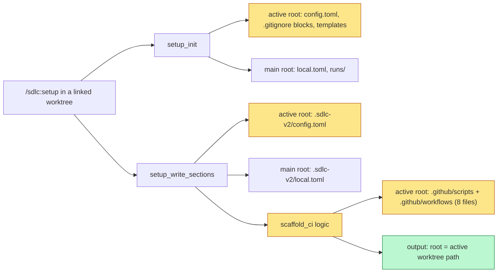

# Proposal

## Why

- Release CI payloads that `scaffold_ci` installs misbehave under RC release flows. `check-changelog.cjs` checks an RC tag, so every push to `main` fails in identity-service (`FAIL: no changelog entry for v1.4.10-rc5`). A Copilot review of identity-service PR #444 found 7 more payload defects: wrong-version promotion, push to the dispatch ref, `${{ inputs.level }}` inside `run:`, silent release-notes loss.
- `scaffold_ci`, `setup_write_sections` and `setup_init` write git-tracked files into the main worktree, not the linked worktree the user runs from. The files land on another branch, and the output gives no hint where they went.
- The ship run report grew to 420-740 lines. About 75% is a raw dump of every Bash command (`tmp/ship-20260930T094254-report.md`, `.sdlc-v2/reports/ship-20260930T140522-report.md`), multi-line commands break the Markdown layout, several sections render garbled text or wrong numbers, and the run metrics are spread over many sections.
- Prompts the user types to correct or redirect a ship or execute run are not recorded anywhere, so the report cannot show why a run changed course.

## What Changes

| Area | Before | After |
|---|---|---|
| `check-changelog.cjs` version | First tag matching unanchored `^v?\d+\.\d+\.\d+`; an RC tag wins; `version.tag.prefix` ignored | Highest final tag: prefix stripped, remainder matches `^\d+\.\d+\.\d+$` |
| `promote-release.cjs` target | Rejects only a target lower than the active RC series | Target must equal the active RC series version; the error names the level that works |
| `promote-release.cjs` branch | Pushes to `GITHUB_REF_NAME` (the dispatch ref), unquoted | Pushes to `RELEASE_BRANCH` (repo default branch); a dispatch from another ref fails before any git write; ref names validated |
| `promote-release.cjs` binary build | Always runs `gh workflow run release.yml` (2 tries) | Runs it only when `.github/workflows/release.yml` exists |
| `promote-release.yml` level | `${{ inputs.level }}` inside `run:` | Passed through `env: LEVEL` |
| `release-on-main.cjs` notes | gh failure, bad JSON, or unreadable tag date return `[]`; release continues; `--limit 100` cap is silent | Each failure throws, so the release stops before the tag; `--limit 1000`; reaching the limit throws |
| `release-on-main.yml` | No concurrency group | `concurrency: {group: release-on-main, cancel-in-progress: false}` |
| **BREAKING** `retag-release` | Always scaffolded; re-created whenever missing | Not scaffolded and not reported by drift checks; existing installed copies are left alone |
| `scaffold_ci`, `setup_write_sections`, `setup_init` root | Main worktree root | Active worktree root for git-tracked files (`.github/*`, `.sdlc-v2/config.toml`, `.gitignore` blocks, templates); `.sdlc-v2/local.toml` and `.sdlc-v2/runs/` stay at the main root; new output field `root` |
| `ci_script_drift`, `setup_prepare` drift | Read the main worktree | Read the active worktree |
| Ship report: header | Run, bump and duration bullets only | `## Summary` table with every run metric (run, plan, steps, execution, review, fixed by severity, hardened, deferred, guardrail hits, commands, decisions, learnings) |
| Ship report: Plan, Planning | Two sections; plan file printed twice; milestone lines repeat the Timeline | One `## Plan` section: file, planning time, decision table |
| Ship report: CLI evidence | One bullet per command, verbatim; multi-line commands break the file | Per-step and per-command count tables plus failed commands only, each as one sanitized line |
| Ship report: Fixed | One line per finding | Severity x source count table plus a critical/high/medium list |
| Ship report: Hardened | Raw trigger text; absolute path per edit | One table row per run; edits-by-surface table; short trigger; repo-relative paths |
| Ship report: Execution | Duration to now; `1 tasks`; one line per wave | Duration to run end; wave table |
| Ship report: Decisions, Timeline | Full multi-paragraph text; empty entries | First line, max 200 chars; empty entries dropped |
| Ship report: Next | Tool instruction written into the file | Not in the file; stays in the tool output `next` |
| User input during a run | Not recorded | A `UserPromptSubmit` hook (`record-user-input`) appends each typed prompt to `.sdlc-v2/evidence/user-inputs.jsonl` while a ship or execute run is active, redacted and capped at 2000 characters |
| Ship report: User input | Not shown | `## User input` table `At \| Step \| Text` after `## Steps`, plus a Summary row; new output field `userInputs` |
| Ship report: Unaccounted | `-1` with no note | `-1` plus a ledger-mismatch note |

Scaffold and setup write flow after the change (changed steps marked):

## Capabilities

### New Capabilities

- `release-ci-payloads`: runtime behavior of the release scripts and workflows `scaffold_ci` installs (version checked, branch pushed, when a release aborts).
- `hook-record-user-input`: the `record-user-input` hook that records prompts typed during an active ship or execute run.

### Modified Capabilities

- `tool-scaffold-ci`: 8-file manifest without `retag-release`; writes under the active worktree root; new `root` output.
- `tool-setup-write-sections`: `config.toml` and the auto-scaffold go to the active worktree root; new `root` output; 8 scaffold entries.
- `tool-setup-init`: git-tracked files go to the active worktree root; `local.toml` and `runs/` stay at the main root; new `root` output.
- `tool-setup-prepare`: `ciScriptDrift` reads the active worktree root.
- `tool-validate`: `ci_script_drift` reads the active worktree root.
- `tool-ship-state`: `report` Markdown opens with a Summary table, uses stats sections, sanitizes stored text, merges Plan and Planning, lists user input, and no longer writes the `next` text into the file; blank decisions are not timeline events; new output field `userInputs`.
- `tool-execute-state`: `report` duration ends at run completion, not at call time.

## Impact

| Path | Kind | Change |
|---|---|---|
| `internal/tools/payloads/check-changelog.cjs`, `.github/scripts/check-changelog.cjs` | CI | Final-tag resolution; v9 |
| `internal/tools/payloads/promote-release.{cjs,yml}`, `.github/scripts/promote-release.cjs`, `.github/workflows/promote-release.yml` | CI | Target guard, branch safety, dispatch guard, env input; v9 |
| `internal/tools/payloads/release-on-main.{cjs,yml}`, `.github/scripts/release-on-main.cjs`, `.github/workflows/release-on-main.yml` | CI | Notes failures throw, limit 1000, ref validation, concurrency; cjs v10, yml v6 |
| `internal/tools/payloads/retag-release.{cjs,yml}`, `.github/scripts/retag-release.cjs`, `.github/workflows/retag-release.yml`, `.github/scripts/__tests__/retag-release-guard.test.cjs`, `plugins/sdlc/templates/retag-release.yml` | CI, template | Deleted |
| `internal/tools/scaffold.go` | MCP tool | Manifest, active root, `root` output |
| `internal/tools/setup_write.go`, `internal/tools/setup.go`, `internal/tools/validators.go` | MCP tool | Root split (setup_write_sections, setup_init); drift root |
| `internal/tools/ship_report.go` | MCP tool | Report rendering; blank decisions not timeline events |
| `internal/tools/execute_state.go` | MCP tool | Report duration end |
| `internal/hooks/user_input_record.go`, `internal/hooks/hooks.go`, `plugins/sdlc/hooks/hooks.json` | hook | New `record-user-input` hook on `UserPromptSubmit` |
| `internal/tools/user_input_evidence.go`, `internal/tools/cli_evidence.go`, `internal/telemetry/failure.go` | evidence | User-input evidence file; shared JSONL reader; exported `Redact` |
| `docs/versioning.md`, `docs/skills/ship.md`, `internal/setupmeta/sections.go`, `internal/config/config.go`, `.sdlc-v2/config.toml` | doc, config | retag removal; worktree write rule; report summary |
| `tests/acceptance/matrix_audit_test.go` | test | Stale retag text |
| `.github/scripts/__tests__/*.test.cjs`, `internal/tools/*_test.go` | CI, test | New and updated tests |
