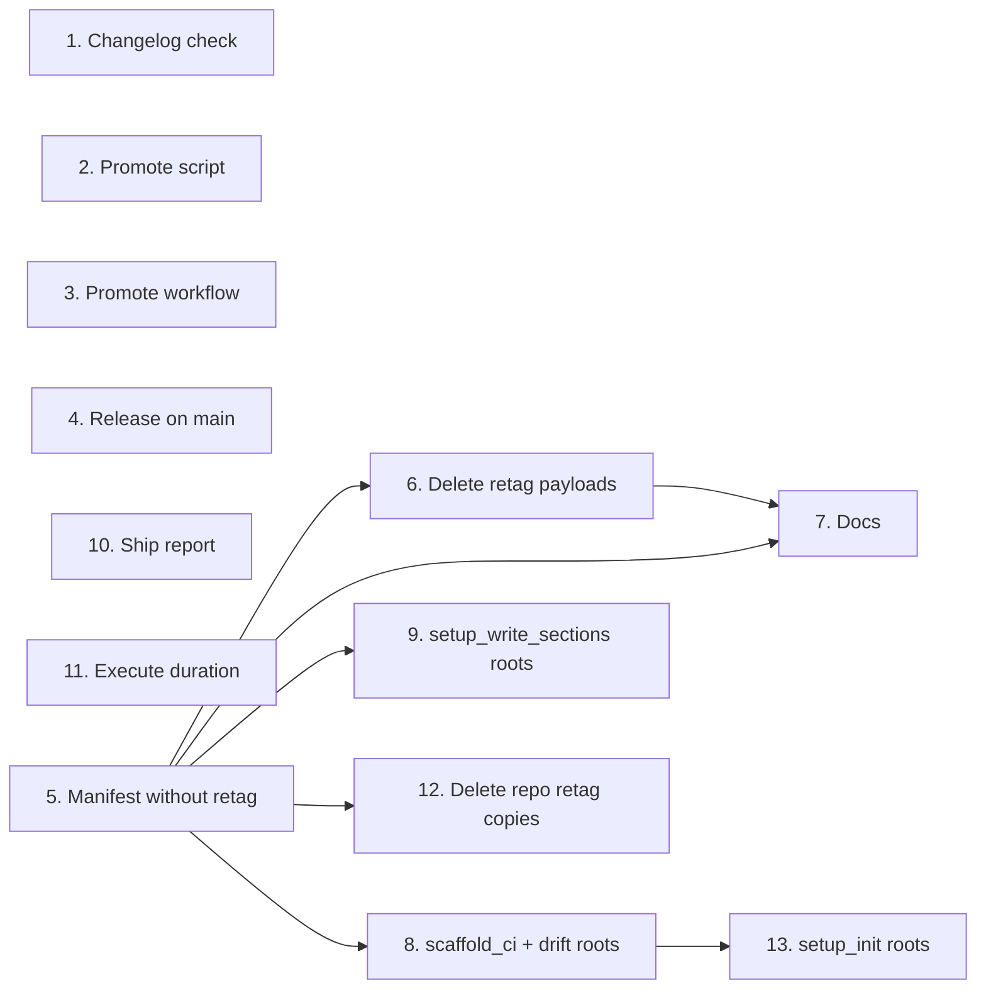

# Tasks

Group dependencies (groups with no path between them can run in parallel). Group numbers match plan task numbers.

## 1. Changelog check

- [x] 1.1 Fix `resolveVersionFromTags(repoRoot, tagPrefix)` (prefix strip, anchored final-tag regex), add the `require.main` guard and export, bump to v9 in internal/tools/payloads/check-changelog.cjs and .github/scripts/check-changelog.cjs; add RC-above-final, final+RC, prefix and no-match cases in .github/scripts/__tests__/check-changelog-version.test.cjs — verify: node --test .github/scripts/__tests__/check-changelog-version.test.cjs <!-- ref:1-1-fix-resolveversionfromtags-reporoot-250f40 -->

## 2. Promote script

- [x] 2.1 Add `resolvePromotionTarget`, `RELEASE_BRANCH` check, `SAFE_REF` allowlist and quoted refs, `release.yml` existence check, `LEVEL` env read, retag comment cleanup, bump to v9 in internal/tools/payloads/promote-release.cjs and .github/scripts/promote-release.cjs; add cases in .github/scripts/__tests__/promote-release-guard.test.cjs — verify: node --test .github/scripts/__tests__/promote-release-*.test.cjs <!-- ref:2-1-add-resolvepromotiontarget-release-b-1d3136 -->

## 3. Promote workflow

- [x] 3.1 Pass `LEVEL` and `RELEASE_BRANCH` through `env`, check out the default branch, bump marker to 9 in internal/tools/payloads/promote-release.yml and .github/workflows/promote-release.yml — verify: go test ./internal/tools/ -run TestPayloads and actionlint .github/workflows/promote-release.yml <!-- ref:3-1-pass-level-and-release-branch-throug-f15dce -->

## 4. Release on main

- [x] 4.1 Throw on the 3 note-collection failures, `PR_NOTES_LIMIT = 1000` and throw at the limit, validate and quote the push branch, quote the tag in git log, retag comment cleanup, bump to v10 in internal/tools/payloads/release-on-main.cjs and .github/scripts/release-on-main.cjs; add the concurrency block and bump marker to 6 in internal/tools/payloads/release-on-main.yml and .github/workflows/release-on-main.yml; flip the missing-tag test and add failure cases in .github/scripts/__tests__/release-on-main-changelog.test.cjs — verify: node --test .github/scripts/__tests__/release-on-main-changelog.test.cjs and actionlint .github/workflows/release-on-main.yml <!-- ref:4-1-throw-on-the-3-note-collection-failu-a43cc5 -->

## 5. Manifest without retag

- [x] 5.1 Drop the 2 retag entries, `pushAuthWorkflowKeys` entry and retag doc comments in internal/tools/scaffold.go; update counts and fixtures in scaffold_test.go, setup_write_test.go, validators_test.go, tool_error_sites_test.go; add TestScaffoldCI_LeavesRetagFilesAlone — verify: go test ./internal/tools/... <!-- ref:5-1-drop-the-2-retag-entries-pushauthwor-f99bbb -->

## 6. Delete retag payloads

- [x] 6.1 Delete internal/tools/payloads/retag-release.cjs and retag-release.yml; drop retag from scaffold_payloads_test.go lists and comment, scaffold_payloads.go comment, tests/acceptance/matrix_audit_test.go cutReason — verify: go test ./internal/tools/... ./tests/acceptance/... <!-- ref:6-1-delete-internal-tools-payloads-retag-7b5596 -->

## 7. Docs

- [x] 7.1 Narrow the main-root paragraph, remove retag mentions and add the "Files written to the active worktree" section in docs/versioning.md; drop retag from internal/setupmeta/sections.go, internal/config/config.go and the sibling-payload-fix-parity guardrail in .sdlc-v2/config.toml — verify: grep -n retag-release on those 4 files returns no hits <!-- ref:7-1-narrow-the-main-root-paragraph-remov-3abe1e -->

## 8. scaffold_ci and drift roots

- [x] 8.1 Resolve `ActiveRoot()` in the scaffold_ci handler, add `ScaffoldCIOut.Root` and description sentence in internal/tools/scaffold.go; add `setupPrepareWithDrift` and handler drift root in internal/tools/setup.go; add the `ci_script_drift` case to `validateRoot` in internal/tools/validators.go; add TestValidateRoot cases and internal/tools/scaffold_worktree_test.go — verify: go test ./internal/tools/ -run 'Worktree|TestScaffold|TestValidate|TestSetupPrepare' <!-- ref:8-1-resolve-activeroot-in-the-scaffold-c-147396 -->

## 9. setup_write_sections roots

- [x] 9.1 Split `setupWriteSections(contentRoot, stateRoot, in)`, add `SetupWriteSectionsOut.Root` and description sentence in internal/tools/setup_write.go; add the linked-worktree test in internal/tools/setup_write_test.go — verify: go test ./internal/tools/ -run TestSetupWriteSections <!-- ref:9-1-split-setupwritesections-contentroot-03b5aa -->

## 10. Ship report

- [x] 10.1 Add the Summary table, merge Plan and Planning, render stats sections, group CLI evidence by command, sanitize stored text, list critical/high/medium fixes, short-form text, wave table, ledger note, drop `## Next`, skip blank decisions in the timeline in internal/tools/ship_report.go; update and add cases in internal/tools/ship_report_test.go; add the summary sentence to docs/skills/ship.md — verify: go test ./internal/tools/ -run 'TestShipStateReport|TestShipReport' <!-- ref:10-1-add-the-summary-table-merge-plan-an-561564 -->

## 11. Execute duration

- [x] 11.1 Add `execReportEnd` and use it for the report duration in internal/tools/execute_state.go; add cases in internal/tools/execute_state_report_test.go — verify: go test ./internal/tools/ -run TestExecState_Report <!-- ref:11-1-add-execreportend-and-use-it-for-th-3d6616 -->

## 12. Delete repo retag copies

- [x] 12.1 Delete .github/scripts/retag-release.cjs, .github/workflows/retag-release.yml, .github/scripts/__tests__/retag-release-guard.test.cjs, plugins/sdlc/templates/retag-release.yml — verify: node --test .github/scripts/__tests__/*.test.cjs and go test ./internal/tools/... <!-- ref:12-1-delete-github-scripts-retag-release-ed5b16 -->

## 13. setup_init roots

- [x] 13.1 Split `setupInitRoots(contentRoot, stateRoot, in)` with `setupInit` as a wrapper, resolve both roots in the handler, add `SetupInitOut.Root` and description sentence in internal/tools/setup.go; add internal/tools/setup_init_worktree_test.go — verify: go test ./internal/tools/ -run 'TestSetupInit|Worktree' <!-- ref:13-1-split-setupinitroots-contentroot-st-cbe894 -->
