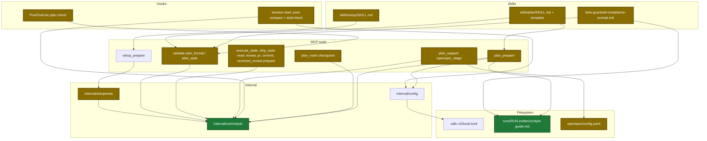
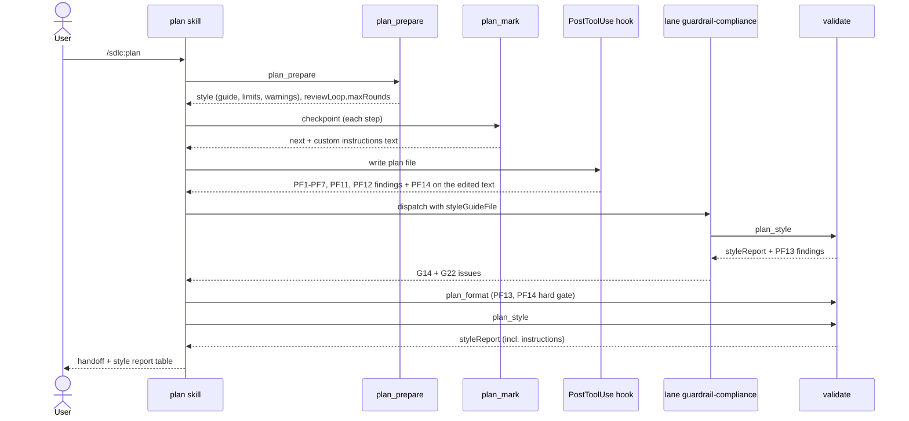

# Design

## Context

- Motivation: see `proposal.md` — Why.
- Today `loadPlanStyle` (`internal/tools/plan.go:642-679`) reads four keys with no value check.
- `setupmeta` has no nested-table field type (`internal/setupmeta/sections.go:16-34`), so all new keys stay flat under `[style]` and `[planStyle]`.
- No local-config migration exists (`internal/configmigrate/migrations.go:23-25`).
- `validate` PF checks are registered in `planBlockingChecks` / `validatePlanFormat` (`internal/tools/validators.go:337-388`); PF8 is reserved, so the new checks are PF13 and PF14. `planBlockingChecks` also runs in the PostToolUse hook.
- Lane and reference prompt files are pinned by SHA-256 in `internal/skillcheck/skillcheck_plan_test.go:451-465`.
- `checkpointNext` (`internal/tools/plan.go:1909-1925`) reads `[planStyle]` fresh on each call but returns only the instruction count.
- `planResumeLines` (`internal/hooks/session_start.go:660-690`) prints the post-compact plan lines; `internal/hooks` already imports `internal/config`.
- `openspecStage` (`internal/tools/plan_support.go:1145-1178`) sets `valid` from the CLI only.
- `sessionStart` (`internal/hooks/session_start.go:45`) prints header lines on every source; the first tool calls of execute and ship (`read`) and of review, pr, commit, received-review (`*_prepare`) return maps or structs that can carry one more field.
- `config.LocalSections` (`internal/config/config.go:52`) gates which top-level keys `setup_write_sections` writes to `local.toml`; `TestLocalSchemaSync` pins it to the schema.

## Goals / Non-Goals

**Goals:**
- One Go package owns style values, defaults, guide text, limits, metrics, STE checks, and the diagram contrast check.
- The plan author, the G22 lane, PF13, and PF14 read the same settings and constants.
- Custom instructions reach context as text at every step and after compaction.
- The review loop limit has one source: a Go constant returned by `plan_prepare`.
- Hard-to-read diagram colors fail at the first plan write and at OpenSpec staging.
- Every setting has a documented, same-content example.
- Every sdlc skill uses the same reader level, standard, tone, and language for chat and questions.

**Non-Goals:**
- Team-shared style in `config.toml`.
- User-defined rule packs (use `narrativeRules`).
- A `layout` key; BLUF is fixed.
- `economist` standard; free-text `persona`.
- Config migration tooling; legacy keys produce warnings only.
- A copy of the ASD-STE100 dictionary (copyrighted); the avoid list is a plugin approximation.
- Contrast checks for named or `rgb()` colors.
- Style rules for commit messages, PR bodies, review comments, Jira text.
- A `style` field from `prepare_orchestrator` (harden, error-report use the session-start block).

## Architecture

Touched parts (green = new, gold = changed; white text on dark fill):



Main runtime flow:



## Data contracts

Config before / after:

```diff
+[style]                      # every sdlc skill: chat and questions
+audience = "functional"      # technical | functional | executive | general | beginner
+writingStandard = "ste"      # ste | plain-language | developer-docs | smart-brevity
+tone = "direct"              # direct | neutral
+language = "English"         # plain text
+technicalTerms = ["logging"] # words the STE checks accept
+
 [planStyle]
-audience = "executive"      # technical | mixed | executive (3 lists disagree)
-verbosity = "terse"         # no consumer
-narrativeRules = [ ...16 pasted ASD-STE100 rules... ]
+visualDensity = "high"       # high | balanced | low
+narrativeRules = []          # extra rules only
 instructions = ["always add before -> after for the changed flows"]
```

`style` field in 6 tool outputs:

```go
type ChatStyle struct {
	Audience        string   `json:"audience"`
	WritingStandard string   `json:"writingStandard"`
	Tone            string   `json:"tone"`
	Language        string   `json:"language"`
	Guide           string   `json:"guide"`    // chat guide
	Warnings        []string `json:"warnings"`
}
```

`plan_prepare` `style` output:

```go
type Style struct {
	Audience        string   `json:"audience"`
	WritingStandard string   `json:"writingStandard"`
	Tone            string   `json:"tone"`
	VisualDensity   string   `json:"visualDensity"`
	Language        string   `json:"language"`
	TechnicalTerms  []string `json:"technicalTerms"`
	NarrativeRules  []string `json:"narrativeRules"`
	Instructions    []string `json:"instructions"`
	Warnings        []string `json:"warnings"`
	Limits          Limits   `json:"limits"`
	WritingGuide    string   `json:"writingGuide"`
}

type Limits struct {
	MaxProseShare         float64  `json:"maxProseShare"`
	MaxParagraphSentences int      `json:"maxParagraphSentences"`
	MaxListItems          int      `json:"maxListItems"`
	MaxSentenceWords      int      `json:"maxSentenceWords"` // 0 = off
	MaxJargonShare        float64  `json:"maxJargonShare"`
	BannedPhrases         []string `json:"bannedPhrases"`
	STE                   bool     `json:"ste"`
	MaxInstructionWords   int      `json:"maxInstructionWords"` // 0 = off
	TechnicalTerms        []string `json:"technicalTerms"`
}

type ReviewLoop struct {
	MaxRounds int `json:"maxRounds"` // 5
}

type ContrastHit struct {
	Line   int    `json:"line"`
	Text   string `json:"text"`
	Reason string `json:"reason"` // "no text color" | "contrast 3.3:1 < 4.5:1"
}
```

Diagram classes (one source: `commstyle.ClassDefNew` / `ClassDefChanged`):

| Class | Line | White-text contrast |
|---|---|---|
| new | `classDef new fill:#1f7a3a,stroke:#0b3d1c,color:#ffffff,stroke-width:2px` | 5.4:1 |
| changed | `classDef changed fill:#8a6d00,stroke:#4a3a00,color:#ffffff,stroke-width:2px` | 4.9:1 |

## Decisions

| Decision | Chosen | Rejected alternatives | Reason |
|---|---|---|---|
| Where style logic lives | new `internal/commstyle` package | keep in `internal/tools/plan.go` | `plan_prepare`, `validate`, `setupmeta`, and the hook all need it; one source for values |
| Guide format | XML-tagged Markdown sections + one example | free-text rule list | Anthropic prompting guide ranks tagged sections and examples above rule lists |
| Rule text storage | Go string maps in `internal/commstyle/packs.go` | embedded Markdown packs (`go:embed`) | each task stays at 5 files or fewer; tests read the same maps the guide uses |
| Standards | `ste`, `plain-language`, `developer-docs`, `smart-brevity` | add `economist`; add Caterpillar TE | `economist` allows figurative wording; Caterpillar TE has no public spec |
| Default audience | `functional` | `technical` | prose about behavior, function, and impact with minimal jargon; mechanism in visuals |
| STE exemptions | backticks, code blocks, tables, `technicalTerms` | no exemptions | STE exempts technical names; a hard gate with false hits blocks every plan |
| Layout | fixed BLUF | `layout` key | one less axis; BLUF fits approval documents |
| G22 owner | `guardrail-compliance` lane | new 6th lane; content-coverage lane | lane already checks configured rules, carries one gate; no change to the 5-lane count |
| Harden offer scope | G14 guardrail failures only | any error-severity lane-3 issue | a G22 style miss is an ordinary fix, not a guardrail block |
| PF13 placement | `validatePlanFormat` only | `planBlockingChecks` | the PostToolUse hook would flag half-written drafts |
| Diagram guard | PF14 in `plan_format` (whole file) + hook on the edited text only + `openspec_stage` + exact classDefs in guide and `openspec/config.yaml` | guide rule only; PF13 only; whole-file PF14 in the hook | a color rule without a check was ignored; a whole-file hook check blocks every edit of an older plan |
| Plugin-wide delivery | session-start hook + `style` in the first tool call of 6 skills + one line in each `SKILL.md` | hook only; tools only | the hook reaches every skill and every compaction; tool output is fresh next to the work |
| Config split | shared keys in `[style]`, plan-only keys in `[planStyle]` | keep all keys in `[planStyle]` | the shared keys apply to every skill; legacy keys keep working with a warning |
| Plugin-wide scope | chat and questions only | also commits, PR bodies, review comments, Jira text | those texts follow team templates and config |
| Contract section | legend table linked to real tasks | 3 copied generic examples; remove the section | the copied examples carried no plan context |
| Review limit home | Go constant `maxReviewRounds = 5`, returned as `reviewLoop.maxRounds` | number in `SKILL.md` prose | one source; checkpoint `next` can announce the last round |
| Instructions after compaction | hook prints them; checkpoint `next` prints full text | count only | text must reach context without a skill reload |
| Legacy keys | warning, value ignored | migration step | no migration machinery exists; personal config |
| Metric unit | words | lines | long bullets cannot hide prose |

## Risks / Trade-offs

| Risk | Impact | Mitigation |
|---|---|---|
| PF13 blocks a finished plan at Step 6.6 | handoff stops | G22 runs `plan_style` in Step 3, Step 4 fixes first |
| STE heuristics give false hits | handoff stops on correct text | exemptions (backticks, tables, `technicalTerms`); an -ing word is a hit only after a preposition or a form of `be`; hit text names the word |
| PF14 blocks an older plan that has pastel classDefs | edit is rejected | the hook checks only the edited text; `plan_format` checks the whole file at handoff |
| Chat guide grows every session context | more tokens per session | 5 short tags; no plan limits or examples |
| Word-based metrics misjudge non-English text | false failures | sentence-length check is off for non-English output |
| Pinned prompt hashes break CI | red build | update hashes in the same task as the prompt edit |
| Same plan passes for one developer and fails for another | confusion | style report prints the settings in effect |

## Migration Plan

- No data migration. Old `verbosity` and `audience = "mixed"` produce warnings and defaults. Shared keys left in `[planStyle]` still work with a "moved to [style]" warning.
- A project template that lists `Contract Examples` keeps that heading; the body uses the legend format.
- Rollback: revert the commit; old keys are still read as plain strings by the old loader.
