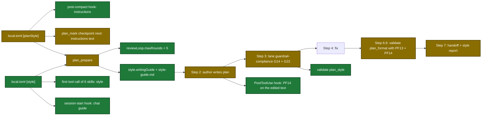

# Proposal

## Why

- Problem: `[planStyle]` cannot steer how a plan reads, custom instructions return to context only as a count, the review loop stops at 3 rounds (users want 5), plan diagrams can be unreadable, the plan's `## Contract Examples` section has no context, and no other sdlc skill reads any style setting for its chat and questions.
- Evidence: `verbosity` has no consumer; `{NARRATIVE_RULES}` is in no prompt; `audience` has 3 value lists (`internal/setupmeta/sections.go:342-350`, `plugins/sdlc/schemas/sdlc-local.schema.json`, `plugins/sdlc/skills/plan/SKILL.md:21`); `checkpointNext` prints "Follow the N custom plan instructions" (`internal/tools/plan.go:1915`); `openspec/config.yaml` `&diagram-style` asks for `classDef new` / `changed` with no colors, so authors pick pastel fills with light text.
- Evidence (other skills): the 12 non-plan skills hold 114 AskUserQuestion sites and read no style setting.
- Why now: reviewers want short, visual, function-first plans with little jargon, and proof that their style settings were applied.

## What Changes

| Area | Before | After |
|---|---|---|
| Style keys | `[planStyle]`: `verbosity`, `audience`, `narrativeRules`, `instructions`; no value check | `[style]` (all skills): `audience`, `writingStandard`, `tone`, `language`, `technicalTerms`. `[planStyle]` (plan only): `visualDensity`, `narrativeRules`, `instructions`. Invalid value falls back to the default with a warning; a shared key left in `[planStyle]` still works with a warning |
| Style in other skills | none | session-start hook prints the chat guide every session; the first tool call of execute, ship, review, pr, commit, received-review returns `style`; every skill follows it for chat and questions, not for commits, PR bodies, review comments, or Jira text |
| **BREAKING** `verbosity` | accepted, unused | ignored with a warning; `visualDensity` replaces it |
| **BREAKING** `audience` values | `technical`/`mixed`/`executive` (schema) vs `technical`/`general` (setup) | `technical`/`functional`/`executive`/`general`/`beginner` in every source; default `functional`; `mixed` falls back with a warning |
| Writing instructions | hardcoded R62 rules in `SKILL.md` | `plan_prepare` builds `style.writingGuide` from the keys and built-in rule packs, and writes it to `<runId>.evidence/style-guide.md` |
| `ste` standard | not offered | full 20-rule ASD-STE100 pack in the guide, plus deterministic STE checks |
| Style check | none | `validate` `plan_format` runs PF13; new `validate` action `plan_style` returns a style report |
| Diagram colors | no rule, no check | guide and `openspec/config.yaml` name 2 exact classDefs (white text, WCAG 4.5:1); PF14 blocks hard-to-read colors in each plan edit's new text and in `plan_format`; `openspec_stage` rejects them |
| Custom instructions in tool output | count only in checkpoint `next` | full numbered text in checkpoint `next`, the guide, `styleReport.instructions`, and the post-compact session-start hook |
| Review loop limit | 3 rounds, prose in `SKILL.md` | 5 rounds, `plan_prepare` `reviewLoop.maxRounds`; checkpoint `next` announces the last round |
| Plan Contract section | `## Contract Examples`: 3 copied generic Contract blocks | `## How to read a task Contract`: one table of Contract keys, each linked to a real task of the plan |
| Plan critique | gates G1–G21 | new gate G22 (style compliance), owned by the `guardrail-compliance` lane |
| Handoff | no style evidence | Step 7 prints the style report |
| Docs | no examples | `docs/skills/plan.md` shows each setting with a same-content example |

Flow after the change (green = new, gold = changed; white text on dark fill):

## Capabilities

### New Capabilities
- `plan-writing-style`: structured plan style settings, the generated writing guide, the numeric limits, the strict STE checks, the diagram contrast rule, and the places that return custom instructions to context.
- `communication-style`: the plugin-wide `[style]` section, the chat guide, the session-start style block, and the communication style line in every skill.

### Modified Capabilities
- `tool-plan-prepare`: `style` output fields, `styleGuideFile`, `reviewLoop`, and `lanes[3]` gate list.
- `tool-plan-mark`: checkpoint `next` carries the custom instructions text and the last-round notice.
- `tool-plan-support`: `openspec_stage` rejects hard-to-read Mermaid colors.
- `tool-validate`: PF13 and PF14 in `plan_format`, new `plan_style` action, `styleReport` output.
- `tool-execute-state`, `tool-ship-state`: `read` returns `style`.
- `tool-review-prepare`, `tool-pr-prepare`, `tool-commit-prepare`, `tool-received-review-prepare`: output returns `style`.
- `skill-plan`: Step 3 merges G1–G22; the skill writes, checks, and reports per the writing guide; the review loop limit comes from `reviewLoop.maxRounds` (5); the Contract legend section.

## Impact

| Path | Kind | Change |
|---|---|---|
| `internal/commstyle/` | Go package (new) | settings, rule packs, guide builder, limits, metrics, STE checks, diagram contrast |
| `internal/tools/plan.go` | MCP tool | use `commstyle`; new output fields; G22 on `lanes[3]`; `maxReviewRounds`; checkpoint `next` text |
| `internal/tools/validators.go` | MCP tool | PF13, PF14, `plan_style` action |
| `internal/tools/plan_support.go` | MCP tool | `openspec_stage` diagram contrast check |
| `internal/hooks/session_start.go` | hook | post-compact plan lines add instructions; every session prints the communication style |
| `internal/hooks/post_tool_validate.go` | hook | PF14 on the edited text |
| `internal/tools/chat_style.go`, `execute_state.go`, `ship_state.go`, `review.go`, `pr.go`, `commit.go`, `received_review.go` | MCP tools | `style` output field |
| `internal/config/config.go` | config | `style` local section |
| `internal/setupmeta/sections.go` | setup metadata | new fields, shared value lists, `communication-style` section |
| `plugins/sdlc/schemas/sdlc-local.schema.json` | schema | new keys and value lists |
| `plugins/sdlc/templates/local.toml` | template | new keys with examples |
| `plugins/sdlc/skills/plan/SKILL.md`, lane prompts, `plan-format-reference.md`, `plan-reviewer-prompt.md`, `plan-template-default.md` | skill | guide use, G22, style report, review limit 5, diagram colors, Contract legend |
| `plugins/sdlc/skills/setup/SKILL.md` | skill | new section, summary lines, write map |
| `plugins/sdlc/skills/{execute,ship,review,pr,commit,received-review,harden,error-report,jira,setup,deferred,verify-pipeline}/SKILL.md` | skill | one communication style line |
| `openspec/config.yaml` | config | `&diagram-style` names the 2 exact classDefs |
| `docs/skills/plan.md`, `docs/plan-architecture.md`, `docs/skills/setup.md` | doc | settings, examples, gate and PF tables, review limit |
