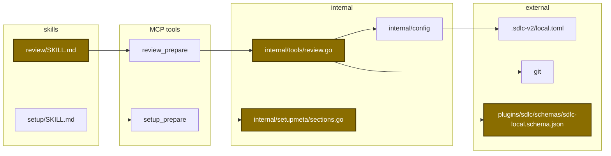
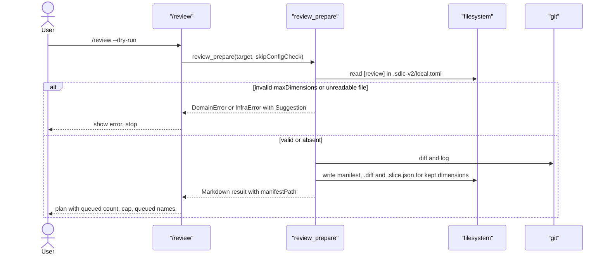

# Design

## Context

- Motivation: see proposal.md - Why.
- The cap logic lives in one function in `internal/tools/review.go`, called once before any diff or slice file is written.
- `[review]` is a per-developer section in `.sdlc-v2/local.toml`; `review_prepare` already reads its `scope` key and ignores read errors today.
- TOML integers arrive as `float64` after decoding (`internal/fsx`).
- `/review` reads only the manifest; ship parses the comment header line.

## Goals / Non-Goals

**Goals:**
- Severity-first cap with the existing tie-break.
- One config key for the cap, validated inside the tool.
- The skill prints the cap and the queued names from manifest fields only.

**Non-Goals:**
- No caller-named dimension list (`--dimensions`).
- No upper limit on the cap.
- No change to the `scope` fallback rule or to the comment header line.

## Architecture

Touched parts and their links (new and changed marked):



Main runtime flow:



Config key state (per developer, in `.sdlc-v2/local.toml`):

```mermaid
stateDiagram-v2
  [*] --> Default: "key absent (cap 8)"
  Default --> Configured: "developer sets maxDimensions >= 1"
  Configured --> Default: "developer deletes the key"
  Default --> Invalid: "developer sets a bad value"
  Configured --> Invalid: "developer sets a bad value"
  Invalid --> Configured: "developer fixes the value"
```

## Data contracts

Config change:

```diff
 [review]
 scope = "working"
+maxDimensions = 22
```

Manifest change:

| Field | Type | Encoding | Example |
|---|---|---|---|
| `plan_critique.dimension_cap` | integer | JSON number | `8` |

Function shape (internal):

```go
const defaultMaxDimensions = 8

func resolveDimensionCap(reviewCfg map[string]any) (int, error)

func refinePlan(dims []reviewDimWork, maxDims int) []string
```

## Decisions

| Decision | Chosen | Rejected alternatives | Reason |
|---|---|---|---|
| Sort fix | Compare `ri > rj`, keep tie-break | Change tie-break too | The spec defines both rules; only the direction is wrong |
| Cap location | `[review] maxDimensions` in `local.toml` | `config.toml` project key; tool input field | `scope` already lives there and `/setup` edits it; user choice |
| Cap range | Minimum 1, no maximum | 1-32; 1-16 | User choice |
| Invalid value | `DomainError` | Silent default to 8 | A silent default hides the user's mistake |
| Read error | `InfraError` (missing file still silent) | Keep ignoring errors | A broken file would set the cap to 8 with no message |
| Cap visibility | `plan_critique.dimension_cap` in manifest | Skill reads `local.toml` | Deterministic work stays in the tool |
| Queued note | Separate line below the header | Change the header | Ship parses the header line |
| Selection flag | Not added | `--dimensions` input | Not chosen; a higher cap gives the same coverage |

## Risks / Trade-offs

| Risk | Impact | Mitigation |
|---|---|---|
| A broken `local.toml` now stops `/review` | Review blocked until the file is fixed | `InfraError` Suggestion says to fix or delete the file |
| A very high cap starts many agents | Cost and rate-limit pressure | Default stays 8; the value is an explicit developer choice |
| Schema sync test skips number fields | Setup field and schema can drift | New dedicated test for `maxDimensions` |
| `task deploy` replaces the shared binary | Other live sessions see the new binary mid-run | Deploy only when no other session uses the plugin |

## Migration Plan

- No migration: the key is optional and the default keeps today's cap count.
- Rollback: revert the commit; an existing `maxDimensions` key is then rejected by the old schema only at `/setup` write time.
