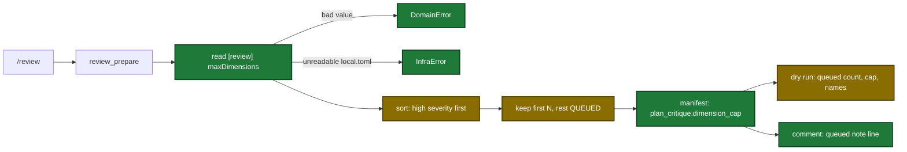

# Proposal

## Why

- Problem: `review_prepare` keeps the 8 **lowest**-severity dispatched dimensions and queues the most severe ones, including every `critical` dimension.
- Evidence: the comparator in `internal/tools/review.go` (`diff := rj - ri; return diff > 0`) sorts ascending; the spec `tool-review-prepare` says "Kept first: higher severity". A ship review run on a security branch with 22 matched dimensions queued all `critical` dimensions.
- Why now: the cap is fixed at 8, and `/review` never names the queued dimensions, so the user cannot see or fix the gap.

## What Changes

| Area | Before | After |
|---|---|---|
| Cap order | Lowest severity kept first | Highest severity kept first; tie-break unchanged (fewer matched files first) |
| Cap value | Fixed at 8 | `[review] maxDimensions` in `.sdlc-v2/local.toml`; default 8, minimum 1, no maximum |
| Invalid cap value | n/a | `review_prepare` stops with a `DomainError` that names the key and the fix |
| Unreadable `local.toml` | Error ignored; defaults used | `review_prepare` stops with an `InfraError`; a missing file or section is still not an error |
| Manifest | No cap value | New `plan_critique.dimension_cap` |
| `/review --dry-run` | Active and skipped counts only | Adds queued count, cap, and a `Queued (not reviewed)` line |
| Review comment | No queued information | One queued note line below the header when the queue is not empty; header unchanged |
| `/setup` and local schema | Only `scope` in `[review]` | Also `maxDimensions` |

Flow of one `/review` run after the change (new and changed steps marked):

## Capabilities

### New Capabilities

- None.

### Modified Capabilities

- `tool-review-prepare`: dimension cap keeps highest severity first, reads its value from `[review] maxDimensions`, reports it in `plan_critique.dimension_cap`, and fails on an invalid value or an unreadable `local.toml`.
- `skill-review`: the dry-run plan and the consolidated comment name the queued dimensions and the cap.

## Impact

| Path | Kind | Change |
|---|---|---|
| `internal/tools/review.go` | MCP tool | Comparator fix, cap from config, `dimension_cap`, new errors, description |
| `internal/tools/review_test.go` | MCP tool | Identity, config, and error tests |
| `internal/setupmeta/sections.go` | MCP tool | New `maxDimensions` setup field |
| `internal/setupmeta/schema_sync_test.go` | MCP tool | Field-to-schema test for `maxDimensions` |
| `plugins/sdlc/schemas/sdlc-local.schema.json` | schema | `reviewSection.maxDimensions` |
| `plugins/sdlc/templates/local.toml` | template | Commented `maxDimensions` example |
| `plugins/sdlc/skills/review/SKILL.md` | skill | Dry-run block, comment note, scope note |
| `docs/skills/review.md` | doc | `maxDimensions` note |
