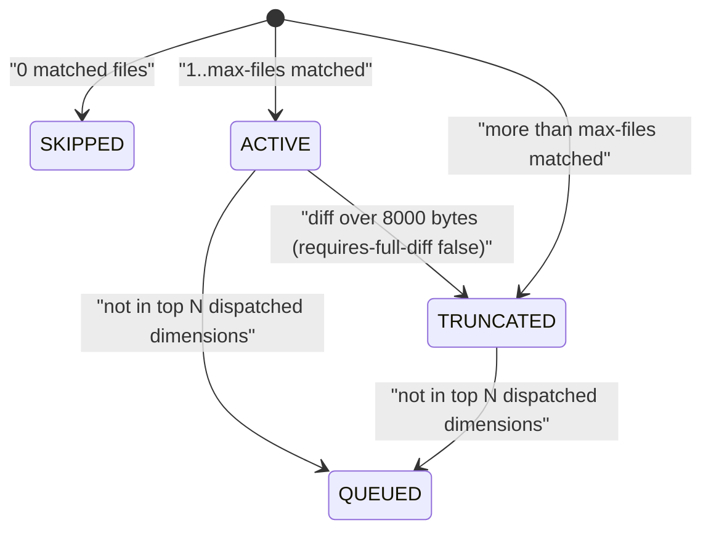

# Spec Delta

## ADDED Requirements

### Requirement: Dimension cap configuration
The tool SHALL read the dimension cap from the `maxDimensions` key of the `[review]` section in `.sdlc-v2/local.toml`, use `8` when the key, section, or file is absent, and stop with an error when the value is invalid or the file cannot be read.

- A valid value is a finite whole number of `1` or more. There is no upper limit; a value above `2147483647` is clamped to `2147483647`.
- An invalid value returns a `DomainError` whose message names `[review] maxDimensions` and the received value, with a `Suggestion` to set a whole number of 1 or more or to delete the key.
- A `local.toml` that exists but cannot be parsed or read returns an `InfraError` with a `Suggestion` to fix or delete the file.
- The error is returned before any git work or file write.

#### Scenario: Key absent
- **WHEN** `.sdlc-v2/local.toml` has no `maxDimensions` key
- **THEN** the cap is `8`
- **AND** `plan_critique.dimension_cap` is `8`

#### Scenario: No local.toml
- **WHEN** `.sdlc-v2/local.toml` does not exist
- **THEN** the cap is `8` and no error is returned

#### Scenario: Configured cap
- **WHEN** `[review]` has `maxDimensions = 22`
- **THEN** the cap is `22`
- **AND** `plan_critique.dimension_cap` is `22`

#### Scenario: Value below 1
- **WHEN** `[review]` has `maxDimensions = 0`
- **THEN** the tool returns a `DomainError` that names `[review] maxDimensions`
- **AND** the error has a `Suggestion`

#### Scenario: Fractional value
- **WHEN** `[review]` has `maxDimensions = 2.5`
- **THEN** the tool returns a `DomainError`

#### Scenario: String value
- **WHEN** `[review]` has `maxDimensions = "8"`
- **THEN** the tool returns a `DomainError`

#### Scenario: Infinite value
- **WHEN** `[review]` has `maxDimensions = inf`
- **THEN** the tool returns a `DomainError`

#### Scenario: Very large value
- **WHEN** `[review]` has `maxDimensions = 1e300`
- **THEN** the cap is `2147483647` and no error is returned

#### Scenario: Malformed local.toml
- **WHEN** `.sdlc-v2/local.toml` contains invalid TOML
- **THEN** the tool returns an `InfraError` with a `Suggestion`

## MODIFIED Requirements

### Requirement: Dimension status
The tool SHALL give every loaded dimension exactly one status: `ACTIVE`, `SKIPPED`, `TRUNCATED`, or `QUEUED`.

Status transitions for one dimension during a single call (N is the dimension cap).

- `max-files` defaults to `100`; only a positive integer overrides it.
- When more than `max-files` files match, only the first `max-files` are kept and `truncated` is `true`.
- For a dispatched dimension cut by `max-files`, the `.diff` file ends with a footer: first line `# --- Truncated (max-files) ---`, then one `# - <path>` line per dropped file. It comes after any diff byte cap footer.
- `QUEUED` is applied before any diff or slice file is written; see the dimension cap requirement. Only dimensions still `ACTIVE` after the cap can become `TRUNCATED` by the diff byte cap.

#### Scenario: max-files cap
- **WHEN** 4 changed files match and `max-files` is `3`
- **THEN** `matched_count` is `3`
- **AND** `truncated` is `true` and status is `TRUNCATED`
- **AND** the `.diff` file ends with a `# --- Truncated (max-files) ---` footer that lists the 4th file as `# - <path>`

#### Scenario: No matched file
- **WHEN** no changed file matches a dimension's triggers
- **THEN** its status is `SKIPPED`
- **AND** its `diff_file` and `slice_file` are `null`

### Requirement: Dimension cap
The tool SHALL keep at most N dispatched dimensions (status `ACTIVE` or `TRUNCATED`), where N is the dimension cap (default 8, see dimension cap configuration), and SHALL change the rest to `QUEUED`.

- `ACTIVE` and `TRUNCATED` dimensions both count toward the cap, because both get a reviewer agent.
- Kept first: higher severity (`critical` > `high` > `medium` > `low` > `info`; unknown ranks as `medium`).
- Tie-break: fewer matched files first.
- A `QUEUED` dimension has `diff_file: null` and `slice_file: null`, and no files are written for it.
- Queued names are listed in `plan_critique.queued_dimensions`.
- `plan_critique.dimension_cap` is N.
- `plan_critique.dimension_cap_applied` is `true` when more than N dimensions were `ACTIVE` or `TRUNCATED`.

#### Scenario: Ten active dimensions
- **WHEN** 10 dimensions are `ACTIVE` before the cap and the cap is 8
- **THEN** 8 stay `ACTIVE` and 2 become `QUEUED`
- **AND** `summary.queued_dimensions` is `2`

#### Scenario: Ten truncated dimensions
- **WHEN** 10 dimensions are `TRUNCATED` by `max-files` before the cap and the cap is 8
- **THEN** 8 stay `TRUNCATED` and 2 become `QUEUED`
- **AND** `summary.active_dimensions` is `8`
- **AND** `plan_critique.dimension_cap_applied` is `true`

#### Scenario: Five active dimensions
- **WHEN** 5 dimensions are `ACTIVE` and the cap is 8
- **THEN** none becomes `QUEUED`

#### Scenario: Critical dimension kept
- **WHEN** 1 `critical` and 8 `info` dimensions are `ACTIVE` and the cap is 8
- **THEN** the `critical` dimension stays `ACTIVE`
- **AND** exactly one `info` dimension becomes `QUEUED`

#### Scenario: Lowest severity queued
- **WHEN** the dispatched severities are `critical, high, medium, low, info, medium, medium, medium, low, info` and the cap is 8
- **THEN** the two `info` dimensions become `QUEUED`

#### Scenario: Equal severity tie-break
- **WHEN** 3 `medium` dimensions match 3, 1, and 2 files and the cap is 2
- **THEN** the dimension with 3 matched files becomes `QUEUED`

#### Scenario: Configured cap above dimension count
- **WHEN** 10 dimensions are `ACTIVE` and the cap is 10
- **THEN** none becomes `QUEUED`
- **AND** `plan_critique.dimension_cap_applied` is `false`

### Requirement: Plan critique
The tool SHALL write a `plan_critique` object into the manifest that describes coverage gaps and overlaps of the dimension plan.

| Field | Meaning |
|---|---|
| `uncovered_files` | Changed files matched by no dimension. |
| `uncovered_suggestions` | `[{dimension, files, reason}]` from the catalog below. |
| `still_uncovered` | Uncovered files that match no catalog entry. |
| `over_broad_dimensions` | Dispatched (`ACTIVE` or `TRUNCATED`) dimensions matching more than 80% of changed files. |
| `overlapping_pairs` | Pairs of dispatched (`ACTIVE` or `TRUNCATED`) dimensions with identical matched-file sets. |
| `dimension_cap` | The dimension cap used for this call. See dimension cap. |
| `dimension_cap_applied` | See dimension cap. |
| `queued_dimensions` | See dimension cap. |

Uncovered-file catalog. The first matching row wins. Matches marked (i) ignore case.

| Suggested dimension | Label | File path matches |
|---|---|---|
| `ci-cd-pipeline-review` | CI/CD workflow | `.github/workflows/`, or `.yml`/`.yaml` containing `ci`, `deploy`, or `pipeline` (i) |
| `ci-cd-pipeline-review` | CI/CD pipeline | `Jenkinsfile` or `.circleci/` (i) |
| `database-migrations-review` | database migration | `migration/` or `migrations/` (i), or ends with `.sql` |
| `internationalization-review` | internationalization | `i18n`, `locale`, `locales`, `translation/`, `translations/` (i) |
| `api-contract-review` | API contract/schema | ends with `.graphql` or `.proto`, or contains `openapi`/`swagger` (i) |
| `documentation-quality-review` | documentation | ends with `.md`, or `doc/`/`docs/` (i) |
| `type-safety-review` | type definition | ends with `.d.ts`, or a `type/`/`types/` segment (i) |
| `state-management-review` | state management | `store`, `state`, `redux`, `zustand`, `pinia` (i) |
| `infrastructure-review` | infrastructure | `Dockerfile`, `docker-compose`, `terraform`, `k8s`, `kubernetes`, or ends with `.dockerfile` or `.tf` (i) |
| `dependency-management-review` | dependency lockfile | ends with `.lock`, or `package-lock`, `yarn.lock`, `Gemfile.lock`, `poetry.lock` |
| `mobile-app-review` | mobile platform | `android/`, `ios/`, or ends with `.swift`, `.kt`, or `.dart` (i) |
| `configuration-management-review` | configuration | `.env` or `.env.*`, or a `config/` segment (i) |

- Suggestions are grouped per dimension, in first-seen order.
- `reason` is `<count> <label> file not covered by any dimension`, with `files` when count is not 1.

#### Scenario: Two catalog groups and one leftover
- **WHEN** uncovered files are `.github/workflows/ci.yml`, `migrations/001_init.sql`, and `src/main.go`
- **THEN** `uncovered_suggestions` lists `ci-cd-pipeline-review` then `database-migrations-review`
- **AND** `still_uncovered` is `["src/main.go"]`

#### Scenario: Identical coverage
- **WHEN** two `ACTIVE` dimensions both match exactly `f1.go` and `f2.go` out of 3 changed files
- **THEN** `overlapping_pairs` holds one pair
- **AND** `over_broad_dimensions` is empty (66% is not over 80%)

#### Scenario: Over-broad dimension
- **WHEN** an `ACTIVE` dimension matches 5 of 6 changed files
- **THEN** its name is in `over_broad_dimensions`

#### Scenario: Truncated dimensions are checked too
- **WHEN** two dimensions both match all 3 changed files and the diff byte cap makes both `TRUNCATED`
- **THEN** both names are in `over_broad_dimensions`
- **AND** `overlapping_pairs` holds that pair
- **AND** `QUEUED` and `SKIPPED` dimensions are never checked

#### Scenario: Cap reported
- **WHEN** the cap is 8
- **THEN** `plan_critique.dimension_cap` is `8`
