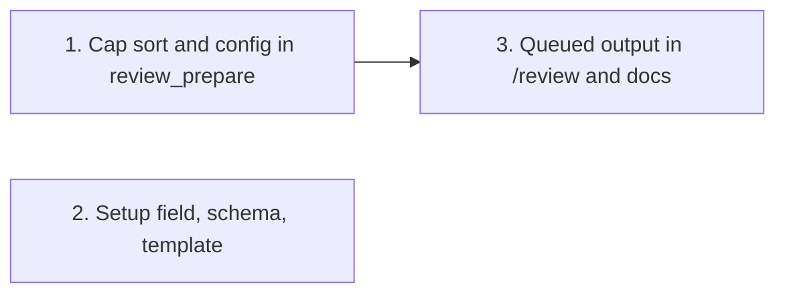

# Tasks

Group dependencies (groups 1 and 2 can run in parallel):

## 1. Cap sort and config in review_prepare

- [x] 1.1 Fix the cap comparator, add resolveDimensionCap, the maxDims parameter, the read-error check, plan_critique.dimension_cap, and the tool description in internal/tools/review.go — verify: go test ./internal/tools/ -run 'TestRefinePlan|TestResolveDimensionCap|TestReviewPrepare'
- [x] 1.2 Add identity, tie-break, custom cap, config, invalid value, and malformed file tests in internal/tools/review_test.go — verify: TestRefinePlanOverCap, TestRefinePlanUnderCap, TestRefinePlanTiebreakFewerFilesFirst, TestRefinePlanCustomCap, TestResolveDimensionCap, TestReviewPrepareKeepsCriticalUnderCap, TestReviewPrepareMaxDimensionsFromLocalToml, TestReviewPrepareInvalidMaxDimensions, TestReviewPrepareMalformedLocalToml pass

## 2. Setup field, schema, template

- [x] 2.1 Add the maxDimensions field and update the review section purpose in internal/setupmeta/sections.go — verify: go test ./internal/setupmeta/
- [x] 2.2 Add reviewSection.maxDimensions in plugins/sdlc/schemas/sdlc-local.schema.json and a commented example in plugins/sdlc/templates/local.toml — verify: TestReviewMaxDimensionsSchemaMatchesField
- [x] 2.3 Add TestReviewMaxDimensionsSchemaMatchesField in internal/setupmeta/schema_sync_test.go — verify: go test ./internal/setupmeta/ -run TestReviewMaxDimensionsSchemaMatchesField

## 3. Queued output in /review and docs

- [x] 3.1 Add the queued count, cap, Queued (not reviewed) line, comment note, and scope note in plugins/sdlc/skills/review/SKILL.md — verify: go test ./internal/skillcheck/...
- [x] 3.2 Document maxDimensions in docs/skills/review.md — verify: grep -rn "maxDimensions" docs/ plugins/sdlc/skills/
- [x] 3.3 Run the full suite and a live dry run after task deploy — verify: task check; /review --dry-run shows no critical dimension in the queued list
