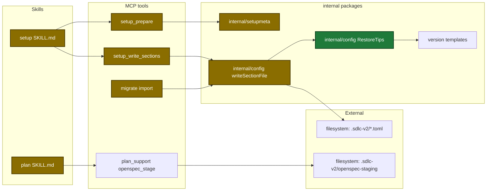
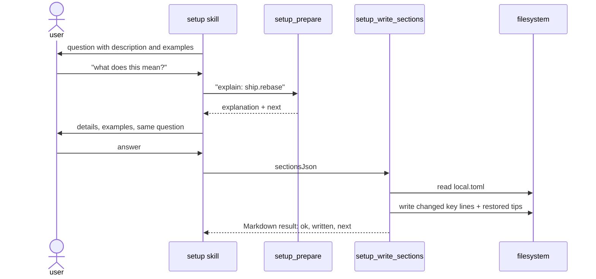
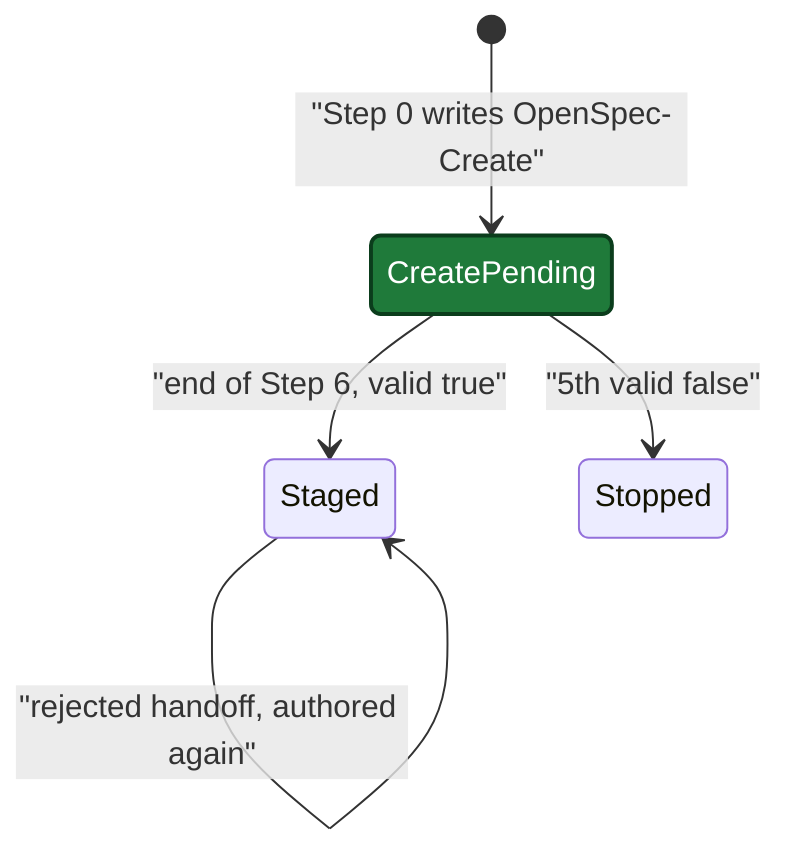

# Design: setup-help-comments-plan-late-openspec

## Context

- Setup option text lives only in `internal/setupmeta/sections.go`. Each field has one short `Description`.
- `go-toml/v2` is the only TOML library. It cannot keep comments on a round trip, so comment-safe writes must edit text.
- Setup writes and `migrate import` share one writer (`internal/config/config.go:902-923`).
- Only ship and execute read the plan staging header (`internal/openspec/materialize.go:37`), after plan Step 7.
- `openspec_stage` reads no run state, so it works after the plan run ends.

## Goals / Non-Goals

**Goals:**
- Setup shows examples for each option and explains one option on request.
- A config write changes only the lines of changed keys and keeps every comment.
- A write restores missing template tips inside the written section.
- Staged OpenSpec files of a Create plan describe the reviewed plan and follow handoff feedback.

**Non-Goals:**
- No explanation for delegated sections (they have no fields).
- No removal of old tips of a moved key.
- No change to the setup menu order or questions.
- No change to the Existing-change and Skip paths of the plan gate.

## Architecture

Touched parts and their links:



## Main runtime flow

Setup asks one option, the user asks for help, then setup writes the section:



## Plan header state

The plan header markers on the Create path:



## Data contracts

```go
type SetupPrepareIn struct {
    SkipConfigCheck bool   `json:"skipConfigCheck,omitempty"`
    Explain         string `json:"explain,omitempty"` // "ship.rebase"
}

// SetupPrepareOut gains:
//   Explanation *optionExplanation `json:"explanation,omitempty"`
//   Next        string             `json:"next,omitempty"`

type optionExplanation struct {
    Option, Label, Type, Description, Details, ConfigFile, ConfigPath string
    Options, Examples, ConsumedBy []string
    Default any
}

// setupmeta.Field gains:
//   Details  string
//   Examples []string // "<TOML value> — <meaning>"

// SetupWriteSectionsOut gains:
//   Next string `json:"next,omitempty"`

var ErrWouldDropComments = errors.New("config: in-place edit failed and a full rewrite would delete comments")

func RestoreTips(file, template []byte, section []string) (out []byte, added int, err error)
```

Plan header lines:

| Stage | `**Source:**` | `**OpenSpec-Create:**` | `**OpenSpec-Staging:**` |
|---|---|---|---|
| after Step 0 Create | `openspec/changes/<name>/` | `<name>` | absent |
| after end-of-Step-6 authoring | same | removed | `.sdlc-v2/openspec-staging/<name>/` |
| after rejected handoff | same | absent | same, files replaced |

## Config changes

`local.toml` rebase tip:

```diff
-# Valid: true | false | "prompt"
+# Valid: true | false | "auto" | "skip" | "prompt"  (true = "auto", false = "skip")
 rebase = true
```

`config.toml` `[commit]` tips (commented examples, no value change):

```diff
 [commit]
 # Allowed commit types (conventional-commit prefix before the colon).
 allowedTypes = ["feat", "fix", "chore", "docs", "refactor", "test", "ci", "perf"]
 # Allowed scopes (empty = any scope accepted).
 allowedScopes = []
+# Regex pattern the commit subject line must match.
+# subjectPattern = "^(feat|fix)(\\(.+\\))?: .+"
+# Commit types that require a body message.
+# requireBodyFor = ["feat"]
```

## Decisions

| Decision | Chosen | Rejected alternatives | Reason |
|---|---|---|---|
| Where option help lives | `explain` input on `setup_prepare` | New MCP tool. Mode on `setup_init` | `setup_prepare` owns the option list and is read-only. Guardrail `mcp-tool-count-discipline` |
| Source of help text | `setupmeta.Field` `Details` and `Examples` | Embed the JSON schema. Parse template comments | `setupmeta` is the only runtime source. A test stops drift |
| Config edit method | Key-level text edit | Encode the section again. New TOML library | The library cannot keep comments. No new dependency |
| Splice failure | Refuse when the file has comments | Full rewrite with a warning | A rewrite deletes all tips |
| Tip restore | Automatic, written section only | Separate repair command. Whole-file restore | Fewer parts. A write does not change other sections |
| Legacy array of tables | Encode that sub-tree again in place | Refuse the write | `migrate import` writes legacy `plan.guardrails` arrays over sub-tables |
| Rebase drift | Widen the schema to five values | Change setup to write booleans | Ship accepts all five values |
| Authoring slot | End of Step 6 ("Create-flow authoring") | New step 6.4 | The `plan_mark` step list stays |
| Create pending marker | New header line `**OpenSpec-Create:**` | Suffix on the staging line | The staging regex in materialize stays strict |
| Rewrite after feedback | From the plan file only | Load run state again | The run is closed after `done`: `plan_prepare` resume finds no active run, and new markers would change a finished run's record |

## Risks / Trade-offs

| Risk | Impact | Mitigation |
|---|---|---|
| Text edit gives other data than a full rewrite | Wrong config values | The decode safety check stays. Mismatch falls back to the refusal or rewrite rule |
| Refusal blocks a write that worked before | User must edit one section by hand | `errors` and `next` name the file and section. Other sections are still written |
| Tip restore inserts a wrong tip | Misleading comment | Restore matches paths with the TOML scanner and touches only the written section |
| Existing fixtures expect lost comments | Tests fail mid-wave | Task 1 changes the fixtures in the same commit |
| Create authoring fails at end of Step 6 | No handoff | 5-attempt rule, then show the CLI output and stop |
| Resume between Step 0 and authoring | Files never staged | Resume reads the `**OpenSpec-Create:**` line and runs authoring once |
