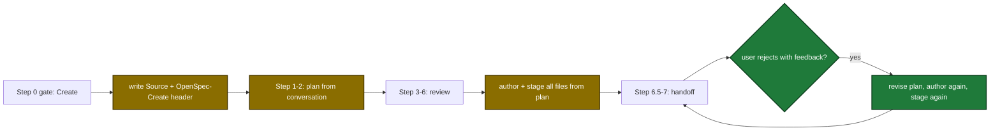
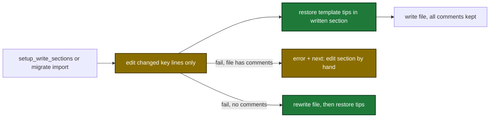

# Proposal: setup-help-comments-plan-late-openspec

## Why

- Problem: setup shows one short sentence per option, each setup write deletes the tip comments of the written section, and the plan Create path writes OpenSpec files before questions and review.
- Evidence: `internal/tools/setup.go:32-58` (no example field), `internal/config/splice.go:174-244` (whole-section encode), `internal/config/config.go:917-922` (whole-file rewrite on splice failure), `plugins/sdlc/skills/plan/SKILL.md:199-220` (Step 0 authoring).
- Why now: the user reported all three defects in one request. Discovery confirmed each defect in the code.

## What Changes

| Area | Before | After |
|---|---|---|
| Setup option help | One `description` per option | `description` plus `examples`. `setup_prepare` input `explain` returns details and examples for one option |
| Setup skill | Prints the description | Prints the examples. Calls `explain` when the user asks what an option means, then asks the same question again |
| Config section write | Encodes the whole section again. Comments inside the section are lost | Edits only the lines of changed keys. Every comment line stays |
| **BREAKING** Config write that cannot be spliced | Whole-file rewrite, all comments lost, warning | Refused when the file has a comment line. `errors` and `next` name the section to edit by hand |
| Template tips | Lost tips stay lost | Each write restores missing template tips inside the written section |
| `migrate` `import` | Silent whole-file rewrite fallback | Same key-level writer. `DomainError` when a rewrite would delete comments |
| Templates | About 20 options have no tip | Each schema option has a tip. Optional options are commented examples |
| `ship.rebase` schema | `true`, `false`, `"prompt"` | `true`, `false`, `"auto"`, `"skip"`, `"prompt"` |
| Plan Create path | Authors and stages files in Step 0 | Records the choice in Step 0. Authors and stages at the end of Step 6 from the reviewed plan. Authors again after a rejected handoff |

Plan Create path after the change:

Config section write after the change:

## Capabilities

### New Capabilities

None.

### Modified Capabilities

- `skill-plan`: the Create path authors OpenSpec files at the end of Step 6 and again after a rejected handoff.
- `tool-setup-write-sections`: key-level edits, comment refusal, tip restore, new `next` output.
- `tool-setup-prepare`: new `explain` input, `explanation` and `next` output, `examples` per field.
- `skill-setup`: shows examples and explains an option on request.
- `tool-migrate`: `import` keeps comments and returns a `DomainError` instead of a comment-deleting rewrite.

## Impact

| Path | Kind | Change |
|---|---|---|
| `internal/config/splice.go` | MCP tool | Key-level edit, commented-header insert |
| `internal/config/config.go` | MCP tool | Refuse rewrite when comments exist, tip restore call |
| `internal/config/tips.go` | MCP tool | New `RestoreTips` |
| `internal/setupmeta/sections.go` | MCP tool | `Details` and `Examples` per field |
| `internal/tools/setup.go` | MCP tool | `explain` input, `examples`, `explanation`, `next` |
| `internal/tools/setup_write.go` | MCP tool | `next` field, new warning text |
| `internal/tools/migrate.go` | MCP tool | `DomainError` for the comment refusal |
| `plugins/sdlc/templates/config.toml` | template | Tips for each option |
| `plugins/sdlc/templates/local.toml` | template | Tips for each option, rebase values |
| `plugins/sdlc/schemas/sdlc-local.schema.json` | schema | `ship.rebase` accepts five values |
| `plugins/sdlc/skills/setup/SKILL.md` | skill | Examples display, explain rule |
| `plugins/sdlc/skills/plan/SKILL.md` | skill | Create-flow authoring at end of Step 6, rejected-handoff rule |
| `docs/skills/setup.md` | doc | Explain behavior |
| `docs/skills/plan.md` | doc | Gate A bullet |
| `docs/plan-architecture.md` | doc | OpenSpec staging intro, guardrails table row |
