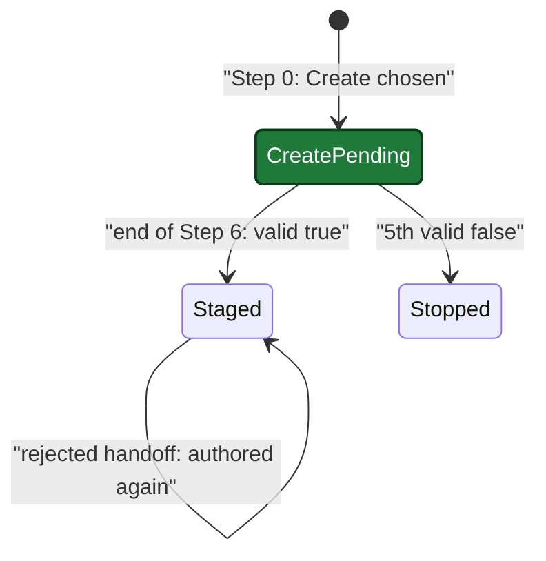

## MODIFIED Requirements

### Requirement: OpenSpec gate check
When `openspec/config.yaml` exists and neither `--spec` nor a path into `openspec/changes/` was given, the skill SHALL classify the request before planning.

| Request | Action |
|---|---|
| Non-functional (refactor, config, docs, CI, deps, test-only) | Print ``OpenSpec detected — pass `--spec` to include spec context in planning.`` and continue without OpenSpec; no question |
| Functional, an active change matches the branch | Treat as `--spec <match>` and load that change |
| Functional, no match | AskUserQuestion with 3 options (below) |

| Option | Effect |
|---|---|
| 1. Create OpenSpec change (default) | Record the choice in Step 0. Author and stage the change artifacts from the reviewed plan at the end of Step 6 (see "OpenSpec artifact staging"). `--auto` takes this option without asking. |
| 2. Use existing change | List active changes from `openspec list --json`; load the chosen one |
| 3. Skip OpenSpec | Plan without OpenSpec; ship skips its OpenSpec steps with a reason |

- The question restates what OpenSpec is and what each option costs, per the decision-framing rule.
- No option tells the user to leave plan and run the CLI by hand.

#### Scenario: Functional change, user picks option 1
- **WHEN** the gate asks and the user selects "Create OpenSpec change" for `add-widget`
- **THEN** the plan header gets `**Source:** openspec/changes/add-widget/` and `**OpenSpec-Create:** add-widget`
- **AND** the skill calls no `openspec_*` action in Step 0

#### Scenario: Non-functional change
- **WHEN** the request is a refactor and no `--spec` was given
- **THEN** the skill prints ``OpenSpec detected — pass `--spec` to include spec context in planning.``
- **AND** it does not call AskUserQuestion

### Requirement: OpenSpec artifact staging
When the user picks **Create OpenSpec change**, the skill SHALL author each artifact at the end of Step 6 from the reviewed plan file, in the order of `artifacts` returned by `plan_support({action:"openspec_instructions"})`, using each artifact's `template`, `instruction`, `context`, and `rules` from that result as the template source (not the OpenSpec CLI directly), and SHALL save them only through `plan_support({action:"openspec_stage"})`.

- Step 0 writes only the `**Source:** openspec/changes/<name>/` and `**OpenSpec-Create:** <name>` header lines.
- Authoring runs once, right before Step 6.5, on every path that reaches Step 6.5.
- The skill never writes under `openspec/` and never runs `openspec new change` itself, in plan mode or normal mode.
- `context` and `rules` constrain the content; they are not copied into the artifact.
- When `openspec_stage` returns `valid: false`, the skill fixes the artifacts and stages again, at most 5 times, then shows the CLI output and stops.
- On `valid: true`, the `**OpenSpec-Create:**` line becomes `**OpenSpec-Staging:** .sdlc-v2/openspec-staging/<name>/`. The `**Source:**` line stays.
- Before authoring, the `## OpenSpec Appendix` holds `[TBD — authored at the end of Step 6]`. After authoring, it holds only the link to the staging dir and the requirement-to-task table; it never holds spec content.

Plan header states on the Create path:

#### Scenario: Plan mode
- **WHEN** plan mode is active and the user picks **Create OpenSpec change** for `add-widget`
- **THEN** the only files written are the plan file and files under `.sdlc-v2/openspec-staging/add-widget/`

#### Scenario: Validation keeps failing
- **WHEN** `openspec_stage` returns `valid: false` five times in a row
- **THEN** the skill shows the last CLI output and stops without a plan handoff

#### Scenario: Nothing staged before review
- **WHEN** Step 0 records **Create OpenSpec change** for `add-widget`
- **THEN** `.sdlc-v2/openspec-staging/add-widget/` is not written before Step 6 ends

#### Scenario: Review fix reaches the specs
- **WHEN** a Step 6 fix adds a requirement to the plan
- **THEN** the staged delta spec files hold that requirement
- **AND** the staged `tasks.md` lists every final plan task

### Requirement: OpenSpec artifacts follow plan guardrails
The skill SHALL apply the active plan guardrails to OpenSpec artifacts before the guardrail lane runs.
- Create: the skill SHALL treat `guardrails` from `openspec_instructions` as constraints when it authors
  `design` and `tasks` at the end of Step 6. The staged `tasks.md` SHALL list one checkbox entry per final
  plan task, in plan order.
- Existing change: Gate A SHALL receive the guardrails. A task or design decision that conflicts with an
  `error` guardrail is a `WARNING` finding; with a `warning` guardrail, a `SUGGESTION`. Guardrail findings
  never make the verdict `CRITICAL`.

#### Scenario: Create flow authors tasks from the final plan
- **WHEN** the guardrail lane splits plan task 3 into two tasks
- **THEN** the staged `tasks.md` lists both tasks

#### Scenario: Create flow re-stages tasks
- **WHEN** the guardrail lane splits plan task 3 into two tasks
- **THEN** the staged `tasks.md` lists both tasks and `stage.json` has a new `validatedAt`

#### Scenario: Existing change breaks a guardrail
- **WHEN** `tasks.md` adds a dependency and guardrail `no-new-deps` (severity `error`) is active
- **THEN** Gate A returns a `WARNING` naming `no-new-deps` and the task line
- **AND** the plan lists it under `## Intake Audit Caveats`

## ADDED Requirements

### Requirement: Create flow resume by header line
On a resume, the skill SHALL read the Create state from the plan header line and SHALL NOT ask the OpenSpec gate question again when the header has an `**OpenSpec-Create:**` or `**OpenSpec-Staging:**` line.

| Checkpoint step | Header line | Action |
|---|---|---|
| before `6.5` | either line | Author nothing now; authoring runs at the end of Step 6 |
| `6.5` or later | `**OpenSpec-Staging:**` | Stage the files on disk again with all files; do not author again |
| `6.5` or later | `**OpenSpec-Create:**` | Run the end-of-Step-6 authoring once |
| any | neither line | Ask the gate question again at step 0 |

#### Scenario: Resume after authoring
- **WHEN** the session resumes at step `6.6` and the header has `**OpenSpec-Staging:** .sdlc-v2/openspec-staging/add-widget/`
- **THEN** the skill calls `openspec_stage` once with every file from that directory except `stage.json`
- **AND** it does not call `openspec_instructions`

#### Scenario: Resume before authoring
- **WHEN** the session resumes at step `3` and the header has `**OpenSpec-Create:** add-widget`
- **THEN** the skill does not ask the gate question
- **AND** it stages nothing before Step 6 ends

### Requirement: OpenSpec files authored again after rejected handoff
When the user rejects the plan-mode handoff with feedback and the plan header has an `**OpenSpec-Staging:**` line, the skill SHALL change the plan for the feedback, author all OpenSpec files again from the changed plan file, and stage them with all files before the next handoff.

- The skill reads and writes no plan run state on this path. It makes no `plan_mark` call and no `evidence_record` call.
- It calls `links_validate` and `validate` with action `plan_format` and `final: true` before the next ExitPlanMode.
- The `openspec_stage` attempt counter starts at 0, with the same 5-attempt rule.
- The `## OpenSpec Appendix` table is replaced in full from the new files.

#### Scenario: Feedback changes a requirement
- **WHEN** the user rejects ExitPlanMode with feedback that removes a plan task
- **THEN** the staged `tasks.md` no longer lists that task
- **AND** the skill calls ExitPlanMode again

#### Scenario: Plan without staging
- **WHEN** the user rejects ExitPlanMode and the plan header has no `**OpenSpec-Staging:**` line
- **THEN** the skill calls no `openspec_*` action
