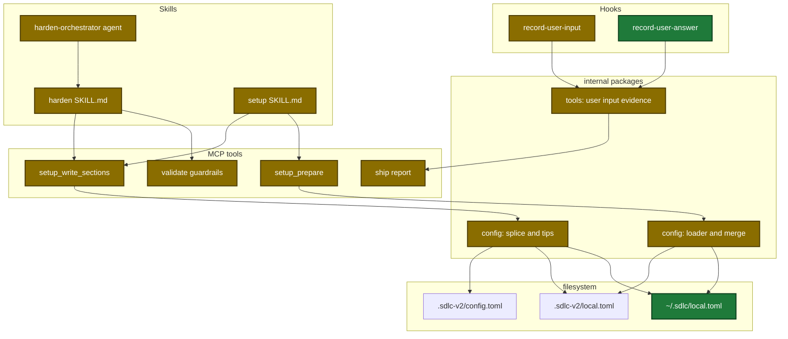
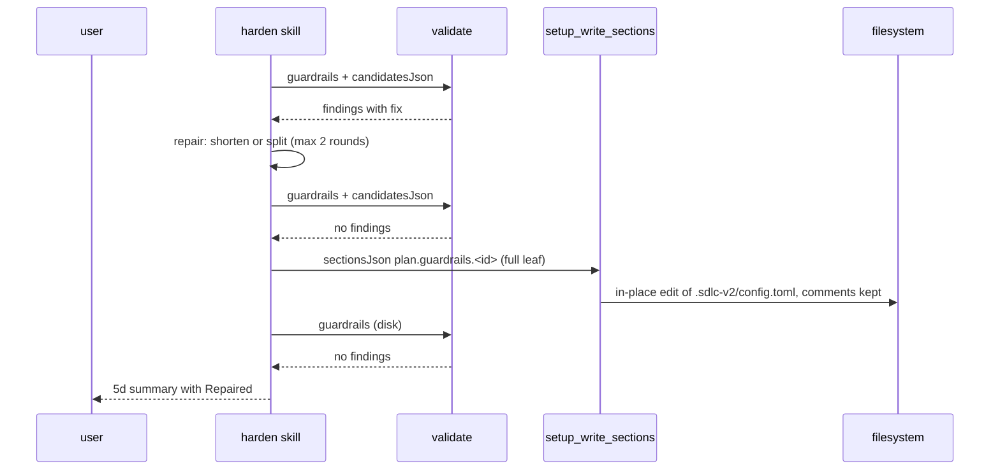
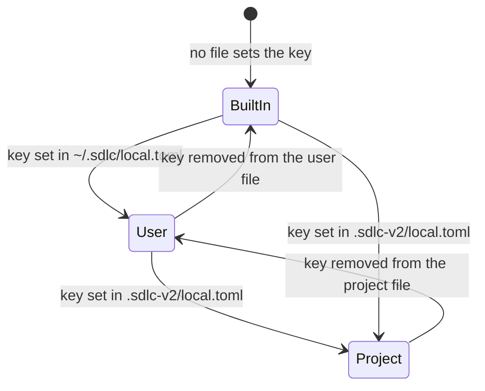

# Design

## Context

- Motivation: see proposal.md - Why.
- All readers of personal settings go through one package (`internal/config`). One merged loader covers every reader.
- The comment-safe write (`internal/config/splice.go`) exists in the code, but release 0.3.2 does not have it. This change closes its gaps. It does not add a second writer.
- The prompt hook gets every injected turn through the same event as typed text. The report reads at most 100 entries, so notices push out real prompts.

## Goals / Non-Goals

**Goals:**
- Keep mechanical work (classify, merge, check, write) in Go. Skills keep the judgment: guardrail repair and the save-target question.
- No new MCP tool. Extend `validate`, `setup_write_sections`, and `setup_prepare`.

**Non-Goals:**
- No release or version bump.
- No migration or version stamp for the user file. Moved-key migrations act only on the project file.
- No update of an old tip above a key that already has a comment.
- No keep of comment lines inside a multi-line value when the value changes.
- No change to the harden step inside ship.

## Architecture

Touched parts, grouped by layer:



## Runtime flow

Harden applies one guardrail proposal:



## Persisted state

Where one local key gets its value:



Template change (`plugins/sdlc/templates/local.toml`):

```diff
 [ship]
 # Auto-run full pipeline without confirmation prompts.
-auto = true
+# auto = false
-steps = ["execute", "commit", "review", "harden", "pr", "verify-pipeline"]
+# steps = ["execute", "commit", "review", "archive-openspec", "pr", "learnings-commit"]
-quick = ["execute", "commit", "review"]
+# No built-in default: when unset, --quick has no steps to run.
+# quick = ["execute", "commit", "review"]
```

Every other `[ship]` key keeps its value and becomes a commented example.

## Data contracts

| Struct | Field | Type | Encoding | Example |
|---|---|---|---|---|
| `ValidateIn` | `candidatesJson` | string | JSON array | `[{"id":"dry","description":"…","severity":"error"}]` |
| `SetupWriteSectionsIn` | `target` | string (enum) | plain text | `user` |
| `SetupPrepareOut` | `userConfigPath` | string | plain text | `/Users/me/.sdlc/local.toml` |
| `SetupPrepareOut` | `localValues` | map | JSON object | `{"communication-style":{"values":{"audience":"technical"},"sources":{"audience":"user"}}}` |
| `sectionRow` | `defaultTarget` | string | plain text | `user` |
| `UserInputEntry` | `kind` | string | plain text | `answer` |

## Decisions

| Decision | Chosen | Rejected alternatives | Reason |
|---|---|---|---|
| Where to filter notices | One classifier used by the hook and the report | Filter only in the report | The 100-entry window fills with notices |
| Harden apply order | Check in memory, repair, write once | Write, check, revert | Revert deletes the learned rule |
| Harden write path | `setup_write_sections` | Plain file edit | Keeps comments. No new tool |
| TOML writer | Keep the in-place splice | New TOML library | No Go TOML library keeps comments on a full rewrite |
| List merge | Project list replaces the user list | Append lists | With append, a project cannot remove a user entry |
| User file path | `~/.sdlc/local.toml`, `SDLC_USER_CONFIG` overrides | XDG path | User choice. The env var also isolates tests |
| Template `[ship]` keys | Commented examples with built-in defaults | Keep live keys | Live keys hide the user file |

## Risks / Trade-offs

| Risk | Impact | Mitigation |
|---|---|---|
| A bad merge gives wrong values to every skill | High | Table tests: user only, project only, both, nested, list replace |
| Tests read the real user file of the developer | Wrong test results | `TestMain` sets `SDLC_USER_CONFIG` to an empty temp path in each package that reads settings |
| The splice uncomments the wrong line | Config damage | Never match inside a multi-line value. Decode check after each write; on mismatch the write fails |
| New projects lose `harden` and `verify-pipeline` from default steps | Different ship pipeline | Documented in getting-started. Set once in the user file |
| Answer payload location is not pinned by a fixture | No answers recorded | Hook reads `tool_input.answers`, then `tool_response.answers`. Manual check after deploy |

## Migration Plan

- No data migration. A project with no user file behaves as before.
- Rollback: revert the commit. The user file is then ignored, and the project file still works.
