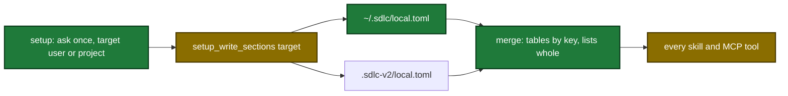

# Proposal

## Why

- Four plugin paths trust their input too much or keep too little of it: the ship report, harden, config writes, and personal settings.
- Evidence:
  - `tmp/ship-20261005T212535-report.md` lists 94 "prompts", and 92 of them are agent notices. Text after an editor tag is hidden. Question answers are not recorded.
  - Harden reverts a new guardrail when `validate` finds a description over 1024 bytes. The learned rule is lost.
  - Setup edits remove the tip comments of `local.toml`.
  - Each new project starts with no personal settings, because only `.sdlc-v2/local.toml` holds them.
- Why now: the user reported all four in one session. Each one loses user data on every run.

## What Changes

| Area | Before | After |
|---|---|---|
| Prompt hook | Records every injected turn as user input | Drops agent and editor notices. Strips context envelopes. Stores `kind: prompt` |
| Question answers | Not recorded | New PostToolUse hook `record-user-answer` stores `kind: answer` entries |
| Ship report User input | First line only, notices counted | Kind column, full flat text up to 500 runes, `prompts N · answers M` |
| `validate` guardrails | Reads the file on disk only | New `candidatesJson` input checks proposed entries in memory. Each finding has a `fix` |
| Harden Step 5a | Edit, validate, revert on any finding | Check, repair (shorten or split, max 2 rounds), write through `setup_write_sections`, revert only as the last step |
| Config write | A new key adds a new line below the commented example | A new key replaces its commented example and keeps the tip. Tip restore covers the whole file |
| Personal settings | Only `.sdlc-v2/local.toml` | `~/.sdlc/local.toml` (or `$SDLC_USER_CONFIG`) merged under the project file, key by key |
| `setup_write_sections` | Project file only | New `target` input: `project` (default) or `user` |
| `setup_prepare` | No local values | `localValues`, `userConfigPath`, `sections[].defaultTarget` |
| Setup skill | Reads `local.toml` directly | Uses `localValues`. Asks once per run where to save |
| `local.toml` template | Live `[ship]` keys | **BREAKING** for new projects only: every `[ship]` key is a commented example with the built-in default (`auto = false`, steps without `harden` and `verify-pipeline`) |

Flow after the change (personal settings load and setup save):

## Capabilities

### New Capabilities
- `local-config-layering`: the user-level personal settings file, its path rules, the merge with the project file, and its error messages.

### Modified Capabilities
- `hook-record-user-input`: drop injected turns, strip envelopes, record question answers.
- `tool-ship-state`: User input section layout of the run report.
- `tool-validate`: `candidatesJson`, byte wording, `fix` on guardrail findings.
- `skill-harden`: check and repair before write, write through `setup_write_sections`.
- `tool-setup-write-sections`: uncomment examples in place, whole-file tip restore, `target` input.
- `tool-setup-prepare`: `localValues`, `userConfigPath`, `defaultTarget`.
- `skill-setup`: save-target question, local values from `setup_prepare`.
- `plan-writing-style`: `[style]` and `[planStyle]` load from the merged files.
- `tool-setup-init`: `[ship]` keys of the template are commented examples.
- `tool-pr-prepare`: `[github]` warnings name both personal settings files.
- `tool-ship-prepare`: the `reviewThreshold` error names both personal settings files.

## Impact

| Path | Kind | Change |
|---|---|---|
| `internal/tools/user_input_evidence.go` | MCP tool helper | Prompt classifier, entry `kind` |
| `internal/hooks/user_input_record.go` | hook | Drop and clean prompts |
| `internal/hooks/user_input_answer.go` | hook | New `record-user-answer` handler |
| `plugins/sdlc/hooks/hooks.json` | hook | PostToolUse matcher `AskUserQuestion` |
| `internal/tools/ship_report.go` | MCP tool | User input section |
| `internal/tools/validators.go` | MCP tool | `candidatesJson`, `fix`, byte wording |
| `plugins/sdlc/agents/harden-orchestrator.md` | skill (agent) | `guardrails[]`, length self-check |
| `plugins/sdlc/skills/harden/SKILL.md` | skill | Step 5a repair flow |
| `internal/config/splice.go`, `internal/config/tips.go` | MCP tool helper | Uncomment in place, whole-file tips |
| `internal/config/config.go` | MCP tool helper | User file, merge, label |
| `plugins/sdlc/templates/local.toml` | template | Commented `[ship]` keys |
| `internal/tools/setup_write.go`, `internal/tools/setup.go`, `internal/setupmeta/sections.go` | MCP tool | `target`, `localValues`, `defaultTarget` |
| `internal/tools/review.go`, `internal/tools/pr.go`, `internal/tools/ship.go` | MCP tool | Messages name both files |
| `plugins/sdlc/skills/setup/SKILL.md`, `internal/skillcheck/skillcheck_worktree_test.go` | skill | Save-target question, exception re-key |
| `docs/getting-started.md`, `docs/plan-architecture.md`, `docs/skills/*.md`, `plugins/sdlc/skills/ship/config-format.md`, `README.md` | doc | User file, merge rule |
