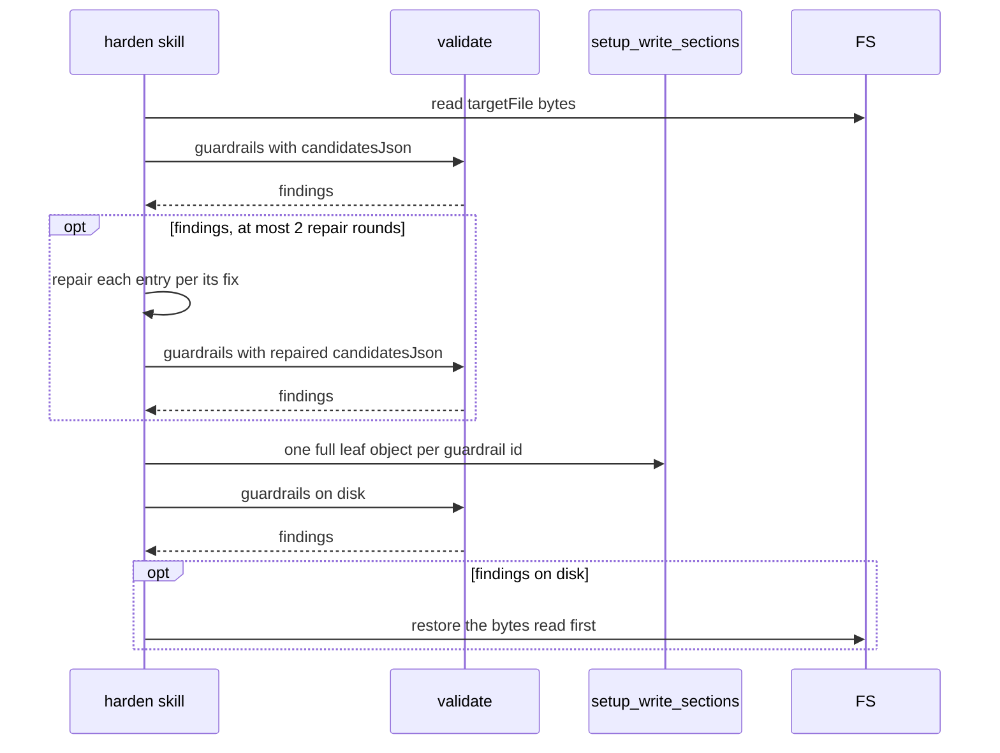

# Spec Delta

## MODIFIED Requirements

### Requirement: Write, validate, revert
The skill SHALL validate each written proposal right after the write and SHALL restore the previous file content when validation reports findings. For a `plan-guardrails` or `execute-guardrails` proposal, the skill SHALL first check the proposed entries in memory, repair them on findings, and SHALL write only after a clean check.

| `surface` | Check before the write | Write | Validation call after the write |
|---|---|---|---|
| `plan-guardrails` / `execute-guardrails` | `validate({action: "guardrails", section: "plan" or "execute", activeWorktree: true, candidatesJson: <proposal.guardrails>})` | `setup_write_sections({sectionsJson: {"<section>.guardrails.<id>": {description, severity}}})`, one full leaf object per entry | `validate({action: "guardrails", section: "plan" or "execute", activeWorktree: true})` |
| `review-dimensions` | none | Edit or Write on `targetFile` | `validate({action: "dimensions"})` |
| `copilot-instructions` | none | Edit or Write on `targetFile` | none |

Guardrail branch of the apply step:



- Repair: shorten the description to 1024 bytes or less, or split the rule into independent guardrails `<id>-1`, `<id>-2`, each a complete rule. The repair follows each finding's `fix`.
- At most 2 repair rounds, with and without `--auto`.
- After 2 failed repair rounds nothing is written. Without `--auto`, `AskUserQuestion` offers **retry** or **cancel**. With `--auto`, the proposal is listed under `Reverted` with the first finding, and the next proposal follows.
- Guardrail writes never use the Edit or Write tools on `.sdlc-v2/config.toml`, so the file's comments and tips stay.
- The restore to the bytes read at the start of the apply step is the last step, only after a clean check and a write.
- A rerun repeats the check and writes the same leaf objects, with no duplicate entry.
- Without `--auto`: after the revert, `AskUserQuestion` offers **retry** (user adjusts the patch) or **cancel** (skip this proposal).
- With `--auto`: revert, no retry, list under `Reverted` with the first finding, continue.
- A `consolidate` proposal replaces the fields of the guardrail with the id cited in `patch`; it never removes fields or lowers severity.
- A `consolidate` whose guardrail id does not exist is malformed: shown to the user, or under `--auto` listed as `malformed consolidate` and skipped.

#### Scenario: New guardrail fails validation
- **WHEN** an applied `plan-guardrails` proposal passed the check before the write
- **AND** the `validate` call after the write returns findings
- **THEN** `.sdlc-v2/config.toml` is restored to its pre-write content
- **AND** the findings are shown to the user

#### Scenario: Long guardrail split before the write
- **WHEN** a `plan-guardrails` proposal has entry `dry` with a 1310-byte description
- **AND** `validate` with `candidatesJson` returns the finding `dry: description exceeds 1024 bytes (1310 bytes, 286 over)`
- **THEN** the skill replaces `dry` with `dry-1` and `dry-2`, each a complete rule of 1024 bytes or less
- **AND** checks again with `candidatesJson` before any write
- **AND** writes `plan.guardrails.dry-1` and `plan.guardrails.dry-2` through `setup_write_sections`

#### Scenario: Repair fails twice under --auto
- **WHEN** `--auto` is set
- **AND** the check still returns findings after 2 repair rounds
- **THEN** `.sdlc-v2/config.toml` is not written
- **AND** the proposal is listed under `Reverted` with the first finding
- **AND** the skill continues with the next proposal

#### Scenario: Two guardrails written in two calls
- **WHEN** the skill writes `plan.guardrails.a`, then `plan.guardrails.b`, in two `setup_write_sections` calls
- **THEN** both `a` and `b` exist in `.sdlc-v2/config.toml` after the second call

#### Scenario: Review dimension keeps write-then-validate
- **WHEN** a `review-dimensions` proposal is applied
- **THEN** the skill writes `targetFile` first and then calls `validate({action: "dimensions"})`

### Requirement: Auto summary
Under `--auto` the skill SHALL print one summary block as its output, after the ambiguous offer step and on every early exit (empty proposals, mirror halt, plugin-defect route).

```text
harden --auto: {A} auto-accepted, {R} reverted, {S} skipped, {U} not processed
Auto-accepted:
Repaired:
Reverted (validation failed, file restored):
Skipped:
Not processed (5b halt):
Not filed (needs a human — invoke error-report manually):
```

- The header line is always printed; empty sections are omitted.
- A reverted proposal never appears under `Auto-accepted`.
- `Repaired` lists each guardrail repaired before its write, with id, method and reason, e.g. `dry → split into dry-1, dry-2 (description 1310 bytes)`.

#### Scenario: One accepted, one reverted
- **WHEN** under `--auto` proposal 1 passes validation and proposal 2 fails it
- **THEN** the header reads `harden --auto: 1 auto-accepted, 1 reverted, 0 skipped, 0 not processed`

#### Scenario: Repaired guardrail listed
- **WHEN** under `--auto` guardrail `dry` was split into `dry-1` and `dry-2` before its write
- **THEN** the summary has a `Repaired:` section with the line `dry → split into dry-1, dry-2 (description 1310 bytes)`

## ADDED Requirements

### Requirement: Guardrail proposals carry structured entries
The `sdlc:harden-orchestrator` subagent SHALL add `guardrails: [{id, description, severity}]` to every `plan-guardrails` and `execute-guardrails` proposal, with each `description` 1024 bytes or less.

- A rule that needs more text is split into independent guardrails with kebab-case ids `<base-id>-<n>`; each part is a complete rule that reads alone.
- `patch` stays in the proposal for display; the skill writes the `guardrails[]` entries.

#### Scenario: Guardrail proposal shape
- **WHEN** the subagent proposes a `plan-guardrails` `consolidate` on id `dry`
- **THEN** the proposal has `guardrails` with one entry `{id: "dry", description: "...", severity: "error"}`
- **AND** the proposal still has `patch`

#### Scenario: Long rule split by the subagent
- **WHEN** one rule needs more than 1024 bytes of description
- **THEN** `guardrails` holds `dry-1` and `dry-2`
- **AND** each description is 1024 bytes or less
