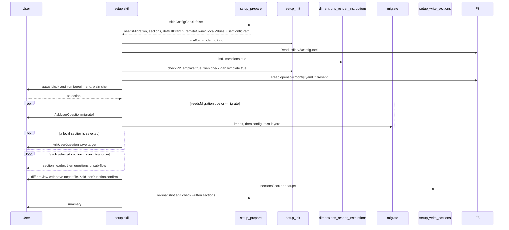

# Spec Delta

## MODIFIED Requirements

### Requirement: Main flow and pre-flight order
The skill SHALL call `setup_prepare({ skipConfigCheck: false })` first, then `setup_init({})` once, then take a config snapshot, before it shows the menu or asks any question.

Main `/setup` flow without direct-entry flags:

Snapshot contents:

| Item | Source |
|---|---|
| `projectConfig` | Read `.sdlc-v2/config.toml` (absent = `{}`) |
| `localValues`, `userConfigPath` | `setup_prepare` output; the skill does not read `.sdlc-v2/local.toml` or the user file itself |
| Installed dimension count and names | `dimensions_render_instructions({ listDimensions: true })` |
| PR template exists | `setup_init({ checkPRTemplate: true })` |
| Plan template exists | `setup_init({ checkPlanTemplate: true })` |
| Managed-block version | Line `# BEGIN MANAGED BY sdlc-v2 (v<N>)` in `openspec/config.yaml` — the same begin marker `openspec_enrich` writes |

Version detection for the `version` section:

- First existing file in this order sets `versionFile` and `fileType`: `package.json`, `Cargo.toml`, `pyproject.toml`, `pubspec.yaml`, `plugin.json`.
- `tagPrefix` is the common leading non-digit part of recent `git tag --list` tags; default `v` when there are no tags or no common prefix.

#### Scenario: Migration flag read before scaffold
- **WHEN** `.sdlc-v2/config.json` exists without `config.toml`
- **THEN** the skill receives `needsMigration: true` from `setup_prepare`
- **AND** only then calls `setup_init({})`

#### Scenario: No version file
- **WHEN** none of the five version files exist
- **AND** the repo has no tags
- **THEN** no `versionFile` is detected
- **AND** `tagPrefix` is `v`

#### Scenario: Local values from setup_prepare
- **WHEN** the skill takes the snapshot
- **THEN** it gets the local values from `localValues` of `setup_prepare`
- **AND** it does not read `.sdlc-v2/local.toml`

### Requirement: Row state
The skill SHALL compute each row's state itself from the snapshot; no tool returns it.

| Section kind | `set` when |
|---|---|
| `review-dimensions` | Installed dimension count > 0 |
| `pr-template`, `plan-template` | The template file exists |
| `openspec-block` | A managed-block line was found |
| `configFile` is `.sdlc-v2/config.toml` | `configPath` resolves in `projectConfig`; an array or a table must have at least one entry |
| `configFile` is `.sdlc-v2/local.toml` (`ship`, `review`, `received-review`, `plan-style`, `github`, `automation`) | `localValues[<section id>].values` is not empty |

- Every other case is `not-set`.

#### Scenario: Empty guardrails table
- **WHEN** `plan.guardrails` resolves to a table with no named guardrail tables
- **THEN** the `plan-guardrails` row is `not-set`

#### Scenario: Guardrail count in the summary
- **WHEN** `config.toml` has `[plan.guardrails.test-coverage-required]` and `[plan.guardrails.no-ci-bypass]`
- **THEN** the `plan-guardrails` row is `set`
- **AND** its summary is `2 configured`

#### Scenario: Managed block written by openspec_enrich
- **WHEN** `openspec_enrich` has written its block into `openspec/config.yaml`
- **AND** the file holds the line `# BEGIN MANAGED BY sdlc-v2 (v2)`
- **THEN** the `openspec-block` row is `set`
- **AND** the snapshot's managed-block version is `2`

#### Scenario: Local section set only in the user file
- **WHEN** `localValues.review.values` is `{scope: "diff"}` and `localValues.review.sources` is `{scope: "user"}`
- **THEN** the `review` row is `set`

### Requirement: Migration step
The skill SHALL run the migration step only when `needsMigration` is `true` or `--migrate` is passed, and SHALL ask before migrating.

- AskUserQuestion: `Legacy or outdated config files detected. Migrate to the current config format before proceeding?` Options `yes`, `no`.
- On `yes`: call `migrate` three times, in order, each with `dryRun: false`: `action: "import"`, then `action: "config"`, then `action: "layout"`.
- All three `result` values are shown to the user verbatim.
- The `import` action writes a legacy value when the destination key is missing or still holds the template default that `setup_init` wrote; a key the user changed is kept. The skill text says so and does not claim that legacy values are never imported.
- When the `import` result has `skippedKeys`, the skill shows each entry on its own line under `Legacy keys not imported:`.
- The `config` action only checks the schema version; its `result` is `up-to-date`. If it fails, the skill shows the error and stops.
- On `no`: skip migration; legacy files are left untouched.
- After migration, the skill re-calls `setup_prepare` (for `localValues`) and re-reads `.sdlc-v2/config.toml` only.

#### Scenario: Current config
- **WHEN** `needsMigration` is `false`
- **AND** `--migrate` is not passed
- **THEN** the skill calls no `migrate` action

#### Scenario: User accepts migration
- **WHEN** the user answers `yes`
- **THEN** the skill calls `migrate` with `import`, `config`, `layout` in that order
- **AND** the skill does not offer to delete legacy files

#### Scenario: Import skipped keys shown
- **WHEN** the `import` action returns `skippedKeys: [".sdlc-v2/config.toml: jira (already set)", ".sdlc-v2/config.toml: workspace", ".sdlc-v2/local.toml: version (not a section)"]`
- **THEN** the skill shows all three entries, one per line, under `Legacy keys not imported:`

### Requirement: Post-write check
After writing, the skill SHALL re-call `setup_prepare`, re-read `.sdlc-v2/config.toml`, and confirm every written section now has state `set`. It SHALL NOT show the summary while a written section reads `not-set`.

- Local sections are checked against `localValues` of the new `setup_prepare` result; the skill does not read `.sdlc-v2/local.toml` or the user file.

#### Scenario: Write did not land
- **WHEN** a written section still reads `not-set`
- **THEN** the skill warns the user
- **AND** offers to retry that section's write

#### Scenario: User-file write checked
- **WHEN** the skill wrote `review` with `target: "user"`
- **THEN** the re-called `setup_prepare` shows `localValues.review.sources` with `user` for each written key

## ADDED Requirements

### Requirement: Save target for personal settings
When at least one selected section has a `defaultTarget`, the skill SHALL ask `Where should setup save your personal settings?` once per run with AskUserQuestion, before the first local section.

| Option | `target` per local section |
|---|---|
| `Defaults per section (Recommended)` | the section's `defaultTarget` |
| `All to this project` | `project` |
| `All to user profile` | `user` |

- No local section selected: no question.
- The answer is not stored; a rerun asks again.

#### Scenario: One question for two local sections
- **WHEN** the user selects `review` and `communication-style`
- **THEN** the skill asks `Where should setup save your personal settings?` once

#### Scenario: No local section
- **WHEN** the user selects only `jira` and `commit`
- **THEN** the skill asks no save-target question

### Requirement: Local section writes pass the save target
The skill SHALL pass the chosen `target` on each `setup_write_sections` call that writes a local section, and SHALL pass no `target` for a project section.

- The diff preview prints the save target file above the rows of each local section.

#### Scenario: Defaults per section
- **WHEN** the user picks `Defaults per section (Recommended)` and configures `review` and `ship`
- **THEN** the skill writes `review` with `target: "user"`
- **AND** writes `ship` with `target: "project"`

#### Scenario: Project section has no target
- **WHEN** the user picks `All to user profile` and configures `jira`
- **THEN** the `setup_write_sections` call for `jira` has no `target`

#### Scenario: Diff preview names the file
- **WHEN** `review` is saved to the user file at `userConfigPath` `/home/a/.sdlc/local.toml`
- **THEN** the diff preview prints `/home/a/.sdlc/local.toml` above the `review` rows

### Requirement: Source badge for local sections
The status block SHALL show, on each `set` local section row, the source of its values from `localValues[<section id>].sources`: `(user)`, `(project)`, or `(user+project)`.

#### Scenario: Values from both files
- **WHEN** `localValues.review.sources` is `{scope: "user", maxDimensions: "project"}`
- **THEN** the `review` status row shows `(user+project)`

#### Scenario: Values from the user file only
- **WHEN** every key in `localValues["communication-style"].sources` is `user`
- **THEN** the `communication-style` status row shows `(user)`
