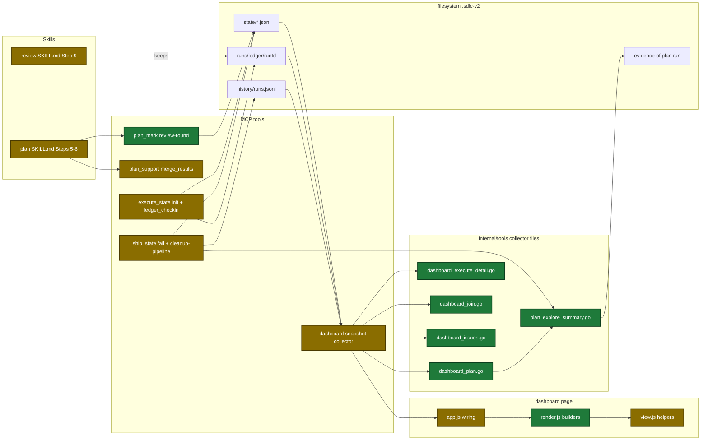
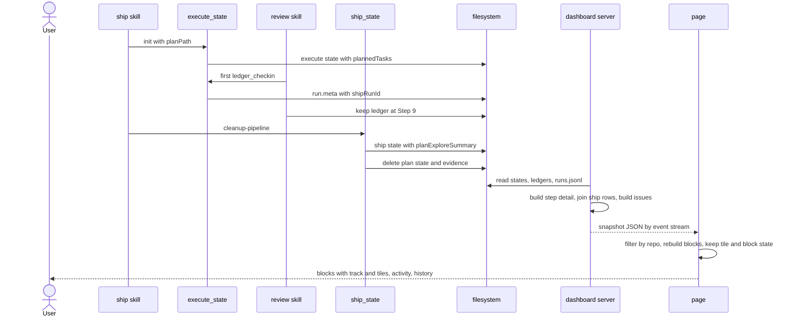
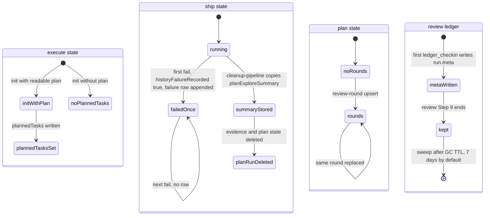

# Design

## Context

- Motivation: see proposal.md - Why.
- The dashboard collector reads ship, execute, and plan state files and review ledger folders. It gives each step only a name and a status (`internal/tools/dashboard_snapshot.go:59-154`).
- A started execute wave already stores task ids and names (`internal/tools/execute_state.go:2715-2731`). Waves that did not start have no names.
- Execute `init` already reads the plan file, and a heading parser exists (`internal/tools/validators.go:702-720`).
- Ship cleanup deletes the plan state and its evidence (`internal/tools/ship_state.go:2099-2120`). The explorer data is then lost.
- The plan review loop goes Step 5 → Step 6 → Step 5. It never returns to Step 3 (`plugins/sdlc/skills/plan/SKILL.md:887`).
- `merge_results` knows the blocking count but returns it only in a summary string (`internal/tools/plan_support.go:519-527`).
- Ship writes a history row only on success. A history row has no run id (`internal/history/history.go:32-45`).
- The page today has a left rail of repo groups and one detail pane. `tmp/dashboard-redesign/requirements-v2.md` (N1–N5) replaces both.

## Goals / Non-Goals

**Goals:**
- Each new state write runs inside an MCP tool, except the review round record, which only the plan skill can know.
- Each read area gets its own collector file, so later tasks edit different files.
- Every snapshot list is `[]`, never `null`. Every snapshot string reaches the page as plain text.
- Node tests reach the page builders with a fake document. No new dependency.
- Each block keeps its collapsed state, closed tiles, and selected station across snapshots. The page keeps the tab, the repo filter, the scroll position, and the focus.

**Non-Goals:**
- A harden cluster list and the `partial` outcome (Q3, D6).
- Clickable history rows.
- A new Taskfile Node task. A CI edit.
- A session id write in any skill. A browser test harness.
- A failure row from `complete-step` with outcome `failure`. No skill sends it.
- A failure row for plan runs.
- A masonry tile layout. A page design below 1000 px (F2 is still open).

## Architecture

The parts that change and how data moves between them.



## Main runtime flow

A ship run with a review, from the state writes to the page.



## Persisted state

The new state keys and when each one is written.



## Data contracts

New snapshot fields. Every slice is `[]` when empty. `omitempty` fields are absent, never `null`.

```go
type DashboardPipeline struct {
    // existing fields unchanged
    SessionID   string `json:"sessionId"`             // "" when unknown
    CommitWaves *bool  `json:"commitWaves,omitempty"` // execute and ship only
}
type DashboardStep struct {
    Name   string               `json:"name"`
    Status string               `json:"status"`
    Detail *DashboardStepDetail `json:"detail,omitempty"`
}
type DashboardIssue struct {
    Source   string `json:"source"`   // step | wave | review | task | state | pipeline
    Severity string `json:"severity"` // critical | high | medium | low | info
    Text     string `json:"text"`     // reason only
    File     string `json:"file"`
    Line     string `json:"line"`     // "" | "42" | "12-14"
    Ref      string `json:"ref"`      // step, wave, dimension, or task
}
type DashboardStepDetail struct {
    Kind         string                 `json:"kind"` // waves | dimensions | explorers | rounds | findings
    Waves        []DashboardWave        `json:"waves,omitempty"`
    Queued       []DashboardTask        `json:"queued,omitempty"`
    Dimensions   []DashboardDimension   `json:"dimensions,omitempty"`
    ReviewTotals *DashboardReviewTotals `json:"reviewTotals,omitempty"`
    Explorers    []DashboardExplorer    `json:"explorers,omitempty"`
    Rounds       []DashboardRound       `json:"rounds,omitempty"`
    MaxRounds    int                    `json:"maxRounds,omitempty"`
    Findings     []DashboardReviewFinding `json:"findings,omitempty"` // text, severity, file, line
}
type DashboardReviewTotals struct {
    Found, Fixed, Deferred, Unaccounted int // json: found, fixed, deferred, unaccounted
}
type DashboardRepo struct {
    // existing fields unchanged
    History []DashboardRun `json:"history"` // 50 newest, never null
}
```

New state keys:

| Key | File | Type | Example |
|---|---|---|---|
| `plannedTasks` | execute state | array of `{id, name}` | `[{"id":"1","name":"Explorer summary builder"}]` |
| `reviewRounds` | plan state | array of `{round, mergedStatus, found, fixed, lenses}` | `[{"round":2,"mergedStatus":"Issues Found","found":4,"fixed":4,"lenses":[]}]` |
| `historyFailureRecorded` | ship state | boolean | `true` |
| `planExploreSummary` | ship state | array of `{name, status, total, top}` | `[{"name":"auth-flow","status":"done","total":12,"top":[]}]` |
| `run.meta` | `runs/ledger/<runId>/` | JSON file `{branch, startedAt, shipRunId?}` | `{"branch":"feat/x","startedAt":"2026-10-07T11:25:17Z"}` |

Page storage (browser `localStorage`, one viewer only):

| Key | Value | Example |
|---|---|---|
| `sdlc-dashboard-tab` | `pipelines`, `activity`, or `history` | `history` |
| `sdlc-dashboard-repo-filter` | JSON array of repo roots | `["/Users/me/repo"]` |

New tool output fields:

| Tool | Field | Type | Encoding | Example |
|---|---|---|---|---|
| `plan_support` `merge_results` | `blockingCount` | integer | JSON number | `3` |
| `ship_state` `fail` | `warnings` | string array | plain text | `["failure history row not written to .sdlc-v2/history/runs.jsonl: …"]` |
| `execute_state` `ledger_checkin` | `warnings` | string array | plain text | `["run.meta not written at …"]` |

## Decisions

| Decision | Chosen | Rejected alternatives | Reason |
|---|---|---|---|
| Where the explorer summary lives after ship cleanup (D4) | ship state `planExploreSummary` | plan state | ship cleanup deletes the plan state and its evidence |
| Review ledger lifetime (D5) | review Step 9 keeps it. The 7-day sweep removes it | delete at the end, a new GC | a finished ship keeps its dimension list. The sweeps exist |
| Failure row (D6) | `ship_state fail` writes one `failure` row for each run | a `partial` outcome, plan rows | nothing defines `partial`. A row has no run id |
| Session of a pipeline (D7) | the state id, else the newest session on the same branch | a skill write of the id | no skill passes the id today |
| Page script split (D8) | DOM builders in `render.js`, which takes the document. Node tests with a fake document | a DOM test library, untested `app.js` | a library is a new dependency |
| Names of planned tasks | execute `init` reads the plan headings | an execute skill change | `init` already reads the plan file |
| Review run meta | the first `ledger_checkin` writes `run.meta` | a `review_prepare` write | `review_prepare` is read-only |
| Round record | marker `review-round`, replaced by round number | append rows | a resume can send a round again |
| Found count | `merge_results` returns `blockingCount` | the skill counts issues | the skill does no arithmetic on free text |
| Severity | one map: `error` → `high`, `warning` → `medium`, other → `info`. Rank from `severityRank` | a second rank map | guardrail `dry` |
| Line type | string | integer | the ledger stores ranges such as `12-14` |
| Stalled text | `no update for 30+ min` | the real age in the text | a clock value changes the snapshot each minute |
| Order of read work | each read area gets its own file with a no-op stub first | one collector file | six tasks would edit one file |
| Detail kind | `detail.kind` names the tile type | the page infers the type from the first non-empty list | an empty list is absent in JSON, so `no findings` and `0 areas` need a kind |
| Page layout (N2, N4) | one feed of blocks for all repos, header tabs, one repo filter | a left rail with repo groups and one detail pane | the user sees all pipelines at once. Activity and History get the full width |
| Step detail (N1, N5) | every step with detail is an open `<details>` tile in a CSS grid | one detail pane for the selected step, a masonry layout | `<details>` gives keyboard support. A grid keeps every tile in place |
| Hash links (D9) | the page reads `#<pipeline id>[/<n>]`, `#activity`, `#history` | no hash | the user chose to ship hash links |
| Block default (v2 question 1) | unfinished blocks open, finished blocks collapsed | all open, all collapsed | the v2 recommendation. One constant changes it |

## Risks / Trade-offs

| Risk | Impact | Mitigation |
|---|---|---|
| A wrong join hides a real run from the feed | the user does not see a running execute or review run | one test for each row of the join rule table |
| A write bug in `fail` or `cleanup-pipeline` breaks a real ship run | the pipeline stops | the state that stops a repeat is written first. A later failure is a warning or a named reason. Seam tests for each failure branch |
| Kept review ledgers use disk space for 7 days | small JSON files stay | the existing sweeps remove them after the GC TTL |
| No sweep runs when no execute or ship run follows | the ledger folder stays | accepted: the folders are small |
| `app.js` wiring has no automated test | a wiring bug passes CI | a Go test checks the ids of `app.js` against `index.html`. User browser checks in waves 2 and 5 |
| The wave 1 commit has the old script on the new markup | the page fails on the first snapshot at that commit | the wave 1 gate does not load the page. Wave 2 replaces the script |
| Older runs have no new data | no tiles | the track shows the status of each step |
| A short open tile sits in a row with a tall tile | empty space inside the short tile | accepted (N5 known limit). A closed tile stays short |
| A snapshot rebuild loses user state | closed tiles reopen, the page jumps | state is kept by pipeline key and section key. The scroll and the focus are saved before the rebuild |

## Migration Plan

- No data migration. Every new state key is optional in its schema.
- Older runs show what they showed before.
- Rollback: revert the change. The old ship schema rejects `historyFailureRecorded` and `planExploreSummary`. Finish or remove an active ship state before the rollback.
