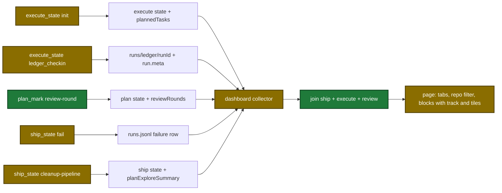

# Proposal

## Why

- The dashboard shows only the name and status of each step. The user cannot see the tasks of a wave, the commit of a wave, the findings of each review dimension, the plan explorers, or the plan review rounds.
- Evidence: `tmp/dashboard-redesign/requirements.md` lists 16 data needs (R1–R16) and 5 new state writes (W1–W5). The review skill deletes its ledger at the end of each run (`plugins/sdlc/skills/review/SKILL.md:487-502`). Ship cleanup deletes the plan evidence (`internal/tools/ship_state.go:2099-2120`).
- Why now: a page preview (`tmp/dashboard-redesign/index.html`) exists, all 10 open questions of the requirements file are closed, and `tmp/dashboard-redesign/requirements-v2.md` fixes the page layout (N1–N5).

## What Changes

| Area | Before | After |
|---|---|---|
| Execute step detail | wave name and status | waves with tasks, task status, and commit state. Planned tasks of waves that did not start show in a `queued` step |
| Review step detail | one rail row for each review run, issues as `file:line rationale` text | the ship block holds its review run. The review tile lists dimensions with finding counts and the totals found, fixed, deferred, unaccounted. A standalone review run has one findings tile for each finished dimension |
| Plan steps | 10 checkpoint steps | 5 stations: `setup`, `explore`, `draft`, `review`, `finalize`. Explore lists explorers. Review lists rounds |
| Ship block | ship, execute, and review runs show as 3 rail rows | 1 ship block with nested execute and review detail, and a `plan` station from the stored explorer summary |
| Issues | `text` holds location and reason | `text` holds the reason. `file`, `line`, `ref` hold the location. New sources: state issues, task errors, stalled runs |
| Run history | none | the 50 newest `runs.jsonl` rows. Ship `fail` writes one `failure` row |
| Review ledger | the review skill deletes it at the end | the review skill keeps it. The 7-day directory sweep removes it |
| Execute `init` | stores task ids | also stores task names from the plan headings |
| Ledger check-in | writes the worker file | the first check-in also writes `run.meta` (branch, start time, ship run id) |
| Plan review loop | no record of each round | `plan_mark` marker `review-round` stores each round. `merge_results` returns `blockingCount` |
| Page | a left rail of repo groups, one detail pane, enamel palette | new page "sdlc signal room": dark glass design, header tabs Pipelines, Activity, History, one repo filter, and one block for each pipeline with a station track and a grid of tiles |
| Page links | none | `#<pipeline id>`, `#<pipeline id>/<n>`, `#activity`, `#history` |

## Capabilities

### New Capabilities

None.

### Modified Capabilities

- `pipeline-dashboard`: step detail with a kind, ship joins, plan stations, review findings, structured issues, run history, pipeline session, new page with blocks, tiles, repo filter, and hash links.
- `skill-review`: the ledger stays after the run.
- `skill-plan`: the review loop records each round.
- `tool-plan-mark`: new marker `review-round`.
- `tool-plan-support`: `merge_results` returns `blockingCount`.
- `tool-execute-state`: `init` stores `plannedTasks`. The first `ledger_checkin` writes `run.meta`.
- `tool-ship-state`: `fail` writes a failure history row. `cleanup-pipeline` copies the explorer summary.

## Flow after the change

The data flow from pipeline state to the page after the change.

## Impact

| Path | Kind | Change |
|---|---|---|
| `internal/tools/dashboard_snapshot.go` | MCP tool | new snapshot types and fields, read seams |
| `internal/tools/dashboard_plan.go` | MCP tool | new file: 5 plan stations, explorers, rounds |
| `internal/tools/dashboard_execute_detail.go` | MCP tool | new file: waves, tasks, commit state |
| `internal/tools/dashboard_join.go` | MCP tool | new file: ship joins, review meta |
| `internal/tools/dashboard_issues.go` | MCP tool | new file: structured issues, severity map, review findings detail |
| `internal/tools/dashboard_activity.go` | MCP tool | history list |
| `internal/tools/plan_explore_summary.go` | MCP tool | new file: explorer summary builder |
| `internal/tools/execute_state.go` | MCP tool | `init` writes `plannedTasks`. `ledger_checkin` writes `run.meta` |
| `internal/tools/ship_state.go` | MCP tool | `fail` writes a failure row. `cleanup-pipeline` copies the explorer summary |
| `internal/tools/plan.go` | MCP tool | marker `review-round` |
| `internal/tools/plan_support.go` | MCP tool | `blockingCount`, status constants |
| `plugins/sdlc/schemas/execute-state.schema.json` | schema | optional `plannedTasks` |
| `plugins/sdlc/schemas/ship-state.schema.json` | schema | optional `historyFailureRecorded`, `planExploreSummary` |
| `plugins/sdlc/skills/review/SKILL.md` | skill | Step 9 keeps the ledger |
| `plugins/sdlc/skills/plan/SKILL.md` | skill | Steps 5 and 6 call `review-round` |
| `plugins/sdlc/skills/ship/SKILL.md` | skill | the `fail` and cleanup lines name the new writes |
| `plugins/sdlc/skills/plan/state-format.md`, `plugins/sdlc/skills/ship/state-format.md`, `plugins/sdlc/skills/execute/state-format.md` | doc | new state keys |
| `internal/dashboard/web/static/index.html`, `app.css`, `app.js`, `view.js`, `render.js` | dashboard page | new page. `render.js` is a new file |
| `internal/dashboard/web/testdata/view.test.cjs`, `snapshot.fixture.json` | test | Node tests with a fake document, shared fixture |
| `docs/dashboard.md`, `docs/plan-architecture.md` | doc | snapshot contract, page layout, ledger lifetime, marker table |
