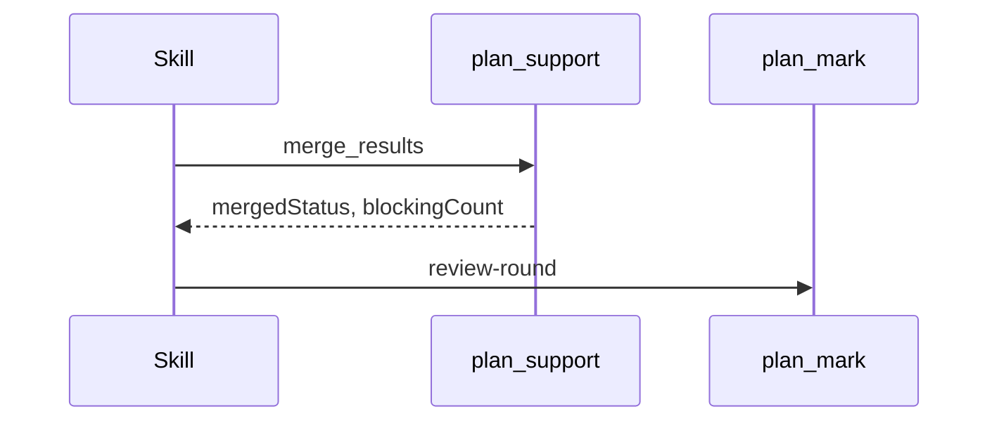

# Spec Delta

## ADDED Requirements

### Requirement: Review round record
At each exit of a Step 5 review round, the skill SHALL call `plan_mark` marker `review-round` with the round, status, found, fixed, and lens verdicts. A failed call SHALL not stop the skill.

#### Scenario: Approved round
- **WHEN** round 2 merges with `mergedStatus: "Approved"`
- **THEN** the skill calls `review-round` with `round: 2`, `found: 0`, `fixed: 0` before Step 6.5

#### Scenario: Round with fixes
- **WHEN** round 1 merges with `blockingCount: 4` and Step 6 fixes 4 issues
- **THEN** the skill calls `review-round` with `round: 1`, `found: 4`, `fixed: 4`

#### Scenario: Last round with open issues
- **WHEN** round 5 ends with blocking issues
- **THEN** the skill calls `review-round` for round 5 before it asks the user

#### Scenario: Single reviewer
- **WHEN** the round uses one reviewer and no lenses
- **THEN** `lenses` is `[{name: "all", verdict: "<mergedStatus>"}]`

#### Scenario: Call fails
- **WHEN** the `review-round` call returns an error
- **THEN** the skill prints the error and continues the review loop
