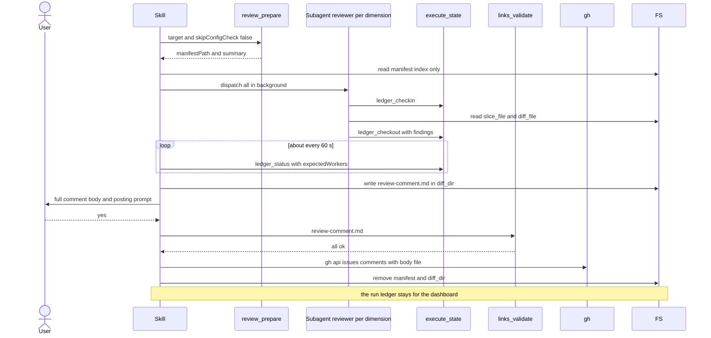

# Spec Delta

## MODIFIED Requirements

### Requirement: Reviewer dispatch
The skill SHALL dispatch one background Agent per dimension with `status` `ACTIVE` or `TRUNCATED`, all in a single message, with `run_in_background: true`.

- Each agent's `model` is `dimension.model` when set, otherwise `manifest.subagent_model`, forwarded verbatim.
- The skill prefers the Workflow tool's native fan-out when it is available.
- `SKIPPED` and `QUEUED` dimensions get no agent.

Each reviewer agent prompt requires this order:

| Order | Agent action |
|---|---|
| 1 | `execute_state({action: "ledger_checkin", runId, workerId})` before reading its files |
| 2 | Read `slice_file` (JSON: `body`, `matched_files`, `file_context`, `warnings`) and `diff_file` |
| 3 | Review only `matched_files`, only for the dimension's concern; at most 20 findings |
| 4 | `execute_state({action: "ledger_checkout", runId, workerId, findings})` last |

- `findings` is a raw JSON array of `{severity, file, line, rationale}`, or `[]` when there are none.
- The default severity for findings is the dimension's `severity`.
- When `truncated` is `true`, the skill treats that dimension's `diff_file` as partial; findings outside it may exist.
- Every reviewer prompt carries the dimension's `truncated` value in a "Diff Completeness" section. When it is `true`, the prompt tells the agent its diff is partial, that a footer starting with `# --- Truncated` lists the omitted files, and that it must not call the omitted files clean.

Main review flow from prepare to cleanup.

#### Scenario: Per-dimension model override
- **WHEN** a dimension has `model: "opus"` and `manifest.subagent_model` is `sonnet`
- **THEN** that dimension's agent is dispatched with model `opus`

#### Scenario: Skipped dimension
- **WHEN** a dimension has `status: "SKIPPED"`
- **THEN** no agent is dispatched for it

#### Scenario: Truncated dimension prompt
- **WHEN** a dimension has `truncated: true`
- **THEN** its reviewer prompt contains `truncated: true`
- **AND** the prompt says the diff file is partial and names the `# --- Truncated` footer

### Requirement: Cleanup on every terminal path
The skill SHALL remove the temp files of the run on dry-run stop, error stop, and normal completion, and SHALL keep the run ledger.

- `rm -f "<manifestPath>"`
- `rm -rf "{manifest.diff_dir}"`
- The skill does not call `execute_state({action: "ledger_cleanup", runId})`. The dashboard reads the ledger to show the review dimensions of a finished run.
- The first execute `gc` or ship `cleanup-pipeline` sweep after the GC TTL (7 days by default) removes the ledger folder.

#### Scenario: Normal completion
- **WHEN** the posting and self-fix steps finish
- **THEN** the manifest and the diff directory are removed
- **AND** the folder `.sdlc-v2/runs/ledger/<runId>/` stays

#### Scenario: Dry-run stop
- **WHEN** the user runs `/review --dry-run`
- **THEN** the manifest and the diff directory are removed
- **AND** no ledger folder exists for the run
