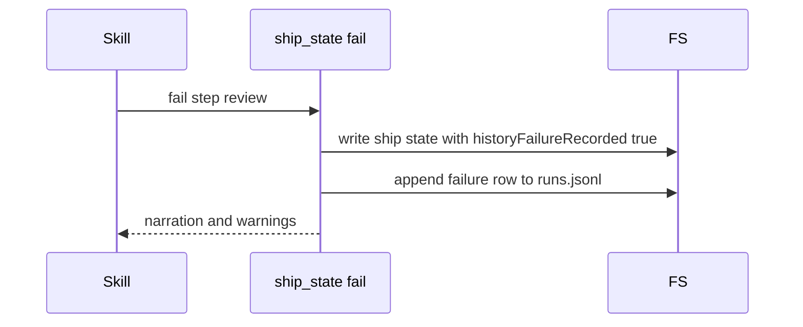

# Spec Delta

## ADDED Requirements

### Requirement: fail writes one failure history row
The first `fail` of a ship run SHALL set `historyFailureRecorded: true`, write the state, and then append one `failure` row to `runs.jsonl`. A later `fail` of the same run SHALL append no row.

#### Scenario: First fail
- **WHEN** `ship_state({action:"fail", step:"review"})` is the first `fail` of the run
- **THEN** `runs.jsonl` gets one row with `skill:"ship"` and `outcome:"failure"`

#### Scenario: Second fail
- **WHEN** the state has `historyFailureRecorded: true`
- **AND** another `fail` call occurs
- **THEN** `runs.jsonl` gets no new row

#### Scenario: State write fails
- **WHEN** the ship state cannot be written
- **THEN** the action returns an `InfraError`
- **AND** `runs.jsonl` gets no row

#### Scenario: Append fails
- **WHEN** the row cannot be appended to `runs.jsonl`
- **THEN** the step stays `failed`
- **AND** the output `warnings` names `.sdlc-v2/history/runs.jsonl`

### Requirement: cleanup-pipeline keeps the explorer summary
Before `cleanup-pipeline` deletes a `done` plan run, it SHALL copy the explorer summary into ship state `planExploreSummary` and write the ship state. Each entry SHALL have `name`, `status`, `total`, and at most 5 `top` items. If the copy fails, the plan run SHALL stay.

#### Scenario: Copy succeeds
- **WHEN** the plan run has explorer `auth-flow` with 12 items
- **THEN** the ship state has `planExploreSummary` with `{name:"auth-flow", status:"done", total:12}` and 5 `top` items
- **AND** the plan run is deleted

#### Scenario: Copy fails
- **WHEN** the explorer summary cannot be read
- **THEN** the plan run stays
- **AND** `planRun.reason` starts with `explorer summary not saved: ` and ends with `. Fix the cause and call cleanup-pipeline again.`

#### Scenario: Retry after the evidence delete
- **WHEN** the ship state already has a non-empty `planExploreSummary`
- **AND** the plan evidence folder is gone
- **THEN** `cleanup-pipeline` keeps the stored list
