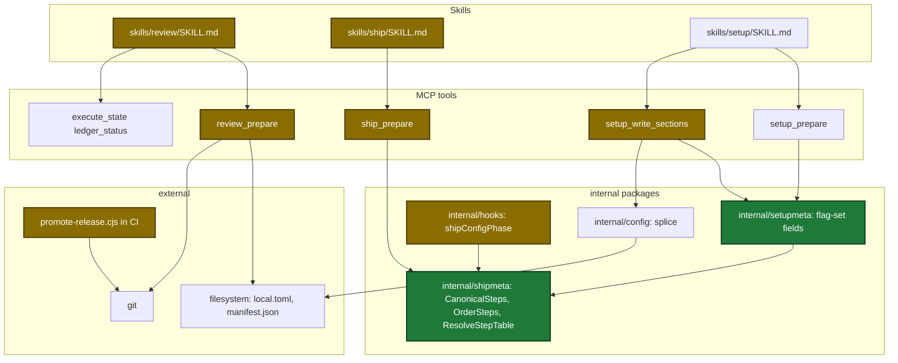
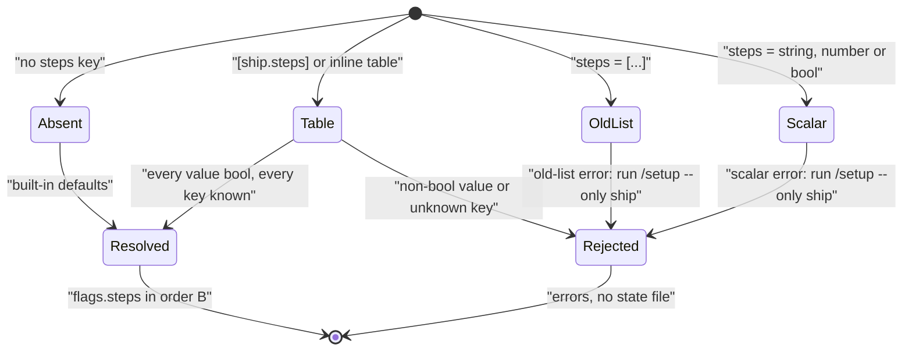
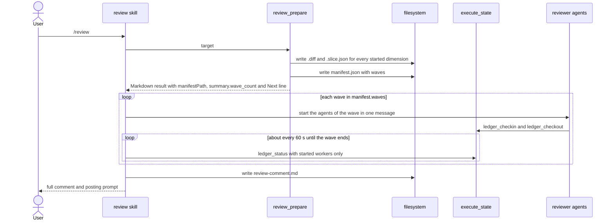
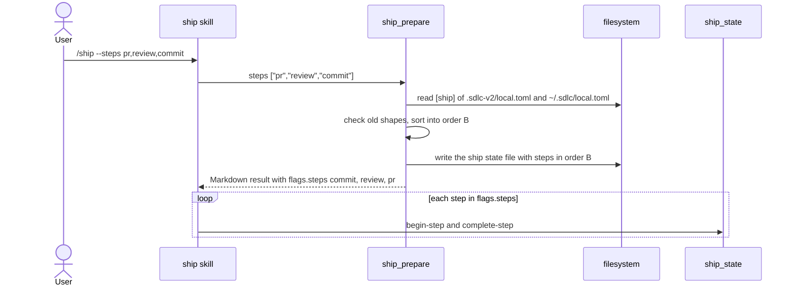

# Design

## Context

- Motivation: see proposal.md - Why.
- Root problem: in each area, a setting or a rule says one thing and the code does another. The fix puts each rule in one place in code and makes config, docs and specs match it.
- The code already handles most of the new behavior. Each fix is small. Two safety checks are new: the promotion stable check and the old-shape errors.
- Constraints:
  - `.github/scripts/promote-release.cjs` and `internal/tools/payloads/promote-release.cjs` must stay byte-identical. `TestPayloads_MatchCheckedIn` checks this.
  - `TestPayloads_SchemaChecksums` pins the SHA-256 digest of `plugins/sdlc/schemas/sdlc-local.schema.json`. Each schema edit updates the digest.
  - `internal/skillcheck/skillcheck_worktree_test.go` pins some skill lines by line number.
  - The template tests need one `key = value` line per schema leaf.
  - No config migration system exists. The repo already rejects an old config shape with a message that points to setup.
  - The config splicer (`internal/config/splice.go`) already deletes an old key line that the new value does not keep. A map value becomes a header table.
- Terms:

| Term | Meaning |
|---|---|
| RC series | The version that release candidates are built for, for example 0.3.4 for the tags 0.3.4-rc1 and 0.3.4-rc2. |
| Dimension | One review topic. One agent reviews one dimension. |
| Wave | A group of dimension agents that run at the same time. The next wave starts when the group ends. |
| Order A | `harden` runs before `verify-openspec`. The order before this change. |
| Order B | `harden` runs after `archive-openspec`. The order after this change. |
| Ledger | The progress file that each review agent writes. The review skill polls these files. |

Touched parts, grouped by layer:



## Goals / Non-Goals

**Goals:**

- A `minor` promotion of RC series 0.3.4 from stable 0.3.3 tags 0.4.0.
- A review that matches 21 dimensions runs 21 agents.
- A ship config has no step order that a user can get wrong.

**Non-Goals:**

| Item | Reason |
|---|---|
| The ideas file in `tmp/` | Out of scope (D5). |
| Old ship report and dashboard drafts in `tmp/` | They are not findings. |
| Migration code for `maxDimensions` or for old step lists | D4 and D6. The tool rejects the old shape with a clear error. |
| The ship config read that ignores a read error (`ship.go:329`) | The finding does not cover this read. |
| The dashboard that shows "completed" between review waves | Separate dashboard change. Follow-up. |
| A ship warning when a stalled dimension ends early | The review comment already names each stalled or missing agent. |
| The `migrate` tool that copies an old step list | The copied list then gets the old-list error. |
| A ship run that started before the upgrade with `harden` before `verify-openspec` in its state | Finish or restart such a run before the upgrade. One maintainer runs ship. |
| The release script that sets the RC level from the PR label | The finding did not choose that option. |
| The changelog | CI writes it from PR notes at promote time (KD9). |
| The step-name enum in `ship-state.schema.json` | The enum is a set of allowed names, not an order. |
| Review-dimension updates for `schema-compatibility-review` and `payload-content-coherence` | Advice for a later `/harden` run. No requirement asks for them. |

## Decisions

| Decision | Chosen | Rejected alternatives | Reason |
|---|---|---|---|
| D1 OpenSpec | Create this OpenSpec change from the final plan. | No OpenSpec change. | User decision. |
| D2 Plan shape | One plan with three task groups. | Three plans. | User decision. |
| D3 Ship step order | Order B. Steps are on/off flags. The plugin owns the order. | Order A; an ordered list in config. | User decision. The user config already uses order B. |
| D4 Review key | Rename `maxDimensions` to `maxParallelDimensions`. No migration code. | Keep the old name with a new meaning. | User decision. The old name describes the old rule. |
| D6 Old step list | Reject it with a clear error. No migration code. | Silent conversion. | User decision. |
| D7 `quick` key | Same table format. A step that the table does not name is off. | Defaults in the quick table. | User decision. |
| KD1 Promotion rule | A target can be equal to or above the RC series. The series must be above the last stable tag. A target above the series prints one `NOTICE:` line. | A step-summary write. | Matches earlier successful runs and common release tools. The stable check stops a second release of an old series. |
| KD2 Wave order owner | `review_prepare` returns `waves`. The skill only loops over them. | A sort in skill text. | Order is mechanical work. Mechanical work belongs in tools. |
| KD3 Wave fields | `waves` is a top-level manifest field. `wave_count` is a summary number. No field in `dimensions[]` entries. | A wave field in each entry. | The spec fixes the keys of each entry. The dry run prints the count from the summary. |
| KD4 Default limit | The default stays 8. | A new default. | The value already limited agents at the same time. No data supports another number. |
| KD5 Unnamed steps | In `[ship.steps]`, a step not named uses its default. In `[ship.quick]`, it is off. | Defaults in the quick table. | The step table merges per key across files, so defaults must fill keys that no file sets. The quick table has no defaults today. |
| KD6 `--steps` input | A set. `ship_prepare` sorts it into order B. A duplicate name is an error. | Keep the input order. | D3 says the order is not a user choice. A duplicate is bad input. |
| KD7 Old shapes | The tool fails with a message that names the new shape and the fix. | Migration code; silent acceptance. | No migration system exists. The repo already does this for an old version shape. |
| KD8 One step list | `setupmeta.CanonicalSteps` refers to `shipmeta.CanonicalSteps`. Every text that names the order builds it from that list. | Two lists kept in sync by tests. | `internal/setupmeta` can import `internal/shipmeta`. No import cycle exists. |
| KD9 Changelog | No task edits the changelog. | A hand edit. | CI writes it from PR notes at promote time. |
| KD10 Review re-entry | The review skill states that an interrupted review restarts at Step 0. | No statement. | The resume-safety rule asks each multi-step skill to state its re-entry behavior. |
| KD11 Table text form | The template and the two local files write a step table as one inline line: `steps = { execute = true, ... }`. A `[ship.steps]` header table is also valid input. | Header tables in the template. | The inline line stays under `[ship]`, so no other key moves. A header placed above other `[ship]` keys takes those keys into the table. The unknown-key error tells the user to move such a key. |
| KD12 Field type | A new field type `flag-set` marks the two step fields. | Reuse `multi-select` with a field-name check in the write tool. | The write tool must know which answers become tables. Other `multi-select` fields stay lists. |

Smallest viable cut:

| Group | Tasks | Reason |
|---|---|---|
| Minimum | 1, 3, 4, 5, 6, 7, 10 | Fixes the three findings in code and skill text. |
| Kept correct | 2, 9, 11 | Docs and the session summary match the new rules. |
| Needed after Task 6 | 8, 12, post-merge step | Without them, setup and the local files hold a list that ship rejects. |

### Data contracts

`review_prepare` output, before → after:

```go
// reviewManifest: new top-level field
Waves [][]string `json:"waves"` // never nil; [] when no dimension is started

// reviewPlanCritique
// removed: DimensionCapApplied, QueuedDimensions, DimensionCap
MaxParallelDimensions int `json:"max_parallel_dimensions"`

// ReviewPrepareSummary
// removed: QueuedDimensions int `json:"queued_dimensions"`
WaveCount int `json:"wave_count"`

// ReviewPrepareOut.Next, manifest mode: no longer empty (see the tool-review-prepare spec)
```

New and changed symbols:

```go
// internal/tools/review.go
const defaultMaxParallelDimensions = 8
func planWaves(dims []reviewDimWork, maxParallel int) [][]string
func resolveMaxParallelDimensions(reviewCfg map[string]any) (int, error)
func reviewWaveNext(manifestPath string, waveCount int) string

// internal/shipmeta/fields.go
var CanonicalSteps = []string{
	"execute", "commit", "review", "verify-openspec", "archive-openspec",
	"harden", "pr", "verify-pipeline", "await-remote-review",
	"learnings-commit",
}
func OrderSteps(names []string) []string
func ResolveStepTable(table map[string]any, defaults []string, label string) (steps []string, problems []string)

// internal/tools/ship.go
func mergeShipFlags(in ShipPrepareIn, cfg map[string]any, versionCfg map[string]any) (map[string]any, map[string]string, []string)
func shipStepConfigErrors(shipCfg map[string]any, cliSteps []string) []string

// internal/tools/setup_write.go
func normalizeFlagSetFields(sectionID string, values map[string]any) error
```

`ShipPrepareIn.Steps` field:

| Field | Type | Encoding | Example |
|---|---|---|---|
| `steps` | string[] | plain JSON array; a set, the order does not matter; a duplicate is an error | `["execute","review","pr"]` |
| `quick` | bool | JSON bool; runs the steps set to `true` in `[ship.quick]` | `true` |

Config change in `.sdlc-v2/local.toml`, before → after:

```diff
 [ship]
-# Pipeline steps to execute during /ship (in order).
-steps = ["execute", "commit", "review", "verify-openspec", "archive-openspec", "harden", "pr", "verify-pipeline"]
-quick = ["execute", "commit", "review", "verify-openspec", "archive-openspec", "harden"]
+# Pipeline steps for /ship: true runs the step, false skips it.
+steps = { execute = true, commit = true, review = true, verify-openspec = true, archive-openspec = true, harden = true, pr = true, verify-pipeline = true, await-remote-review = false, learnings-commit = false }
+quick = { execute = true, commit = true, review = true, verify-openspec = true, archive-openspec = true, harden = true, pr = false, verify-pipeline = false, await-remote-review = false, learnings-commit = false }

 [review]
-maxDimensions = 8
+maxParallelDimensions = 8
```

States of a ship step config value when `ship_prepare` reads it:



### Main runtime flow

Review with waves, from the user to the Markdown result:



Ship step resolution, from the user to the Markdown result:



### Guardrail notes

| Guardrail | Severity | How this design meets it |
|---|---|---|
| `handler-data-contracts` | error | `waves` is `[]`, never `null`. Bad step input and bad flag-set answers fail before any write. |
| `mcp-error-actionable`, `mcp-error-has-suggestion` | error | Each new error names the fix. Each `DomainError` has a `Suggestion`. |
| `mcp-output-drives-behavior` | error | `review_prepare` manifest mode returns a `next` text for both the waves case and the empty case. |
| `mcp-parameter-documented` | error | The `steps` field description states the encoding and gives an example. |
| `mcp-deterministic-work-split` | error | The wave order and the flag-set conversion are in Go tools, not in skill text. |
| `dry` | error | One step list (KD8). Both promote script copies change in the same task. |
| `schema-code-sync-required`, `schema-change-secondary-readers` | error | Schema, template, setup fields, readers, docs and the two local files change together. |
| `skill-flow-soundness`, `skill-flow-soundness-3`, `sub-skill-approval-orchestration` | error | Every wave ends with each worker done, skipped or stopped. A `TaskStop` ownership error is not retried. The comment names each stalled or missing worker. |
| `skill-resume-safety` | error | KD10. Setup re-runs give the same file. Ship resume keeps the ordered `steps[]` in state. |
| `multi-wave-gates-enforcement` | warning | No departure. Execute runs its gates stage before each wave commit. |

## Risks / Trade-offs

| Risk | Impact | Mitigation |
|---|---|---|
| A wrong promotion tag | A tag is permanent. A mistaken `major` tags 1.0.0 for the maintainer and every project with the payload. | The level stays a user choice. A level above the series prints `NOTICE:`. The stable check stops a second release. End-to-end tests pin exit 1 and no pushed tag. |
| A wrong wave loop | Dimensions without review, or agents stopped too early, for every review and ship user. | `expectedWorkers` holds only started workers. A wave ends only when each worker is done, skipped or stopped. Tests pin wave sizes and order. |
| Old step lists in user configs | Ship stops with an error until the user runs setup again. | The error names `/setup --only ship`. Setup writes the table. The post-merge step edits the two maintainer files. |
| `ledger_status` returns the findings of every registered worker on each poll | Later waves repeat earlier findings in the poll output. | Accepted cost. |
| A ship run that started before the upgrade | Its state keeps order A. The new loop uses order B. | Finish or restart such a run before the upgrade. |
| More dimensions get files | The diff size limit and the overlap checks run on more dimensions. | Expected. The files are temp files. |
| A key below a `[ship.steps]` header | The key belongs to the step table. | The unknown-key error tells the user to move the key above the header. |

## Migration Plan

- Deploy: merge all tasks. Run `task deploy` in the main worktree. Start a new Claude Code session so the new plugin binary loads.
- Then edit `.sdlc-v2/local.toml` and `~/.sdlc/local.toml` by hand to step tables with all ten steps. Do not edit them before the deploy. The old binary ignores a table and runs the six default steps with no error.
- Check: `/sdlc:review --dry-run` shows the wave count. `/sdlc:ship --dry-run` shows order B.
- Rollback: revert the merge commit and deploy again. Restore the old `steps = [...]` lines in the two local files.
