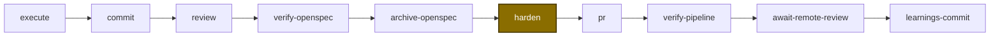
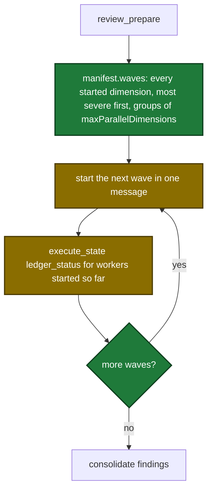

# Proposal

## Why

- Problem: in three areas, a setting or a rule says one thing and the code does another.
- Evidence:
  - Promotion: on 2026-10-08 a `minor` promotion of RC series 0.3.4 failed. The maintainer wanted 0.4.0. `promote-release.cjs` accepts a level only when the result equals the RC series.
  - Review: on 2026-10-07 one ship run matched 21 dimensions and reviewed 8. `maxDimensions` cut coverage. No dimension reviewed the Go and web code.
  - Ship: `internal/shipmeta/fields.go` runs `harden` before the OpenSpec steps. The user config runs `harden` after them. The skill text and `ship_state` disagree about the next step.
- Why now: each defect gave a wrong result in a real run this week.

## What Changes

| Area | Before | After |
|---|---|---|
| Promotion level | A level must produce exactly the RC series version. A higher level exits 1. | A level that produces the RC series or a higher version is accepted. A higher version prints one `NOTICE:` line. |
| Promotion safety | Only the equal-series rule stops a second release of a released series. | The RC series must be above the latest stable tag. Otherwise the script exits 1 with `Nothing to promote:`. |
| Review coverage | Dimensions above the limit get status `QUEUED`, no files and no agent. | Every matching dimension runs. `review_prepare` returns `waves`. The skill starts one wave at a time. |
| **BREAKING** Review config key | `[review] maxDimensions` caps coverage. | `[review] maxParallelDimensions` sets how many agents run at the same time. The old key returns an error that names the new key. |
| Review manifest | `plan_critique.queued_dimensions`, `dimension_cap`, `dimension_cap_applied`, `summary.queued_dimensions`. Manifest-mode `next` is empty. | `waves`, `plan_critique.max_parallel_dimensions`, `summary.wave_count`. Manifest-mode `next` tells how to start the waves. |
| Ship step order | Order A: `harden` before `verify-openspec`. The config list order wins. | Order B: `harden` after `archive-openspec`. The plugin owns the order. |
| **BREAKING** Ship step config | `steps = [...]` and `quick = [...]` are ordered lists. | `[ship.steps]` and `[ship.quick]` are tables of true/false. An old list returns an error that names `/setup --only ship`. |
| Ship `--steps` input | An ordered list. | A set. `ship_prepare` sorts it into order B. A duplicate name is an error. |
| Setup | `steps` and `quick` are `multi-select` fields, written as lists. | `steps` and `quick` are `flag-set` fields. `setup_write_sections` writes them as tables. |

Order B, after the change:

The review flow after the change. Each wave starts only after the previous wave ends:

## Capabilities

### New Capabilities

None.

### Modified Capabilities

- `release-ci-payloads`: the promotion target can be above the RC series; the RC series must be above the latest stable tag.
- `tool-review-prepare`: no `QUEUED` status; every started dimension gets files; `waves` replaces the dimension cap; key `maxParallelDimensions`; old-key error; manifest-mode `next`.
- `skill-review`: dry run, dispatch and polling run per wave; no queued note; an interrupted review restarts.
- `skill-ship`: the main loop uses order B; the conditional-step text says `ship.steps`; the rebase rule lists the next steps in order B.
- `tool-ship-prepare`: steps come from tables; `--steps` is a set; errors for an old list, a scalar, a non-bool value, an unknown key and a duplicate name.
- `local-config-layering`: step tables merge per key; the review-key error names `maxParallelDimensions`.
- `skill-setup`: `flag-set` answers; the gate reads the selected steps; the source-badge example uses the new review key.
- `tool-setup-prepare`: the field type list has `flag-set`; `whenStepInActiveSteps` reads the selected steps.
- `tool-setup-write-sections`: template comment lines use the new review key; new flag-set write rule.
- `tool-setup-init`: the scaffolded template shows `steps` and `quick` as inline tables.

## Impact

| Path | Kind | Change |
|---|---|---|
| `.github/scripts/promote-release.cjs` | CI | New level rule, stable check, `NOTICE:` line, version 10. |
| `internal/tools/payloads/promote-release.cjs` | CI | Byte-identical copy of the script above. |
| `.github/scripts/__tests__/promote-release-guard.test.cjs` | CI | Flipped and new guard tests. |
| `docs/versioning.md` | doc | Level input and the four-row rule table. |
| `internal/tools/review.go` | MCP tool | `waves`, `maxParallelDimensions`, old-key error, manifest-mode `next`. |
| `plugins/sdlc/skills/review/SKILL.md` | skill | Wave dispatch and per-wave polling. |
| `docs/skills/review.md` | doc | New key and manifest fields. |
| `.sdlc-v2/review-dimensions/documentation-review.md`, `.sdlc-v2/review-dimensions/mcp-tool-review.md` | doc | Example key name. |
| `internal/shipmeta/fields.go` | MCP tool | Order B, `OrderSteps`, `ResolveStepTable`. |
| `internal/tools/ship.go` | MCP tool | Table read, old-list, scalar and duplicate errors, descriptions. |
| `internal/hooks/session_start.go` | hook | Ship summary reads the step table. |
| `plugins/sdlc/skills/ship/SKILL.md`, `reference.md`, `state-format.md`, `config-format.md` | skill | Order B and step flags. |
| `docs/skills/ship.md`, `docs/skills/harden.md` | doc | Step flags and `harden` position. |
| `internal/setupmeta/sections.go` | MCP tool | One step list from `shipmeta`, `flag-set` fields, review key. |
| `internal/tools/setup_write.go` | MCP tool | Flag-set answer written as a table. |
| `plugins/sdlc/skills/setup/SKILL.md` | skill | Flag-set answer mapping. |
| `plugins/sdlc/schemas/sdlc-local.schema.json` | schema | Review key rename; `steps` and `quick` become objects of booleans. |
| `plugins/sdlc/templates/local.toml` | template | Review comment; inline step tables. |
| `internal/skillcheck/skillcheck_worktree_test.go` | CI | Pinned skill line keys move. |
| `.sdlc-v2/local.toml`, `~/.sdlc/local.toml` | template | Manual post-merge edit to step tables. Not in repository history. |
