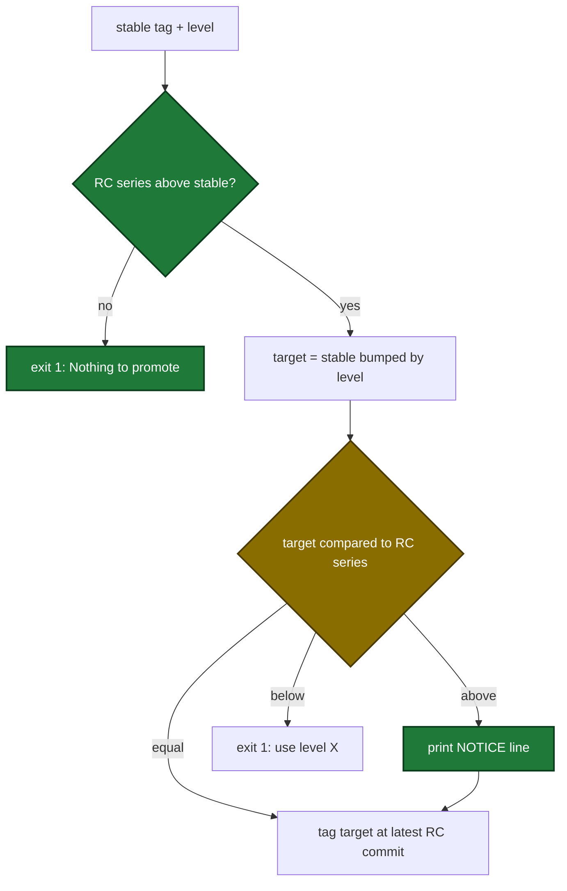

# Spec Delta

## RENAMED Requirements

- FROM: `### Requirement: Promotion target equals the active RC series`
- TO: `### Requirement: Promotion target is not below the active RC series`

## MODIFIED Requirements

### Requirement: Promotion target is not below the active RC series
`promote-release.cjs` SHALL promote only when the active RC series is above the latest stable tag and the version computed from the latest stable tag and the `level` input is equal to or above the active RC series, and SHALL otherwise exit 1 before any git write.

- The script checks the series first. A series equal to or below the latest stable version gives an error that starts with `Nothing to promote:`.
- An equal target tags the target version at the latest RC commit of the series.
- A target above the series prints one line that starts with `NOTICE:` and names the target tag and the series. Then it tags the target version at the latest RC commit of the series.
- A target below the series gives an error that names the chosen level, the computed tag and the series version.
- That error names the first of `patch`, `minor`, `major` that reaches the series. When no level reaches the series, the error says `no level reaches <series> from <stable>`.
- The RC lookup and its log lines use the series version, not the target version.

Promotion decision from the inputs to the tag:

#### Scenario: Level skips past the RC series
- **WHEN** the latest stable tag is `v1.4.9`, the active RC series is `1.4.10`, and `level` is `minor`
- **THEN** the script prints a line that starts with `NOTICE:` and contains `v1.5.0, above the active RC series 1.4.10`
- **AND** the script tags `v1.5.0` at the latest `v1.4.10-rcN` commit
- **AND** no tag `v1.4.10` is pushed

#### Scenario: Level matches the RC series
- **WHEN** the latest stable tag is `v1.4.9`, the active RC series is `1.4.10`, and `level` is `patch`
- **THEN** the script tags `v1.4.10` at the latest `v1.4.10-rcN` commit
- **AND** the script prints no `NOTICE:` line

#### Scenario: Major level above the RC series
- **WHEN** the latest stable tag is `v0.3.3`, the active RC series is `0.3.4`, and `level` is `major`
- **THEN** the target is `1.0.0`
- **AND** the script prints a `NOTICE:` line before it tags `v1.0.0`

#### Scenario: Level below the RC series
- **WHEN** the latest stable tag is `v1.4.9`, the active RC series is `3.0.0`, and `level` is `patch`
- **THEN** the script exits 1 with the message `Chosen level "patch" produces v1.4.10, but the active RC series is 3.0.0. no level reaches 3.0.0 from 1.4.9`
- **AND** no tag is pushed

#### Scenario: RC series already released
- **WHEN** the latest stable tag is `v0.3.2` and the active RC series is `0.3.1` or `0.3.2`
- **THEN** the script exits 1 with a message that starts with `Nothing to promote:`
- **AND** no tag is pushed

#### Scenario: Second promotion of the same series
- **WHEN** a `patch` promotion of a series finished and the maintainer runs a second `patch` promotion
- **THEN** the second run exits 1 and stderr contains `Nothing to promote`
- **AND** no new tag is pushed
