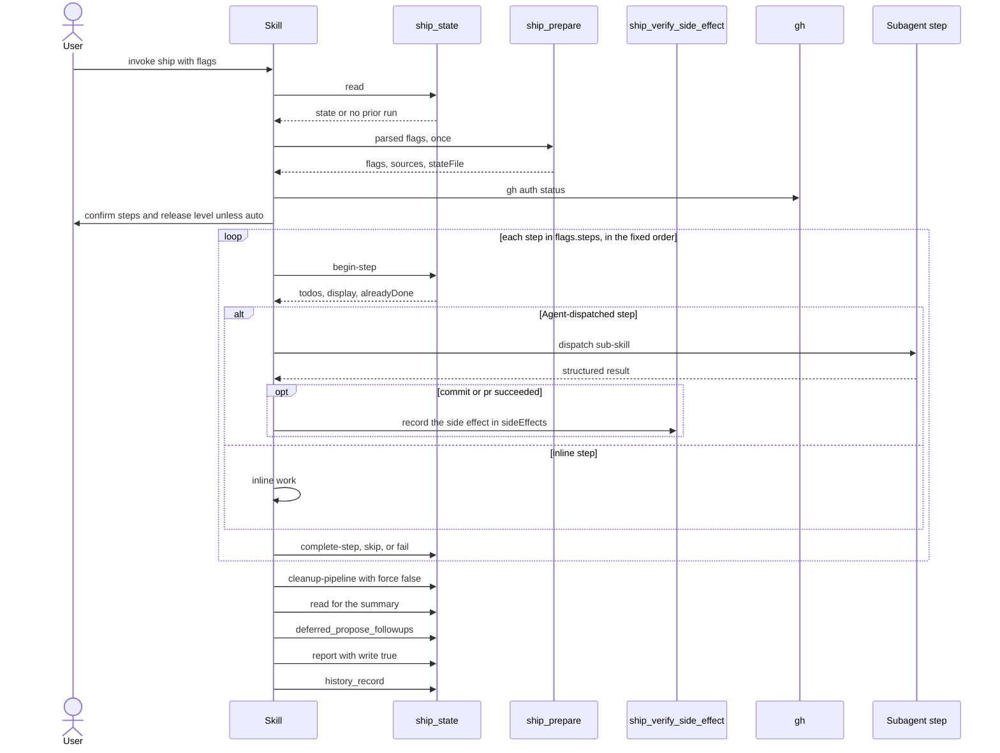

# Spec Delta

## MODIFIED Requirements

### Requirement: Step loop
The skill SHALL run each name in `flags.steps` in the order `execute, commit, review, verify-openspec, archive-openspec, harden, pr, verify-pipeline, await-remote-review, learnings-commit`, strictly one at a time, with a `ship_state` lifecycle call pair per step.

- `ship_prepare` always returns `flags.steps` in this fixed order, so the skill loop and the `next` step of `ship_state` agree.

Main pipeline flow between the user, the skill, the MCP tools, and sub-skills:

- Per step: announce `→ <step>`; `begin-step`; `TodoWrite(todos)`; print `display`; do the work; `complete-step` with `detail:{outcome:"success", result}`.
- `alreadyDone:true` on `begin-step` skips the work and goes straight to `complete-step`.
- After the `commit` or `pr` sub-skill reports success, and before `complete-step`, the skill records the side effect: `commit` calls `ship_verify_side_effect({step:"commit", expected:<full HEAD sha>})`; `pr` calls `ship_verify_side_effect({step:"pr"})`. This is the only writer of the `sideEffects` journal that `alreadyDone` reads. `landed:false` is logged as one warning line and is not a step failure.
- A step legitimately bypassed at runtime gets `skip` with a `detail.reason` instead of work plus `complete-step`.
- A name absent from `flags.steps` gets no `ship_state` call at all.
- On failure: `fail` with `detail:{error:"<error summary>"}` (the only detail field `fail` reads), then stop and print `Step <N> (<name>) failed: 
`, `State saved to: <path>`, `To resume: /ship --resume`.
- The skill does not end its turn between steps.
- The skill never creates or pushes a git tag and never uses a worktree.

#### Scenario: Step already done on resume
- **WHEN** `begin-step` for `pr` returns `alreadyDone:true`
- **THEN** the skill does not dispatch the `pr` sub-skill
- **AND** calls `complete-step` for `pr`

#### Scenario: Side effect recorded after commit
- **WHEN** the `commit` sub-skill reports success
- **THEN** the skill calls `ship_verify_side_effect` with `step:"commit"` and the full HEAD sha as `expected`
- **AND** then calls `complete-step` for `commit`

#### Scenario: PR side effect not found
- **WHEN** the `pr` sub-skill reports success and `ship_verify_side_effect({step:"pr"})` returns `landed:false`
- **THEN** the skill logs one warning line
- **AND** still calls `complete-step` for `pr`

#### Scenario: Sub-skill failure
- **WHEN** the `review` dispatch fails
- **THEN** the skill calls `ship_state({action:"fail", step:"review", ...})`
- **AND** prints `To resume: /ship --resume` and stops

#### Scenario: harden runs after the OpenSpec steps
- **WHEN** `flags.steps` holds `verify-openspec`, `archive-openspec` and `harden`
- **THEN** the skill runs `verify-openspec`, then `archive-openspec`, then `harden`
- **AND** `begin-step` accepts each of the three steps

### Requirement: received-review and commit-fixes
The skill SHALL dispatch `received-review` only when at least one finding was collected, SHALL dispatch `commit-fixes` only when `received-review` made changes, and SHALL record both with `decide` only.

- `received-review` and `commit-fixes` have no `steps[]` entry; the skill never calls `begin-step`, `complete-step`, `start`, `complete`, `skip`, or `fail` for them.
- They are not configurable: `ship_prepare` rejects either name set to `true` in the `[ship.steps]` table, in the `[ship.quick]` table, or in `--steps` with an error, so neither is ever seeded into the state `steps[]`.
- The `received-review` payload is `Review findings to address (from /review, <K> of <M>):` followed by each collected finding's heading, `**File:**` line, and body verbatim.
- `received-review` pauses for the user unless `flags.auto`.
- `commit-fixes` is a separate commit, never squashed into the feature commit.
- With no collected finding, the skill goes straight to rebase.

#### Scenario: No collected findings
- **WHEN** every finding is below the threshold
- **THEN** neither `received-review` nor `commit-fixes` is dispatched

#### Scenario: Findings collected before a PR exists
- **WHEN** findings are collected and no PR exists yet
- **THEN** the `received-review` prompt has no `--pr` and carries every collected finding

### Requirement: Rebase
After `commit-fixes` and before the next configured step among `verify-openspec`, `archive-openspec`, `harden`, `pr`, the skill SHALL run `git fetch origin <base>` and skip the rebase when `git merge-base --is-ancestor origin/<base> HEAD` succeeds, where `<base>` is the resolved base branch.

- Otherwise `flags.rebase` `"auto"` rebases and `"skip"` never rebases; any other value is informational.
- A conflict stops the pipeline; the user resolves it and runs `--resume`.
- The outcome is always recorded with `ship_state({action:"decide", step:"rebase", detail:{text}})`.
- Every later commit, including the archive commit and the `harden` commit, lands on the rebased branch. No second rebase runs.

#### Scenario: Already up to date
- **WHEN** `origin/<base>` is already an ancestor of `HEAD`
- **THEN** no rebase runs and a `rebase` decision is recorded

#### Scenario: Conflict
- **WHEN** the rebase hits a conflict
- **THEN** the skill stops and tells the user to resolve it and `--resume`

#### Scenario: Base branch configured
- **WHEN** `[git] baseBranch = "develop"`
- **THEN** the skill runs `git fetch origin develop` and rebases onto `origin/develop` when behind

#### Scenario: Rebase before verify-openspec
- **WHEN** `flags.steps` holds `verify-openspec` and `harden`
- **THEN** the rebase runs before `verify-openspec`
