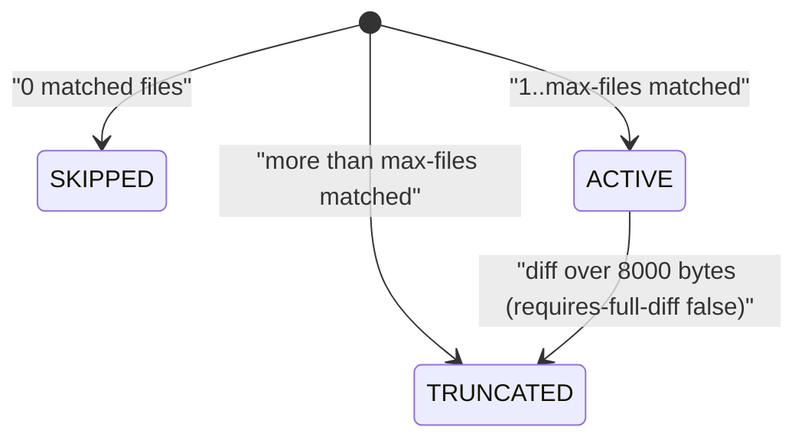

# Spec Delta

## RENAMED Requirements

- FROM: `### Requirement: Dimension cap`
- TO: `### Requirement: Parallel dimension waves`

## MODIFIED Requirements

### Requirement: Dimension status
The tool SHALL give every loaded dimension exactly one status: `ACTIVE`, `SKIPPED`, or `TRUNCATED`.

Status transitions for one dimension during a single call:

- `max-files` defaults to `100`; only a positive integer overrides it.
- When more than `max-files` files match, only the first `max-files` are kept and `truncated` is `true`.
- For a dispatched dimension cut by `max-files`, the `.diff` file ends with a footer: first line `# --- Truncated (max-files) ---`, then one `# - <path>` line per dropped file. It comes after any diff byte cap footer.
- The status `QUEUED` does not exist. The parallel limit never changes a status; see parallel dimension waves.

#### Scenario: max-files cap
- **WHEN** 4 changed files match and `max-files` is `3`
- **THEN** `matched_count` is `3`
- **AND** `truncated` is `true` and status is `TRUNCATED`
- **AND** the `.diff` file ends with a `# --- Truncated (max-files) ---` footer that lists the 4th file as `# - <path>`

#### Scenario: No matched file
- **WHEN** no changed file matches a dimension's triggers
- **THEN** its status is `SKIPPED`
- **AND** its `diff_file` and `slice_file` are `null`

### Requirement: Per-dimension diff and slice files
For every `ACTIVE` or `TRUNCATED` dimension the tool SHALL write `<name>.diff` and `<name>.slice.json` into a new temp directory named `sdlc-review-*` under the system temp directory, and SHALL write neither file for a `SKIPPED` dimension.

- Every `ACTIVE` or `TRUNCATED` dimension gets both files, in every wave. The parallel limit does not change which dimensions get files.
- `<name>.diff` holds the diff hunks of the dimension's matched files only, joined in matched-file order.
- `<name>.slice.json` is a JSON object with the fields below.

| Field | Meaning |
|---|---|
| `body` | Dimension Markdown body. When `_common.md` is non-empty, it is prefixed with `## Common Review Instructions`, the `_common.md` text, then the body. |
| `matched_files` | Matched file paths. |
| `file_context` | One `{file, commits: [{hash, subject}]}` entry per matched file. Empty for scopes `staged` and `working`. |
| `warnings` | Validation messages for the dimension file (field and severity checks). |

- `file_context` commits come from `git log --format=COMMIT:%H %s --name-only <base>..HEAD`.
- Each `hash` is the first 8 characters of the commit hash.
- At most 5 commits are kept per file.
- The tool never deletes the temp directory; the caller cleans it up.

#### Scenario: Slice for an active dimension
- **WHEN** dimension `code-quality` matches `src/app.go` and `src/util.go`
- **THEN** `code-quality.diff` contains `diff --git` headers for those files
- **AND** `code-quality.slice.json` has a non-empty `body` and 2 `matched_files`

#### Scenario: Queued dimension gets no files
- **WHEN** `[review] maxParallelDimensions` is `1` and three dimensions are `ACTIVE`
- **THEN** no dimension has status `QUEUED`
- **AND** `diff_dir` holds three `.diff` files and three `.slice.json` files
- **AND** the `diff_file` and `slice_file` of each of the three dimensions are non-null paths

### Requirement: Parallel dimension waves
The tool SHALL put every `ACTIVE` or `TRUNCATED` dimension name into the top-level manifest field `waves`, a list of waves that each hold at most N names, where N is `maxParallelDimensions` (default 8). The tool SHALL NOT change the status of any dimension because of N.

- Order: higher severity first (`critical` > `high` > `medium` > `low` > `info`; unknown ranks as `medium`).
- Tie-break: fewer matched files first.
- The tool fills each wave to N names before it starts the next wave. Only the last wave can hold fewer than N names.
- `SKIPPED` dimensions are in no wave.
- With no `ACTIVE` or `TRUNCATED` dimension, `waves` is `[]`, never `null`, and `summary.wave_count` is `0`.
- `summary.wave_count` is the number of waves.
- `plan_critique.max_parallel_dimensions` is N.

#### Scenario: Ten active dimensions
- **WHEN** 10 dimensions are `ACTIVE` and N is 8
- **THEN** all 10 stay `ACTIVE`
- **AND** `waves` holds two waves of 8 and 2 names
- **AND** `summary.wave_count` is `2`

#### Scenario: Ten truncated dimensions
- **WHEN** 10 dimensions are `TRUNCATED` by `max-files` and N is 8
- **THEN** all 10 stay `TRUNCATED`
- **AND** `summary.active_dimensions` is `10`
- **AND** `waves` holds two waves of 8 and 2 names

#### Scenario: Five active dimensions
- **WHEN** 5 dimensions are `ACTIVE` and N is 8
- **THEN** `waves` holds one wave of 5 names

#### Scenario: Critical dimension kept
- **WHEN** 1 `critical` and 8 `info` dimensions are `ACTIVE` and N is 8
- **THEN** `waves[0][0]` is the `critical` dimension
- **AND** exactly one `info` dimension is in `waves[1]`

#### Scenario: Lowest severity queued
- **WHEN** the dispatched severities are `critical, high, medium, low, info, medium, medium, medium, low, info` and N is 8
- **THEN** the two `info` dimensions are in `waves[1]`
- **AND** every dimension is in a wave

#### Scenario: Equal severity tie-break
- **WHEN** 3 `medium` dimensions match 3, 1, and 2 files and N is 2
- **THEN** `waves[0]` holds the dimensions with 1 and 2 matched files, in that order
- **AND** `waves[1]` holds the dimension with 3 matched files

#### Scenario: Configured cap above dimension count
- **WHEN** 10 dimensions are `ACTIVE` and N is 10
- **THEN** `waves` holds one wave of 10 names

#### Scenario: Twenty-one dimensions with the default limit
- **WHEN** 21 dimensions are `ACTIVE` or `TRUNCATED` and no `maxParallelDimensions` key is set
- **THEN** `waves` holds three waves of 8, 8 and 5 names, in severity order
- **AND** every one of the 21 dimensions has a `.diff` file and a `.slice.json` file

#### Scenario: No started dimension
- **WHEN** every loaded dimension is `SKIPPED`
- **THEN** `waves` is `[]`
- **AND** `summary.wave_count` is `0`

### Requirement: Plan critique
The tool SHALL write a `plan_critique` object into the manifest that describes coverage gaps and overlaps of the dimension plan.

| Field | Meaning |
|---|---|
| `uncovered_files` | Changed files matched by no dimension. |
| `uncovered_suggestions` | `[{dimension, files, reason}]` from the catalog below. |
| `still_uncovered` | Uncovered files that match no catalog entry. |
| `over_broad_dimensions` | Dispatched (`ACTIVE` or `TRUNCATED`) dimensions matching more than 80% of changed files. |
| `overlapping_pairs` | Pairs of dispatched (`ACTIVE` or `TRUNCATED`) dimensions with identical matched-file sets. |
| `max_parallel_dimensions` | The parallel limit N used for this call. See parallel dimension waves. |

- `plan_critique` has no `dimension_cap`, `dimension_cap_applied` or `queued_dimensions` field.

Uncovered-file catalog. The first matching row wins. Matches marked (i) ignore case.

| Suggested dimension | Label | File path matches |
|---|---|---|
| `ci-cd-pipeline-review` | CI/CD workflow | `.github/workflows/`, or `.yml`/`.yaml` containing `ci`, `deploy`, or `pipeline` (i) |
| `ci-cd-pipeline-review` | CI/CD pipeline | `Jenkinsfile` or `.circleci/` (i) |
| `database-migrations-review` | database migration | `migration/` or `migrations/` (i), or ends with `.sql` |
| `internationalization-review` | internationalization | `i18n`, `locale`, `locales`, `translation/`, `translations/` (i) |
| `api-contract-review` | API contract/schema | ends with `.graphql` or `.proto`, or contains `openapi`/`swagger` (i) |
| `documentation-quality-review` | documentation | ends with `.md`, or `doc/`/`docs/` (i) |
| `type-safety-review` | type definition | ends with `.d.ts`, or a `type/`/`types/` segment (i) |
| `state-management-review` | state management | `store`, `state`, `redux`, `zustand`, `pinia` (i) |
| `infrastructure-review` | infrastructure | `Dockerfile`, `docker-compose`, `terraform`, `k8s`, `kubernetes`, or ends with `.dockerfile` or `.tf` (i) |
| `dependency-management-review` | dependency lockfile | ends with `.lock`, or `package-lock`, `yarn.lock`, `Gemfile.lock`, `poetry.lock` |
| `mobile-app-review` | mobile platform | `android/`, `ios/`, or ends with `.swift`, `.kt`, or `.dart` (i) |
| `configuration-management-review` | configuration | `.env` or `.env.*`, or a `config/` segment (i) |

- Suggestions are grouped per dimension, in first-seen order.
- `reason` is `<count> <label> file not covered by any dimension`, with `files` when count is not 1.

#### Scenario: Two catalog groups and one leftover
- **WHEN** uncovered files are `.github/workflows/ci.yml`, `migrations/001_init.sql`, and `src/main.go`
- **THEN** `uncovered_suggestions` lists `ci-cd-pipeline-review` then `database-migrations-review`
- **AND** `still_uncovered` is `["src/main.go"]`

#### Scenario: Identical coverage
- **WHEN** two `ACTIVE` dimensions both match exactly `f1.go` and `f2.go` out of 3 changed files
- **THEN** `overlapping_pairs` holds one pair
- **AND** `over_broad_dimensions` is empty (66% is not over 80%)

#### Scenario: Over-broad dimension
- **WHEN** an `ACTIVE` dimension matches 5 of 6 changed files
- **THEN** its name is in `over_broad_dimensions`

#### Scenario: Truncated dimensions are checked too
- **WHEN** two dimensions both match all 3 changed files and the diff byte cap makes both `TRUNCATED`
- **THEN** both names are in `over_broad_dimensions`
- **AND** `overlapping_pairs` holds that pair
- **AND** `SKIPPED` dimensions are never checked

#### Scenario: Cap reported
- **WHEN** `maxParallelDimensions` is 8
- **THEN** `plan_critique.max_parallel_dimensions` is `8`
- **AND** `plan_critique` has no `dimension_cap` key

### Requirement: Manifest file
In manifest mode the tool SHALL write `manifest.json` into the same temp directory and SHALL return its path as `manifestPath`.

| Field | Meaning |
|---|---|
| `version` | Always `1`. |
| `timestamp` | Creation time, RFC3339, UTC. |
| `subagent_model` | Always `sonnet`. |
| `plugin_version` | Plugin version of the running binary. |
| `scope` | Resolved review scope. |
| `base_branch` | Base ref used; `null` when none. |
| `current_branch` | Current branch of the active worktree. |
| `uncommitted_changes` | `true` when `git status --porcelain` output is not empty. |
| `git.commit_count` | Same value as `summary.commitCount`. |
| `git.changed_files_count` | Number of changed files. |
| `pr` | Open PR of the current branch; `{exists: false}` for scopes `staged`, `working` and `worktree`. See PR lookup. |
| `dimensions[]` | One index entry per loaded dimension (table below). |
| `waves` | Lists of dimension names in start order. See parallel dimension waves. `[]` when no dimension is started. |
| `plan_critique` | See plan critique. |
| `summary` | Same object as the returned `summary`. |
| `diff_dir` | The temp directory path. |
| `warnings` | Non-fatal problems, e.g. a failed PR lookup. Always an array; `[]` when there are none. |

Each `dimensions[]` entry holds only these keys: `name`, `description`, `severity`, `model`, `status`, `requires_full_diff`, `truncated`, `matched_count`, `diff_file`, `slice_file`.

- `diff_file` and `slice_file` are set only when `status` is `ACTIVE` or `TRUNCATED`.
- The manifest holds file paths, never diff or slice content.
- Wave data is only in `waves` and `summary.wave_count`. No `dimensions[]` entry has a wave key.

#### Scenario: One active dimension
- **WHEN** one dimension matches 2 changed files with `target: main`
- **THEN** the manifest has `version: 1`, `scope: "all"`, and one `dimensions[]` entry with `status: "ACTIVE"` and `matched_count: 2`
- **AND** its `diff_file` and `slice_file` are non-null paths
- **AND** `waves` is a list that holds one wave with that dimension name

### Requirement: Manifest-mode output
In manifest mode the tool SHALL return `manifestPath`, a `summary` object, and a `next` text that tells the caller how to start the waves.

| Field | Meaning |
|---|---|
| `manifestPath` | Path of `manifest.json`. |
| `summary.total_dimensions` | Loaded dimensions. |
| `summary.active_dimensions` | Dimensions with status `ACTIVE` or `TRUNCATED`. |
| `summary.skipped_dimensions` | Dimensions with status `SKIPPED`. |
| `summary.wave_count` | Number of waves in the manifest `waves` field. |
| `summary.total_changed_files` | Changed files for the scope. |
| `summary.uncovered_file_count` | Length of `plan_critique.uncovered_files`. |
| `summary.suggested_dimensions` | Length of `plan_critique.uncovered_suggestions`. |
| `summary.dimensionsTotal` | Same as `total_dimensions`. |
| `summary.dimensionsApplied` | Same as `active_dimensions`. |
| `summary.filesChanged` | Same as `total_changed_files`. |
| `summary.commitCount` | `git rev-list --count <base>..HEAD`; `0` for `staged`/`working` or on failure. |
| `summary.linesChanged` | Lines starting with `+` or `-` in the full scope diff, not counting lines starting with `+++` or `---`. |
| `summary.scope` | Resolved scope. |
| `summary.hasPR` | Same as manifest `pr.exists`: `true` only for an open PR. |
| `next` | Text from the table below. |

| `summary.wave_count` | `next` |
|---|---|
| 1 or more | `Read the manifest at <manifestPath>. Start the agents of waves[0] in one message, poll until the wave ends, then start the next wave. Waves: <wave_count>.` |
| 0 | `No dimension matched the changes: waves is empty. Do not start agents or poll. Go to the consolidation step with zero findings.` |

- `summary` has no `queued_dimensions` field.

#### Scenario: Summary counts
- **WHEN** one dimension matches both of 2 changed files
- **THEN** `summary.total_dimensions` is `1`, `summary.active_dimensions` is `1`, and `summary.total_changed_files` is `2`
- **AND** `summary.wave_count` is `1`

#### Scenario: Next text with waves
- **WHEN** the manifest has 3 waves
- **THEN** `next` starts with `Read the manifest at` and ends with `Waves: 3.`

#### Scenario: Next text with no wave
- **WHEN** every loaded dimension is `SKIPPED`
- **THEN** `next` is `No dimension matched the changes: waves is empty. Do not start agents or poll. Go to the consolidation step with zero findings.`

### Requirement: Dimension cap configuration
The tool SHALL read the parallel limit N from the `maxParallelDimensions` key of the `[review]` section in `.sdlc-v2/local.toml`, use `8` when the key, section, or file is absent, and stop with an error when the value is invalid, the old `maxDimensions` key is present, or the file cannot be read.

- A valid value is a finite whole number of `1` or more. There is no upper limit; a value above `2147483647` is clamped to `2147483647`.
- An invalid value returns a `DomainError` whose message names `[review] maxParallelDimensions` and the received value, with a `Suggestion` to set a whole number of 1 or more or to delete the key.
- The old key `maxDimensions` returns a `DomainError`, also when `maxParallelDimensions` is set. The tool checks the old key first.
- Old-key message: `[review] maxDimensions in .sdlc-v2/local.toml (or ~/.sdlc/local.toml) was renamed to maxParallelDimensions. It now sets how many review agents run at the same time. Every dimension runs.`
- Old-key `Suggestion`: `Rename the key to maxParallelDimensions (keep the value), then retry review_prepare.`
- A `local.toml` that exists but cannot be parsed or read returns an `InfraError` with a `Suggestion` to fix or delete the file.
- The error is returned before any git work or file write.

#### Scenario: Key absent
- **WHEN** `.sdlc-v2/local.toml` has no `maxParallelDimensions` key and no `maxDimensions` key
- **THEN** N is `8`
- **AND** `plan_critique.max_parallel_dimensions` is `8`

#### Scenario: No local.toml
- **WHEN** `.sdlc-v2/local.toml` does not exist
- **THEN** N is `8` and no error is returned

#### Scenario: Configured cap
- **WHEN** `[review]` has `maxParallelDimensions = 22`
- **THEN** N is `22`
- **AND** `plan_critique.max_parallel_dimensions` is `22`

#### Scenario: Value below 1
- **WHEN** `[review]` has `maxParallelDimensions = 0`
- **THEN** the tool returns a `DomainError` that names `[review] maxParallelDimensions`
- **AND** the error has a `Suggestion`

#### Scenario: Fractional value
- **WHEN** `[review]` has `maxParallelDimensions = 2.5`
- **THEN** the tool returns a `DomainError`

#### Scenario: String value
- **WHEN** `[review]` has `maxParallelDimensions = "8"`
- **THEN** the tool returns a `DomainError`

#### Scenario: Infinite value
- **WHEN** `[review]` has `maxParallelDimensions = inf`
- **THEN** the tool returns a `DomainError`

#### Scenario: Very large value
- **WHEN** `[review]` has `maxParallelDimensions = 1e300`
- **THEN** N is `2147483647` and no error is returned

#### Scenario: Malformed local.toml
- **WHEN** `.sdlc-v2/local.toml` contains invalid TOML
- **THEN** the tool returns an `InfraError` with a `Suggestion`

#### Scenario: Old key present
- **WHEN** `[review]` has `maxDimensions = 8`
- **THEN** the tool returns a `DomainError` whose message contains `was renamed to maxParallelDimensions`
- **AND** the `Suggestion` is `Rename the key to maxParallelDimensions (keep the value), then retry review_prepare.`

#### Scenario: Old key and new key both present
- **WHEN** `[review]` has `maxDimensions = 8` and `maxParallelDimensions = 4`
- **THEN** the tool returns the same old-key `DomainError`
- **AND** the tool runs no git command and writes no file
