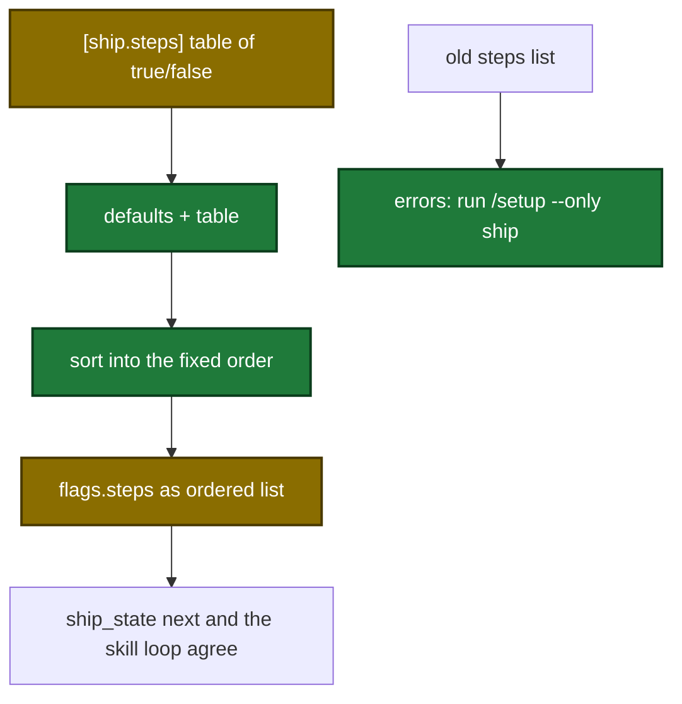

# Spec Delta

## MODIFIED Requirements

### Requirement: Input fields
The tool SHALL accept these input fields; every field is optional.

| Field | Type | Required | Encoding | Meaning |
|---|---|---|---|---|
| `skipConfigCheck` | bool | no | JSON bool | Skip the config-version gate. |
| `hasPlan` | bool | no | JSON bool | A plan exists for this run. |
| `planFile` | string | no | plain text path, e.g. `"docs/plan.md"` | Plan for the `execute` step. |
| `auto` | bool | no | JSON bool | Run unattended. Overrides config `ship.auto` only when `true`. |
| `steps` | string[] | no | plain JSON array, e.g. `["execute","review","pr"]` | Set of step names to run. The order does not matter: the tool sorts the names into the fixed pipeline order. A duplicate name is an error. |
| `quick` | bool | no | JSON bool | Run the steps set to `true` in the `[ship.quick]` table. A step not in the table is off. |
| `quality` | string | no | enum `full` \| `balanced` \| `minimal` | Quality level forwarded to `execute`. |
| `bump` | string | no | plain text, e.g. `"minor"` | Release bump level. |
| `draft` | bool | no | JSON bool | Open the PR as a draft. Overrides config only when `true`. |
| `rebase` | string | no | plain text, e.g. `"skip"` | Rebase strategy. |
| `dryRun` | bool | no | JSON bool | Recorded in `flags.dryRun`. State is still initialized. |
| `resume` | bool | no | JSON bool | Recorded in `flags.resume`. |
| `openspecChange` | string | no | plain text, e.g. `"add-x"` | Recorded in `flags.openspecChange` (`null` when empty). |
| `hookActivePipeline` | bool | no | JSON bool | Recorded in `flags.hookActivePipeline`. |
| `planModeBlocked` | bool | no | JSON bool | Recorded in `flags.planModeBlocked`. |
| `gc` | bool | no | JSON bool | Run the GC branch instead of a pipeline init. |
| `ttlDays` | int | no | JSON integer, e.g. `14`; `0` is legal | GC time-to-live in days. |
| `sessionId` | string | no | plain text | Stamped into the state's `sessionId`. |

- The `steps` field description ends with `Optional. Defaults to config ship.steps. Pass only to override.`

#### Scenario: Pass-through flags recorded
- **WHEN** the call passes `hasPlan:true`, `dryRun:true`, and `openspecChange:""`
- **THEN** `flags.hasPlan` and `flags.dryRun` are `true`
- **AND** `flags.openspecChange` is `null`

#### Scenario: Steps input order ignored
- **WHEN** the call passes `steps:["pr","review","commit"]`
- **THEN** `flags.steps` is `["commit","review","pr"]`
- **AND** `sources.steps` is `"cli"`

### Requirement: Flag merge precedence
The tool SHALL resolve each flag from input, then config `[ship]`, then the built-in default, and SHALL record the winning tier per key in `sources`.

| Flag key | Precedence | Default |
|---|---|---|
| `steps` | non-empty `steps` input (`cli`) > `quick:true` → the `[ship.quick]` table (`quick`) > the `[ship.steps]` table (`config`) > default | `["execute","commit","review","archive-openspec","pr","learnings-commit"]` |
| `auto`, `draft` | input `true` (`cli`) > config bool > default | `false` |
| `quality` | input only; key omitted when not given | none |
| `bump` | see the bump requirement | `"patch"` |
| `reviewThreshold` | config string > default | `"info"` |
| `rebase` | input string > config (`true`→`"auto"`, `false`→`"skip"`, string verbatim, any other type passed through) > default | `"auto"` |
| `verifyPipelineTimeout` | config number > default | `1200` |
| `verifyPipelineInterval` | config number > default | `60` |
| `verifyPipelineMaxIterations` | config number > default | `3` |
| `awaitRemoteReviewTimeout` | config number > default | `600` |
| `awaitRemoteReviewInterval` | config number > default | `60` |
| `awaitRemoteReviewers` | non-empty config array > default | `["copilot"]` |
| `executeWaveTimeout` | config number > default | `1800` |
| `executeWaveInterval` | config number > default | `60` |
| `executeCommitWaves` | config `execute.commitWaves` bool > default | `true` |

- `sources` values: `cli`, `quick`, `config`, `default`, plus the three bump-policy values below.
- A non-boolean `execute.commitWaves` sets `flags.commitWavesInvalidType:true` and keeps the default.
- `[ship.steps]` and `[ship.quick]` are tables of step name → `true` or `false`. The table can also be an inline table under `[ship]`, for example `steps = { harden = true }`.
- In the `[ship.steps]` table, a step that the table does not name uses its default. In the `[ship.quick]` table, a step that the table does not name is off.
- The tool reads each table once per call and reads the keys in sorted order.
- `flags.steps` is always a JSON array of step names in the fixed order: `execute, commit, review, verify-openspec, archive-openspec, harden, pr, verify-pipeline, await-remote-review, learnings-commit`.

Step resolution from config to `flags.steps`:

#### Scenario: Steps from config
- **WHEN** config has `[ship.steps]` with `commit = true`, `review = true`, `execute = false`, `archive-openspec = false`, `pr = false`, `learnings-commit = false`, and the input has no `steps`
- **THEN** `flags.steps` is `["commit","review"]`
- **AND** `sources.steps` is `"config"`

#### Scenario: Defaults with no config
- **WHEN** no `[ship]` section exists and the input sets no flags
- **THEN** `flags.bump` is `"patch"` and `sources.steps` is `"default"`

#### Scenario: Malformed rebase config passes through
- **WHEN** config `[ship]` sets `rebase` to a number
- **THEN** `flags.rebase` holds that number
- **AND** `sources.rebase` is `"config"`

#### Scenario: reviewThreshold from config
- **WHEN** config `[ship]` sets `reviewThreshold = "low"`
- **THEN** `flags.reviewThreshold` is `"low"` and `sources.reviewThreshold` is `"config"`

#### Scenario: Step table fills defaults
- **WHEN** config has `[ship.steps]` with only `harden = true`
- **THEN** `flags.steps` is `["execute","commit","review","archive-openspec","harden","pr","learnings-commit"]`

#### Scenario: Quick table
- **WHEN** config has `[ship.quick]` with `execute = true` and `review = true`, and the call passes `quick:true`
- **THEN** `flags.steps` is `["execute","review"]`
- **AND** `sources.steps` is `"quick"`

### Requirement: Pipeline validation
The tool SHALL collect validation problems into `errors` and `warnings`, and SHALL NOT create a state file when `errors` is non-empty.

| Condition | Goes to | Text (short) |
|---|---|---|
| `cleanup` in the step list | error | `"cleanup" is a reserved terminal step appended automatically by the pipeline. ...` |
| `received-review` or `commit-fixes` in the step list, from any tier | error | `"<s>" in --steps is a conditional step the pipeline dispatches itself when review findings need fixing — remove it. Valid values: ...` (`ship.steps` or `ship.quick` in place of `--steps` when not from input) |
| Unknown step name, `sources.steps` is `cli` | error | `Unrecognized step "<s>" in --steps. Valid values: execute, commit, review, verify-openspec, archive-openspec, harden, pr, verify-pipeline, await-remote-review, learnings-commit` |
| Unknown step name from any other tier | warning | same text, with `ship.steps` or `ship.quick` in place of `--steps` |
| `steps = [...]` (old list shape) | error | `ship.steps in .sdlc-v2/local.toml (or ~/.sdlc/local.toml) uses the old list shape (steps = [...]). The plugin now fixes the step order, so each step is an on/off flag. Replace the list with a [ship.steps] table, for example: [ship.steps] harden = true. Run /setup --only ship to rewrite it.` |
| `quick = [...]` (old list shape) | error | the same text with `ship.quick`, `quick = [...]` and `[ship.quick]` |
| Non-bool value in a step table, e.g. `harden = "yes"` | error | `ship.steps.harden must be true or false, got "yes". Set it to true or false in [ship.steps].` (`ship.quick.<name>` for the quick table) |
| Scalar `steps` or `quick` value, e.g. `steps = "harden"` | error | `ship.steps must be a [ship.steps] table of true/false values, got string. Run /setup --only ship to rewrite it.` (`ship.quick` for the quick key) |
| Unknown key in a step table, e.g. `draft = false` below `[ship.steps]` | error | `ship.steps has an unknown key "draft". Every key below the [ship.steps] header belongs to that table. Move other [ship] keys above the header.` |
| Duplicate name in the `steps` input | error | `--steps lists "review" more than once. List each step once. The order does not matter.` |
| `quality` not `full`/`balanced`/`minimal` | error | `Invalid --quality "<q>". Valid values: full, balanced, minimal` |
| `reviewThreshold` not exactly `critical`/`high`/`medium`/`low`/`info` | error | `invalid reviewThreshold "<t>": use one of critical, high, medium, low, info in [ship] of .sdlc-v2/local.toml (or ~/.sdlc/local.toml)` |
| Resolved step list is empty | error | `All steps are skipped. At least one step must run.` |
| `hasPlan:true`, `execute` in steps, `planFile` empty | error | `ship cannot run the "execute" step without a plan document. Fix: re-run with --plan <path-to-plan.md>. ...` |
| `bump` from input and `pr` not in steps | error | `--bump "<b>" specified but pr step is skipped — resolve by removing --bump or adding "pr" to ship.steps.` |
| `quick:true` with a non-empty `steps` input | error | `--quick + --steps not allowed: use --quick or --steps, not both` |
| `quick:true` and no `[ship.quick]` table, or a table with no step set to `true` | error | `No quick profile defined. Run \`ship --init-config\` to set one.` |
| `[version]` config read fails for a reason other than not-found | error | `version config: <cause>` |
| `execute.commitWaves` is not a boolean | warning | `execute.commitWaves in ship config is not a boolean — value ignored, defaulting to true. ...` |
| Always | warning | `If review finds critical/high issues, pipeline will pause for fix approval` |
| Current branch equals the git default branch | warning | `You are on the default branch "<b>". Ship pipelines should run on feature branches.` |

- A conditional step name (`received-review`, `commit-fixes`) set to `true` in a step table is kept, so the conditional-step check rejects it. Set to `false`, it is ignored with no problem.
- An unknown key in a step table is an error whatever its value.

#### Scenario: Execute without plan
- **WHEN** the call passes `hasPlan:true`, `steps:["execute","commit"]`, and no `planFile`
- **THEN** `errors` is non-empty
- **AND** `stateFile` is empty

#### Scenario: Invalid reviewThreshold
- **WHEN** config `[ship]` sets `reviewThreshold = "LOW"`
- **THEN** `errors` has an entry naming every value `critical`, `high`, `medium`, `low`, `info`
- **AND** no `ship-*.json` file exists under `.sdlc-v2/runs/`

#### Scenario: Reserved step
- **WHEN** the call passes `steps:["commit","cleanup"]`
- **THEN** `errors` is non-empty

#### Scenario: Conditional step in config
- **WHEN** config has `[ship.steps]` with `received-review = true` and the input has no `steps`
- **THEN** `errors` has one entry naming `"received-review"` as a conditional step in `ship.steps` and listing every valid step
- **AND** `warnings` has no entry naming `received-review`
- **AND** no `ship-*.json` file exists under `.sdlc-v2/runs/`

#### Scenario: Conditional step in input
- **WHEN** the call passes `steps:["commit","commit-fixes"]`
- **THEN** `errors` has one entry naming `"commit-fixes"` as a conditional step in `--steps`

#### Scenario: Bump without pr step
- **WHEN** the call passes `steps:["commit"]` and `bump:"minor"`
- **THEN** `errors` has an entry containing `pr step is skipped`

#### Scenario: Default-branch warning without pr
- **WHEN** the call runs on `main` with `steps:["commit"]`
- **THEN** `warnings` contains `You are on the default branch "main". Ship pipelines should run on feature branches.`

#### Scenario: Old step list rejected
- **WHEN** config `[ship]` sets `steps = ["execute", "commit"]`
- **THEN** `errors` has an entry that contains `uses the old list shape` and `Run /setup --only ship to rewrite it.`
- **AND** no `ship-*.json` file exists under `.sdlc-v2/runs/`

#### Scenario: Old quick list rejected
- **WHEN** config `[ship]` sets `quick = ["execute"]`
- **THEN** `errors` has an entry that starts with `ship.quick in .sdlc-v2/local.toml (or ~/.sdlc/local.toml) uses the old list shape`

#### Scenario: Non-bool step value
- **WHEN** config has `[ship.steps]` with `harden = "yes"`
- **THEN** `errors` has the entry `ship.steps.harden must be true or false, got "yes". Set it to true or false in [ship.steps].`

#### Scenario: Non-bool quick value
- **WHEN** config has `[ship.quick]` with `execute = "yes"` and the call passes `quick:true`
- **THEN** `errors` has an entry that names `ship.quick.execute`

#### Scenario: Scalar steps value
- **WHEN** config `[ship]` sets `steps = "harden"`
- **THEN** `errors` has the entry `ship.steps must be a [ship.steps] table of true/false values, got string. Run /setup --only ship to rewrite it.`

#### Scenario: Unknown key below the step table
- **WHEN** config has `[ship.steps]` with `draft = false`
- **THEN** `errors` has an entry that starts with `ship.steps has an unknown key "draft".`

#### Scenario: Duplicate step in input
- **WHEN** the call passes `steps:["review","review"]`
- **THEN** `errors` has the entry `--steps lists "review" more than once. List each step once. The order does not matter.`

#### Scenario: No quick table
- **WHEN** config has no `[ship.quick]` table and the call passes `quick:true`
- **THEN** `errors` has the entry `No quick profile defined. Run \`ship --init-config\` to set one.`

### Requirement: Default-branch push gate
The tool SHALL return a `DomainError` when the current branch is exactly `main` or `master` and `pr` is in the resolved step list, regardless of config.

- Message: `ship cannot run the "pr" step on default branch "<b>" — pushing to main/master is never auto-approved`.
- Suggestion: switch to a feature branch, or remove `"pr"` from `--steps`/`ship.steps`.
- The gate is decided by the branch name only, not by git config, and it wins over any collected `errors`.

#### Scenario: Default steps on main
- **WHEN** the call runs on `main` with the default steps
- **THEN** the tool returns a `DomainError`

#### Scenario: No pr step on main
- **WHEN** the call runs on `main` with `steps:["commit"]`
- **THEN** the call succeeds

#### Scenario: Feature branch
- **WHEN** the call runs on `feature/x` with the default steps
- **THEN** the call succeeds
