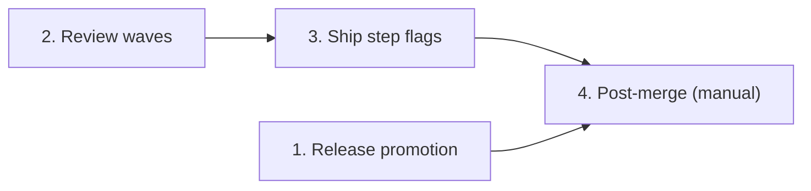

# Tasks

Group dependencies. Group 1 has no path to the other groups, so it can run in parallel with them. Task 7 and Task 8 need Task 3:

## 1. Release promotion

- [x] 1.1 Change the level rule, add the stable check and the `NOTICE:` line, and raise the script version to 10 in `.github/scripts/promote-release.cjs` and its byte-identical copy `internal/tools/payloads/promote-release.cjs`, with guard tests in `.github/scripts/__tests__/promote-release-guard.test.cjs` (Task 1: Promotion guard accepts a level above the RC series; both copies are pinned by `TestPayloads_MatchCheckedIn`) — verify: `node --test .github/scripts/__tests__/promote-release-guard.test.cjs && go test ./internal/tools/ -run TestPayloads` <!-- ref:1-1-change-the-level-rule-add-the-stable-1a9c72 -->
- [x] 1.2 Describe the level input and add the four-row rule table in `docs/versioning.md` (Task 2: Promotion docs describe the level input and its rules) — verify: `grep -n "Enter the target version" docs/versioning.md` returns no line <!-- ref:1-2-describe-the-level-input-and-add-the-25bfd7 -->

## 2. Review waves

- [x] 2.1 Rename the review key to `maxParallelDimensions` in `plugins/sdlc/schemas/sdlc-local.schema.json`, `plugins/sdlc/templates/local.toml` and `internal/setupmeta/sections.go`, with the sync test, the field lookup in `internal/tools/review_test.go` and the new schema digest in `internal/tools/scaffold_payloads_test.go` (Task 3: Review config key becomes maxParallelDimensions; the digest pin is shared with task 3.2) — verify: `go test ./internal/setupmeta/... && go test ./internal/tools/ -run 'Template|Payloads|MatchesSetupField'` <!-- ref:2-1-rename-the-review-key-to-maxparallel-11a9f9 -->
- [x] 2.2 Replace the dimension cap with `planWaves`, `waves`, `wave_count`, `max_parallel_dimensions`, the old-key error and the manifest-mode `next` text in `internal/tools/review.go`, with wave tests in `internal/tools/review_test.go` (Task 4: review_prepare returns waves for every dimension) — verify: `go test ./internal/tools/ -run 'Review|PlanWaves|MaxParallel|IndexEntry|CritiquePlan|MCPToolParameterDescriptions|SchemaPropertyDescriptions'` <!-- ref:2-2-replace-the-dimension-cap-with-planw-922787 -->
- [x] 2.3 Rewrite Step 2 and Step 3 as a per-wave dispatch and poll loop, remove the queued note and add the interruption note in `plugins/sdlc/skills/review/SKILL.md`, and update `docs/skills/review.md`, `.sdlc-v2/review-dimensions/documentation-review.md` and `.sdlc-v2/review-dimensions/mcp-tool-review.md` (Task 5: Review skill starts and polls one wave at a time) — verify: `go test ./internal/skillcheck/...` and `git grep -n -E 'maxDimensions|QUEUED|queued_dimensions|dimension_cap' -- plugins/sdlc/skills/review docs/skills/review.md .sdlc-v2/review-dimensions` returns only the old-key sentence in `docs/skills/review.md` <!-- ref:2-3-rewrite-step-2-and-step-3-as-a-per-w-83c21c -->

## 3. Ship step flags

- [x] 3.1 Add order B, `OrderSteps` and `ResolveStepTable` in `internal/shipmeta/fields.go`, and the table read, old-list, scalar, non-bool, unknown-key and duplicate errors and the field descriptions in `internal/tools/ship.go`, with tests in `internal/shipmeta/fields_test.go` and `internal/tools/ship_test.go` (Task 6: ship_prepare resolves steps from on/off tables in order B) — verify: `go test ./internal/shipmeta/... && go test ./internal/tools/ -run 'Ship|MCPToolParameterDescriptions|SchemaPropertyDescriptions'` <!-- ref:3-1-add-order-b-ordersteps-and-resolvest-4dffb8 -->
- [x] 3.2 Change `steps` and `quick` to objects of booleans in `plugins/sdlc/schemas/sdlc-local.schema.json` and to commented inline tables in `plugins/sdlc/templates/local.toml`, with `stepTable` in `internal/tools/template_tips_test.go`, `propertyNamesEnum` and `TestLocalSchemaStepsDefault_MatchesBuiltIns` in `internal/shipmeta/fields_test.go`, and the new schema digest in `internal/tools/scaffold_payloads_test.go` (Task 7: Ship schema and template use step tables; needs task 2.1 for the shared digest pin) — verify: `go test ./internal/shipmeta/... && go test ./internal/tools/ -run 'Template|LocalTemplate|Payloads'` <!-- ref:3-2-change-steps-and-quick-to-objects-of-43ca29 -->
- [x] 3.3 Point `CanonicalSteps` at `shipmeta.CanonicalSteps` and make `steps` and `quick` `flag-set` fields in `internal/setupmeta/sections.go`, with order-B tests in `internal/setupmeta/sections_test.go` and the `flag-set` schema check in `internal/setupmeta/schema_sync_test.go` (Task 8: Setup fields use the ship step list as flag sets) — verify: `go test ./internal/setupmeta/... && go test ./internal/config/ -run ShippedReviewThreshold` and `go list -deps ./internal/shipmeta` shows no `internal/setupmeta` <!-- ref:3-3-point-canonicalsteps-at-shipmeta-can-de8f6b -->
- [x] 3.4 Render the resolved step table and the old-list note in `shipConfigPhase` of `internal/hooks/session_start.go`, with tests in `internal/hooks/session_start_test.go` (Task 9: Session-start summary reads the step table) — verify: `go test ./internal/hooks/ -run ShipConfig` <!-- ref:3-4-render-the-resolved-step-table-and-t-312f74 -->
- [x] 3.5 Change the step order to order B and `ship.steps[]` to `ship.steps` in `plugins/sdlc/skills/ship/SKILL.md`, `plugins/sdlc/skills/ship/reference.md` and `plugins/sdlc/skills/ship/state-format.md`, and keep the pinned line `ship/SKILL.md:28` in place (Task 10: Ship skill text uses order B and step flags) — verify: `go test ./internal/skillcheck/...` and `grep -n "Enter the target version" plugins/sdlc/skills/ship/SKILL.md` returns no line <!-- ref:3-5-change-the-step-order-to-order-b-and-6cbe9f -->
- [x] 3.6 Change the examples and precedence text to step tables in `plugins/sdlc/skills/ship/config-format.md`, `docs/skills/ship.md` and `docs/skills/harden.md`, and move the pinned key `ship/config-format.md:128` in `internal/skillcheck/skillcheck_worktree_test.go` (Task 11: Ship and harden docs describe step flags) — verify: `go test ./internal/skillcheck/... && go test ./internal/config/ -run ShippedReviewThreshold` <!-- ref:3-6-change-the-examples-and-precedence-t-9fec7c -->
- [x] 3.7 Add `normalizeFlagSetFields` and the tool description sentence in `internal/tools/setup_write.go`, with flag-set tests in `internal/tools/setup_write_test.go`, update the answer mapping in `plugins/sdlc/skills/setup/SKILL.md`, and move the pinned keys `setup/SKILL.md:859` and `:930` in `internal/skillcheck/skillcheck_worktree_test.go` when their lines move (Task 12: Setup writes a flag-set answer as a table) — verify: `go test ./internal/tools/ -run 'SetupWrite|MCPToolParameterDescriptions' && go test ./internal/skillcheck/...` <!-- ref:3-7-add-normalizeflagsetfields-and-the-t-c16b91 -->

## 4. Post-merge (manual maintainer step)

- [ ] 4.1 Manual maintainer step, not dispatched by execute: after all tasks merge, run `task deploy`, start a new Claude Code session, then replace the old step lists with ten-key step tables in `.sdlc-v2/local.toml` and `~/.sdlc/local.toml` (Post-merge step: update the two local ship configs) — verify: neither file has `steps = [` or `quick = [`, and `/sdlc:ship --dry-run` resolves the project steps to `execute, commit, review, verify-openspec, archive-openspec, harden, pr, verify-pipeline` <!-- ref:4-1-manual-maintainer-step-not-dispatche-4488d3 -->

## Workflow follow-up

- After all tasks, run the plan checks V1 to V7: `task check`, `node --test .github/scripts/__tests__/*.test.cjs internal/dashboard/web/testdata/view.test.cjs`, and the V3 to V6 grep blocks of the plan.
- After task 4.1, run V8: `/sdlc:review --dry-run` shows the wave count, and `/sdlc:ship --dry-run` shows order B.
- `/sdlc:ship` validates and archives this change. Do not run `openspec archive` directly.
