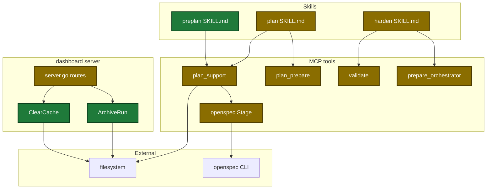
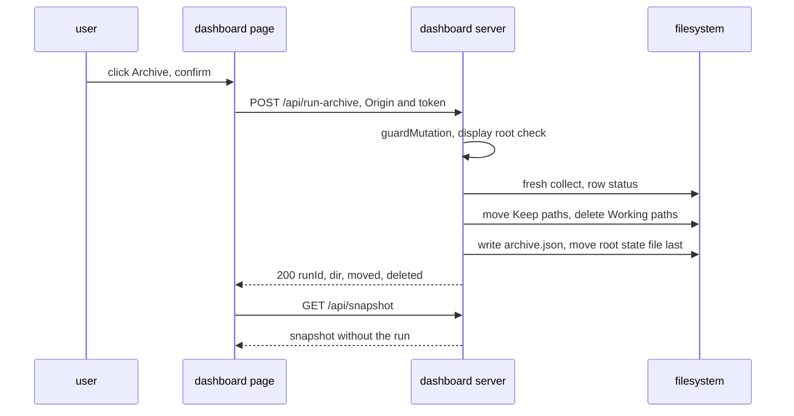
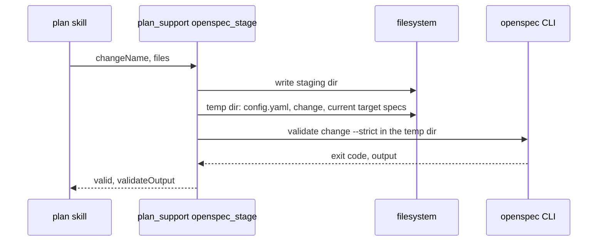
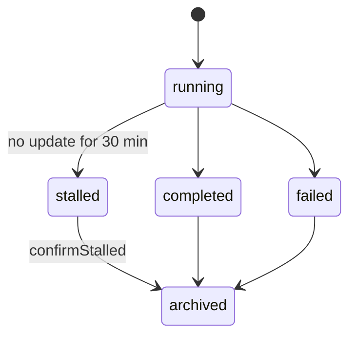

# Design

## Context

- See proposal.md - Why.
- `plan_prepare` always starts a run and prunes other runs (`internal/tools/plan.go:1293-1384`). Preplan cannot call it.
- Only `POST /api/stop` changes files today. Its Origin and token checks are inline (`internal/dashboard/web/server.go:376-394`).
- A ship row hides its nested execute and review runs (`internal/tools/dashboard_join.go:129-190`).
- The per-run dir id (`startedAt` digits) differs from the state file name (`internal/tools/execute_state.go:993-998`).
- The stage check temp dir holds only `openspec/config.yaml` and the change (`internal/openspec/stage.go:240-259`). Ship validates in the real tree (`internal/openspec/materialize.go:175`).

## Goals / Non-Goals

**Goals:**
- One shared guard for every dashboard route that changes files.
- One run-id rule (`execRunID`) and one bare-name rule (`bareRunName`).
- The plan review keeps its quality: full re-run of all lanes and lenses.
- The plan stage check and the ship check give the same result for a delta.

**Non-Goals:**
- Archive restore and archive retention.
- Mermaid rendering in the dashboard.
- A setup menu row for `[harden]`.

## Architecture

Touched parts, by layer:



Main runtime flow, run archive:



Stage check flow after the change:



Persisted state of a run row:



## Data contracts

```go
// plan_support
Topic          string `json:"topic,omitempty"`
PreplanFile    string `json:"preplanFile,omitempty"`
PreplanCreated bool   `json:"preplanCreated"`

// prepare_orchestrator
CustomInstructions map[string][]string `json:"customInstructions,omitempty"`
Next               string              `json:"next"`

// dashboard
type ArchiveRunOut struct { RunID, Dir string; Moved, Deleted []string }
type ClearCacheOut struct { FreedBytes int64; Classes []ClearCacheClass; Skipped []ClearCacheSkip }

// openspec
var ErrTargetSpec = errors.New("openspec stage: target spec")
func copyTargetSpecs(activeRoot, tmp string, files []StageFile) error
```

Config change:

```diff
+[harden.instructions]
+plan-guardrails = []
+execute-guardrails = []
+review-dimensions = []
+copilot-instructions = []
```

## Decisions

| Decision | Chosen | Rejected alternatives | Reason |
|---|---|---|---|
| Guardrails for preplan | new `plan_support` action `preplan_context` | `plan_prepare`, a new MCP tool | `plan_prepare` starts a run; a new tool costs 7 registry edits |
| Archive and clear entry | guarded POST routes on the dashboard server | `dashboard` MCP tool actions | the tool is annotated non-destructive |
| Archive members | the server finds them from a fresh collect | the client sends them | the client sends only repo and run id |
| Archive dir name | `run-archive` beside `runs/` | `archive` | `archive` already names the OpenSpec step |
| Guardrail lane split | G22 moves to new lane 5 | split by guardrail range | `lanes[3]` and `lanes[4]` keep their meaning |
| Lane dispatch | foreground, inline prompt, retry once | background with evidence polls | polls and file prompts cost time and permission denials |
| Harden config | `config.toml` with four per-surface lists | `local.toml` | user choice (D5) |
| Detail viewer | modal dialog on the right side | a div drawer | only `.stage` may scroll; ids `detail` and `<aside>` are banned |
| Stage check specs | copy only the target specs of the deltas | copy the whole `openspec/specs/` tree; a skill rule to copy every scenario | the CLI reads only target specs; a skill rule is not deterministic |

## Risks / Trade-offs

| Risk | Impact | Mitigation |
|---|---|---|
| A crash in the middle of an archive | a run is partly moved | the root state file moves last, so the row stays visible and a second archive finishes the move |
| Clear deletes a file in use | lost evidence lines | only rotated `.1` files older than 30 minutes; the server log is truncated, never deleted |
| Path from a request | file access outside `.sdlc-v2/` | `repo` must equal a display root; the run id must pass `bareRunName` and match a state from `state.List` |
| Foreground lanes block the session | no other work during Step 3 | the lanes run in parallel in one message |
| Custom instructions relax a rule | weaker guardrails | the validator rejects a severity downgrade in code |
| Stage check now fails plans that passed before | more Create-flow fix rounds | the failure moves from ship to plan time, where the plan skill already fixes and re-stages up to 5 times |
