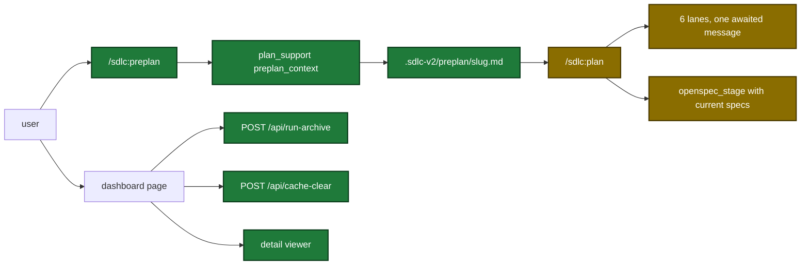

# Proposal

## Why

- Problem: six gaps waste user time or hide data. Ideas reach `/sdlc:plan` unsorted, plans run slow, harden ignores team text, and the dashboard cannot archive a run, clear cache files, or show full detail. The plan OpenSpec check also passes deltas that ship then rejects.
- Evidence: plan run `plan-main-20261008T175538Z` took 2 h 50 min for 32 tasks. Lanes poll evidence files, and the guardrail lane made 41 tool calls (`plugins/sdlc/skills/plan/lane-guardrail-compliance-prompt.md:28-31`). One machine holds 3294 `sdlc-*` temp dirs. `ship_prepare` stopped with `MODIFIED "Dispatch metadata" omits scenario(s) the current spec still has` after the plan check passed.
- Why now: the user listed the six items after that slow run (`tmp/features.md`), and asked for the stage check fix after the ship stop.

## What Changes

| Area | Before | After |
|---|---|---|
| Preplan | no skill | `/sdlc:preplan <topic>` keeps `.sdlc-v2/preplan/<slug>.md` current and checks each proposal against the plan guardrails |
| `plan_support` | 9 actions | 10 actions: adds `preplan_context` |
| Plan Step 2 | no format check before the lanes | one `plan_format` pre-check, at most 3 calls |
| Plan Step 3 | 5 lanes in the background, evidence files polled | 6 lanes in one awaited message with inline prompts; G22 moves to the new `style-compliance` lane; G14 reads plan text only |
| Harden | built-in rules only | `[harden.instructions]` lists are printed and passed to the orchestrator |
| Guardrail validate | no severity check | a candidate that lowers the severity of an existing id is an error finding |
| Dashboard routes | only `POST /api/stop` changes files | adds `POST /api/run-archive`, `POST /api/cache-clear` and the read-only `GET /api/learning` |
| Dashboard detail | ship review shows counts; ship plan shows explorers only; text cut at 200 characters | the same detail as a standalone run; a right-side detail viewer shows full text |
| Stop error body | plain text | JSON `{"error":{"code","message","suggestion"}}`; status codes do not change |
| OpenSpec stage check | temp copy has no current specs; a bad MODIFIED delta passes | temp copy holds the current target specs; the same delta fails at plan time |

User flow after the change (preplan to plan, and the dashboard controls):

## Capabilities

### New Capabilities
- `skill-preplan`: the `/sdlc:preplan` dialogue that keeps one topic file and checks proposals against the plan guardrails.

### Modified Capabilities
- `tool-plan-support`: new action `preplan_context`.
- `tool-plan-prepare`: six lanes; G22 moves to lane `style-compliance`.
- `skill-plan`: awaited inline lane dispatch, format pre-check, six-lane markers.
- `pipeline-dashboard`: archive, cache clear, learning body, detail viewer, step detail parity, command groups.
- `tool-prepare-orchestrator`: `customInstructions` and `next` in the harden output.
- `tool-validate`: guardrail severity downgrade check.
- `skill-harden`: prints and applies the custom instruction lists.
- `openspec-staging`: the pre-approval validation copies the current target specs.

## Impact

| Path | Kind | Change |
|---|---|---|
| `plugins/sdlc/skills/preplan/SKILL.md` | skill | new |
| `plugins/sdlc/skills/plan/SKILL.md` | skill | Step 2 pre-check, Step 3 six awaited lanes |
| `plugins/sdlc/skills/plan/lane-style-compliance-prompt.md` | skill | new lane prompt (G22) |
| `plugins/sdlc/skills/plan/lane-guardrail-compliance-prompt.md` | skill | G14 only, plan text only |
| `plugins/sdlc/skills/harden/SKILL.md`, `plugins/sdlc/agents/harden-orchestrator.md` | skill | custom instructions |
| `internal/tools/plan_support.go` | MCP tool | `preplan_context`, `ErrTargetSpec` mapping |
| `internal/openspec/stage.go` | MCP tool | copy current target specs before validate |
| `internal/tools/plan.go` | MCP tool | `buildLanes` adds lane 5 |
| `internal/tools/validators.go` | MCP tool | severity downgrade finding |
| `internal/tools/harden.go`, `internal/tools/prepare_orchestrator.go` | MCP tool | manifest and output fields |
| `internal/tools/dashboard_*.go`, `internal/tools/run_artifacts.go` | MCP tool | archive, clear, detail data |
| `internal/dashboard/web/server.go`, `cmd/sdlc/main.go` | MCP tool | new routes and shared guard |
| `internal/dashboard/web/static/*` | MCP tool | detail viewer, archive and clear controls |
| `internal/paths/paths.go` | MCP tool | `preplan` and `run-archive` data dirs |
| `plugins/sdlc/schemas/sdlc-config.schema.json`, `plugins/sdlc/templates/config.toml` | schema, template | `[harden.instructions]` |
| `plugins/sdlc/schemas/ship-state.schema.json` | schema | `planReviewRounds` |
| `docs/skills/preplan.md`, `docs/dashboard.md`, `docs/plan-architecture.md`, `docs/skills/harden.md` | doc | new and changed sections |
