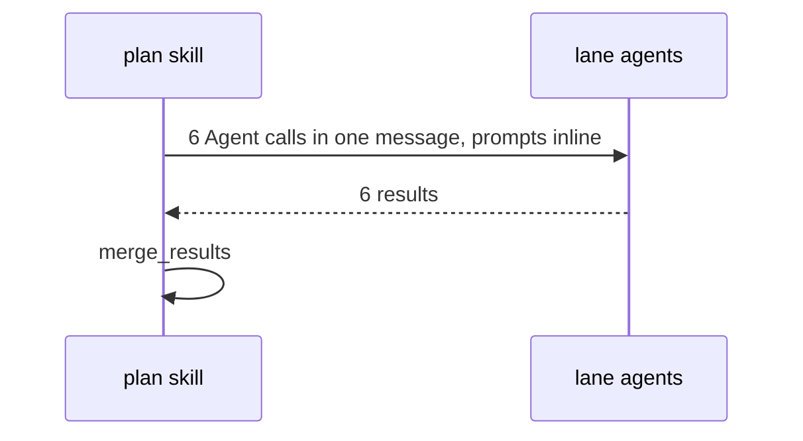

# Spec Delta

## MODIFIED Requirements

### Requirement: Checkpoints and integrity markers
The skill SHALL record progress with `plan_mark`, one call at a time.

| When | Call |
|---|---|
| Step 0, after the `plan-file` marker | `plan_mark({marker: "checkpoint", path: "", data: {step: "0", iteration: 0}})` |
| Start of Steps 1, 2, 3, 4, 5, 6, 6.5, 6.6, 7 | `plan_mark({marker: "checkpoint", path: "", data: {step, iteration}})` |
| Fan-outs (Step 1 explorers, Step 3 lanes, Step 5 lenses or reviewer) | same, plus `expectedWriters` |
| After the `guardrail-compliance` lane result is merged | `plan_mark({marker: "guardrailsEvaluated"})` |
| After all six lanes returned and merged | `plan_mark({marker: "critiqueRan"})` |
| Before the Step 7 handoff branch | `plan_mark({marker: "done"})` |

- `guardrailsEvaluated` and `critiqueRan` are written once per run, never on a re-dispatch.
- Steps 0–2 use `iteration: 0`; the first Step 3 and Step 5 rounds are `r1`.

#### Scenario: Critique marker waits for all lanes
- **WHEN** five of the six Step 3 lanes have returned
- **THEN** the skill has not called `plan_mark({marker: "critiqueRan"})`

## ADDED Requirements

### Requirement: Awaited inline lane dispatch
The skill SHALL dispatch all six Step 3 lanes in one message as foreground Agent calls, with the filled prompt text inline, and SHALL NOT poll `evidence_digest` or the evidence directory for lanes, lenses, the reviewer, or Gate A.

#### Scenario: Denied dispatch
- **WHEN** the permission check denies one lane dispatch
- **THEN** the skill sends that dispatch again one time
- **AND** a second denial merges that lane with status `fail`

#### Scenario: Prompt delivery
- **WHEN** the skill dispatches a lane
- **THEN** the Agent prompt holds the filled template text and does not tell the agent to read its instructions from a file

### Requirement: Format pre-check
At the end of Step 2, the skill SHALL call `validate` with `action: "plan_format"` and `final: false`, fix the findings, and stop after 3 calls.

#### Scenario: Findings left after 3 calls
- **WHEN** the third `plan_format` call still returns findings
- **THEN** the skill goes to Step 3
- **AND** the Step 6.6 format gate blocks the handoff until the findings are fixed

### Requirement: Guardrail lane reads plan text only
The `guardrail-compliance` lane SHALL judge G14 from the plan text only, and SHALL report a guardrail that needs source proof without a file:line citation as an issue.

#### Scenario: Missing citation
- **WHEN** a guardrail needs proof from source and the plan cites no file:line
- **THEN** the lane reports a G14 issue for the missing citation
- **AND** the lane opens no source file
