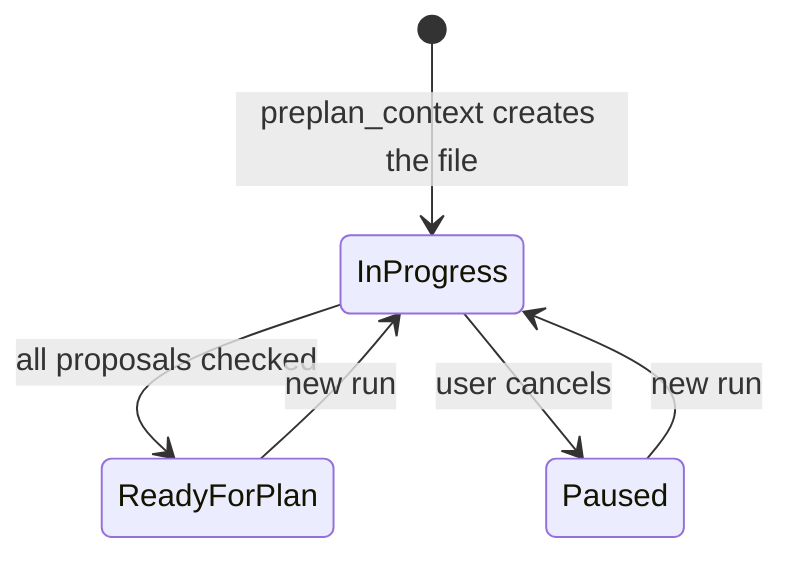

# Spec Delta

## Purpose

Lets a user shape an idea into one topic file, with each proposal checked against the plan guardrails, before `/sdlc:plan` reads that file.

## ADDED Requirements

### Requirement: Topic file start
The `/sdlc:preplan` skill SHALL get the plan guardrails and the topic file path from `plan_support` action `preplan_context`, and SHALL NOT start a plan run.

#### Scenario: First run for a topic
- **WHEN** the user runs `/sdlc:preplan auth flow` and `.sdlc-v2/preplan/auth-flow.md` does not exist
- **THEN** the skill calls `plan_support` with `action: "preplan_context"` and `topic: "auth flow"`
- **AND** the topic file exists with status `in progress`
- **AND** no new `plan-*` state file exists in `.sdlc-v2/runs/`

#### Scenario: Tool error
- **WHEN** `preplan_context` returns an error
- **THEN** the skill prints the error and stops

### Requirement: One question at a time
The skill SHALL ask one question in each AskUserQuestion call and SHALL update the topic file after each answer.

- Questions ask about function and effect, not about code.
- A vague answer gets one follow-up question.

#### Scenario: Answer recorded
- **WHEN** the user answers a question with a new decision
- **THEN** the topic file `## Decisions` table has one more row before the next question

### Requirement: Guardrail check per proposal
The skill SHALL check each proposal against each plan guardrail before the topic is ready for plan, and SHALL record one result row for each proposal in `## Guardrail check`.

| Conflict | Result row |
|---|---|
| breaks an `error` guardrail after one rework | `dropped — <id>` |
| breaks a `warning` guardrail, user keeps it | `kept — <id>` |
| no conflict | `pass` |
| guardrails unavailable | `unavailable — <warning>` |

#### Scenario: Error guardrail conflict
- **WHEN** a proposal still breaks an `error` guardrail `no-ci-bypass` after one rework
- **THEN** the result row is `dropped — no-ci-bypass`

#### Scenario: Warning guardrail conflict
- **WHEN** a proposal breaks a `warning` guardrail
- **THEN** the skill shows the reason and asks the user to keep or rework the proposal

### Requirement: Flow diagrams with a text twin
The skill SHALL write a before and after Mermaid diagram under `## Flows` for each proposal that changes a flow, and SHALL write a numbered text list of the same steps below each diagram.

#### Scenario: Flow change
- **WHEN** a proposal changes how a user starts a plan
- **THEN** `## Flows` has a Mermaid diagram and a numbered list with the same steps

#### Scenario: No flow change
- **WHEN** no proposal changes a flow
- **THEN** `## Flows` has the line `No flow change.`

### Requirement: Topic status
The topic file status SHALL change only as the diagram shows.

#### Scenario: Cancel
- **WHEN** the user cancels during a question
- **THEN** the status is `paused` and the file stays

### Requirement: Handoff to plan
When the topic is ready, the skill SHALL ask whether to start `/sdlc:plan <preplanFile>` now, and SHALL keep the status `ready for plan` when the user stops or the plan skill fails.

#### Scenario: User starts the plan
- **WHEN** the user picks start
- **THEN** the skill runs `/sdlc:plan` with the topic file path in the same session

#### Scenario: Plan skill fails
- **WHEN** the plan skill stops with an error
- **THEN** the skill prints the error and tells the user to run `/sdlc:plan <preplanFile>`
