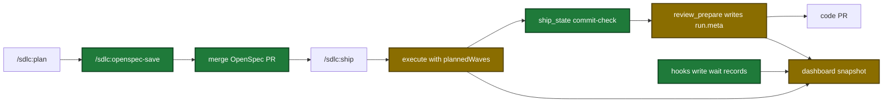

# Proposal

## Why

- The dashboard hides facts a person needs: a run that waits for an answer looks stuck, and review and execute show only started work.
- Evidence: ship run `20261008T110918Z` ran 8 of 23 review dimensions, and the dashboard did not show the 15 that never started. `tmp/improvements.md` lists 8 dashboard and pipeline items.
- Spec work and code ship in one PR today. A separate OpenSpec PR lets a reviewer approve the specs first.

## What Changes

| Area | Before | After |
|---|---|---|
| Feed order | Open runs first, in snapshot order, then completed runs | Waiting on you, running, failed, stalled, completed. Newest start first in each group |
| Plan setup station | No detail | Guardrail counts stored at the first `plan_prepare` call |
| Waiting runs | A run that waits for an answer turns `stalled` after 30 min | Wait records from hooks. "WAITING ON YOU" mark, `waiting` count, `(N)` in the tab title. No stall while a wait is open |
| Plan review station | Page sums per-round counts. Repair-limit answers are not stored | Distinct totals, repair-limit flag, each finding with its choice (`accepted`, `rejected`, `stop`) |
| Review run plan | `run.meta` written at the first check-in. Rows only for started dimensions | `review_prepare` writes the wave plan. Rows for every planned dimension. Ship report wave table |
| Ship commit step | Skill stages with a shell line. The commit agent always runs | `ship_state` `commit-check` stages and checks. A clean tree completes the step with `nothing to commit: …` |
| Execute waves | Waves appear at `wave-start` | `init` stores `plannedWaves`. Every planned wave shows from the start |
| Station track | Capped at 1100 px | Full panel width. Stations wrap to a new row. No sideways scroll |
| OpenSpec save | Ship saves the change in the same PR as the code | `/sdlc:openspec-save` saves the change on its own branch and PR. A later ship saves nothing again |

Flow after the change, from plan to two PRs and the dashboard:

## Capabilities

### New Capabilities
- `hook-attention-records`: hooks write and delete wait records for open questions and permission prompts.
- `tool-openspec-save`: MCP tool that saves a staged OpenSpec change on its own branch.
- `skill-openspec-save`: skill that saves, commits, and opens a PR for a staged OpenSpec change.

### Modified Capabilities
- `pipeline-dashboard`: feed order, attention, plan station detail, review plan rows, commit result, planned waves, station track, tab title.
- `hook-record-user-input`: answer and prompt hooks close wait records.
- `tool-plan-prepare`: stores guardrail counts once.
- `tool-plan-support`: `merge_results` gives each issue a stable ID.
- `tool-plan-mark`: `review-round` takes finding IDs. New `review-outcome` marker.
- `skill-plan`: records finding IDs, asks one question for each open finding at the repair limit, offers `openspec-save`.
- `tool-review-prepare`: mints `run_id` and `worker_id`, writes `run.meta`, takes `dryRun`.
- `tool-execute-state`: `run.meta` write point, `ledger_skip`, `init` `plannedWavesJson`.
- `skill-review`: reads `run_id` and `worker_id`, records stopped workers.
- `tool-ship-state`: `commit-check` action, review wave table in the report.
- `skill-ship`: commit step route, staging rule, review decide records, Saved-plan message.
- `skill-execute`: passes the wave plan to `init`.
- `openspec-staging`: a Saved header stops a second save.

## Impact

| Path | Kind | Change |
|---|---|---|
| `internal/attention/` | MCP tool | new wait record package |
| `internal/hooks/` | hook | question, permission, and session wait hooks |
| `plugins/sdlc/hooks/hooks.json` | hook | 4 new entries |
| `internal/tools/dashboard_*.go`, `internal/tools/review_ledger_plan.go` | MCP tool | snapshot fields and builders |
| `internal/dashboard/web/static/` | doc | page order, marks, tiles, track |
| `internal/tools/plan.go`, `internal/tools/plan_support.go` | MCP tool | guardrail counts, finding IDs, outcome marker |
| `internal/tools/review.go`, `internal/tools/execute_state.go` | MCP tool | run plan write, `ledger_skip`, `plannedWavesJson` |
| `internal/tools/ship_state.go`, `internal/tools/ship_report.go` | MCP tool | `commit-check`, review wave table |
| `internal/tools/openspec_save.go` | MCP tool | new `openspec_save` |
| `plugins/sdlc/schemas/ship-state.schema.json`, `plugins/sdlc/schemas/execute-state.schema.json` | schema | `commitBaseHead`, `plannedWaves` |
| `plugins/sdlc/skills/{plan,review,ship,execute,openspec-save}/SKILL.md` | skill | flow changes and new skill |
| `docs/dashboard.md`, `docs/skills/*.md`, `README.md` | doc | matching docs and tool count 33 |
