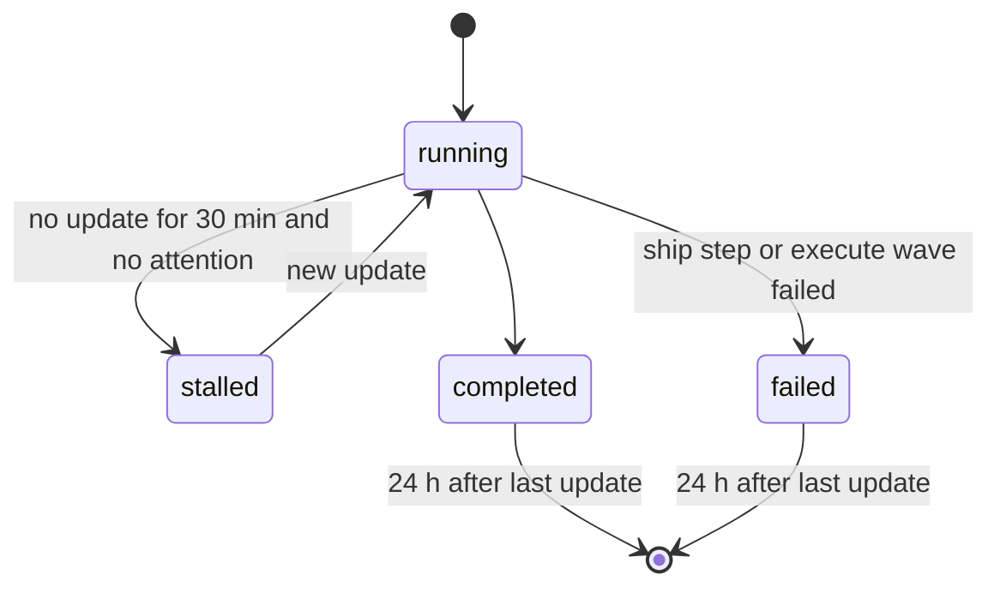

# Spec Delta

## MODIFIED Requirements

### Requirement: Pipeline status
The snapshot SHALL give each ship, execute, plan, and review run one status of `running`, `stalled`, `completed`, or `failed`, and SHALL show a `completed` or `failed` run only when its last update is in the last 24 h. A `running` run with `attention` SHALL not turn `stalled`.

#### Scenario: Stalled run
- **WHEN** a ship run is in flight
- **AND** its last update is 31 min old
- **THEN** its status is `stalled`

#### Scenario: Old finished run
- **WHEN** an execute run has `runStatus:"completed"`
- **AND** its last update is 25 h old
- **THEN** the run is not in the snapshot

#### Scenario: Waiting run
- **WHEN** a running pipeline has `attention`
- **AND** its last update is 31 min old
- **THEN** its status is `running`

### Requirement: Step status by run kind
The snapshot SHALL take the status of one step from the run kind by this table.

| Kind | One step is | Status rule |
|---|---|---|
| ship | a ship step | the stored value |
| execute | a wave | the stored value, with `partial` shown as `failed`. A planned wave that has not started is `pending` |
| plan | a station that groups checkpoint steps | before, at, after the station of the current step: `completed`, `in_progress`, `pending`. With the `done` marker: all `completed` |
| review | a dimension | `completed` when `checkoutAt` is set, `skipped` when `run.meta` has a stop reason, `pending` when planned with no worker file, else `in_progress` |

#### Scenario: Partial wave
- **WHEN** an execute wave has status `partial`
- **THEN** the step status is `failed`

#### Scenario: Plan checkpoint
- **WHEN** a plan run is at checkpoint step `5`
- **THEN** stations `setup`, `explore`, and `draft` are `completed`
- **AND** station `review` is `in_progress` and station `finalize` is `pending`

#### Scenario: Planned dimension not started
- **WHEN** `run.meta` plans dimension `docs-review` and no worker file exists for it
- **THEN** the step `docs-review` is `pending`

#### Scenario: Stopped dimension
- **WHEN** `run.meta` has `stopReason` `stalled` for dimension `perf-review`
- **THEN** the step `perf-review` is `skipped` with `reason` `stalled`

### Requirement: Step detail kind
Each step `detail` SHALL carry `kind`: `waves`, `dimensions`, `explorers`, `rounds`, `findings`, `guardrails`, or `result`. A step with no detail SHALL have no `detail` key. An empty list SHALL be absent, and the `kind` SHALL stay.

#### Scenario: Plan station with no explorers
- **WHEN** a ship state has `planExploreSummary: []`
- **THEN** the `plan` step has `detail` `{kind:"explorers"}` and no `explorers` key

#### Scenario: Harden step
- **WHEN** a ship run has the step `harden`
- **THEN** the step has no `detail` key

#### Scenario: Clean commit step
- **WHEN** the ship step `commit` is `completed` with result `nothing to commit: execute committed 5 wave commit(s)`
- **THEN** the step has `detail` `{kind:"result", result:"nothing to commit: execute committed 5 wave commit(s)"}`

#### Scenario: Normal commit step
- **WHEN** the ship step `commit` is `completed` with result `committed 3f2a9c1`
- **THEN** the step has no `detail` key

### Requirement: Execute step detail
The snapshot SHALL give each execute wave step a `detail.waves` entry with the wave number, status, commit sha (`""` when not committed), and its tasks with id, name, and status. A planned wave from `plannedWaves` that has not started SHALL be a `pending` wave step with its tasks. Planned tasks in no wave and no planned wave SHALL go to a last step `queued` with status `pending`.

#### Scenario: Running task
- **WHEN** a started wave has a task with no task row
- **AND** the progress file of that task exists
- **THEN** the task status is `in_progress`

#### Scenario: Planned task not started
- **WHEN** the execute state has `plannedTasks` with task `7`
- **AND** no wave and no planned wave holds task `7`
- **THEN** the last step is `queued` with task `7` in `detail.queued`

#### Scenario: Old run without names
- **WHEN** an execute state has no `plannedTasks` key
- **THEN** each task without a name shows its id and `name:""`

#### Scenario: Commits off
- **WHEN** the execute state has `commitWaves:"false"`
- **THEN** the pipeline has `commitWaves:false`

#### Scenario: Planned waves before the first wave
- **WHEN** the execute state has `plannedWaves` `[{number:1, taskIds:["1","2"]}, {number:2, taskIds:["3"]}]` and no started wave
- **THEN** the steps are `wave 1` and `wave 2`, both `pending`
- **AND** no `queued` step exists

### Requirement: Plan stations
The snapshot SHALL show a plan run as 5 stations: `setup` (step 0), `explore` (1), `draft` (2), `review` (3 to 6), `finalize` (6.5 to 7). Progress SHALL count stations, with total 5. Station `setup` SHALL have `guardrails` detail when the plan state has `guardrailCounts`.

#### Scenario: Explore detail
- **WHEN** the plan evidence holds writer `explore-auth-flow` with 12 items
- **THEN** station `explore` lists explorer `auth-flow` with `total:12` and its first 5 findings

#### Scenario: Review rounds
- **WHEN** the plan state has 2 `reviewRounds` rows and the run is at step `5`
- **THEN** station `review` lists 2 rounds with `maxRounds:5`
- **AND** the progress label is `round 3 of 5`

#### Scenario: Unreadable evidence
- **WHEN** the plan evidence path cannot be read
- **THEN** station `explore` has no detail
- **AND** the snapshot does not fail

#### Scenario: Guardrail counts
- **WHEN** the plan state has `guardrailCounts` `{total:3, error:2, warning:1}`
- **THEN** station `setup` has `detail` `{kind:"guardrails", guardrails:{total:3, error:2, warning:1}}`

### Requirement: Review station totals
The ship step `review` SHALL list each planned dimension with its name, wave, status, finding count, worst severity, and stop reason, and SHALL give the totals found, fixed, deferred, and unaccounted from the ship healing data when that data exists. With a review plan, it SHALL give `reviewPlan` totals: waves planned and run, dimensions planned and run, and never started.

#### Scenario: Dimension count
- **WHEN** a nested review dimension `security` has 3 findings, one of them `high`
- **THEN** the dimension has `findings:3` and `worst:"high"`

#### Scenario: Totals
- **WHEN** the ship healing data has 9 found, 6 fixed, 3 deferred, and 0 unaccounted
- **THEN** the review step has `reviewTotals` `{found:9, fixed:6, deferred:3, unaccounted:0}`

#### Scenario: Never-started dimensions
- **WHEN** `run.meta` plans 23 dimensions in 3 waves and 8 dimensions have worker files in wave 1
- **THEN** `reviewPlan` is `{wavesPlanned:3, wavesRun:1, dimensionsPlanned:23, dimensionsRun:8, neverStarted:15}`

### Requirement: Page layout
The page SHALL have the title `sdlc signal room`, with a `(N) ` prefix when N pipelines in the repos in scope wait for a person, and a header with the tabs Pipelines, Activity, and History, each with a count. Under the header a sticky repo filter SHALL serve all three tabs. The page SHALL have no left rail.

#### Scenario: Tabs by keyboard
- **WHEN** the Pipelines tab has focus and the user presses the right arrow key
- **THEN** the Activity tab opens

#### Scenario: End key
- **WHEN** a tab has focus and the user presses `End`
- **THEN** the History tab opens

#### Scenario: Narrow page
- **WHEN** the page is narrower than 1000 px
- **THEN** the header counts are hidden

#### Scenario: Waiting title
- **WHEN** 1 pipeline in scope has `attention`
- **THEN** the title is `(1) sdlc signal room`

### Requirement: Pipeline blocks
The Pipelines tab SHALL show one block for each pipeline in 5 groups: waiting on you, running, failed, stalled, completed. In each group the newest `startedAt` SHALL come first. A block head SHALL show the status lamp, kind, branch, repo name, an issue chip when issues exist, the status word, and a `details N` toggle.

#### Scenario: Default state
- **WHEN** the page loads with one running and one completed pipeline
- **THEN** the running block is open and the completed block is collapsed

#### Scenario: Collapsed block
- **WHEN** the user collapses a block
- **THEN** the block shows its head and track only

#### Scenario: Collapse all
- **WHEN** a visible block is open and the user clicks `Collapse all details`
- **THEN** every visible block collapses and the button text is `Expand all details`

#### Scenario: Waiting run first
- **WHEN** the snapshot has a completed run, a running run, and a running run with `attention`
- **THEN** the order is the run with `attention`, the running run, the completed run

#### Scenario: Newest first in a group
- **WHEN** two running runs started at 10:00 and 11:00
- **THEN** the 11:00 run comes first

## ADDED Requirements

### Requirement: Pipeline attention
A pipeline SHALL carry `attention` `{kind, askedAt, header, text}` from the newest open wait record whose session and branch match the pipeline, when the pipeline is `running`. Otherwise `attention` SHALL be absent. A nested execute run SHALL show no second mark.

#### Scenario: Matching record
- **WHEN** a record has session `s1` and branch `feat/x`
- **AND** a running pipeline has `sessionId` `s1` on branch `feat/x`
- **THEN** the pipeline has `attention` with the record header and text

#### Scenario: Other branch
- **WHEN** a record has session `s1` and branch `main`
- **AND** the pipeline is on branch `feat/x`
- **THEN** the pipeline has no `attention` key

#### Scenario: Old record
- **WHEN** the record `askedAt` is 25 h old
- **THEN** the pipeline has no `attention` key

### Requirement: Waiting mark on the page
A block with `attention` SHALL show `◈ WAITING ON YOU · <elapsed>` and `<header>: "<text>"`, a `waiting` lamp ring, and a `◈` glyph on the current station. The header SHALL show a `waiting` count over all repos. The elapsed time SHALL update every second.

#### Scenario: Banner
- **WHEN** a pipeline has `attention` asked 252 s ago with header `Guardrail`
- **THEN** the block shows `◈ WAITING ON YOU · 4m 12s`

#### Scenario: Reduced motion
- **WHEN** the user prefers reduced motion
- **THEN** the lamp ring does not pulse

### Requirement: Station track
The station track SHALL use the full panel width. Stations SHALL wrap to a new row when one station gets less than 88 px. The track SHALL not scroll sideways.

#### Scenario: Wide panel
- **WHEN** a panel is 2560 px wide and a ship run has 10 stations
- **THEN** all stations are in one row

#### Scenario: Narrow panel
- **WHEN** a review run has 23 stations in a 1280 px panel
- **THEN** the stations wrap to more rows
- **AND** the track has no horizontal scroll

### Requirement: Plan review totals and outcomes
Station `review` SHALL carry `roundTotals` `{iterations, violations, fixes, distinct}`, `repairLimit`, and `outcomes`. With finding IDs on every round, totals SHALL count distinct IDs. Otherwise they SHALL sum the round counts with `distinct:false`. `repairLimit` SHALL be true when the last round is at the limit with Issues Found.

#### Scenario: Distinct totals
- **WHEN** round 1 found `a`, `b`, `g1` and fixed `a`, `g1`, and round 2 found and fixed `b`
- **THEN** `roundTotals` is `{iterations:2, violations:3, fixes:3, distinct:true}`

#### Scenario: Old rounds
- **WHEN** a round has no `findings` key
- **THEN** `roundTotals.distinct` is `false`

#### Scenario: Outcome list
- **WHEN** the plan state has `reviewOutcome` with finding `f-9d01aa42` and choice `accepted`
- **THEN** `outcomes` lists `f-9d01aa42` with choice `accepted`

#### Scenario: Review tile
- **WHEN** `roundTotals` is `{iterations:5, violations:7, fixes:6, distinct:true}` and `repairLimit` is true
- **THEN** the tile shows `5 iterations · 7 violations · 6 fixes` and `REPAIR LIMIT REACHED`
