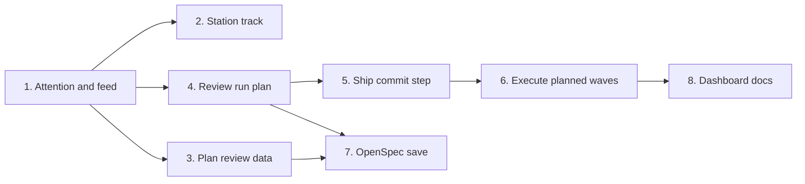

# Tasks

Group order (groups with no path between them can run in parallel):

## 1. Attention and feed

- [x] 1.1 Add snapshot types and kinds in internal/tools/dashboard_snapshot.go (Task 1) — verify: go test ./... && node --test internal/dashboard/web/testdata/view.test.cjs <!-- ref:1-1-add-snapshot-types-and-kinds-in-inte-d259d4 -->
- [x] 1.2 Add the wait record store in internal/attention/attention.go (Task 2) — verify: go test ./internal/attention/ ./internal/telemetry/ ./internal/tools/ <!-- ref:1-2-add-the-wait-record-store-in-interna-6f4d4b -->
- [x] 1.3 Write and close question waits in internal/hooks/block_askuserquestion.go (Task 3) — verify: go test ./internal/hooks/ <!-- ref:1-3-write-and-close-question-waits-in-in-132a62 -->
- [x] 1.4 Add permission and session wait hooks in internal/hooks/attention_hooks.go (Task 4) — verify: go test ./internal/hooks/ <!-- ref:1-4-add-permission-and-session-wait-hook-59709a -->
- [x] 1.5 Attach attention in internal/tools/dashboard_snapshot.go (Task 5) — verify: go test ./internal/tools/ <!-- ref:1-5-attach-attention-in-internal-tools-d-7f5b33 -->
- [x] 1.6 Add feed order, counts, and title in internal/dashboard/web/static/view.js (Task 6) — verify: node --test internal/dashboard/web/testdata/view.test.cjs <!-- ref:1-6-add-feed-order-counts-and-title-in-i-c8c4cd -->
- [x] 1.7 Render the waiting mark in internal/dashboard/web/static/render.js (Task 7) — verify: node --test internal/dashboard/web/testdata/view.test.cjs && go test ./internal/dashboard/web/ <!-- ref:1-7-render-the-waiting-mark-in-internal-4cf990 -->

## 2. Station track

- [x] 2.1 Drop the 1100 px cap in internal/dashboard/web/static/app.css (Task 8) — verify: go test ./internal/dashboard/web/ <!-- ref:2-1-drop-the-1100-px-cap-in-internal-das-801c3c -->

## 3. Plan review data

- [x] 3.1 Store guardrail counts in internal/tools/plan.go (Task 9) — verify: go test ./internal/tools/ <!-- ref:3-1-store-guardrail-counts-in-internal-t-bd6948 -->
- [x] 3.2 Add stable finding IDs in internal/tools/plan_support.go (Task 10) — verify: go test ./... <!-- ref:3-2-add-stable-finding-ids-in-internal-t-64d12e -->
- [x] 3.3 Add round finding IDs and review-outcome in internal/tools/plan.go (Task 11) — verify: go test ./... <!-- ref:3-3-add-round-finding-ids-and-review-out-6ea424 -->
- [x] 3.4 Build plan setup and review detail in internal/tools/dashboard_plan.go (Task 12) — verify: go test ./internal/tools/ <!-- ref:3-4-build-plan-setup-and-review-detail-i-12c3e2 -->
- [x] 3.5 Record finding IDs and repair-limit choices in plugins/sdlc/skills/plan/SKILL.md (Task 13) — verify: go test ./internal/skillcheck/... <!-- ref:3-5-record-finding-ids-and-repair-limit-5fd32f -->
- [x] 3.6 Render plan and result tiles in internal/dashboard/web/static/render.js (Task 14) — verify: node --test internal/dashboard/web/testdata/view.test.cjs <!-- ref:3-6-render-plan-and-result-tiles-in-inte-f2f0bd -->

## 4. Review run plan

- [x] 4.1 Write run.meta in review_prepare in internal/tools/review.go (Task 15) — verify: go test ./... <!-- ref:4-1-write-run-meta-in-review-prepare-in-dd565e -->
- [x] 4.2 Add ledger_skip in internal/tools/execute_state.go (Task 16) — verify: go test ./... <!-- ref:4-2-add-ledger-skip-in-internal-tools-ex-87699c -->
- [x] 4.3 Add the review plan reader in internal/tools/review_ledger_plan.go (Task 17) — verify: go test ./internal/tools/ <!-- ref:4-3-add-the-review-plan-reader-in-intern-408d1e -->
- [x] 4.4 Add the review wave table in internal/tools/ship_report.go (Task 18) — verify: go test ./internal/tools/ <!-- ref:4-4-add-the-review-wave-table-in-interna-422e61 -->
- [x] 4.5 Use the run plan in plugins/sdlc/skills/review/SKILL.md (Task 19) — verify: go test ./internal/skillcheck/... <!-- ref:4-5-use-the-run-plan-in-plugins-sdlc-ski-f5de89 -->
- [x] 4.6 Group dimensions by wave in internal/dashboard/web/static/render.js (Task 20) — verify: node --test internal/dashboard/web/testdata/view.test.cjs <!-- ref:4-6-group-dimensions-by-wave-in-internal-b55e34 -->

## 5. Ship commit step

- [x] 5.1 Add commit-check in internal/tools/ship_state.go (Task 21) — verify: go test -tags integration ./... <!-- ref:5-1-add-commit-check-in-internal-tools-s-7a0d08 -->
- [x] 5.2 Route the commit step in plugins/sdlc/skills/ship/SKILL.md (Task 22) — verify: go test ./internal/skillcheck/... <!-- ref:5-2-route-the-commit-step-in-plugins-sdl-005ca0 -->
- [x] 5.3 Show the commit result in internal/tools/dashboard_snapshot.go (Task 23) — verify: go test ./internal/tools/ <!-- ref:5-3-show-the-commit-result-in-internal-t-32920f -->

## 6. Execute planned waves

- [x] 6.1 Store plannedWaves in internal/tools/execute_state.go (Task 24) — verify: go test -tags integration ./... <!-- ref:6-1-store-plannedwaves-in-internal-tools-2a4e3f -->
- [x] 6.2 Pass the wave plan in plugins/sdlc/skills/execute/SKILL.md (Task 25) — verify: go test ./internal/skillcheck/... <!-- ref:6-2-pass-the-wave-plan-in-plugins-sdlc-s-4c1f84 -->
- [x] 6.3 Show planned waves in internal/tools/dashboard_execute_detail.go (Task 26) — verify: go test ./internal/tools/ <!-- ref:6-3-show-planned-waves-in-internal-tools-89aabd -->
- [x] 6.4 Render planned wave blocks in internal/dashboard/web/static/render.js (Task 27) — verify: node --test internal/dashboard/web/testdata/view.test.cjs <!-- ref:6-4-render-planned-wave-blocks-in-intern-69c144 -->

## 7. OpenSpec save

- [x] 7.1 Add the openspec_save core in internal/tools/openspec_save.go (Task 28) — verify: go test ./... <!-- ref:7-1-add-the-openspec-save-core-in-intern-da12c2 -->
- [x] 7.2 Register openspec_save in internal/tools/openspec.go (Task 29) — verify: go test -tags integration ./... <!-- ref:7-2-register-openspec-save-in-internal-t-fa9bbc -->
- [x] 7.3 Add the openspec-save skill in plugins/sdlc/skills/openspec-save/SKILL.md (Task 30) — verify: go test ./internal/skillcheck/... <!-- ref:7-3-add-the-openspec-save-skill-in-plugi-8d5a2c -->
- [x] 7.4 Offer openspec-save in plugins/sdlc/skills/plan/SKILL.md (Task 31) — verify: go test ./internal/skillcheck/... <!-- ref:7-4-offer-openspec-save-in-plugins-sdlc-a0b8bb -->

## 8. Dashboard docs

- [x] 8.1 Update docs/dashboard.md (Task 32) — verify: grep -rn "ledger_checkin.*writes .run.meta" docs/ returns 0 hits <!-- ref:8-1-update-docs-dashboard-md-task-32-ver-c8d16e -->

## Workflow follow-up

- Merge the OpenSpec PR from `/sdlc:openspec-save`, or let ship archive the change after review.
