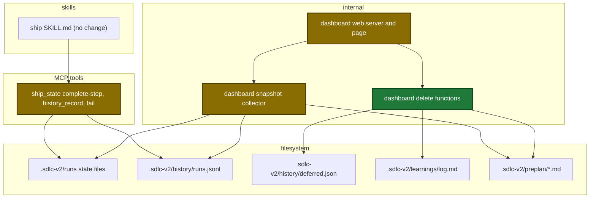
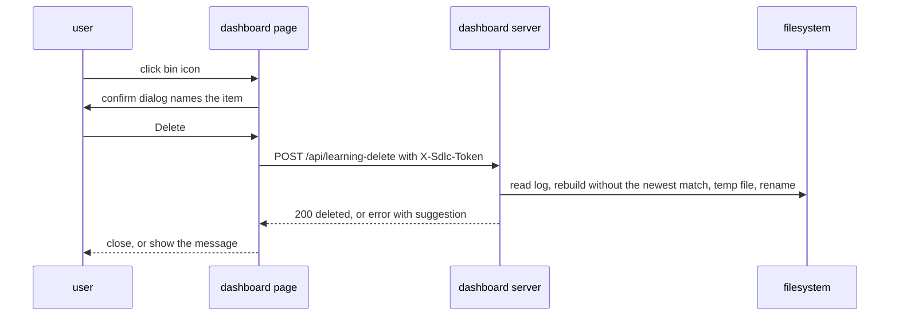
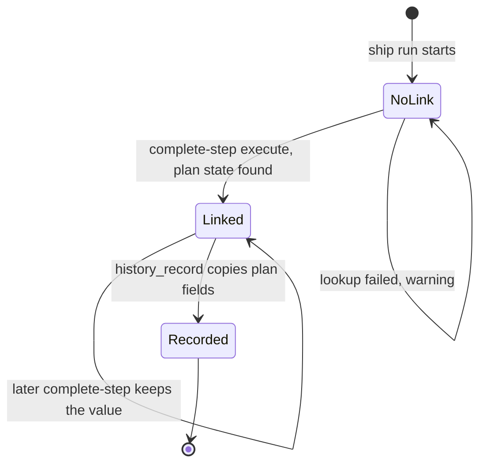

# Design

## Context

- See proposal.md - Why.
- The only plan link today is the execute state `planPath`. The plan state holds the plan times, and `cleanup-pipeline` deletes it after the report.
- `shipPlanTimingFor` (`internal/tools/ship_report.go:391`) already joins a plan row of `runs.jsonl` by `plan_file`.
- The dashboard POST routes pass `guardMutation` (`internal/dashboard/web/server.go:407-437`).

Touched parts:

Main runtime flow of a delete:

Ship state with the new key:

## Goals / Non-Goals

**Goals:**
- One save point for the plan link: `complete-step` of `execute`, in the one existing state write.
- One join for old runs: the dashboard calls `shipPlanTimingFor`, no copy.
- Deletes that never leave a half-written store file.

**Non-Goals:**
- No skill text change.
- No new MCP tool.
- No lock between the MCP server and the dashboard.
- No browser test harness.

## Decisions

| Decision | Rejected option | Reason |
|---|---|---|
| Save `linkedPlan` at `complete-step` of `execute` | save at `begin-step(execute)` | `begin-step` can see the execute state of an earlier run |
| Plan end = `planIntegrity.done` | `planTiming.lastModifiedAt` | edits after the handoff must not lengthen the plan time |
| A failed plan lookup adds a warning | fail the step | the ship run must not stop for a display value |
| New repo `warnings` list | put read errors in `repo.error` | `repo.error` blocks archive of every run of the repo |
| Already gone is 200 `alreadyGone:true` | 404 as run archive | the user goal is met |
| Learning delete: newest match. Deferred delete: first match | delete all matches | same rule as the detail viewer and as resolve |
| Deferred and learning writes use a temp file and a rename | `os.WriteFile` | a crash leaves the old file or the new file, never half of one |
| Go computes `totalMs` | compute in the page | one rule for the sort and the display |

Data contracts:

| Field | Type | Encoding | Example |
|---|---|---|---|
| ship state `linkedPlan.planFile` | string | plain text | `<plans-dir>/x.md` |
| ship state `linkedPlan.startedAt` | string | RFC 3339 | `2026-10-10T08:20:00Z` |
| ship state `linkedPlan.completedAt` | string, optional | RFC 3339 | `2026-10-10T09:40:00Z` |
| `runs.jsonl` `plan_started_at` | string, optional | RFC 3339 | `2026-10-10T08:20:00Z` |
| `runs.jsonl` `plan_duration_ms` | integer, optional | ms | `4800000` |
| delete 200 body | object | JSON | `{"deleted":true,"alreadyGone":false,"message":"…"}` |

Config: no change.

## Risks / Trade-offs

- [A delete loses an append from a session] → the read-to-rename window is short. `docs/dashboard.md` states the race.
- [A delete of an `in progress` topic file breaks a live preplan session] → the confirm dialog names the risk.
- [The dashboard writes `deferred.json` with mode 0600] → the same user reads the file.
- [The page click wiring has no browser test] → one manual check and one Go HTTP end-to-end test.
