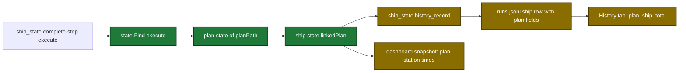

# Proposal

## Why

- Problem: the dashboard shows only part of each pipeline run. Preplan topic files are not shown, the plan station has no time, and the total time starts at the ship start.
- Evidence: the ship state stores no plan link (`internal/tools/ship_report.go:426-436`). The plan station has no times (`internal/tools/dashboard_join.go:90-103`). The user cannot delete a deferred item, a learning or a topic file from the page.
- Why now: the user approved a dashboard design (`design/dashboard/requirements.md`) and the preplan topic file `.sdlc-v2/preplan/dashboard-life-cycle-controls.md` (decisions 1 to 14).

## What Changes

| Area | Before | After |
|---|---|---|
| Ship state | no plan link | `complete-step` of `execute` saves `linkedPlan {planFile, startedAt, completedAt}` once |
| History row (`runs.jsonl`) | ship rows have no plan data | ship rows get `plan_file`, `plan_started_at`, `plan_duration_ms` |
| Snapshot | no preplans, no read warnings | each repo has `preplans[]` and `warnings[]` |
| Plan station | no time | plan time from `linkedPlan`, else from the history join for old runs |
| Total time | from the ship start | from the plan start when a plan is linked |
| Page tabs | Pipelines, Activity, History | Pipelines, Activity, History, Preplans |
| History tab | one duration column, no controls | plan, ship and total columns, outcome chips, two sort buttons |
| Activity tab | no filter, no delete | priority chips, a bin icon on each deferred and learning row |
| Server routes | 3 POST routes | 6 POST routes: + preplan, deferred and learning delete |

Ship pipeline flow after the change:

## Capabilities

### New Capabilities

(none)

### Modified Capabilities

- `pipeline-dashboard`: preplan list, repo warnings, plan times, History columns and controls, priority chips, three delete routes, fourth tab.
- `tool-ship-state`: `complete-step` of `execute` saves the linked plan data. `history_record` and the first `fail` row copy it into the history row.

## Impact

| Path | Kind | Change |
|---|---|---|
| `internal/tools/ship_state.go` | MCP tool | save `linkedPlan`, copy plan fields to history rows, warnings |
| `plugins/sdlc/schemas/ship-state.schema.json` | schema | + optional `linkedPlan` |
| `internal/history/history.go` | MCP tool | + `plan_started_at`, `plan_duration_ms` |
| `internal/tools/dashboard_*.go` | MCP tool | preplans, plan times, History totals, delete functions |
| `internal/dashboard/web/server.go` | CLI | three delete routes |
| `internal/dashboard/web/static/*` | doc | page port of the approved draft |
| `docs/dashboard.md`, `docs/skills/dashboard.md`, `plugins/sdlc/skills/ship/state-format.md` | doc | new fields, routes and tabs |
