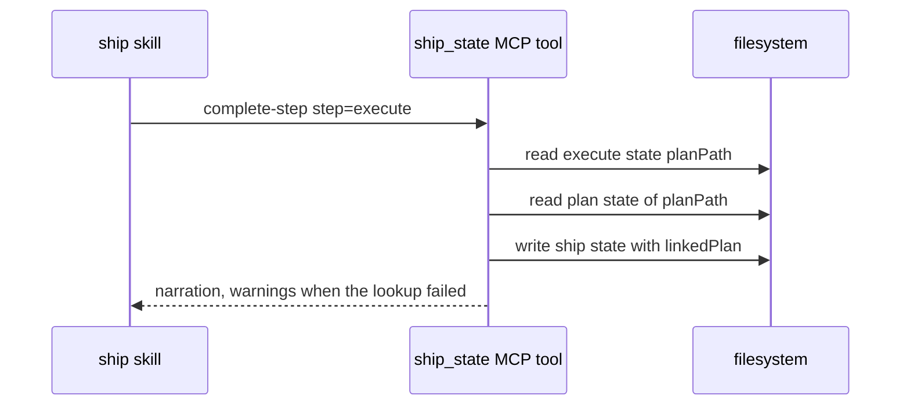

# Spec Delta

## ADDED Requirements

### Requirement: Linked plan save
`complete-step` and `complete` of step `execute` with an outcome other than `failure` SHALL save `linkedPlan {planFile, startedAt, completedAt}` in the ship state once. `planFile` SHALL come from the execute state `planPath`. `startedAt` and `completedAt` SHALL come from the plan state marks `skillInvoked` and `done`.

#### Scenario: Plan found
- **WHEN** `complete-step` completes `execute` and the plan state has `skillInvoked` and `done`
- **THEN** the ship state has `linkedPlan` with `planFile`, `startedAt` and `completedAt`

#### Scenario: Second call
- **WHEN** `complete-step` of `execute` runs again
- **THEN** `linkedPlan` keeps its first value

#### Scenario: Lookup error
- **WHEN** the execute state cannot be read
- **THEN** the step completes
- **AND** the output `warnings` has one entry that starts with `plan times not saved:`
- **AND** the ship state has no `linkedPlan`

#### Scenario: No done mark
- **WHEN** the plan state has no `done` mark
- **THEN** `linkedPlan` has no `completedAt`

### Requirement: History row plan fields
`history_record` with skill `ship` and the first `fail` row of a ship run SHALL copy `linkedPlan` of the ship state into `plan_file`, `plan_started_at`, and `plan_duration_ms`. A ship state read error SHALL add one `warnings` entry and SHALL still write the row.

#### Scenario: Plan fields
- **WHEN** the ship state has `linkedPlan` with `startedAt` 08:20 and `completedAt` 09:40
- **THEN** the `runs.jsonl` row has `plan_started_at` 08:20 and `plan_duration_ms` 4800000

#### Scenario: Read error
- **WHEN** the ship state file is corrupt
- **THEN** the row is written with no plan fields
- **AND** the output has one `warnings` entry and `next` says no retry is needed

#### Scenario: End before start
- **WHEN** `linkedPlan.completedAt` is before `linkedPlan.startedAt`
- **THEN** the row has `plan_started_at` and no `plan_duration_ms`
