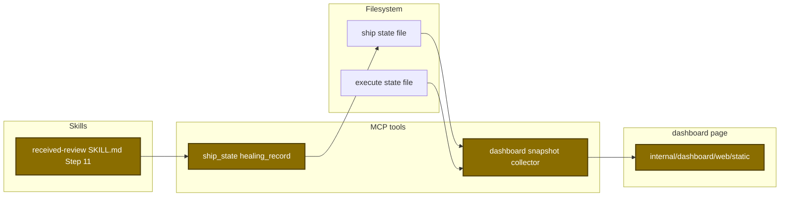
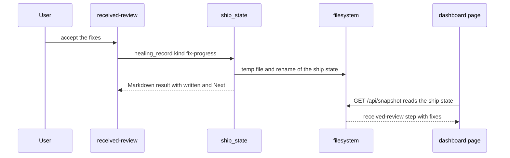
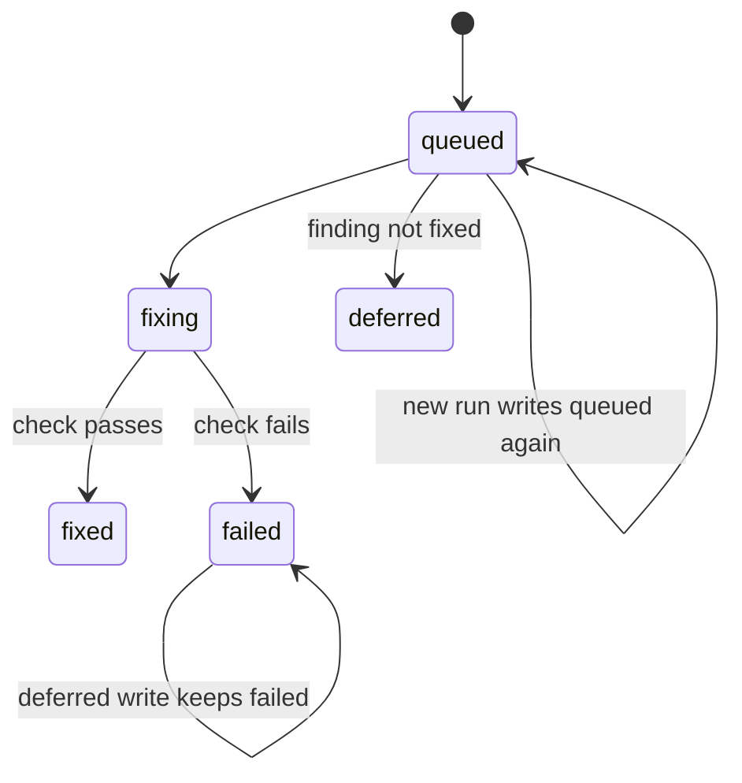

# Design

## Context

- See proposal.md - Why.
- Ship steps and execute waves already store `startedAt` and `completedAt` (`ship-state.schema.json:97-104`, `execute-state.schema.json:127-132`).
- Each reader of `healing.fixed[]` counts each record as fixed: the review ledger, the ship report, the dashboard review totals, and the harden clusters.
- The received-review skill has no resume. Ship starts a new agent each time (`plugins/sdlc/skills/ship/SKILL.md:151`).
- The approved page draft is in `design/dashboard/static/`. It holds preview-only code (`designDep`, `draftDep`, `sampleFixes`, `withDraftSteps`).

## Goals / Non-Goals

**Goals:**
- Real step times and fix records in the snapshot, with no new MCP tool.
- A page that matches the draft, with no preview-only code.

**Non-Goals:**
- Step times for plan and standalone review pipelines. Their state files store no step times.
- A change to `healing.fixed[]` or its readers.
- A `received-review` entry in the shared ship step list (`shipmeta.CanonicalSteps`).
- Changes to the preview program in `cmd/design-preview/`.

The touched parts:

The main runtime flow, from one status write to the page:

The status of one fix record:

The stored record (`healing.fixProgress[]`):

| Field | Type | Encoding | Example |
|---|---|---|---|
| `origin` | string | `local-review` or `pr-comment` | `local-review` |
| `severity` | string | review severity, lowercase | `high` |
| `file` | string | repo-relative path | `internal/auth/token.go` |
| `line` | integer or absent | line number | `42` |
| `title` | string | plain text | `Token expiry check skips equal times` |
| `status` | string | `queued`, `fixing`, `fixed`, `failed`, `deferred` | `fixing` |
| `firstAt`, `updatedAt` | string | RFC 3339 UTC | `2026-10-10T10:00:00Z` |

## Decisions

| Decision | Chosen | Rejected alternatives | Reason |
|---|---|---|---|
| Write path for fix status | kind `fix-progress` on `ship_state healing_record` | a new MCP tool or action; a write in `received_review_prepare` | The tool list stays the same size. The received-review tools only read GitHub. |
| Storage | new array `healing.fixProgress[]` | a status field on `healing.fixed[]` | Each reader of `healing.fixed[]` counts a record as fixed. |
| A fixed finding | `fix-progress` `fixed` right after the check, then the `fixed` kind in the recording part | one call that writes both arrays | The page shows each fix as fixed when the fix ends. The `fixed` kind keeps its tests. |
| Which findings get a row | each finding with a `queued` call at Step 11 entry | rows for findings that Step 2 defers under `--auto` | An exit before Step 11 leaves no open row. |
| Station place | attach to a stored `received-review` step, or insert after the first `review` step | a change to `shipmeta.CanonicalSteps` | The shared step list stays the same. |
| Detail shape | kind `fixes` with field `fixes` | kind `result` with one text line | One row for each fix. The field name equals the kind name, as for `waves`. |
| Size cap | 200 records for each run | no cap | Guardrail `persisted-io-failure-fallback` needs a cap for a list that grows. |
| `deferred` after `failed` | the tool keeps `failed` | a rule in the skill text | The tool applies the rule the same way each time. |
| Archive icon URL | percent-encode `http://` in the data URI | a weaker CSS test | `TestStaticCSS_FontAndPalette` stops loads from other servers. |
| Card balance test | array tests for the pure helpers and a local fake grid | a larger shared fake document | The shared fake has no `removeChild` or `clientWidth`. |
| Test for the grid observer in `app.js` | a Go text pin in `server_test.go` | a node test that loads `app.js` | `app.js` calls `init()` at load and has no export. |

## Risks / Trade-offs

| Risk | Impact | Mitigation |
|---|---|---|
| A stopped session leaves a `queued` or `fixing` row | The row shows an old status | On a completed run, the step shows completed. The docs explain the row. |
| A failed status write | The page shows an old status | The skill prints a warning and the fix continues. |
| A stored `fixProgress` value that is not a list | No more status writes | The tool returns a `DataError`. The snapshot shows no step. |
| A page script error | The page is blank | Node tests for each new helper and builder, and Go pins for `app.js`. |
| The draft folder is not in git | Another worktree cannot copy the draft | Plan and execute run in this worktree. Each port task stops when the folder is absent. |
