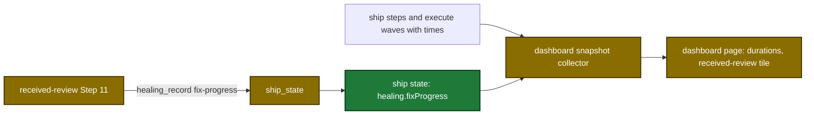

# Proposal

## Why

- Problem: the dashboard run details show no run duration, no step duration, no received-review step, and full-length issue rows.
- Evidence: the snapshot step has only `name`, `status` and `detail` (`internal/tools/dashboard_snapshot.go:116-122`). `healing_record` stores only fixed findings (`internal/tools/ship_state.go:1656`).
- Why now: a design session produced an approved draft in `design/dashboard/static/` and a preplan with 22 proposals.

## What Changes

| Area | Before | After |
|---|---|---|
| Snapshot step | `{name, status, detail?}` | `{name, status, startedAt?, completedAt?, detail?}` for ship steps and execute waves |
| Ship pipeline steps | no received-review step | a `received-review` step after `review` when fix records exist, with detail kind `fixes` |
| `ship_state` `healing_record` | kinds `review-total`, `fixed`, `hardened` | also kind `fix-progress`, stored in `healing.fixProgress[]`, at most 200 records |
| received-review Step 11 | records fixed and deferred findings after the fix pass | also writes `queued`, `fixing`, `fixed`, `failed`, `deferred` for each finding while the pass runs |
| Dashboard dialogs | brown fill, strong blur, **Close** text button | black glass, light blur, close icon at the top left |
| Dashboard pipeline block | no durations, **Archive** text button | run duration chip, step durations, archive icon at the left of the options |
| Dashboard tiles | full issue text in source order, flat review list | 2-line rows in severity order, received-review tile, review cards in balanced columns |

## Capabilities

### New Capabilities

No new capability.

### Modified Capabilities
- `pipeline-dashboard`: snapshot step times, the received-review step and kind `fixes`, page durations, row order, review cards, archive and close icons.
- `tool-ship-state`: `healing_record` kind `fix-progress`.
- `skill-received-review`: Step 11 writes the fix status of each finding.

The flow from the fix pass and the run state to the page, after the change:

## Impact

| Path | Kind | Change |
|---|---|---|
| `internal/tools/dashboard_snapshot.go`, `internal/tools/dashboard_join.go` | MCP tool | step times, received-review step, kind `fixes` |
| `internal/tools/ship_state.go` | MCP tool | `healing_record` kind `fix-progress` and its description |
| `plugins/sdlc/schemas/ship-state.schema.json` | schema | `healing.fixProgress` |
| `plugins/sdlc/skills/received-review/SKILL.md` | skill | Step 11 status writes |
| `internal/dashboard/web/static/` | doc | page files copied from the approved draft |
| `internal/dashboard/web/testdata/` | CI | node tests and the snapshot fixture |
| `docs/dashboard.md`, `docs/getting-started.md`, `docs/skills/received-review.md`, `docs/skills/ship.md`, `plugins/sdlc/skills/ship/state-format.md` | doc | durations, icons, fix statuses, the cap of 200 |
