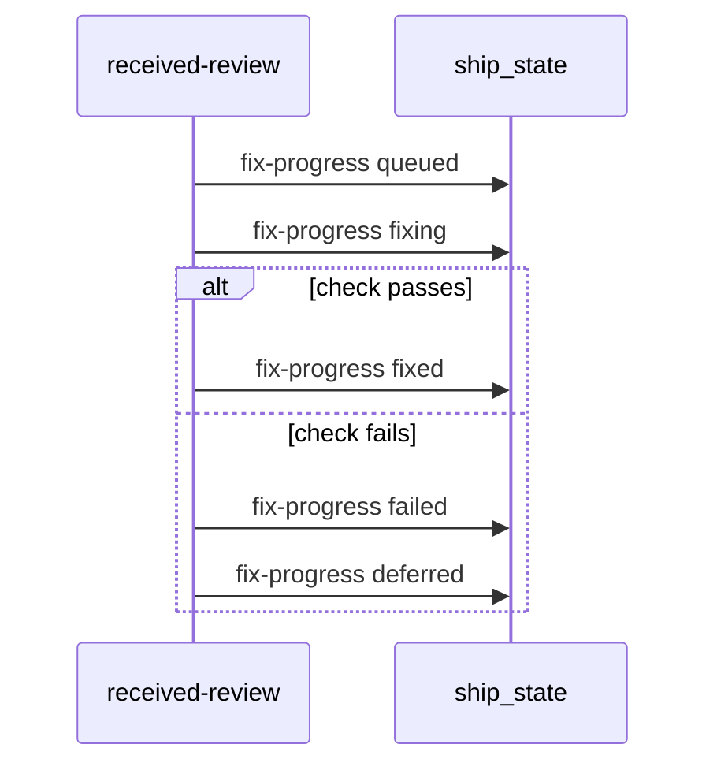

# Spec Delta

## ADDED Requirements

### Requirement: Fix progress records
In Step 11, the skill SHALL write the status of each will-fix finding with `ship_state` `healing_record` kind `fix-progress`, in the order of the diagram below.

#### Scenario: Fix passes its check
- **WHEN** the fix for `internal/auth/token.go:42` passes its check
- **THEN** the skill makes a `fix-progress` call with status `fixed` before the next fix starts
- **AND** the `fixed` kind call stays in the recording part of Step 11

#### Scenario: Fix fails its check
- **WHEN** the fix for `internal/api/errors.go:17` fails its check
- **THEN** the skill reverts the files of that fix
- **AND** the skill makes a `fix-progress` call with status `failed`

#### Scenario: Same key in each call
- **WHEN** the skill writes the statuses of one finding
- **THEN** each call has the same `origin`, `file`, `line`, and `title`

#### Scenario: Finding with no queued call
- **WHEN** a finding ends unfixed and got no `queued` call
- **THEN** the skill makes no `deferred` call for that finding

#### Scenario: Standalone run
- **WHEN** no ship run is live on the branch
- **THEN** each `fix-progress` call returns `written:false` and the fix pass continues

### Requirement: Fix progress write failure
A failed `fix-progress` call SHALL NOT stop a fix or a reply.

#### Scenario: Status write fails
- **WHEN** a `fix-progress` call returns an error
- **THEN** the skill prints `WARNING: could not record fix progress for <file>:<line> — <error>`
- **AND** the fix continues
